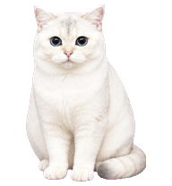

# 饺饺提醒 (Jiaojiao Reminder)

An offline Windows desktop pet that helps with hydration, tasks, focus sessions, breaks, and healthy movement — while still acting like a playful cat.

[Download the latest release](../../releases/latest) · [Customize your pet](docs/CUSTOMIZE_YOUR_PET.md) · [中文](README.md)



## What Jiaojiao does

- Shows prominent task, water, and movement reminders without covering her face.
- Stays calmly seated or lying down during focus sessions.
- Jumps happily when it is time to move after extended computer use.
- Eats food, drinks water, follows a treat, reaches for a wand, nudges the pointer, and fetches a thrown ball.
- Grooms, stretches, yawns, meows, rolls over, sleeps, breathes, and wakes up during idle time.
- Stores reminders, history, focus sessions, hydration, and settings locally in SQLite.
- Runs without Codex, Node.js, Rust, Python, an account, or a cloud service.

## Download

The [Releases](../../releases/latest) page provides a Windows x64 installer and a portable executable. The project is currently unsigned, so Windows SmartScreen may show an unknown-publisher warning. Verify `SHA256SUMS.txt` or build from source if desired.

## Build from source

Requirements: Node.js 20+, Rust stable, Visual C++ Build Tools, and WebView2 Runtime.

```powershell
npm.cmd ci
npm.cmd run verify
npm.cmd run tauri build
```

## Make it your pet

Prepare 3–8 photos that you have the right to use, then follow [CUSTOMIZE_YOUR_PET.md](docs/CUSTOMIZE_YOUR_PET.md). The repository also includes a reusable [AI coding prompt](AI_CUSTOMIZATION_PROMPT.md) and the complete [pet pack specification](docs/PET_PACK_SPEC.md).

The application code is [MIT licensed](LICENSE). Jiaojiao's photographs and derived visual assets have a separate [asset license](JIAOJIAO_ASSETS_LICENSE.md). Forks are encouraged to replace them with their own pet imagery and license terms.
