<p align="center">
  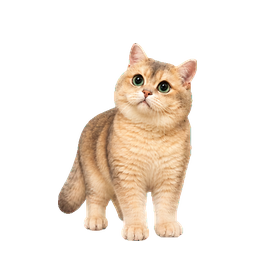
</p>

<h1 align="center">圆圆提醒</h1>

<p align="center">
  一只会陪你喝水、专注、休息、安排工作，也愿意和你玩一会儿的 Windows 桌面小猫。
</p>

<p align="center">
  <a href="../../releases/latest"><strong>下载已发布版本</strong></a>
  · <a href="docs/CUSTOMIZE_YOUR_PET.md">换成自己的宠物</a>
  · <a href="README.en.md">English</a>
</p>

<p align="center">
  
  
  
  
</p>

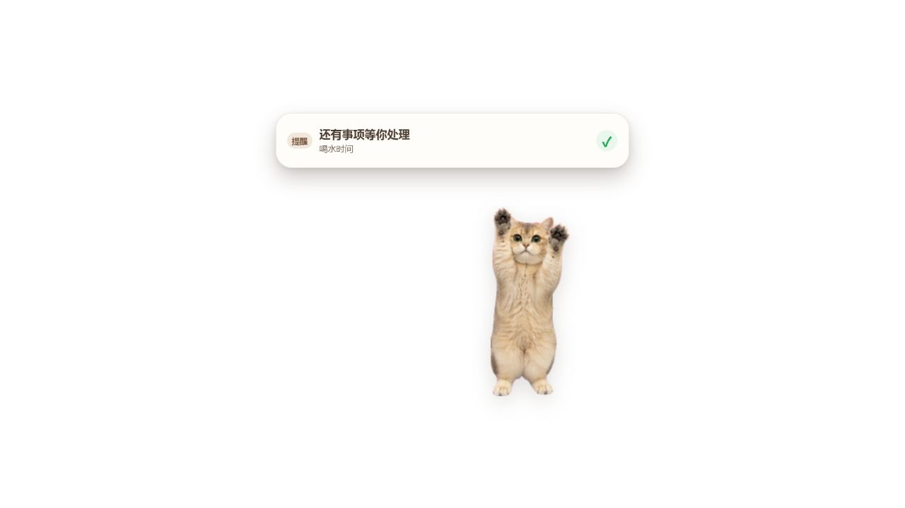

圆圆提醒是一款完全本地运行的桌面宠物与任务提醒工具。安装和日常使用不需要 Codex、Kimi Code、Node.js、Rust、Python、账号或云服务；Coding 工具只在你希望修改代码或把圆圆换成自己的宠物时才会用到。

## 当前版本：1.5.35

当前源码包含统一主程序、独立宠物包、英语与通用知识复习，以及近期的窗口和互动修复。

- **学习黑板**：题目、答题结论和“下一题”在一个界面内显示，无需滚动，宠物不遮挡内容。
- **安静学习**：读题时圆圆保持静止；未作答一分钟后最多做一次短动作，答题时仍保留动作反馈。
- **逗猫棒**：恢复原来的八方向伸爪、挥爪和收回动作，跟随拖动方向，松手后恢复。
- **本地数据**：更换宠物保留共享学习进度与设置，更新前可完整备份。

1.5.35 已通过本地完整校验、Rust 测试和生产构建，并在维护者本机安装；用户反馈人工核查正常。本轮已取消新的 24 小时观察，不将未执行的观察记为通过。稳定版发布验收仍为 `PENDING`；源码合并不等于已经发布同版本安装包。版本与原始安装器绑定见[交付说明](docs/release/UNIFIED_1_5_35_GITHUB_HANDOFF.md)，近期变化见[更新日志](CHANGELOG.md)。

## 圆圆会陪你做什么

想换成自己的宠物，可以用[一段提示词制作自己的桌面宠物](AI_CUSTOMIZATION_PROMPT.md)。即使电脑上没有本项目，也可将提示词与照片交给 Coding 工具。普通换宠物默认得到独立宠物包，保留圆圆主程序和已有数据。

| 你的事情 | 圆圆的配合 |
| --- | --- |
| 喝水提醒 | 弹出醒目的大气泡，用前爪拍“屏幕玻璃”；记录喝水后马上恢复日常状态。 |
| 工作任务 | 提醒一次性、间隔、每日和自选星期事项；可编辑、启停、删除，并支持 5/10/30/60 分钟稍后。 |
| 专注工作 | 乖乖坐着或趴着，不随意走动；专注结束后提醒你休息。 |
| 久坐活动 | 连续使用电脑达到设定时间后，圆圆会开心地上蹦下跳。若与喝水重叠，会先提醒喝水。 |
| 离屏休息 | 可开始 5 或 10 分钟的定时休息，并锁定 Windows；回来解锁后继续使用。 |
| 日常陪伴 | 会舔毛、伸懒腰、打哈欠、喵喵叫、翻肚皮、入睡、呼吸和醒来。 |
| 需要安静陪伴 | 由你主动选择让圆圆靠近、陪你轻轻活动或退开留出空间；只用猫咪动作回应，不判断或记录情绪。 |
| 离开后回来 | 白天确实离开较久后，圆圆会低频起身靠近、轻轻蹭一蹭；没有对白，也不会记录你去了哪里。夜间安静、短暂离开、专注或提醒占用时不触发。 |
| 互动玩耍 | 吃猫粮、喝水、追着猫条吃、左右伸爪抓逗猫棒、蹭鼠标、追球并把球叼回来。 |
| 英语与知识复习 | 在桌面黑板做选择题或回忆题，查看答题反馈；支持暂停继续、错题练习和学习记录。 |
| 我的宠物 | 修改昵称、导入和切换独立宠物包，主程序和已有数据保持统一。 |
| 回顾记录 | 查询已经完成、手动跳过或因过期自动归档的工作、喝水和活动记录。 |
| 数据安全 | 每天自动备份，保留最近 14 份；也可手动备份并在校验后安全恢复。 |

## 今天：喝水和事项放在一起

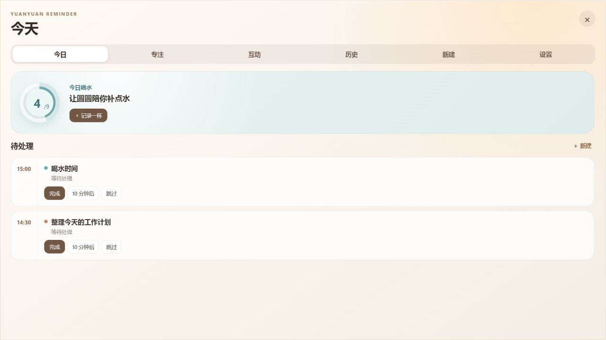

- 一次性、间隔、每日、每周提醒；
- 完成、5/10/30/60 分钟后提醒、跳过；
- 今日饮水进度；
- 喝水、普通事项、活动提醒采用明确的优先级和排队机制。

## 专注：工作时安静，休息时陪你离屏

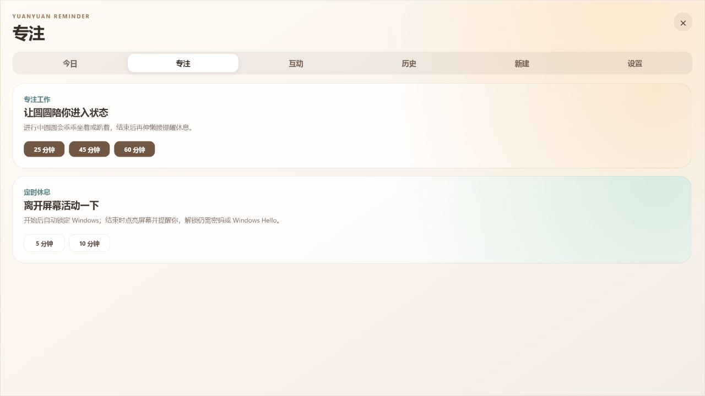

专注期间圆圆只使用安静的坐姿或趴姿。离屏休息可以锁定 Windows，计时结束后通过系统提示和圆圆动画提醒你回来；Windows 出于安全原因不允许应用绕过密码、PIN 或 Windows Hello 自动解锁。

## 互动：圆圆不是一张会切换的图片

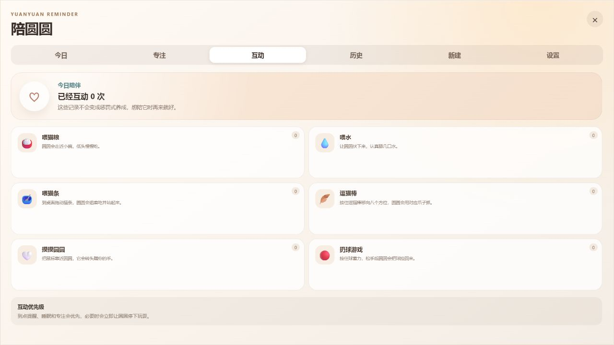

<table>
  <tr>
    <td width="50%" align="center">
      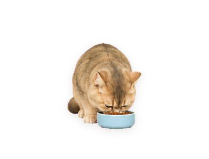
      <br><strong>喂猫粮</strong>
      <br><sub>圆圆走近小碗，低下脑袋慢慢吃。</sub>
    </td>
    <td width="50%" align="center">
      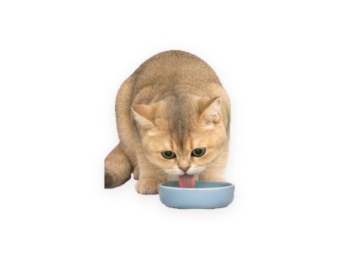
      <br><strong>喂水</strong>
      <br><sub>圆圆伏在水碗前，伸出舌头认真喝水。</sub>
    </td>
  </tr>
  <tr>
    <td width="50%" align="center">
      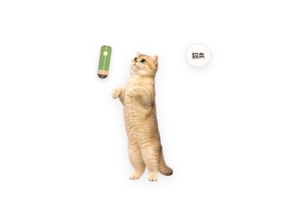
      <br><strong>喂猫条</strong>
      <br><sub>眼睛盯着猫条，随鼠标转向，猫条升高时会站起来吃。</sub>
    </td>
    <td width="50%" align="center">
      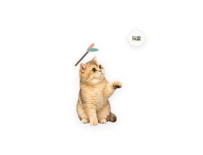
      <br><strong>逗猫棒</strong>
      <br><sub>逗猫棒在哪个方向，圆圆就朝那个方向转头、伸出对应的爪子。</sub>
    </td>
  </tr>
  <tr>
    <td width="50%" align="center">
      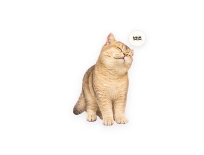
      <br><strong>摸摸圆圆</strong>
      <br><sub>鼠标进入头部区域后，圆圆会眯起眼睛，顺着你的手轻轻蹭过去。</sub>
    </td>
    <td width="50%" align="center">
      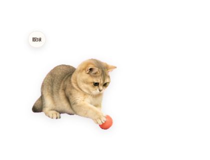
      <br><strong>扔球游戏</strong>
      <br><sub>追到球后先用爪子扒拉，再叼起球慢慢走回来并放到脚边。</sub>
    </td>
  </tr>
</table>

- 猫条会跟随鼠标，圆圆转头盯住猫条并逐步站起来吃；
- 逗猫棒在左边时伸左爪，在右边时伸右爪，在上方会站起来抓；
- 鼠标进入头部区域时圆圆会轻轻蹭过去，移出后立即停下；
- 扔球时按住蓄力、松手抛出，圆圆会追球、扒拉两下、叼回来并放到脚边；
- 切换互动会正确结束上一项玩具，不会把猫条或球带到下一个场景。

### 陪陪我：听得懂，但不替猫咪说人话

照料页提供三张由你主动打开的陪伴小牌：圆圆可以安静靠近一会、先伸懒腰陪你轻轻活动，或退开并停止主动回看。简单反馈只使用表情和肢体动作，不出现猫咪对白气泡。

这三种陪伴不判断你的情绪，不调用模型，也不保存原因或心情记录；状态只在当前应用内存中运行，到时自动结束，关闭应用后不恢复。喝水、到期工作事项和等待用户仍可优先出现。

## 学习：一块安静的桌面黑板

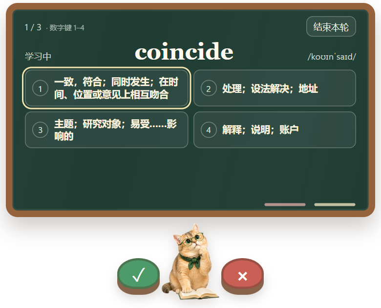

从“学习”页开始一轮复习，使用鼠标或数字键 1–4 选择答案。答题后黑板保留所选项与正确项，并完整显示结论；错题可以看懂后再继续。暂停会保留当前题，稍后可以接着学习。

支持自行导入 CSV、原生 JSON 和通用知识包，查看导入预览、进度与取消，并导出自己的内容。重复导入保留已有排程；可能改变答案或重置排程的更新会先提示。官方源码不捆绑个人词库，学习内容与记录保存在本机。上图使用隔离演示数据。

## 设置：把提醒节奏交给你

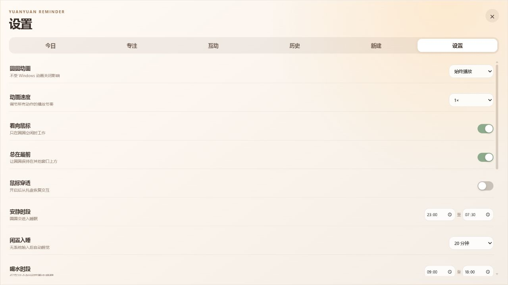

可以设置动画模式与速度、道具标签显示方式、朝向鼠标、置顶与穿透、安静时段、自动入睡、喝水与活动节奏、错过提醒策略、开机启动和提醒暂停。道具标签可选“纯动作 / 需要时显示 / 始终显示”，只贴在任务牌等工具上，不会成为圆圆的对白；默认仅在等待确认、失败、疑似停住或状态不明时显示。管理页支持修改、暂停和删除普通提醒；设置页可以创建、查看和恢复本地备份。

## 下载和使用

请在 [Releases](../../releases/latest) 页面按该版本说明选择安装版或便携版，并核对附件与 `SHA256SUMS.txt`。截至 2026-09-22，最新正式 Release 为 **v1.3.2**，并非当前 **1.5.35 源码**；另有独立饺饺预览版，不要混作圆圆统一主程序更新。

- 安装版适合长期使用；便携版可直接运行，文件名以对应 Release 附件为准。
- 1.5.35 尚未提供正式 Release 下载，需要时可按下方步骤从源码构建。
- 升级前在“设置 → 数据备份”创建备份。回退旧版本时应配套恢复升级前的数据，不要直接让旧程序读取已迁移的新库。

当前支持 Windows 10/11 x64。GitHub 社区稳定版以系统稳定、核心功能、数据迁移/备份、关键 E2E 和可重复构建为发布硬门，不把商业代码签名证书作为阻断条件。由于程序尚未购买商业代码签名证书，Windows 可能显示“未知发布者”或 SmartScreen 提示，Smart App Control/组织策略也可能直接阻止运行。请只从本项目的 GitHub Release 下载并核对 `SHA256SUMS.txt`，受限环境可从完全对应的源码标签自行构建。

应用数据默认保存在：

```text
%LOCALAPPDATA%\com.yuanyuan.reminder\
```

## 用自己的宠物照片制作一个版本

这套工具不仅可以运行圆圆，也可以成为你自己的桌面宠物项目：

1. 准备 3–8 张你有权使用的宠物照片，覆盖正脸、侧脸、全身和标志性花纹；
2. 将仓库和照片交给 Codex、Kimi Code 或其他 Coding 工具，并附上 [AI 定制提示词](AI_CUSTOMIZATION_PROMPT.md)；
3. 按照 [自定义宠物教程](docs/CUSTOMIZE_YOUR_PET.md) 生成、验证独立宠物包，然后在“设置 → 我的宠物”中导入。

完整动作和文件格式见 [宠物包规范](docs/PET_PACK_SPEC.md)。生成过程中必须锁定毛色、脸型、眼睛、花纹和体态，不能用一张静态图代替连续动作帧。

## 本地开发

需要：Node.js 22+、Rust stable、Visual C++ Build Tools、WebView2 Runtime。

```powershell
npm.cmd ci
npm.cmd run verify
cargo test --manifest-path src-tauri/Cargo.toml --locked
npm.cmd run tauri dev
```

正式构建：

```powershell
npm.cmd run tauri build
```

### 源码合并与正式发布

`main` 的源码更新通过 PR 和 CI 合并，不会自动发布安装包。当前 1.5.35 稳定发布验收仍为 `PENDING`；本轮新的 24 小时观察已按用户决定取消，不再启动或等待，也不记为测试通过。

正式稳定标签仍使用独立验收流程，需绑定实际测试的源码与安装包，并完成适用的数据恢复、安装器、人工复核和素材许可事项。[既有 V2 策略](docs/release/COMMUNITY_STABLE_RELEASE_POLICY_V2.json)与历史失败、未验记录保留；取消本轮观察的决定见[1.5.35 交付说明](docs/release/UNIFIED_1_5_35_GITHUB_HANDOFF.md)。后续正式发布前须同步适用规则，源码合并和用户日常核查不代替尚未完成的发布验收。

安装器、许可证归档、商业签名和回退流程详见[发布 SOP](docs/release/P0_RELEASE_SIGNING_AND_FALSE_POSITIVE_SOP.md)。发布工具及历史验收材料保留在 `scripts/` 和 `docs/release/`，不要通过修改通过标记跳过未完成项。

只预览界面：

```powershell
npm.cmd run dev
```

浏览器预览支持 `?window=panel&tab=today|focus|care|history|add|settings` 和 `?window=pet`，不写入真实数据库。

## 项目结构

```text
src/                       React 界面、宠物状态机和交互
src-tauri/                 Rust/Tauri 后端、SQLite、Windows 集成
public/assets/pet/         当前圆圆宠物包
scripts/                   宠物图集构建与验证工具
docs/                      使用、定制和格式说明
.github/workflows/         自动测试和 Windows Release
```

## 隐私

- 提醒、历史、喝水、互动与学习记录只保存在本机 SQLite 数据库；
- 程序不需要登录，不上传任务、照片或使用记录；
- 程序不调用任何 AI 服务，也不会自行读取 Codex/Claude 的任务正文；只有你在设置中主动检查且已有授权时，才会在本机读取对应 Hook 配置；
- 自动启动、通知和锁屏均通过本地 Windows 能力完成。

完整的数据类型、备份、日志、删除方式和联系方式见[圆圆提醒隐私政策](PRIVACY.md)。

## 参与贡献

请先阅读 [CONTRIBUTING.md](CONTRIBUTING.md) 和 [CODE_OF_CONDUCT.md](CODE_OF_CONDUCT.md)。安全问题请按照 [SECURITY.md](SECURITY.md) 报告。

程序代码使用 [MIT License](LICENSE)。圆圆照片、图集、图标和演示图片使用单独的 [圆圆素材许可](ASSETS_LICENSE.md)；第三方摘要见[第三方声明](THIRD_PARTY_NOTICES.md)，逐组件全文见[第三方许可证归档](THIRD_PARTY_LICENSES.txt)。如果你发布自己的分支，建议替换成你自己的宠物素材并重新运行许可归档生成器。
