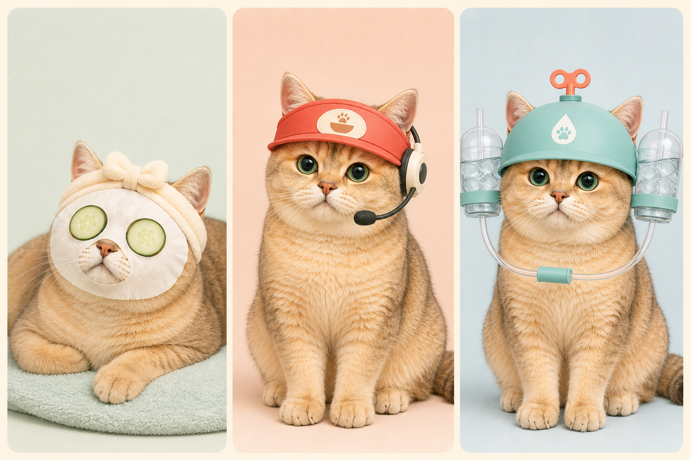
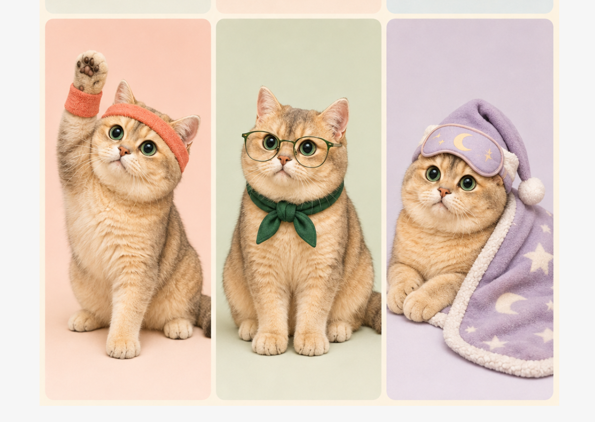
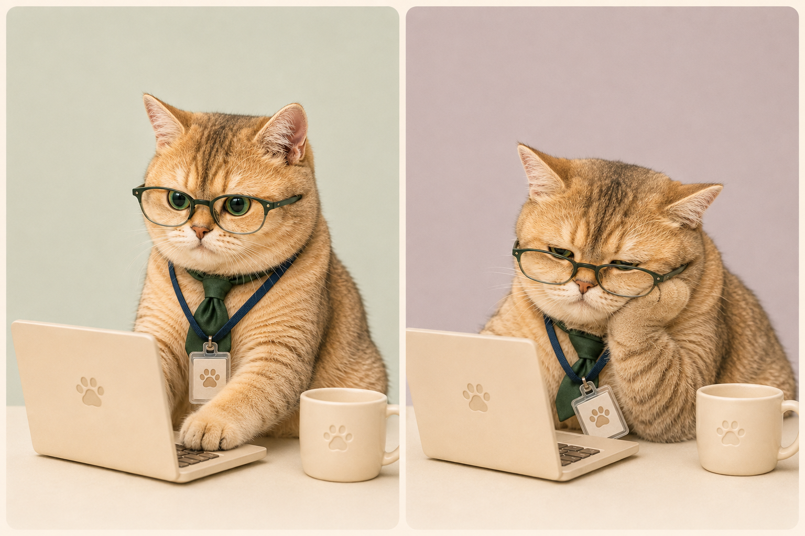

# 圆圆 1.5.7 情境装扮开发方案

状态：设计提案 v1.1  
开发基线：圆圆提醒 1.5.7  
建议发布候选：1.5.8（仅在功能实现和完整验证后升级）

## 1. 目标

为圆圆增加由真实应用状态驱动的“情境装扮”，让用户不用阅读文字，也能从圆圆的造型和姿势快速判断它正在休息、提醒吃饭、提醒喝水、专注工作或因工作过久而疲惫。

首版不是自由搭配服装的换装商城，而是固定角色本体、固定场景身份和固定动作语义。每个场景只使用一个强识别主道具，最多增加一个辅助道具，避免遮住圆圆的眼睛、鼻子、耳朵和金色毛发特征。

首版范围包括：

- 云朵护理员：白色面膜、黄瓜眼贴、闭眼躺卧；
- 开饭值班员：猫耳帽檐、单边耳机和麦克风；
- 补水管理员：双水杯、软管、上链式补水帽；
- 热身教练：珊瑚色运动发带和护腕，配合伸展与活动提醒；
- 专注陪读员：绿色眼镜和领巾，安静陪伴学习与阅读；
- 晚安巡夜员：紫色睡帽、眼罩和星月毯，覆盖入睡与醒来；
- 上班圆圆：眼镜、领带、工牌、电脑和咖啡；
- 劳累圆圆：工作持续过久后，转为半眯眼、托腮和松垮姿势。

重逢接待员和今日冠军保留为第二阶段扩展。

## 2. 设计示意图

### 2.1 首版核心造型



- 护理：白色面膜覆盖面部，双眼放置黄瓜片，圆圆闭眼躺下并呈现放松状态。
- 开饭：参考猫耳帽檐、单边耳机和麦克风的结构，使用原创饭碗爪印，不出现第三方品牌标志。
- 补水：参考上链帽和双杯结构，杯中改为透明冰水，帽子使用薄荷蓝、浅水蓝和珊瑚色点缀。

### 2.2 热身、陪读与晚安造型



- 热身教练：珊瑚色发带和护腕，抬爪伸展，承担久坐活动提醒；
- 专注陪读员：绿色眼镜和领巾，不带电脑，承担学习、阅读和安静陪伴；
- 晚安巡夜员：紫色睡帽、额头眼罩和星月毯，睡眠循环时眼罩落下并保持蜷卧。

### 2.3 专注工作与久坐疲劳



左侧为正常专注状态；右侧为持续工作后的疲劳状态。两侧必须保持同一副眼镜、领带、工牌、电脑和咖啡杯，只改变姿态、眼神和配件松垮程度，使变化看起来是同一个角色经过了一段时间，而不是更换了另一张图片。

以上图片均为设计示意，不是可直接安装的动画素材。正式资产必须重新按每格 `192 × 208`、每行 8 帧的宠物图集规范制作和验证。用户提供的第三方参考图片只用于造型研究，不复制到仓库、不进入安装包。

## 3. 产品原则

### 3.1 装扮是状态语言

用户应在约半秒内理解圆圆当前的状态。装扮首先服务于提醒和陪伴语义，其次才是装饰。

### 3.2 圆圆身份始终优先

- 保持圆脸、绿色眼睛、金色毛发、耳朵、鼻子、体态和真实照片质感一致；
- 不用巨大的卡通眼睛替代原眼睛；
- 面膜必须保留鼻子、嘴部、耳朵和脸部边缘；
- 疲劳通过眼睑、耳朵、托腮和身体重心表现，不能拉伸或扭曲脸型；
- 同一场景的所有帧一次生成完整动作家族，不拼接来自不同生成批次的单帧。

### 3.3 一次只出现一个身份

圆圆不能同时戴护理面膜、开饭耳机和工作工牌。场景切换必须先退出旧身份，再进入新身份；强提醒可以直接打断低优先级的环境装扮。

### 3.4 非语言优先

精灵图中不放文字、条形码、品牌标志、对话框或口号。提醒内容继续由现有系统卡呈现，无障碍名称明确描述状态，不依赖颜色或造型猜测。

### 3.5 原创化边界

- 开饭造型只吸收“猫耳帽檐＋耳麦值班员”的通用结构；
- 补水造型只吸收“帽子＋双杯＋软管”的通用结构；
- 不使用麦当劳金拱门、包装、制服、MIND.A.DAY、CoverCat 或其他第三方字样；
- 咖啡杯和工牌只使用圆圆自己的爪印符号，不出现参考图中的文字或版式。

## 4. 首版场景定义

| 场景 | 触发条件 | 进入动作 | 持续动作 | 完成或退出 |
| --- | --- | --- | --- | --- |
| 云朵护理员 | 用户主动休息；专注结束后的休息阶段 | 戴好发带和白色面膜，躺下 | 闭眼呼吸，黄瓜片随头部轻微起伏 | 普通退出播放摘下面膜；强提醒可立即打断 |
| 开饭值班员 | `meal` 类型提醒到期 | 戴猫耳帽檐，触碰耳机并抬爪 | 保持值班姿势，偶尔轻触耳麦 | 完成后播放现有 `eating-food`；稍后或跳过后恢复原状态 |
| 补水管理员 | 现有喝水提醒到期 | 补水帽就位，双杯轻微稳定 | 一次强提醒后安静等待 | 完成后播放现有 `drinking-water`；稍后或跳过后恢复原状态 |
| 热身教练 | 现有活动提醒到期 | 戴好运动发带并抬爪招呼 | 伸懒腰、左右热身和短暂蹦跳 | 完成活动后收起护腕并恢复原状态 |
| 专注陪读员 | 学习会话、阅读陪伴或学习卡片进行中 | 戴眼镜、系领巾并安静坐好 | 低频眨眼、看卡片、轻微歪头 | 学习结束后摘下眼镜并恢复原状态 |
| 晚安巡夜员 | 手动睡觉或符合现有自动入睡条件 | 戴睡帽、放下眼罩并蜷卧 | 眼罩覆盖双眼，毯角随呼吸轻微起伏 | 唤醒时推起眼罩、钻出毯子并回到清醒姿态 |
| 上班圆圆 | 专注会话进行中；受信任务持续运行 | 戴眼镜和工牌，进入电脑前 | 低频敲键盘、查看屏幕、停顿思考 | 工作结束后收起场景道具并恢复安静状态 |
| 劳累圆圆 | 连续工作接近活动提醒阈值 | 敲键速度降低，眼镜下滑，身体逐渐下沉 | 半眯眼、单爪托腮，另一爪停在键盘旁 | 休息完成后伸懒腰并恢复精神；强提醒优先打断 |

## 5. 连续工作与疲劳规则

### 5.1 时间来源

首版不增加第二套独立久坐计时器，优先复用已有数据：

- 专注会话使用既有会话开始时间；
- 普通电脑使用复用活动提醒的连续使用累计；
- 受信任务守望只在内存中记录本次持续运行时间，不保存任务正文、项目路径或额外活动历史。

### 5.2 状态阶段

| 阶段 | 建议条件 | 表现 |
| --- | --- | --- |
| 精神工作 | 从开始至疲劳提示点 | 正常坐姿、低频敲键盘、眼镜端正 |
| 疲劳过渡 | 达到当前活动提醒间隔约 80% | 敲键变慢、停顿增加、眼镜轻微下滑 |
| 劳累状态 | 达到疲劳提示点但尚未完成休息 | 半眯眼、托腮、工牌歪斜、身体下沉 |
| 恢复 | 用户完成休息或开始新的专注会话 | 收起咖啡和电脑，播放伸懒腰，再恢复精神工作 |

疲劳提示点建议跟随用户已有的活动提醒间隔，并限制在 20–60 分钟范围内，避免极短间隔频繁换装或极长间隔一直没有反馈。

专注会话进行中，疲劳造型只提供安静的视觉提示，不弹出新的打断卡。专注结束后再进入休息或伸展。喝水、到期事项和等待用户等高优先级提醒仍可打断专注造型。

## 6. 优先级与恢复

由高到低：

1. 喝水、到期事项、开饭提醒、等待用户处理；
2. 用户主动发起的猫条、逗猫棒、摸摸和扔球互动；
3. 活动提醒及其热身动作；
4. 专注工作、受信任务守望和劳累状态；
5. 主动休息和护理装扮；
6. 普通待机与自动睡眠。

规则：

- 高优先级状态开始时，保存可恢复的长期状态，但不保存一次性动作进度；
- 提醒结束后，只在原状态仍有效时恢复，例如专注会话仍在进行才恢复上班圆圆；
- 圆圆手动入睡后，高优先级提醒按现有策略唤醒；处理完成后是否继续睡眠仍由当前活动仲裁器决定；
- 减少动态模式跳过穿戴和过渡动作，直接显示每个场景的稳定关键帧；
- 动画关闭时，装扮仍可显示静态姿态，但不能依靠闪烁或移动传达唯一信息。

## 7. 素材结构

### 7.1 新增场景图集

新增：

```text
public/assets/pet/scene-atlas.webp
```

建议采用 8 列 × 18 行、每格 `192 × 208` 的几何规格，总尺寸 `1536 × 3744`：

| 行 | 动作名称 | 帧数与循环 |
| --- | --- | --- |
| 0 | `spa-enter` | 8 帧，一次性 |
| 1 | `spa-loop` | 8 帧，低频循环 |
| 2 | `spa-exit` | 8 帧，一次性 |
| 3 | `meal-alert` | 8 帧，一次性 |
| 4 | `meal-wait` | 8 帧，低频循环 |
| 5 | `hydration-alert` | 8 帧，一次性 |
| 6 | `hydration-wait` | 8 帧，低频循环 |
| 7 | `work-focus-loop` | 8 帧，低频循环 |
| 8 | `work-fatigue-enter` | 8 帧，一次性 |
| 9 | `work-fatigue-loop` | 8 帧，低频循环 |
| 10 | `work-recover` | 8 帧，一次性 |
| 11 | `warmup-alert` | 8 帧，一次性 |
| 12 | `warmup-loop` | 8 帧，低频循环 |
| 13 | `study-focus-loop` | 8 帧，低频循环 |
| 14 | `study-curious` | 8 帧，一次性 |
| 15 | `night-enter` | 8 帧，一次性 |
| 16 | `night-loop` | 8 帧，低频循环 |
| 17 | `night-exit` | 8 帧，一次性 |

### 7.2 贴身装扮与场景道具

贴身且随身体移动的内容直接进入场景图集：

- 面膜、黄瓜片和发带；
- 开饭帽檐、耳机和麦克风；
- 补水帽、双杯和软管；
- 运动发带和护腕；
- 陪读眼镜和绿色领巾；
- 睡帽、眼罩和星月毯；
- 工作眼镜、领带、挂绳和工牌。

电脑和咖啡杯使用现有道具层思路实现：复用 `Computer` 道具并新增 `CoffeeMug`。这样可以保持猫咪动作格紧凑，也方便强提醒到来时快速收起桌面道具。工牌必须跟随胸部运动，因此不能只做成固定 CSS 贴片。

### 7.3 清单扩展

在宠物清单中增加：

```text
sceneSpritesheet
sceneRows
sceneAnimations
```

前端动画表增加 `scene` 图集类型。每个动作继续声明行号、帧序、每帧时长和循环起点，不在组件中硬编码动画节奏。

## 8. 运行时设计

新增纯函数 `resolveSceneAppearance`，只根据权威状态快照选择场景，不直接操作窗口：

```text
喝水到期                 -> hydration-alert / hydration-wait
开饭提醒到期             -> meal-alert / meal-wait
用户互动进行中           -> 暂时退出情境装扮，使用现有互动动作
活动提醒到期             -> warmup-alert / warmup-loop
学习或阅读会话进行中     -> study-focus-loop / study-curious
专注或受信任务运行中     -> work-focus-loop
连续工作达到疲劳提示点   -> work-fatigue-enter / work-fatigue-loop
用户主动休息             -> spa-enter / spa-loop
手动或自动进入睡眠       -> night-enter / night-loop / night-exit
其他                     -> 无情境装扮，使用 1.5.7 现有动作
```

建议修改范围：

- `src/pet/manifest.ts`：增加场景动画类型与回退清单；
- `public/assets/pet/pet-manifest.json`：登记场景图集与时序；
- `src/pet/SpriteAnimator.tsx`：支持 `scene` 图集；
- `src/pet/PetWindow.tsx`：接入场景解析、结束回调和恢复；
- `src/pet/companionMotion.ts`：保持基础姿态和情境装扮之间的映射集中；
- `src/pet/CompanionPropStage.tsx`：复用电脑并增加无文字咖啡杯；
- `src-tauri/src/companion_core.rs`：如需后台统一仲裁，增加开饭和工作疲劳的固定表达信号；
- `src-tauri/src/companion_runtime.rs`：把到期提醒和连续使用状态转换为固定信号；
- `src/types.ts`、`src/panel/TaskPanel.tsx`：增加 `meal` 提醒类别和对应表单选项。

数据库中的提醒类别目前以字符串保存，首版预计不需要新增表或修改历史数据；仍需通过迁移和升级回归确认旧数据库可以无损读取。

## 9. 面板与设置

增加“情境装扮”设置：

- 关闭：始终使用 1.5.7 原动作；
- 仅提醒时：只显示开饭和补水装扮；
- 完整体验：显示提醒、护理、热身、陪读、晚安、工作和疲劳装扮。

默认建议为“完整体验”，同时尊重现有动画模式和减少动态设置。

提醒编辑表单增加“吃饭”类别，并允许创建早餐、午餐和晚餐的普通重复提醒。首版不自动推断用户饭点，不访问网络或定位。

无障碍状态至少包括：

- 圆圆正在休息护理；
- 圆圆正在提醒吃饭；
- 圆圆正在提醒喝水；
- 圆圆正在专注工作；
- 圆圆工作久了有些疲惫。

## 10. 开发阶段

### 阶段 A：合同与回退

- 冻结 1.5.7 当前宠物清单和提醒优先级测试；
- 增加场景图集类型、清单字段和缺失资源回退；
- 确保没有 `scene-atlas.webp` 时仍完整使用旧动作。

### 阶段 B：首版视觉资产

- 以圆圆现有形象为唯一身份参考，逐行生成 18 个完整动作家族；
- 装配透明场景图集；
- 生成逐行动画预览和接触表；
- 修复身份漂移、裁切、配件跳动、透明边和道具穿插。

### 阶段 C：状态仲裁

- 接入护理、开饭、补水、热身、陪读、晚安、专注和疲劳状态；
- 实现提醒抢占、用户互动抢占和状态恢复；
- 确保专注、睡眠、提醒和互动仍只有一个呈现所有者。

### 阶段 D：面板与可访问性

- 增加吃饭提醒类别；
- 增加情境装扮设置；
- 完成键盘操作、屏幕阅读器名称、强制颜色和减少动态行为。

### 阶段 E：验证与发布

- 完成自动化、视觉和真实 Windows 运行验收；
- 实现完成后统一升级到候选版本 1.5.8；
- 构建安装版并验证 1.5.7 数据升级、提醒恢复和卸载保留数据。

## 11. 测试计划

### 11.1 单元测试

- 喝水提醒始终高于活动、工作疲劳和护理状态；
- 开饭提醒能进入提醒、等待、完成、稍后和跳过流程；
- 疲劳提示点计算有上下界，计时暂停和重置正确；
- 活动提醒进入热身教练，完成、稍后和跳过后正确退出；
- 学习与工作同时存在时，权威活动所有者只能选择陪读或工作其中一个；
- 入睡、睡眠循环和唤醒按顺序播放，强提醒仍能可靠唤醒；
- 专注会话结束后不残留电脑、咖啡或工牌；
- 强提醒结束后只恢复仍有效的长期状态；
- 减少动态和动画关闭均选择稳定关键帧；
- 场景图集缺失或清单错误时安全回退，不阻断提醒核心。

### 11.2 集成测试

- 专注工作过程中到期喝水：工作场景退出，补水提醒出现，处理后恢复专注；
- 劳累状态下开始逗猫：电脑和咖啡立即收起，互动结束后按连续工作状态恢复；
- 睡眠中到期开饭或喝水：按现有规则唤醒，处理后由活动仲裁器决定恢复；
- 完成喝水后原有杯数统计不受场景动画影响；
- 应用重启后不恢复一次性换装进度，不产生重复提醒。

### 11.3 视觉验收

- 场景图集尺寸、透明通道、格子占用和未使用格符合规范；
- 每一行完整播放，无尺寸跳变、基线跳动、裁切和跨格；
- 圆圆在全部场景中保持同一脸型、毛色、眼睛和体态；
- 面膜状态明确闭眼且有两片黄瓜，鼻子和嘴部可辨；
- 开饭状态在桌面宠物尺寸下可辨识耳机和麦克风；
- 补水杯中只显示清水，不出现深色饮料或第三方文字；
- 正常工作与劳累状态的眼神和姿势一眼可区分；
- 热身、陪读和晚安三套造型在桌面宠物尺寸下互不混淆；
- 睡帽、眼罩和毯角在入睡与唤醒过程中不穿模；
- 工牌、眼镜、软管和咖啡杯在动画中不漂移、不穿模；
- 100%、125%、150% Windows 缩放均检查实际播放；
- 动画气泡和系统卡不能遮挡圆圆的脸与主要装扮。

### 11.4 完整项目验证

实现阶段完成后执行：

```powershell
npm.cmd run verify
cd src-tauri
cargo test
cd ..
npm.cmd run tauri build
```

## 12. 首版验收条件

- 七类情境和八个状态均有独立、可识别且连贯的动作；
- 提醒优先级、专注安静、睡眠恢复和互动清理不发生回归；
- 工作状态能在连续使用后自然过渡到劳累状态，并在休息后恢复；
- 吃饭提醒可创建、重复、完成、稍后和跳过；
- 所有装扮可关闭，关闭后行为与 1.5.7 一致；
- 减少动态、动画关闭和无障碍名称完整；
- 不包含第三方商标、文字、包装或参考图片；
- 自动验证、Rust 测试、动画 QA 和 Windows 正式构建全部通过。

## 13. 第二阶段候选

- 重逢接待员：格纹围巾和轻蹭动作；
- 今日冠军：任务完成后短暂出现的小纸皇冠。

第二阶段仍遵守“一次一个身份”，不引入自由混搭和服装商店。
