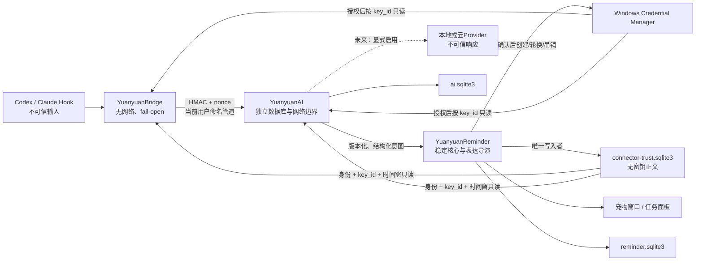

# 圆圆智能陪伴P0威胁模型

状态：P0可执行草案 
日期：2026-08-04 
范围：`YuanyuanReminder.exe`、`yuanyuan-ai.exe`、`yuanyuan-bridge.exe`、两套SQLite数据库、Windows Credential Manager、命名管道、暂存目录、未来连接器与Provider边界 
对应方案：最终设计16章、开发方案P0-015

## 1. 安全目标与不可破坏条件

1. AI、Bridge、连接器或模型全部故障时，喝水、活动、专注、提醒、宠物日常和本地数据仍可用；
2. 未经认证的外部事件不能改变任务状态，重放不能重复生效；
3. Bridge不访问网络、不调用模型、不迁移数据库，Hook在所有异常路径保持fail-open；
4. AI进程不读取或锁定`yuanyuan-reminder.sqlite3`，模型不能直接控制宠物UI；
5. 密钥正文只在Windows Credential Manager中存在，不进入SQLite、日志、诊断、备份或前端；
6. 外部文本始终是不可信数据，不能自行扩大权限、生成任意返回动作或触发工具；
7. 未明确授权时不上传任务、文件、倾诉、工作内容或诊断；
8. 不绕过Windows密码、PIN、Windows Hello或锁屏边界。

## 2. 资产

| 编号 | 资产 | 保护目标 | 主要责任 |
| --- | --- | --- | --- |
| A01 | 提醒核心及其可用性 | 不被AI故障、外部事件或锁竞争拖垮 | WS1 |
| A02 | `yuanyuan-reminder.sqlite3` | 完整性、可恢复性、本地私密性 | WS1/WS8 |
| A03 | `yuanyuan-ai.sqlite3` | 任务审计一致性、记忆与会话隔离 | WS1/WS5 |
| A04 | 连接器HMAC密钥 | 机密性、来源隔离、可轮换和可吊销 | WS2 |
| A05 | 任务事件和状态证据 | 来源真实性、顺序、终态和审计完整性 | WS2 |
| A06 | 原始倾诉、工作内容、文件和路径 | 默认不持久化、不外发、不进入诊断 | WS0/WS4/WS5 |
| A07 | 用户授权与确认 | 不被模型、Hook或外部内容伪造 | WS1/WS7 |
| A08 | 宠物表达与用户信任 | 不虚构成功、不冒充说话、不操纵用户 | WS0/WS1/WS3 |
| A09 | 安装包、三个可执行文件和连接器配置 | 发布身份、升级完整性、可回退 | WS8 |
| A10 | 备份、导出和删除墓碑 | 不泄密、不复活已删除敏感内容 | WS5/WS8 |

## 3. 攻击者与失效主体

- 不可信Hook、任务日志、网页、文件或模型输出；
- 同一Windows用户下的其他普通进程；
- 匿名、其他本地账户或远程客户端；
- 被污染、过旧或被替换的连接器、AI程序、安装包和依赖；
- 恶意或配置错误的Provider、自定义地址和重定向目标；
- 能诱导用户点击但不能绕过系统认证的社会工程攻击者；
- 非恶意故障：磁盘满、只读、锁占用、休眠、崩溃、升级中断、时钟异常和事件风暴。

管理员或已完全控制当前Windows账户的攻击者不在“能够绝对阻止”的范围内；产品仍必须通过签名、审计、最小权限和不保存额外秘密降低损害，不能把“同一用户”当成可信来源。

## 4. 信任边界与入口

边界规则：Bridge→AI只传认证任务事件；AI→核心只传版本化结构化意图；WebView不直连Provider；两个数据库不共享连接或迁移；外部事件不能携带任意命令、URI或可执行路径。

## 5. 威胁登记表

风险等级使用“高/中/低”；高风险没有自动化或可重复人工证据时阻断发布。风险接受人是角色，不代表当前风险已经接受。

| ID | 威胁与入口 | 现有控制与证据 | 剩余风险/下一验证 | 风险 | 接受人 |
| --- | --- | --- | --- | --- | --- |
| T01 | Hook伪造任务成功、失败或等待用户 | HMAC覆盖全部已知字段；密钥按`connector_id + source_instance`隔离；稳定核心创建/轮换/立即吊销；Bridge和AI双重身份绑定；真实凭据闭环与篡改测试关闭失败 | 真实实例发现、Hook信任审核和连续认证失败停用未完成 | 高 | WS2＋WS0 |
| T02 | 合法事件重放或ACK丢失造成重复 | 5分钟窗口、16字节nonce、AI库原子登记；相同事件幂等ACK、不同身份拒绝 | 时钟跳变与跨版本nonce迁移仍需验证 | 高 | WS2 |
| T03 | 同一用户的其他进程向管道注入 | 当前用户DACL之外再做HMAC认证；普通取钥不能绕过身份/时间授权；跨连接器身份拒绝；未知、旧签和吊销密钥拒绝 | 需完成同用户非授权真实进程攻击夹具和连续认证失败暂停策略 | 高 | WS2 |
| T04 | 匿名、其他账户或远程管道访问 | 受保护DACL、真实匿名令牌`ACCESS_DENIED`、`PIPE_REJECT_REMOTE_CLIENTS` | 真实第二Windows账户与远程主机证据未完成 | 高 | WS2/WS8 |
| T05 | 超大、损坏、乱序、未知版本事件造成DoS或错误状态 | 64KiB上限、协议校验、保守降级、CRC32C隔离、容量硬上限、乱序状态机 | JSON深度/频率预算和长时间事件风暴待验证 | 高 | WS2 |
| T06 | Bridge阻塞源任务或输出污染Hook | 目标1秒、硬超时3秒、所有路径退出码0、stdin输入、stdout/stderr静默 | 真实Codex/Claude版本夹具和24小时压力未完成 | 高 | WS2/WS8 |
| T07 | 暂存目录被篡改、塞满或利用链接逃逸 | 当前用户DACL、文件/字节上限、原子改名、SHA-256去重、链接拒绝、损坏隔离 | 卸载清理和安全软件长期占用仍需验证 | 中 | WS2/WS8 |
| T08 | AI数据库满盘、只读、锁竞争或强杀造成半提交 | 独立库、`BEGIN IMMEDIATE`、提交后ACK；满盘/只读/写锁/独占占用零写入恢复；真实强杀重启保留记录；7/90/180/365天有界保留清理及故障整体回滚 | 损坏迁移、备份恢复、睡眠、清理调度和24/72小时长期增长待验证 | 高 | WS1/WS5 |
| T09 | AI崩溃循环拖垮提醒核心 | 独立进程、健康门、退避、第三次熔断、显式恢复；真实子进程崩溃时核心事务持续成功 | 24/72小时常驻与系统睡眠证据未完成 | 高 | WS1/WS8 |
| T10 | 旧/新核心与AI协议错配 | v1健康协议、未知版本无ACK、v1/v2真实调试子进程双向拒绝 | 历史签名发布二进制和升级中断矩阵未完成 | 高 | WS1/WS8 |
| T11 | 恶意`return_action`打开文件、命令或任意URI | 协议只接受受限动作标识；稳定核心静态注册表绑定内置连接器身份/来源/精确动作，目标只允许短ASCII不透明标识；渲染前签发2分钟一次性能力凭证，点击后消费并以当前注册表、目标摘要二次校验；URI、文件、Shell、脚本、路径、控制字符、篡改、过期、撤销与重放测试均关闭失败；正式来源处理器未过门前固定降级任务守望台且无Tauri命令 | Codex/Claude真实来源窗口处理器、锁屏/焦点窃取、正式按钮、审计落盘和无障碍验收尚未实现，不得开放外部返回 | 高 | WS1/WS2 |
| T12 | 日志、网页、文件通过提示注入调用工具 | 不可信来源标签不得洗掉；模型无权授予权限；工具需宿主策略和结构验证 | AI运行时、工具代理与恶意样本套件尚未实现 | 高 | WS5/WS7 |
| T13 | 自定义Provider造成SSRF、明文泄露或错误域凭据外发 | WebView无Provider网络；设计要求AI进程允许列表、DNS/重定向复核和关闭后硬断网 | Provider网络层尚未实现，不得启用云模型 | 高 | WS4/WS5 |
| T14 | WebView脚本或CSP扩大网络出口 | 当前产品可离线运行；设计冻结WebView IPC-only和无通配`connect-src` | 需建立CSP自动回归和生产包检查 | 高 | WS1/WS8 |
| T15 | 恶意深链、项目路径、备份名导致命令执行或目录穿越 | 返回动作拒绝URI；提醒备份名校验；连接器底层协调器拒绝非普通目录/文件和重解析点并绑定打开后Windows文件身份；用户级官方入口只接收已授权身份或单次令牌，路径由核心解析；项目级只读命令仅允许任务面板调用且没有路径参数，Rust原生选择器结果立即密封，确认令牌不含路径，来源双因子/授权/根目录与固定`.codex`/`.claude`子目录在读取前后重复校验；同目录自有临时文件/备份以身份精确清理，原子替换失败不覆盖原文 | 具备特权的祖先重解析点矩阵、真实窗口验收和AI导入导出仍待完成 | 高 | WS1/WS5 |
| T16 | 旧备份恢复使已删除记忆复活 | AI备份默认关闭；设计要求删除墓碑、DPAPI本机备份和口令便携导出分离 | P2备份格式和删除传播尚未实现 | 高 | WS5/WS0 |
| T17 | 诊断、日志、审计或任务守望泄露密钥、代码、路径或倾诉 | 认证错误为稳定分类；密钥Debug脱敏；信任审计只有固定动作/原因/时间和`key_id`；诊断快照无自由正文、64 KiB/5文件、预览、精确清理、原子写入和当前用户DACL；用户导出只接受本机普通驱动器上的绝对`.json`，拒绝重解析祖先和覆盖，临时/最终文件复读时均执行独立规范Schema与敏感标记扫描，绝对路径不回传且无应用内副本/自动上传；表达导演只读AI任务库四个固定字段并把任务键截断为不透明摘要，不读取标题、正文、工作区或原始事件，缺失/旧Schema/异常路径关闭失败；NSIS卸载默认保留LocalAppData/RoamingAppData，只有显式勾选才删除，两条路径已有候选绑定合成哨兵证据 | 第二账户/满盘/目标占用/安全软件、数据库交换竞态、其余DPI/Narrator和卸载辅助功能矩阵尚未完成 | 高 | WS5/WS8 |
| T18 | 安装包、sidecar或连接器被替换/降级 | AI只从核心同目录固定文件名启动；协议不兼容关闭失败；来源工具只读复核用离线`WinVerifyTrust`绑定打开文件身份、精确发布者和分发位置，再用Windows系统暂存包身份或Claude v2发布证据中的SHA-256交叉；v2证据绑定清单哈希、唯一版本平台和代码审核过的签名根版本区间，生成器固定输入快照并拒绝撤销/过期/多个签名、未知根、重复/未知字段及验证器替换；Claude 2.1.211两平台清单证据已验签导入且真实x64文件已通过双因子适配器；脚本、多安装、包族/清单缺失及同名替换关闭失败；发布门用一次性静默安装从最终NSIS提取实际`NSS`主程序，区分构建目录`UNK`主程序，并要求便携主程序、NSIS实际主程序和安装包三项候选哈希、签名身份与安全扫描一致 | 圆圆自身Authenticode、时间戳、SBOM、历史/后续Claude版本与arm64实体、签名/包族/密钥轮换实证和回退尚未完成 | 高 | WS8＋WS0 |
| T19 | 安装/卸载覆盖或删除用户原有Hook配置 | Bridge尚未进入安装包；私有官方接入/断开流程绑定授权身份、当前handler集合、官方根目录及全部用户级候选来源，再由底层协调器执行两分钟确认、重读、精确备份和原子替换；撤销要求语义所有权与规范原始节点字节同时精确，混合组只删圆圆handler，触碰/重复节点关闭失败；私有组合状态机配置优先并允许冲突后显式仅断权，区分权限撤销、凭据清理与本地维护结果；撤权后维护只删除信任库证明已撤销的精确凭据并记录进度；来源工具可信度已与安装/授权分层，双因子不通过时明确阻断未来真实守望；产品只接入了零写入项目检查，真实Hook写入命令仍不存在，开发实验台默认关闭执行且不进入发布目录 | 真实Hook写入的正式设置页/Tauri命令、Claude版本/安装/轮换矩阵、真实窗口验收和卸载夹具尚未实现 | 高 | WS2/WS8 |
| T20 | 模型绕过表达导演直接让猫“说话”、虚构成功或操纵用户 | 三进程边界；稳定核心拥有最终表达权；产品冻结非语言N0—N4；Rust导演只接受固定信号并输出固定姿态/道具/标签，快照没有台词、自由文本、动画名、资源或工具参数；模型优先级不能越过提醒，N3/N4另需信息文档/正式确认卡；本地提醒、专注、睡眠和减少动态已接入生产路径；AI任务库只读状态按30秒终态聚合/10分钟摘要冷却/10分钟长运行/24小时失效映射；三档日小时预算、一键安静和无气泡专注完成仪式由稳定核心执行且预算不保存任务内容；六种固定道具只使用固定短标签和来源枚举；旧PetIntent只有绑定事项的事务可进入系统卡，简单反馈载荷文字为空，固定无障碍语义不读取事件文字，发布边界阻断旧气泡类名与历史猫咪对白 | 真实Hook/签名sidecar发布接线、模型回应接线、忽略后自适应降频、可点击任务台及真实窗口辨识/无障碍验收尚未完成 | 高 | WS0/WS1/WS3 |
| T21 | 对工作挫折或危机状态作诊断、说教、依赖诱导或虚假救援承诺 | 不做情绪诊断；S0—S2分级；危机资源用静态包；不自动联系他人 | 专业复核、危机资源版本和安全评测尚未完成 | 高 | WS0/WS6 |
| T22 | 锁屏休息被应用绕过系统认证 | 现有产品不绕过Windows认证；设计明确禁止 | 新休息模式必须保持系统认证E2E | 高 | WS1/WS8 |

## 6. 已验证的可重复安全证据

- 协议、Bridge、连接器、AI和核心共397项Rust测试通过；普通整仓运行另有3项需要符号链接创建特权或完整交互式Windows登录凭据的发布门按设计忽略；
- 真实Windows匿名令牌无法打开当前用户专属命名管道；远程标志固定启用；
- 正式Credential Manager写侧完成32字节随机密钥、本机持久化、两阶段轮换、旧事件五分钟窗、立即重置和精确清理；
- 信任库完成身份绑定、永久`key_id`墓碑、类型化审计、旧表迁移（含凭据清理标记无损补列）、16身份容量、事务回滚和凭据删除失败后权限不复活；
- 稳定核心确认令牌绑定动作与身份、两分钟过期、单次消费且最多16个；状态查询不创建存储、不返回`key_id`；
- 私有Hook写入协调器绑定原始/候选摘要与Windows文件身份，覆盖单次消费、过期、并发变化、同内容换文件、同目录备份、原子替换失败和脱敏错误；真实重解析点用例因当前进程无符号链接创建特权而保持发布门，不计为已通过；
- 私有官方目标封装的生产函数签名不接受路径，并覆盖Codex全部用户级来源绑定、非首选来源出现、授权材料/官方根目录变化、冲突无令牌、幂等、容量和脱敏；该封装仍没有Tauri命令或前端入口；
- 项目级只读检查现只允许任务面板经Tauri官方原生选择器创建模块内密封的目录能力，覆盖Codex/Claude固定项目来源、用户层叠加、项目层圆圆所有权冲突、根目录/配置子目录替换、重解析目录拒绝、来源工具专属第二因子、两分钟单次/可取消令牌、16项容量和全输出脱敏；它不读取任务、代码或递归内容，不返回或持久化路径，且没有任何配置写入入口；
- 来源工具信任复核使用Windows离线Authenticode链、精确发布者与分发位置，并要求Windows系统暂存包身份或Claude v2发布证据SHA-256第二因子；打开句柄和结束后的文件身份一致性阻止同名替换。v2生成器与Rust消费者共同验证规范版本、固定平台、清单/二进制摘要、唯一版本平台和代码审核过的签名根版本区间，签名子密钥归并至主根，撤销/过期/多个签名、未知根、非规范字段及验证器替换关闭失败；状态卡不返回路径/哈希/证书材料且不执行来源进程。本机真实Store管理Codex已通过签名与包身份适配器，Claude 2.1.211两平台清单证据已验签导入且真实x64文件已通过签名与摘要双因子适配器；
- 无损撤销覆盖规范单-handler组、混合用户组、部分安装、重复撤销，以及注释、重格式化、修改、重复和非首选来源变化拒绝；备份与原子替换失败保持安装原文；
- 私有断开组合状态机覆盖配置先于断权、配置冲突后显式仅断权、配置失败不尝试断权、配置成功后断权失败重试、权限已撤销但凭据清理/本地维护待完成、过期/重放和16项容量；撤权后维护使用独立令牌，精确凭据清理失败可有界推进且不重新授权；返回不含身份或路径；
- 真实Bridge CLI完成签名输入、原始字节传输、提交后ACK、静默成功且不创建暂存；
- 满盘、只读、写锁、独占文件占用、事件表故障均不产生半提交，解除故障后可重试；
- 真实AI进程兼容矩阵、崩溃熔断、健康超时终止、强制终止后数据保留和重新启动通过；
- AI或子进程崩溃循环期间，提醒设置、今日事项和专注状态仍可访问。

证据索引见`docs/P0_PROGRESS.md`、`docs/adr/`和`docs/protocol/`。当前正式NSIS不包含AI与Bridge，因此这些证据属于P0原型，不代表任务守望已经发布。

## 7. 发布阻断条件

以下任一项成立时，不得把AI、Bridge或真实Hook加入发布安装包：

- 任一高风险项缺少与实际发布路径相符的自动化或可重复人工验证；
- Bridge需要网络、AI需要提醒数据库、模型可直达WebView/宠物UI；
- 密钥、原始倾诉、代码或完整Hook载荷进入日志、数据库、备份或诊断；
- 协议不兼容时仍启动高层能力，或AI故障影响提醒核心；
- 安装器不能验证三个exe发布身份，或卸载会破坏用户原有Hook；
- 真实第二账户、历史二进制升级、睡眠恢复、24小时守望和72小时发布候选门禁未完成；
- 非语言表达、安抚安全路径或危机资源未通过对应用户研究和专业复核。

## 8. 风险接受与变更流程

- 高风险只能由WS0产品负责人和对应技术责任人共同接受，并记录期限、原因、补偿控制和复核日期；
- WS8可因证据不足阻断发布，不能以排期、演示成功或“仅本地运行”为理由自动接受风险；
- 协议、权限、网络出口、数据库归属、凭据、返回动作、备份密钥或危机安全资源变化必须链接新的ADR或更新本模型；
- 风险关闭必须引用实际测试、构建、签名、研究或复核产物，不能只写“代码已实现”；
- 本模型每个里程碑结束、发布候选生成、重大依赖升级或安全事件后复核一次。

## 9. 当前明确接受的P0残余风险

P0原型暂时接受“AI与Bridge不进入安装包、真实Hook不启用”这一隔离前提下的实现不完整；这不是对正式发布风险的接受。管理员或已完全控制当前Windows账户的攻击者仍可读取当前用户可访问的数据或替换未签名开发产物，正式发布通过签名与安装路径保护降低风险，但不承诺抵御已完全失陷的操作系统。
