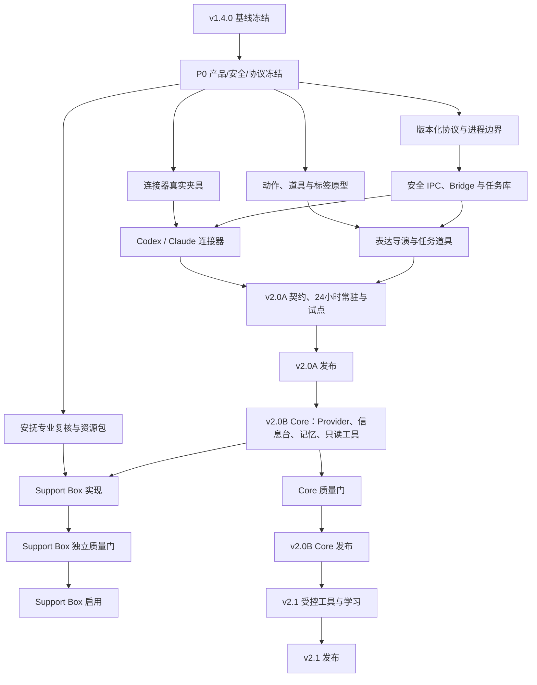

# 圆圆智能陪伴与任务守望能力分解开发方案

方案版本：1.0<br>
编制日期：2026-08-03<br>
设计依据：`docs/YUANYUAN_AI_COMPANION_EXPERT_REVIEW.md` v1.5<br>
实施状态：`docs/P0_PROGRESS.md`<br>
当前基线：圆圆提醒 v1.4.0 构建候选版<br>
目标版本：v2.0A、v2.0B Core、Support Box、v2.1<br>

---

## 1. 方案目的

本方案把已经冻结的最终设计转换为可以建立里程碑、拆 Issue、安排人员和执行质量门的开发计划。它不重新讨论产品方向，也不授权扩大功能范围。

开发遵循五项执行原则：

1. v1.4.0 是稳定离线核心，任何智能功能故障都不能影响提醒、喝水、活动、专注、历史、备份和宠物日常；
2. 先验证任务守望和非语言表达地基，再加入 LLM、记忆、安抚和受控写工具；
3. 稳定主程序、智能进程和任务桥采用独立故障域，提醒数据库和智能数据库分离；
4. 每个阶段都有独立可发布产物和退出门，未过门模块不得通过同版本其他模块“搭车发布”；
5. 产品、视觉、安全、职业健康/心理健康和发布工作从 P0 并行进入，不把它们留到代码完成后补做。

文中的“人日”表示有效工作量，不等于自然日，也不能直接把各Epic人日相加后当作阶段周期；视觉、顾问、QA和主开发可并行。阶段周数沿用最终设计的初估，必须在P0根据真实人员到位、Spike结果和动画产能重新校准。

## 2. 版本交付边界

| 交付单元 | 用户价值 | 必须包含 | 明确不包含 | 是否可独立发布 |
| --- | --- | --- | --- | --- |
| v1.4.0 稳定底座 | 完全离线的桌面宠物与提醒工具 | 当前全部能力、迁移、备份、安装和回归证据 | AI、任务守望 | 是，且必须先冻结 |
| v2.0A 任务守望 | 圆圆替用户安静看着 Codex/Claude Code 长任务 | Bridge、受限 IPC、任务事件、连接器、表达导演、四类道具、标签模式、诊断与24小时常驻 | LLM、长期记忆、写工具、完整安抚盒 | 是 |
| v2.0B Core | 圆圆能理解输入、保持小猫身份并用信息工具回应 | AI 进程、Provider、倾听台、安全信息文档、精选记忆、只读工具、AI 数据控制 | 通用 Shell、自动审批、任意文件写入 | 是，不受 Support Box 延期阻塞 |
| Support Box | 工作不顺时提供用户主动选择的非语言安抚 | 六路径、只听不记、数据去向、支持偏好、S0—S2、安全资源和专业复核 | 诊断、治疗、被动情绪识别、自动求救 | 是，独立功能门 |
| 三路径基础陪伴集 | 完整安抚盒未过门时的安全降级 | 只陪我一会、陪我动一动、先别管我 | 倾诉收集、呼吸练习、问题整理、安抚效果表述 | 可随 v2.0B Core 发布 |
| v2.1 受控工具与学习 | 用户确认后处理少量低风险事务并形成可审核技能 | 结构化写工具、确认、撤销、审计、学习卡、技能版本 | 通用电脑控制、技能市场、多 Agent 编排 | 是 |

版本编号、安装包显示名称和数据库 schema 版本分别管理，不能用应用版本号替代协议版本或数据迁移版本。

## 3. 拟议工程落点

P0 先验证结构，不要求立即大规模搬迁现有代码。通过验证后建议形成以下边界：

```text
yuanyuan-reminder/
  src/
    companion/                 非语言表达、道具和标签模式
    taskwatch/                 任务台、连接器设置和任务状态 UI
    ai/                        倾听台、安全信息文档和记忆中心
    support/                   基础陪伴集与完整 Support Box
    pet/                       保留现有渲染、交互和动画播放
    panel/                     保留现有提醒、专注、设置等面板
  src-tauri/
    src/
      companion_core/         表达导演、优先级、状态恢复和功能门
      commands/               按业务域拆分 Tauri commands
      ...                     保留提醒调度、仓储、Windows 集成
    crates/
      yuanyuan-protocol/       无 Tauri 依赖的版本化协议与测试夹具
      yuanyuan-bridge/         YuanyuanBridge.exe，快速校验、入队、fail-open
      yuanyuan-ai/             YuanyuanAI.exe，Provider、记忆和工具编排
    migrations/               仅提醒核心数据库迁移
    ai-migrations/            yuanyuan-ai.sqlite3 独立迁移
  tests/
    fixtures/connectors/       脱敏 Codex/Claude 版本化事件夹具
    contracts/                 协议、连接器和 Provider 契约测试
    soak/                      24/72小时常驻与故障注入
  docs/adr/                    架构决策记录
```

边界要求：

- `yuanyuan-protocol` 只包含数据结构、Schema、规范化、签名载荷和兼容规则，不依赖 Tauri、WebView 或 Provider SDK；
- `YuanyuanBridge.exe` 不访问网络、不调用模型、不执行数据库迁移，只做输入限制、认证、入队和快速返回；
- `YuanyuanAI.exe` 是唯一允许访问模型 Provider 的进程，网络目标由 Rust 允许列表控制；
- `YuanyuanReminder.exe` 保留提醒核心和确定性的表达导演，不承载模型推理；
- v2.0A 即初始化独立 `yuanyuan-ai.sqlite3` 的连接器、任务和事件表，P2 再增加会话、文档、记忆和技能表；任务数据不得临时写入提醒数据库；
- 现有 `PetIntent` 在迁移期只服务 v1.4.0 提醒表达。新的 `response_intent`、`prop_presentation` 和 `display_document` 不继续向它堆叠自由文本和动画名。

## 4. 工作流与责任划分

| 工作流 | 主要责任 | 主代码区域 | 推荐负责人 | 关键输出 |
| --- | --- | --- | --- | --- |
| WS0 产品与决策 | 范围、指标、用户研究、ADR和变更控制 | `docs/`、研究夹具 | 产品负责人 | 冻结边界、研究报告、门禁结论 |
| WS1 稳定核心与表达导演 | 状态优先级、道具编排、恢复、功能门 | `src-tauri/src/companion_core/`、`src/companion/` | Windows/Rust 主开发 | 确定性表达状态机 |
| WS2 任务协议与连接器 | 事件协议、Bridge、IPC、Codex/Claude 接入 | `src-tauri/crates/yuanyuan-protocol/`、`yuanyuan-bridge/` | Rust/连接器开发 | 可信、非干预的任务状态 |
| WS3 前端体验与无障碍 | 任务台、道具、标签、设置和屏幕阅读器 | `src/taskwatch/`、`src/companion/` | React/UX | 可理解、可操作的非语言 UI |
| WS4 AI 与安全信息台 | Provider、结构化意图、安全内容块和只读工具 | `yuanyuan-ai/`、`src/ai/` | AI/Rust/React | v2.0B Core 智能入口 |
| WS5 记忆与数据生命周期 | AI 数据库、FTS5、删除、备份和便携导出 | `ai-migrations/`、`yuanyuan-ai/` | Rust/数据开发 | 可解释、可删除的精选记忆 |
| WS6 安抚与安全支持 | 六路径、只听不记、资源包和专业复核 | `src/support/`、智能进程受限接口 | 产品/前端/顾问 | 独立过门的 Support Box |
| WS7 受控工具与学习 | 工具策略、确认、撤销、审计和学习卡 | `yuanyuan-ai/`、Rust业务命令 | Rust/AI | v2.1 受控执行闭环 |
| WS8 QA、视觉与发布 | 动画、契约测试、常驻、签名、SBOM和安装 | `public/assets/pet/`、`scripts/`、发布配置 | QA/视觉/发布 | 可签名、可回归的安装包 |

每个关键模块设置一名主负责人和一名可接手者。P1 结束前，可接手者必须能依据契约文档独立运行连接器模拟器、定位一项失败夹具并完成一次表达状态机变更演练。

## 5. 依赖关系与关键路径



硬关键路径为：v1.4.0冻结 → P0协议/故障域 → 安全IPC与Bridge → 两个连接器 → 表达导演 → v2.0A质量门 → v2.0B Core → v2.1。

Support Box 是并行支路。它依赖 v2.0B Core 的倾听台和结构化信息能力，但其专业复核、本地化资源和隐私质量门不反向阻塞 Core。

## 6. 工作项标准

### 6.1 Definition of Ready

进入开发的任务必须具备：

- 对应最终设计章节和一个稳定的工作项编号；
- 用户价值、非目标、数据敏感级别和失败降级；
- 输入/输出 Schema 或界面状态；
- 依赖项、负责人、可接手者和估算；
- 至少一条正常验收和一条故障/取消验收；
- 涉及 Hook、Provider、备份、深链、安抚或写操作时，有对应威胁模型条目。

### 6.2 Definition of Done

任务完成必须同时满足：

- 代码、迁移、配置和文档均已更新；
- 单元、契约或集成测试覆盖主要路径和失败路径；
- 不破坏 v1.4.0 离线核心，AI/Bridge关闭时有明确回归结果；
- 日志不含凭据、原始倾诉、提示词、代码或完整 Hook 载荷；
- UI 通过键盘、文本缩放、减少动态效果和标签模式检查；
- 修改协议时同时更新兼容表、金标准夹具和降级行为；
- 修改宠物动作时通过角色一致性、透明背景、完整动作行和连续播放 QA；
- 达到阶段质量门后才能标记对应 Epic 完成，不能以“代码已写完”代替。

## 7. P0：冻结与技术验证（3—4周）

P0 目标是用最小原型关闭不确定性，不开发完整产品功能。

### P0-E01 v1.4.0 基线冻结

估算：2—3人日；负责人：WS8；硬前置：无。

任务：

- P0-001 保存当前提交和全部有效未提交成果清单（接手基线约27项，实施时以实时状态为准）、数据库迁移版本、安装包和资源哈希清单；
- P0-002 重新执行 TypeScript、前端测试、Rust测试、宠物资源验证和安装构建；
- P0-003 记录提醒延迟、空闲CPU、内存、数据库大小、启动时间和24小时常驻基线；
- P0-004 使用 v1.3.2 数据库副本验证升级、备份、恢复和失败回滚；
- P0-005 建立“AI全部关闭”回归套件，作为后续每阶段必跑门禁。

交付物：`BASELINE_V1.4.0.md`、基线测试报告、安装包哈希、性能基线。

完成条件：发布级待验证项有明确通过/阻塞结论；未冻结 v1.4.0 前不得修改智能架构。

P0-004 前置实现证据（2026-08-06）：已增加非默认 `migration-qa` 验收程序，强制要求显式绝对路径、关闭态普通文件和 schema v6，只读源文件并在随机副本上执行生产迁移、旧列逐值保持、备份恢复与迁移失败安全回滚；报告不含源路径或用户正文。合成 v6 链发现并促成修复了迁移失败后事务未关闭、同连接回滚可能暴露半迁移结构的问题，默认回归已覆盖。当前仍缺少操作者确认来源于 v1.3.2 的真实副本，因此该任务不能标记完成，详见 `P0_V132_DATABASE_MIGRATION_QA_2026-08-06.md`。

当前实施状态（2026-08-09）：非默认`runtime-qa`增加`baseline-ai-off`配置和30秒至72小时受控退出，配套PowerShell采样整棵Tauri/WebView2进程树的启动、逐PID CPU增量、工作集、私有内存、句柄、线程、数据库增长、正式目录写入、AI子进程和Application Error。60秒短测通过，CPU平均0.0684%、P95 0.2117%，正式目录写入0。`reminder-latency`配置和通用隔离夹具从计划时间、生产`claim_due`实际领取时间和Windows UI Automation真实呈现时间计算三段延迟P50/P95；验收构建先生成生产前端并启用Tauri `custom-protocol`，窗口以可见方式启动。20个真实窗口样本覆盖2/5/8/11/14秒五个调度相位各4次且全部通过：后端领取P50/P95为6,903.5/12,938.9 ms，领取到窗口交接P50/P95为240.9/281.0 ms，总呈现P50/P95为7,150.2/13,167.8 ms，均低于冻结的16,000/1,000/17,000 ms上限。独占运行锁、唯一标题、完整强提醒无障碍名称和时间顺序校验会阻断并发或任务列表提前命中的假阳性；schema v2报告绑定主程序、夹具和脚本哈希，少于20样本的负向门按设计返回2。独立校验器会重算延迟与分位值并重新绑定三份来源，拒绝相位/字段漂移、过期来源和乐观篡改，当前报告复核退出0。发布边界现会通过一次性静默安装—提取—卸载取得NSIS实际`NSS`主程序，并与构建目录`UNK`主程序和安装包分别进入清单、签名和安全软件门；实际安装变体已在独立Windows测试账户完成3次新配置可见窗口采样，P50/P95为136.4/230.1 ms，AI子进程、Application Error和残留均为0。采样器使用普通账户可用的原生进程快照，以SID/ProfileList绑定实际账户目录，schema v2同时绑定采集脚本。产物不变时发布清单哈希保持稳定，预检可重新验证而不会自行令外部证据过期；默认路径文件转换与控制面板注册现在是两个独立检查，后者在当前受管账户继续保持待办。P0-005“AI全部关闭”组合门已完成并接入每轮`verify`和发布预检。这些仍不替代24小时、睡眠恢复和干净机安装证据。见`P0_RUNTIME_BASELINE_QA_2026-08-06.md`、`P0_REMINDER_LATENCY_QA_2026-08-06.md`、`P0_RELEASE_COLD_START_QA_2026-08-06.md`、`P0_NSIS_INSTALLED_PAYLOAD_QA_2026-08-09.md`与`P0_AI_DISABLED_REGRESSION_2026-08-06.md`。

P0-003常驻验收增量（2026-08-09）：同一隔离采样器现提供显式24小时严格门，固定请求86,400秒、60秒采样、300秒预热和至少72,000秒活跃样本覆盖；运行期间必须观察到真实Windows `suspend→resume` 与 `lock→unlock` 成对事件，不会主动锁机、解锁、睡眠或绕过系统认证。工作集、私有内存、句柄和线程按6段中位点计算每小时斜率，并同时限制首末段增长；CPU、数据库增长、正式目录零写入、AI零子进程、Application Error零事件和受控退出共同决定结果。schema v2绑定主程序、夹具与执行脚本，独立复核器重算全部统计和失败原因；5项回归覆盖来源过期、样本/趋势篡改、未知字段、系统事件缺失、乐观通过及短测冒充。30秒真实窗口执行链已通过，严格复核按设计拒绝该短测；真实24小时正向报告仍待人工安排并完成睡眠和锁屏动作，见`P0_RUNTIME_ENDURANCE_GATE_2026-08-09.md`。

### P0-E02 架构决策与安全边界

估算：3—5人日；负责人：WS0/WS1/WS2。

任务：

- P0-010 ADR-001：三进程故障域、启动/停止、监督、熔断和升级顺序；
- P0-011 ADR-002：`yuanyuan-protocol`、任务事件协议v1和兼容策略；
- P0-012 ADR-003：命名管道DACL、会话SID、HMAC、nonce、重放和容量边界；
- P0-013 ADR-004：`return_action + return_target`，拒绝任意URI和可执行协议；
- P0-014 ADR-005：提醒数据库与 `yuanyuan-ai.sqlite3` 生命周期；
- P0-015 建立资产、攻击者、入口、缓解、验证和风险接受人齐全的威胁模型；
- P0-016 制定模块责任图、第二名可接手者和决策变更流程。

交付物：5份ADR、威胁模型、责任图、协议草案。

完成条件：不存在必须让Bridge访问网络、让AI进程进入提醒数据库或让模型直达宠物UI的设计缺口。

### P0-E03 协议、进程和 IPC 技术刺探

估算：4—6人日；负责人：WS1/WS2。

任务：

- P0-020 建立最小 `yuanyuan-protocol` crate，验证序列化、Schema版本和未知字段兼容；
- P0-021 建立 Bridge→命名管道→主程序的空载荷样例，测量P95；
- P0-022 验证显式DACL、远程客户端拒绝和同用户非授权进程失败；
- P0-023 验证进程未启动、队列已满、载荷损坏和超时均不会阻塞调用者；
- P0-024 验证主程序监督AI进程崩溃循环并熔断，不影响提醒调度；
- P0-025 验证事件落盘、CRC32C损坏隔离、容量上限和重放去重。

交付物：可运行Spike、基准数据、失败注入记录。

完成条件：Bridge处理目标1秒、硬超时3秒可实现；故障域和fail-open得到可重复证据。

当前诊断卡增量（2026-08-09）：设置页的本地诊断卡已经补齐预览/清理二次确认的确定性焦点进入与取消返回、礼貌实时状态、忙碌语义和强制颜色边界；预览展示独立敏感扫描v1的4项结论，第二步通过Windows原生窗口选择本机`.json`保存位置。后端拒绝远程盘、重解析祖先、覆盖和非规范Schema，在临时与最终文件复读时重新扫描；绝对路径不回传，不创建应用内副本，也不自动上传。非默认`runtime-qa`诊断配置在当前144 DPI（150%）桌面取得607×943物理窗口、404.7×628.7逻辑窄窗正向证据；真实Enter/Tab链、原生窗口打开/关闭、434字节合成导出、敏感匹配0、固定无障碍边界、预启动中性隐私背景、正式目录零写入、受控退出与隔离清理全部通过。独立校验器重新绑定来源、PNG及导出JSON，并拒绝DPI虚拟化、灰屏、敏感/陈旧/乐观导出证据。该结果只关闭当前150%档，100%、125%、200%、高对比度、文本缩放、Narrator以及第二账户/满盘/安全软件验收仍开放，见`P0_DIAGNOSTIC_CARD_RUNTIME_QA_2026-08-09.md`。

### P0-E04 连接器能力与金标准夹具

估算：4—6人日；负责人：WS2/WS8。

任务：

- P0-030 冻结支持的 Codex 和 Claude Code 版本范围；
- P0-031 采集并脱敏 running、waiting_user、succeeded、failed、cancelled、重复、乱序和缺失事件；
- P0-032 给每份夹具记录来源版本、事件语义、权威等级和敏感字段；
- P0-033 验证 Codex notify/Hooks 与 Claude Hooks 的短超时、空决策和退出码；
- P0-034 建立未知版本、缺少字段和额外字段的保守降级样例；
- P0-035 输出连接器能力矩阵和配置合并/撤销差异样例。

交付物：版本化夹具、能力矩阵、Hook非干预报告。

完成条件：可以在不启动真实长任务的情况下复现全部核心状态和异常。

### P0-E05 非语言表达与道具原型

估算：5—8人日，视觉并行；负责人：WS1/WS3/WS8。

任务：

- P0-040 冻结 N0—N4、四种v2.0A道具和状态→表达映射；
- P0-041 制作纯动作、辅助标签、自适应标签三套可点击原型；
- P0-042 验证运行、需要用户、成功、失败、未知五种状态的辨识率；
- P0-043 单独访谈任务守望用户的学习意愿、标签偏好和打扰感；
- P0-044 冻结现有动画复用清单、新增动作清单、视觉规范和降级姿态；
- P0-045 验证优先级抢占后恢复专注/睡眠/提醒状态，不遗留道具；
- P0-046 验证减少动态效果、高对比度、150%/200% DPI和屏幕阅读器语义。

交付物：交互原型、研究报告、动作说明书、标签默认决策。

完成条件：60秒介绍后核心状态辨识率达到冻结阈值；未达到时明确采用辅助/自适应标签，不恢复猫咪台词。

### P0-E06 AI、信息文档与记忆刺探

估算：4—6人日；负责人：WS4/WS5。

任务：

- P0-050 用一个云Provider和一个回环Provider验证结构化输出、流式、取消和超时；
- P0-051 冻结 `response_intent` v1意图枚举、未知意图安静降级和兼容表；
- P0-052 冻结安全 `display_document` 内容块、`references`、`actions` 和大小限制；
- P0-053 验证原始Markdown/HTML、自动链接、远程资源和正文伪造按钮无法渲染或执行；
- P0-054 用中文数据比较 FTS5 `unicode61`、`trigram` 或受控分词方案；
- P0-055 冻结记忆来源、置信度、敏感级别和低信任事实断言测试；
- P0-056 冻结DPAPI本机备份和口令型便携导出的恢复体验，算法参数留待P2安全复核。

交付物：Schema v1草案、Provider契约报告、FTS5评测、备份ADR。

完成条件：自由文本无法直达宠物UI；信息文档和低信任记忆的安全边界可自动测试。

### P0-E07 安抚与专业复核

估算：4—6人日，顾问时间另计；负责人：WS0/WS6。

任务：

- P0-060 原型化六路径和三路径基础陪伴集；
- P0-061 由职业健康/心理健康顾问复核呼吸替代、结构性压力和禁用文案；
- P0-062 冻结S0—S2、正式安全面板、地区资源包格式和复核周期；
- P0-063 冻结地区缺失、过期、校验失败时不猜号码的通用降级；
- P0-064 验证“只听不记”零持久化架构和崩溃即丢弃；
- P0-065 验证“理一理”数据去向图标和重新授权流程；
- P0-066 形成Support Box独立功能门及未过门裁剪规则。

交付物：专业复核记录、资源包Schema、功能门定义、隐私数据流图。

完成条件：完整模块通过顾问复核，或明确只进入三路径基础陪伴集；两种结果均不阻塞v2.0B Core设计。

当前工程证据（2026-08-04）：

- P0-060：已完成六路径状态定义、双质量门裁剪、开发实验台和正式三路径入口；正式入口只提交固定路径与时长，使用内存会话、固定非语言动作和事务抢占，完整六路径产品界面仍未实现；
- P0-062/P0-063：资源包v1及缺失、非法、未生效、过期时的无号码通用降级已自动测试，见 `protocol/SUPPORT_RESOURCE_PACK_V1.md`；
- P0-064：已证明当前前端会话不调用存储、日志、网络、后端或模型，关闭/完成后正文不可达；AI原型已在私密引导与本地存储前应用进程级WER无堆并对全局/本进程LocalDumps配置失败关闭。两阶段强退取证工具已实现：QA注入版release AI在真实授权正文路径后异常终止并扫描应用/转储目录，离线终结器要求停机页面文件副本及休眠/交换文件完整状态；工具规则已通过，获授权隔离主机实测仍待完成；
- P0-066：只有专业复核和地区资源同时就绪才开放完整六路径，否则只开放三路径；该门已固化为确定性代码；
- 类型化支持偏好已进入AI数据库v3并覆盖作用域、删除墓碑、防旧备份复活和v2→v3失败回滚；原始倾诉没有可写入字段；
- P0-065：数据去向与重新授权交互原型已完成；本机/云端选择、授权前披露、五分钟单次回执、去向/Provider变化、过期、消费和取消后的重新授权均有确定性回归，开发页完成宽窄屏真实点击且正式包排除通过。`yuanyuan-ai`已增加内存单次能力核心，并在可信Rust Provider描述与适配器绑定后消费授权，只构造固定Schema和本次用户原文；专用结果门仅向工具层返回“事实、感受、可控、下一步”四字段。独立本地请求协议不扩写健康/关闭控制通道；9项协议与10项可信宿主/监听回归证明授权前无正文、提交无额外上下文、响应无通用模型字段，注册表披露变化会撤权，适配器只在正文校验与授权消费后创建；协议请求/命令/响应/结果不提供`Debug`或`Clone`，session、令牌、正文、四格结果和Support Sort专用收发缓冲在正常释放时主动清零。Windows隔离传输原语已增加有界双向命名管道、读取前后客户端PID快照、进程创建/退出时间校验、连接/写入/响应共用的3秒硬截止，以及仅通过继承stdin传递的32字节随机session；23项管道单元、1项同用户独立进程、3项引导单元和5项真实AI子进程回归证明静默服务端按时返回、畸形/伪造输入、已退出进程句柄及同账户非授权进程关闭失败、连续实例重建不丢消息、直接父进程身份不符在数据库前拒绝、策略闸门在身份核验后且正文读取前拒绝，AI强退后必须用新session重启。稳定核心监督器进一步把引导接入每次AI启动/重启epoch，并在写入失败、AI退出、熔断、关闭或重启时撤去父进程session；健康与关闭控制请求使用有界双向传输，健康探测不突破启动门的剩余预算。AI现会在健康门开放前绑定私密监听，以单实例串行形成零队列背压；稳定核心内部请求端注入session且不向调用者暴露管道，真实AI进程已完成无Provider查询往返。调用者断连和AI停机均会触发Provider取消令牌；慢Provider回归证明并发请求按预算失败、合作取消后服务恢复，原生Windows客户端截断写或放弃响应读取后监听器同样恢复。稳定核心新增同目录固定文件名、WinTrust链、精确发布者、签名证书SHA-256及监督周期文件锁组成的AI签名启动门，5项回归证明策略未冻结时相邻原型仍不可启动、身份缺项或不匹配关闭失败。正文隐私门进一步禁止十二段内部生产链（新增语义预审门）加入日志/控制台宏或为敏感载荷恢复自动`Debug`，并使Provider请求、原始模型输出、解析显示文档、授权令牌/身份、四格结果及面板命令敏感字段在普通释放、拒绝、过期、取消与全撤销时主动清理；真实AI调试子进程已用唯一正文金丝雀贯通固定Provider和四格结果，关闭后标准流为空、隔离本地文件零命中且release AI不含测试入口，稳定核心同正文闭环的捕获日志也为零。未注册面板门只接受`panel`窗口，拒绝外部请求标识/session/额外上下文，由稳定核心生成请求标识并注入私密session；它未加入Tauri命令注册。非默认PID复用压力执行器与独立验证器在第424次创建取得真实同PID不同创建时间样本，并证明旧身份在载荷读取前被拒绝。确定性语义预审和版本化工程语料已完成；真实签名/包身份正向证据、第二账户、正式Tauri注册后窗口动态金丝雀、真实Provider、强退转储/换页取证、绕过/误拒评测和专业顾问签审仍未完成，见`P0_SUPPORT_SORT_PRIVACY_GATE_2026-08-07.md`、`P0_SUPPORT_SORT_SEMANTIC_PRE_REVIEW_2026-08-08.md`与`P0_PID_REUSE_STRESS_QA_2026-08-07.md`；
- P0-065崩溃隐私增量：AI非关闭辅助路径在私密引导、`LOCALAPPDATA`和数据库前先设置并回读WER `NOHEAP`，再只读检查64位HKLM中的全局与`yuanyuan-ai.exe`专属LocalDumps配置；策略不可用、读取失败或发现配置时关闭失败。每次已认证Support Sort连接还会在身份核验后、正文分配与读取前重新复核。正文源码隐私门此前由九段扩展为十一段，当前纳入语义预审门后为十二段；release AI必须存在三项崩溃隐私正向标记。真实PID复用单项已在第424次创建观察并证明旧身份读取前拒绝；两阶段强退捕获/离线页面文件扫描工具、源码与产物绑定、跨分块UTF-8/UTF-16LE扫描和正式AI注入标记排除已完成，但尚无获授权隔离主机的在线捕获及停机页面文件证据。第二账户和签名包身份仍待完成。该增量仍不覆盖检查后的竞态、管理员调试器、未纳入指定目录的外部转储工具或未声明完整的内存载体，仍不得据此开放Support Box，见`P0_AI_CRASH_PRIVACY_GATE_2026-08-07.md`、`P0_PID_REUSE_STRESS_QA_2026-08-07.md`与`P0_CRASH_PRIVACY_FORENSIC_QA_2026-08-08.md`；
- P0-061、真实地区包、顾问签字和用户研究仍未完成，完整Support Box继续关闭。

详细分解、测试矩阵和发布判断见 `P0_SUPPORT_SAFETY_SPIKE.md`。

### P0-E08 发布、签名与误报预演

估算：3—5人日；负责人：WS8。

任务：

- P0-070 比较 Microsoft Artifact Signing、OV/EV和Store渠道；
- P0-071 设计三个exe与安装包统一身份、SHA-256和RFC3161时间戳流程；
- P0-072 在未签名/候选签名构建上执行Defender、SmartScreen和至少两款目标市场安全软件预演；
- P0-073 建立误报复现、厂商提交、跟踪和发布阻断流程；
- P0-074 冻结SBOM、许可证、辅助进程兼容清单和回退要求。

交付物：签名选型、预算和采购路径、误报处理SOP。

完成条件：签名和误报路径在预算、时间和密钥保护上可执行。

当前实施状态（2026-08-10）：已建立版本化发布策略、候选证据状态、Windows Authenticode采集、CycloneDX 1.6 SBOM、第三方许可证清单、候选哈希绑定的Defender扫描入口、日常预检和严格发布阻断。当前Windows x64清单为507个去重组件、0项许可证声明缺失；生产图进一步生成覆盖301个第三方组件的2,686,481 bytes确定性许可证全文归档，冻结22种精确表达式、11个受来源约束的回退映射和5个MPL精确源码地址。项目许可证、素材许可、第三方摘要和逐组件全文通过精确Tauri资源映射进入NSIS安装/卸载脚本；策略漂移、缺文件、路径逃逸、代码文件误收录和绝对路径泄露会阻断生成。自动证据不替代素材权利、发布地区、许可证选择与专业法律复核。官方渠道复核确认Artifact Signing Public Trust存在主体地区限制，Store的MSI/EXE路径仍要求安装器及全部PE预先使用受信CA证书签名，因此在发布主体、地区和预算明确前不猜测渠道。NSIS实际载荷、官方v1.3.2→当前候选→先卸载当前版再回装旧版的隔离转换、默认安装路径文件转换、安装失败恢复、合成全新数据库首次启动恢复及卸载数据选择均已形成候选绑定自动证据；预检将默认路径文件转换与控制面板注册拆成独立检查，当前候选13项自动门通过、13项外部/人工门待完成，严格门按设计退出2。损坏候选以退出码2拒绝；主程序替换受阻的首轮探测曾发现NSIS返回0却形成“旧主程序+新卸载器/许可文件”的半升级，现由安装前独占替换检查以退出码32在写入前拒绝，旧核心、卸载器、许可边界和合成哨兵均保持不变。schema v2又把原始候选放入1% CPU硬上限与关闭即终止子进程树的Windows Job，在观察到部分主程序写入后强制终止，要求部分文件哈希、旧卸载器、许可缺席、哨兵和零残留全部成立，再由未修改候选完整恢复。独立首次启动探针在合成空数据目录观察到非空SQLite WAL后终止同类受限Job，再由同一NSIS安装核心恢复到可见窗口、schema 11、完整默认数据和`quick_check=ok`；规范化无旁文件样本由独立校验器重开复核。真实卸载复选框初始关闭，默认卸载保留LocalAppData/RoamingAppData合成哨兵，明确勾选后两处才被删除。当前受管账户拒绝HKCU写入，默认路径报告明确保持`registrationGatePassed=false`且`default_install_control_panel_registration=pending`；控制面板注册、真实旧库迁移、真实掉电/系统重启和签名候选仍属于完整人工门。本机由火绒接管安全产品状态，`WinDefend`停止且`Get-MpComputerStatus`不可用；未启停用户安全服务，Defender扫描没有被伪装为通过。稳定核心另已接入关闭态AI签名启动门，发布主体与证书未冻结前不会启动相邻原型。完整流程见`release/P0_RELEASE_SIGNING_AND_FALSE_POSITIVE_SOP.md`、`P0_THIRD_PARTY_LICENSE_QA_2026-08-09.md`、`P0_RELEASE_UPGRADE_ROLLBACK_PROBE_2026-08-09.md`、`P0_RELEASE_DEFAULT_INSTALL_PATH_QA_2026-08-09.md`、`P0_RELEASE_INSTALL_FAILURE_RECOVERY_QA_2026-08-09.md`、`P0_RELEASE_FIRST_START_RECOVERY_QA_2026-08-10.md`、`P0_RELEASE_UNINSTALL_DATA_CHOICE_QA_2026-08-09.md`与`P0_AI_SIDECAR_TRUST_GATE_2026-08-07.md`。

P0-E08渠道决策更新（2026-08-10）：项目负责人已调整为低成本分阶段方案。当前 NSIS 仅通过 GitHub Releases 作为明确标注、附 SHA-256 的未签名测试版；计划稳定渠道为 Microsoft Store MSIX，由 Store 托管签名。占位身份MSIX技术预览已完成结构验证，但Store身份、运行矩阵和正式提交候选尚未建立，正式`selectedChannel`保持`pending`，正式发布门继续关闭。

P0-E08许可证人工门增量（2026-08-10）：预检不再接受`licenseReviewVerified`裸布尔值。确定性复核包绑定三项正式候选和SBOM、许可清单、全文归档、NOTICE、素材许可、项目许可、许可策略、发布策略八份材料，并冻结507/306/301组件计数、22种生产表达式、11个回退映射和5个MPL源码地址。实际签字契约要求渠道、精确发布者Subject、目标地区、商业属性、具名人工身份、九项复核决定、商业素材许可状态、零未解决发现和至少两项证据引用；拒绝Codex/ChatGPT/AI/Bot/自动化签字、候选或渠道漂移及只改布尔值的伪通过。当前只生成复核包和空模板，未创建实际签字文件，许可门继续保持待办。

P0-E08外部信任门增量（2026-08-10）：预检新增确定性的`release-external-trust-test-packet.json`，以当前发布清单与策略冻结便携主程序、NSIS实际安装主程序、安装包三项候选，并明确SmartScreen必须使用无历史安装/执行的干净Windows环境、真实Internet Zone/Mark-of-the-Web、在线信誉和`no_warning`结果；第三方矩阵要求至少两款互不重复、非Microsoft Defender且实时防护启用的产品覆盖安装前扫描、启动安装、安装、首次启动、常驻、卸载与卸载后扫描，全程零检测。实际签字校验器要求具名人工测试人、环境快照哈希、完整时间与证据引用，拒绝AI/自动化测试人、候选或策略漂移、Defender冒充、重复产品、检测遗漏及只改布尔/计数的伪通过。当前只生成测试包和模板，未创建实际签字文件，SmartScreen与第三方安全软件门继续保持待办，见`P0_RELEASE_EXTERNAL_TRUST_QA_2026-08-10.md`。

P0-E08签名协议门增量（2026-08-10）：预检新增确定性的`release-signing-protocol-packet.json`，冻结三项正式候选、发布策略和Authenticode采集脚本；实际签字校验器实时结合Windows签名事实，要求三项最终产物均为Valid、同发布者Subject/同证书指纹、各有时间戳证书，并由具名人工操作人记录签名工具可执行文件哈希、逐产物执行证据哈希及`/fd SHA256`、RFC3161 `/tr`、`/td SHA256`。拒绝Codex/ChatGPT/AI/Bot操作人、SHA-1、旧式`/t`、非HTTPS时间戳URL、凭据材料、候选/策略/采集脚本漂移及只改`rfc3161ProtocolVerified`的伪通过。当前 NSIS 仅作未签名测试版，包内`decisionsFrozen=false`；正式 Store MSIX 将建立新的候选和验收路径，见`P0_RELEASE_SIGNING_PROTOCOL_QA_2026-08-10.md`。

P0-E08无障碍人工验收门增量（2026-08-10）：发布策略和严格预检新增确定性的`release-accessibility-acceptance-packet.json`，把便携主程序、NSIS实际安装主程序与安装包绑定到最终有效签名候选；实际签字要求100%/125%/150%/200% DPI、100%/150%/200%文本缩放、深浅Windows对比度主题、系统与应用减少动态、五条无指针键盘路径、六条Windows Narrator实际听读路径，以及安装、默认保留数据卸载和显式删除数据卸载全部通过。校验器实时拒绝未签名或证书漂移候选、Codex/ChatGPT/AI/Bot测试人、自动化主要结论、缺档矩阵、Narrator未听到、未解决发现和只改`accessibilityAcceptanceVerified`的伪通过。当前只存在3,762 bytes确定性包与关闭失败模板，尚未执行真实人工矩阵，见`P0_RELEASE_ACCESSIBILITY_ACCEPTANCE_QA_2026-08-10.md`。

P0-E08完整升级回退门增量（2026-08-10）：预检新增确定性的`release-upgrade-completion-packet.json`，冻结三项正式候选、官方v1.3.2身份、六个自动子门、真实数据库迁移报告和签名协议材料；实际签字要求可写HKCU控制面板注册、明确来源的关闭态v1.3.2数据库逐值迁移、真实断电或虚拟机硬重置、实际Windows重启、未修改签名候选恢复，以及先恢复升级前schema v6副本再启动旧版。拒绝Codex/ChatGPT/AI/Bot测试人或样本提供者、优雅退出冒充掉电、杀进程冒充系统重启、旧版打开schema v11数据库、弱迁移/签名结论和只改`upgradeRollbackDrillVerified`的伪通过。当前5,064 bytes包明确只缺真实迁移报告和签名协议实际签字；不读取现有用户库、不执行物理中断或系统重启，完整门继续保持待办，见`P0_RELEASE_UPGRADE_COMPLETION_QA_2026-08-10.md`。

### P0 退出门

只有以下项目全部有结论才能进入 P1：

- v1.4.0 稳定基线通过或有明确先修缺陷；
- 三进程、双库和fail-open证据通过；
- Codex/Claude核心事件可由夹具稳定复现；
- 非语言表达达到阈值或已冻结标签降级；
- Support Box通过复核或已冻结三路径裁剪；
- 地区安全资源缺失降级已复核；
- 签名、误报、负责人和第二接手者可执行；
- P1 Issue 已满足 Definition of Ready。

## 8. P1：v2.0A任务守望（4—6周）

### P1 Epic 分解

| Epic | 估算 | 主要任务 | 依赖 | 完成条件 |
| --- | --- | --- | --- | --- |
| P1-E01 工程骨架 | 3—4人日 | Cargo工作区/多binary、共享协议crate、sidecar打包、开发模式启动与熔断 | P0-E02/E03 | 三进程可独立启动、停止、升级和降级 |
| P1-E02 任务事件与数据库 | 4—6人日 | 协议v1、状态转换、证据等级、归组去重、`watched_tasks/task_events`迁移、纠正终态 | P1-E01 | 乱序、重试、父子任务、跨工作区测试通过 |
| P1-E03 安全IPC与暂存 | 4—6人日 | DACL管道、签名、nonce、时间窗、队列、CRC32C、隔离区、重放 | P1-E01/E02 | 伪造/重放/容量/损坏/崩溃测试通过 |
| P1-E04 连接器信任 | 3—5人日 | Credential Manager、`key_id`、两阶段轮换、立即吊销、重置信任、认证失败停用 | P1-E03 | 轮换宽限与立即吊销行为可重复验证 |
| P1-E05 Codex连接器 | 3—5人日 | notify兼容、Hooks安装/合并/撤销、信任检测、事件映射、诊断 | P1-E02/E04 | 能力矩阵范围内状态可信、异常不干预源任务 |
| P1-E06 Claude Code连接器 | 3—5人日 | Hooks配置、事件过滤、任务归组、fail-open、诊断 | P1-E02/E04 | 不使用阻塞输出/退出码2，跨项目不串线 |
| P1-E07 返回动作 | 2—3人日 | `return_action/target`静态注册表、短时一次性能力凭证、双重校验、安全降级；门禁基础已实现，真实来源处理器与正式入口待来源版本验收 | P1-E05/E06 | 文件、Shell、脚本和未知协议全部拒绝；无可信处理器时只回任务守望台 |
| P1-E08 表达导演 | 5—7人日 | N0—N4基础、优先级、抢占恢复、多任务聚合、打扰预算、按来源/状态暂缓主动提示、功能门 | P0-E05/P1-E02 | 确定性测试覆盖提醒/专注/睡眠/守望/暂缓到期组合 |
| P1-E09 道具与任务台 | 5—8人日 | 小电脑/沙漏、任务牌、任务篮、铃铛、标签三档、稍后/恢复提醒、连接器设置和诊断 | P1-E05—E08 | 五种状态可访问、可点击、可暂缓和恢复、无猫咪对白 |
| P1-E10 动画与视觉 | 并行5—10人日 | 守望、等待用户、成功、失败动作；现有动画降级；DPI与连贯播放 | P0-E05 | 角色一致性、完整动作行和连续播放QA通过 |
| P1-E11 契约与发布门 | 5—7人日 | 夹具矩阵、E2E、故障注入、24小时常驻、干净机、试点统计 | 全部P1 Epic | v2.0A质量门全部通过 |

### P1 建议实现顺序

1. 先完成 P1-E01—E04，禁止在认证和事件状态机未稳定前开始真实连接器；
2. Codex和Claude连接器可并行，但共用同一协议和模拟器，不复制状态逻辑；
3. 表达导演先使用无美术的测试道具状态，随后接入正式资源；
4. 任务台和标签模式可以与连接器并行开发，以夹具驱动，不等待真实Hook；
5. 每合入一个连接器都执行非干预测试；P1末尾再执行24小时组合常驻和试点。

P1-E02前置维护证据（2026-08-06）：任务事件7/90天与任务摘要180/365天有界清理已从启动后单次执行升级为常驻低频调度。AI服务先完成任务与控制双管道健康，5秒后执行首轮，此后每6小时使用独立连接重复；优雅退出会唤醒并回收维护线程，单轮失败不影响任务接收且保留下一轮机会。全新AI库在迁移建表前启用增量回收，每个删除周期最多回收256页；旧库与未知v0表不隐式转换。真实子进程已经删除过期进度事件并在清理后继续通过健康检查和优雅退出。一年等价Release验收以3,650任务、175,200事件和7,300 nonce运行118个删除周期，删除171,287事件与1,148任务后全部不变量通过；相对无压缩基线，检查点后的数据库家族从32,903,168降至2,670,592 bytes。6小时周期仍需在24/72小时、系统睡眠恢复和真实连接器负载下校准，当前不据此宣称长期增长门通过，见`P0_TASK_RETENTION_SCHEDULER_2026-08-06.md`与`P0_TASK_RETENTION_LOAD_QA_2026-08-06.md`。

P1-E02状态可信度证据（2026-08-06）：活动运行不得被另一`run_id`静默替换，曾经生效的旧运行不得回流；提前被拒绝的新运行不会被永久封死，当前运行正常结束后仍可合法启动。父任务允许迟到补全和后续省略，禁止同一运行改挂；父子乱序到达与跨工作区隔离已在真实任务表验证。AI库schema v4只为当前摘要增加固定`evidence_level`，旧v3任务安全默认为`unknown`，迁移失败保持v3。等待用户、成功、失败和取消只有权威证据才进入守望台和表达导演；非权威来源终态投影为状态不明且不锁死后续继续运行或更强证据。Codex部分完成合成载荷已贯穿连接器、认证签名、数据库和只读表达链并证明不会形成确定成功，规则见`protocol/TASK_STATE_RESOLUTION_V1.md`。真实Hook载荷和长期组合运行仍是P1发布门。

当前前置实现证据（2026-08-05）：P1-E08已先行落地确定性表达核心、30秒终态聚合、每10分钟一次摘要、跨重启去重、安静/日常/亲近三档日小时预算、一键安静、专注结束N1伸懒腰仪式和离开后N1轻蹭重逢仪式；两种被动仪式共用同一日/小时额度。重逢只接受白天由真实闲置开始的自动休眠，检测到至少离开10分钟；短暂离开、夜间安静、手动唤醒、专注、提醒和基础陪伴均不触发或阻止呈现。离开资格和时长峰值只在当前进程内存中存在，预算库只保存固定事件种类与时间，不保存任务身份、离开原因、活动内容或自由文本，故障注入可整体回滚。被动仪式自然结束不得计作用户忽略；只有未来具备明确接受/关闭操作的主动邀请才可评估降频，且应用关闭/崩溃、事务抢占、专注、安静、睡眠和窗口不可见均不计忽略。当前不创建忽略历史库，学习卡和其他主动邀请仍按独立设计、隐私和用户研究门推进，不能据此把P1-E08标记为整体完成。

P1-E09前置界面边界也已落地：旧PetIntent按固定枚举拆成动作、系统信息卡、计时卡和工具卡，简单反馈载荷不再携带显示文字；系统卡必须绑定真实事项，生产包禁止旧气泡类名与已清理的猫咪对白。正式设置提供“纯动作 / 需要时显示 / 始终显示”三档道具标签并默认适应模式；适应模式只在等待用户、失败、疑似停住和状态不明时显示固定中性短标签，纯动作不生成备用文字，视觉标签设置不影响固定读屏语义。设置沿用JSON默认补全，无需新增数据库迁移，后端拒绝未知模式。外部任务道具现为明确可聚焦的任务守望入口；稳定核心先从只读AI库读取最多64项最近状态，再在Rust端按Codex/Claude Code与固定状态聚合，只将有界数量交给前端，标题、正文、项目路径、任务标识和精确时间均不跨越后端边界；库缺失不显示入口，页面读取错误不影响其他模块。开发用浏览器夹具受`DEV`编译门保护；另有非默认`runtime-qa`功能以带标记隔离目录、独立应用/WebView数据和合成认证事件驱动真实Tauri链路，两类夹具均受生产边界阻断。当前144 DPI（150%）环境已证明设置完整可见、可持久化；任务守望真实窗口607×943、猫咪窗口330×354无裁切，Windows UI Automation识别固定控件名称，页面Tab顺序和点击猫咪道具唤起任务台通过，正式用户目录零新增写入。证据见`P0_LABEL_MODE_RUNTIME_QA_2026-08-05.md`与`P0_TASK_WATCH_CENTER_QA_2026-08-05.md`。这些仍是合成事件，不证明真实签名Hook；多档DPI、高对比度、Narrator人工体验、全应用键盘和目标用户辨识仍未验收，不能据此把P1-E09标记为整体完成。

P1-E08/E09主动提示暂缓增量（2026-08-06）：任务守望台已提供用户显式的“10分钟后再提醒/恢复提醒”，只暂停匹配“来源 + 固定状态”的圆圆主动表达，聚合任务状态始终留在任务台；主提醒库schema v11只保存来源、状态、截止与更新时间，不保存任务身份或内容。运行、等待用户、失败、疑似停住和未知可暂缓，成功/取消等终态不显示入口。到期非终态正常恢复；超过普通终态窗口的失败会按来源生成一次脱敏聚合，专注、一键安静、基础陪伴和本地提醒仍可阻止呈现，未呈现不消费；按原截止时间确认可防止旧到期记录误删用户续期。契约见`protocol/TASK_WATCH_ATTENTION_DEFERRAL_V1.md`。当前完成390×620开发页面布局及真实点击/恢复检查，正式Tauri、多DPI、高对比度和Narrator仍是P1发布门。

P1-E10失败陪伴动作增量（2026-08-07，2026-08-09验收更新）：`failed`动画由循环改为一次性约1.6秒察觉动作，正式宠物窗口随后在任务牌仍可见时进入`focus-calm`安静陪伴；减少动态模式跳过察觉动作并直接安静陪伴。纯函数回归同时冻结完整动态、减少动态和其他完成动作不误触发三条路径，避免把任务没成功表现为圆圆长时间沮丧或向用户施加照顾压力。非默认`task-failure-motion`运行配置和`failed-only`认证事件夹具已在当前150% DPI交互式Windows桌面取得正向证据：完整动态24帧中16个不同帧，减少动态24帧中1个不同帧，固定无障碍语义、隐私背景、受控退出和隔离清理全部通过，人工复核确认动作一次性收束且失败牌持续。该增量复用现有图集，没有新增或替换美术帧；多DPI、高对比度、Narrator、真实签名Hook和正式签名候选仍未完成，详见`P1_TASK_FAILURE_MOTION_RUNTIME_QA_2026-08-07.md`。

P1-E10任务提示动作增量（2026-08-07，2026-08-09验收更新）：修复`StayClose`共享姿态只按姿态选动画造成的语义串线，只有固定`task_failed`状态可播放失败动作，长运行、基础陪伴和普通陪在身边均保持`focus-calm`。需要用户的`alert-glass-paws`与检查/收起任务牌的`review`由无限循环改为一次性动作，分别收束到`waiting`和`focus-calm`；减少动态直接使用收束姿态，固定道具与无障碍语义保持。隔离运行夹具的失败、等待用户和疑似停滞三场景现已在当前150% DPI取得完整/减少动态共6组真实Tauri窗口正向证据；完整动态不同帧为16/21/16，减少动态均为1。预启动中性背景保证联系表不含桌面或其他应用内容，视觉复核清单以哈希绑定候选、夹具、采集链和全部报告/图像，独立校验器与4项篡改回归通过。多DPI、高对比度、Narrator、真实签名Hook和签名候选仍是发布门，详见`P1_TASK_CUE_MOTION_QA_2026-08-07.md`。

P1-E01连续服务停机增量（2026-08-07）：全量回归捕获到Windows控制管道已确认关闭后，内部任务管道唤醒消息未被主循环确认，导致关闭线程等待客户端超时。主循环现会先确认这条固定内部唤醒再退出；外部事件仍严格保持提交后ACK、失败不ACK。定向真实执行20/20通过，默认与全特性整仓回归通过，见`P1_AI_SERVICE_SHUTDOWN_QA_2026-08-07.md`。

### v2.0A 发布门

- 虚假成功、跨工作区串线、重复终态提醒为0；
- Bridge异常、队列满、主程序未运行均不改变源任务结果；
- 密钥轮换/吊销、重置信任和恶意返回动作测试通过；
- 不配置LLM、无账号、无网络仍可完整守望本地任务；
- 五类状态达到冻结辨识率，或辅助/自适应标签已成为默认；
- 24小时常驻无持续内存增长、队列堆积和提醒风暴；
- v1.4.0离线核心回归全部通过；
- 连接器和表达导演完成第二名开发者接手演练。

## 9. P2-Core：v2.0B Core（5—7周）

| Epic | 估算 | 主要任务 | 依赖 | 完成条件 |
| --- | --- | --- | --- | --- |
| C-E01 AI进程监督 | 3—5人日 | AI进程启动、健康检查、取消、超时、熔断、版本协商 | v2.0A | AI崩溃不影响提醒与任务守望 |
| C-E02 Provider Adapter | 5—7人日 | 一个云Provider、一个回环Provider、能力探测、流式、用量和费用上限 | C-E01 | 每个Provider独立通过契约矩阵 |
| C-E03 意图协议 | 3—5人日 | `response_intent` v1、兼容表、未知意图安静降级、模型输出校验 | C-E02 | 自由文本/动画名无法进入宠物UI |
| C-E04 安全信息文档 | 6—8人日 | 安全内容块、引用、动作注册表、大小限制、流式合并、取消、纯文本降级 | C-E02/E03 | Markdown/HTML、钓鱼链接、远程资源、假按钮均不能生效 |
| C-E05 倾听台与信息台 | 5—7人日 | 键盘入口、聆听动作、生成状态、来源、停止、标签和无障碍 | C-E03/E04 | 简单回应不出文档，复杂内容不成为猫咪台词 |
| C-E06 AI数据库与迁移 | 3—5人日 | 会话、turn、文档、表达事件、schema meta、迁移失败降级 | C-E01 | AI库损坏/迁移失败不影响提醒库 |
| C-E07 精选记忆 | 6—9人日 | 记忆来源、确认、冲突、有效期、FTS5、引用、删除传播 | C-E06 | 中文金标准、低信任事实和删除测试通过 |
| C-E08 只读工具 | 3—5人日 | 今日事项、专注、喝水和历史的结构化只读接口 | C-E03 | 模型不能绕过Rust读取超范围数据 |
| C-E09 Provider与隐私设置 | 4—6人日 | 数据流预览、Credential Manager、服务端保留、SSRF、网络硬禁用 | C-E02 | 关闭Provider后网络层无对应外发 |
| C-E10 AI备份与导出 | 5—7人日 | DPAPI本机备份、口令型便携导出、KDF/格式版本、删除墓碑、重新授权 | C-E06/E07 | 同机恢复、错口令、换机、旧备份复活测试通过 |
| C-E11 非语言智能动画 | 并行5—10人日 | 聆听、思考、慢眨眼、靠近/陪坐、提词器和记忆盒动作 | P0视觉规范 | 无口型、无静态抖动、角色一致性通过 |
| C-E12 Core评测与发布 | 5—8人日 | 中文评测集、身份稳定、协议恶意样例、72小时常驻、干净机 | 全部Core Epic | Core质量门全部通过 |

### Core 关键实现规则

- Provider响应先进入智能进程Schema校验，再由稳定核心选择表达；前端不直接接收Provider流；
- `display_document` 使用受限AST/内容块渲染器，不引入通用Markdown渲染器；
- `actions` 只引用产品注册动作，正文、代码块、引用地址都不能生成按钮；
- 会话历史默认不等于长期记忆，记忆必须显式确认；
- `model_inferred/system_observed` 未确认时不得进入事实断言、工具参数或关系表达；
- 自动AI备份默认关闭；便携导出是显式用户操作且不包含凭据；
- v2.0B Core候选构建可以完全不包含完整Support Box入口。

## 10. P2-Support：Support Box独立支路（与Core并行5—7周）

| Epic | 估算 | 主要任务 | 依赖 | 完成条件 |
| --- | --- | --- | --- | --- |
| S-E01 功能门与基础陪伴 | 3—4人日 | 独立feature gate、只陪着、动一动、先别管我、退出恢复 | 表达导演 | AI关闭时可独立运行，不使用安抚疗效文案 |
| S-E02 只听不记 | 4—6人日 | 进程内缓冲、一次性纸条、关闭/崩溃清除、禁止日志/模型/备份 | 倾听台 | 全链路持久化次数为0 |
| S-E03 缓一下 | 4—6人日 | 呼吸灯/沙漏、无屏息、落地感、安静计时、随时停止 | 顾问复核 | 呼吸不适可立即换路径，不宣称治疗 |
| S-E04 理一理 | 5—7人日 | 数据去向图标、事实/感受/可控/下一步结构、本地/云端确认 | Core Provider/文档 | 不诊断人格或他人动机，不隐藏结构性问题 |
| S-E05 支持偏好 | 3—5人日 | 本次/项目/长期范围、查看/删除、跨工作区隔离 | AI数据库 | 只保存确认偏好，不保存原始倾诉 |
| S-E06 S0—S2与资源包 | 5—8人日 | 正式安全面板、地区静态包、版本/过期/校验、通用降级 | 顾问/安全 | 不由LLM生成热线；缺失时不猜号码 |
| S-E07 安抚动画与道具 | 并行5—10人日 | 安抚盒、倾听台、纸条废纸篮、呼吸灯、整理板、后退动作 | 视觉规范 | 小猫身份连贯、减少动态效果等价 |
| S-E08 专业与隐私发布门 | 5—7人日 | 顾问复核、拒绝/不适/危机场景、云端硬禁用、崩溃与备份排除 | 全部Support Epic | Support Box独立质量门通过 |

S-E01 当前实现状态（2026-08-05）：正式照料页和 Rust 稳定核心已经接通三条固定路径、固定时长白名单、自动结束、手动结束、专注互斥和事务抢占；会话只存在主进程内存，数据库没有支持/情绪历史表，应用重启不恢复。首轮真实Tauri窗口、自动/手动结束和退开动作实拍通过，选择器焦点恢复与焦点环已有DOM回归；多档DPI、真实键盘、读屏和用户辨识验收尚未完成，因此 S-E01 的代码完成条件已满足，体验发布门仍保持打开。

若 S-E08 未通过：

- 构建只开启 S-E01 三路径基础陪伴集；
- 隐藏“安抚盒”完整名称和六路径入口；
- 不发布呼吸、倾诉、问题整理和支持偏好；
- 通用语言入口遇到明确安全风险仍进入正式通用降级面板；
- 不推迟已通过质量门的 v2.0B Core。

## 11. P3：v2.1受控工具与学习（4—6周）

| Epic | 估算 | 主要任务 | 完成条件 |
| --- | --- | --- | --- |
| P3-E01 工具注册表与策略 | 4—6人日 | 结构化Schema、只读/可逆/副作用/高风险分级、权限检查 | 模型不能自行扩权或注册工具 |
| P3-E02 确认、取消与审计 | 4—6人日 | 系统确认卡、逐次确认、幂等、取消、关联ID、结果状态 | 无确认写入为0，审计不含敏感正文 |
| P3-E03 首批写工具 | 5—8人日 | 创建/修改提醒、开始专注、记录喝水；Rust二次校验 | 输入边界、撤销或补偿策略通过测试 |
| P3-E04 技能数据模型 | 4—6人日 | skills、versions、差异、状态、回退、权限上限 | 技能版本可审核、可回退、不能扩权 |
| P3-E05 圆圆学习卡 | 4—6人日 | 7天去重、每周3张、拒绝降权、专注静默、采纳/拒绝 | 不形成建议泛滥或内疚表达 |
| P3-E06 防循环与间接注入 | 4—6人日 | 调用指纹、状态变化、三次熔断、不可信派生链路 | 重复调用停止，外部文本不能决定参数 |
| P3-E07 v2.1质量门 | 4—6人日 | 工具、技能、确认、撤销、污染和回退矩阵 | 全部长期学习可见、可撤销、可诊断 |

v2.1 首批只发布当前业务域中已有可靠Rust校验的工具。邮件、消息、付款、公开发布、通用Shell、任意文件读写和外部Agent权限审批继续排除。

## 12. P4：稳定、签名与发布（2—3周）

P4 对每个发布单元分别执行，不把v2.0A、Core、Support Box和v2.1合成一次不可回退的大发布。

| 领域 | 必做项 | 阻断条件 |
| --- | --- | --- |
| 回归 | `npm.cmd run verify`、Rust测试、迁移、宠物资源、浏览器E2E | 任一核心回归失败 |
| 常驻 | v2.0A 24小时、发布候选72小时、睡眠恢复、断网和进程崩溃 | 持续内存增长、队列堆积、提醒风暴 |
| 安装 | 干净Windows、升级、卸载、current-user、多DPI、WebView2 | 无法安全升级/回退或遗留配置 |
| 数据 | 双库迁移、损坏降级、DPAPI恢复、便携导入、删除墓碑 | 数据丢失、已删除记忆复活、凭据进入备份 |
| 安全 | DACL、认证、重放、深链、SSRF、CSP、信息文档、云端硬禁用 | 高风险项无可重复证据 |
| 安抚 | 只听不记、资源包、地区降级、减少动态效果和顾问签字 | 完整模块未过门则裁剪，不得带病发布 |
| 供应链 | 三exe和安装包签名、时间戳、SBOM、许可证、误报 | 签名或误报处理未闭环 |
| 用户引导 | 数据流、连接器变更、标签模式、退出与卸载说明 | 用户无法理解读取范围或权限边界 |

## 13. 排期方案

### 13.1 单主开发者顺序方案：18—26周

| 周期 | 阶段 | 主要结果 |
| --- | --- | --- |
| 第1—4周 | P0 | 基线、协议、原型、安全、顾问和签名冻结 |
| 第5—10周 | P1 | v2.0A功能、连接器、表达导演、24小时常驻 |
| 第11—17周 | P2 Core | Provider、信息台、记忆、只读工具、AI备份 |
| 第11—17周并行外部工作 | Support准备 | 顾问、资源包和视觉可并行；主开发不足时完整模块顺延 |
| 第18—23周 | P3 | 受控写工具、技能与学习卡 |
| 第24—26周 | P4 | 组合稳定、签名、误报和发布 |

单人方案中，Support Box不是硬塞进第11—17周的承诺。若主开发产能不足，v2.0B Core按时过门，三路径基础陪伴集随Core发布，完整Support Box进入后续独立小版本。

### 13.2 三条工作线并行方案：14—20周

| 工作线 | P0 | P1 | P2 | P3/P4 |
| --- | --- | --- | --- | --- |
| A Windows/Rust | 故障域、IPC、协议 | Bridge、任务库、连接器信任 | AI进程、数据、备份 | 工具策略、签名、稳定 |
| B React/产品/AI | 道具/标签原型 | 任务台、表达与设置 | 倾听台、信息台、记忆UI | 确认卡、学习卡、无障碍 |
| C 连接器/QA | 夹具、模拟器、研究口径 | Codex/Claude、故障注入、24小时 | Provider契约、评测、Support测试 | 72小时、安装、误报、发布 |
| D 兼职视觉 | 动作说明和原型 | 守望动作与道具 | 聆听/信息/安抚动作 | 修复与最终QA |
| E 兼职顾问 | 边界和资源包 | 按需复核 | Support Box逐场景复核 | 发布签字和复核周期 |

并行方案建议节奏：第1—3/4周P0，第4—9周v2.0A，第8—14周v2.0B Core与Support并行，第13—17周v2.1，第18—20周最终稳定。实际日期在P0根据人员到位和动画产能重新校准。

## 14. 测试分层

| 层级 | 重点 | 示例 |
| --- | --- | --- |
| 单元测试 | 纯函数、状态转换、Schema和数据规则 | 任务终态纠正、意图降级、打扰预算、记忆来源 |
| 契约测试 | 外部版本和跨进程协议 | Codex/Claude夹具、Provider流式、协议兼容表 |
| 集成测试 | 进程、数据库、IPC和Tauri命令 | Bridge→管道→任务库→表达事件、AI库迁移失败 |
| 安全测试 | 认证、输入、渲染、网络和数据 | 重放、恶意深链、Markdown钓鱼、SSRF、云端硬禁用 |
| 前端E2E | 用户闭环与无障碍 | 连接/断开、任务牌、标签、倾听、记住/忘记、安抚退出 |
| 视觉QA | 小猫身份和多显示环境 | 连续动画、透明背景、150%/200%DPI、多屏、减少动态效果 |
| 故障注入 | 降级和非干预 | Bridge崩溃、队列满、模型断网、数据库损坏、资源包过期 |
| 常驻测试 | 长期资源和状态恢复 | 24/72小时、睡眠恢复、断网恢复、多任务风暴 |
| 产品验证 | 价值和打扰 | 道具辨识与学习意愿、切回次数、静音、情绪价值 |
| 专业复核 | 安抚边界 | 呼吸不适、拒绝安抚、结构性压力、S1/S2和地区缺失 |

测试数据原则：真实用户倾诉不得进入测试库；真实Hook/Provider载荷必须授权、脱敏、标明来源版本。任何金标准修改都需要评审记录，不能在结果不佳后静默更换样本。

基础验证命令随工程拆分调整为：前端与资源继续执行 `npm.cmd run verify`；Rust多crate建立后执行 `cargo test --workspace`；每个发布候选执行 `npm.cmd run tauri build`。连接器契约、故障注入、常驻和安装验证作为独立脚本接入统一发布门，不能被三条基础命令替代。

## 15. 数据迁移与回退顺序

1. v2.0A 首次启动创建 `yuanyuan-ai.sqlite3`，只增加 schema meta、连接器、任务、事件和删除墓碑基础设施；失败时关闭守望，不触碰提醒库；
2. v2.0B Core 增加会话、turn、显示文档、表达事件、记忆和Provider配置；迁移失败时关闭Core，v2.0A守望和v1.4.0提醒继续；
3. Support Box 增加 `support_preferences`，不创建倾诉原文表；“只听不记”始终只在进程内存；
4. v2.1 增加 agent runs、tool calls、skills和skill versions；旧客户端看到未知表时忽略，不反向修改；
5. 每次AI库迁移前创建独立加密快照；提醒库继续使用既有安全备份流程；
6. 升级失败先停用最高层模块，不尝试把新AI数据强写回旧schema；
7. 应用降级版本只承诺读取兼容schema，不能通过删除新表完成“回退”；需要回退时保留AI库并关闭不兼容功能；
8. 彻底删除通过墓碑传播到正文、派生摘要、FTS/向量索引、暂存和备份恢复。

## 16. Issue、分支和里程碑管理

建议里程碑：

- `P0-freeze`
- `v2.0A-alpha`
- `v2.0A-rc`
- `v2.0B-core-beta`
- `support-box-beta`
- `v2.1-beta`
- `release-hardening`

Issue 标题使用“工作流/阶段/编号 + 可验证结果”，例如：

```text
[WS2/P1-023] Bridge队列满时在3秒内fail-open且保留终态
[WS3/P1-048] 辅助标签模式显示五类任务状态并支持屏幕阅读器
[WS6/S-012] 只听不记在进程崩溃后无数据库、日志和崩溃报告残留
```

标签至少包含：阶段、工作流、风险等级、数据敏感度、是否阻塞发布、主负责人和可接手者。一个PR只关闭一个可验证目标；协议、迁移、权限或资源包变更必须链接ADR/威胁模型/复核记录。

## 17. 每周执行节奏

- 周一：检查阶段质量门、依赖和本周可交付结果，不按代码文件分配目标；
- 每日：更新阻塞、协议变化、风险和实际人日，不记录无意义的“完成百分比”；
- 周中：运行相关契约/故障测试，避免周末才发现跨进程问题；
- 周五：演示真实用户闭环，执行AI关闭回归，更新决策记录和下周依赖；
- 每两周：由非主负责人执行一次接手演练或故障定位；
- 每个阶段结束：单独举行质量门评审，产品、工程、QA和对应安全/顾问共同签字。

## 18. 首个两周行动清单

### 第1周

1. 建立 `P0-freeze` 里程碑和 P0-001—P0-074 Issue；
2. 完成v1.4.0基线验证、性能记录和AI关闭回归套件；
3. 建立ADR目录并完成三进程、协议、IPC三份首要ADR；
4. 建立最小 `yuanyuan-protocol` crate和空载荷管道Spike；
5. 冻结Codex/Claude夹具采集与脱敏规范；
6. 启动道具/标签原型和视觉动作说明；
7. 预约职业健康/心理健康复核并准备六路径场景包；
8. 启动代码签名渠道和预算核实。

### 第2周

1. 完成Bridge fail-open、DACL、队列和重放Spike；
2. 形成首批Codex/Claude核心事件夹具和能力矩阵；
3. 完成纯动作/辅助标签/自适应标签对照测试；
4. 完成 `response_intent`、`display_document` 和恶意渲染原型；
5. 完成中文FTS5小样评测和AI备份恢复体验决策；
6. 完成Support Box专业复核第一轮及地区缺失降级草案；
7. 更新人力、动画产能、风险和18—26/14—20周排期；
8. 准备P0中期评审：明确继续、收窄或暂停的证据，不提前进入P1功能开发。

## 19. 最终执行判断

建议按以下顺序实际启动：

1. 先关闭v1.4.0发布级验证；
2. 立即进入P0，不直接开始LLM或完整安抚开发；
3. v2.0A只验证“可信任务状态 + 拟真非语言表达 + 不干预源任务”；
4. v2.0A过门后并行启动v2.0B Core与Support Box支路；
5. Core先满足安全信息、记忆和数据生命周期，再进入任何写工具；
6. v2.1只从现有业务规则成熟的提醒、专注和喝水工具开始；
7. 任一阶段出现范围扩张，优先移入后续里程碑，不压缩安全、动画连贯性、无障碍或回归时间。

这套拆分的核心不是把所有设计一次做完，而是让每个版本都能独立证明价值、可靠性和边界：v2.0A证明圆圆能可信守望，v2.0B Core证明圆圆能理解但仍像小猫，Support Box证明安抚有帮助且不越界，v2.1再证明少量受控工作可以安全进入关系闭环。
