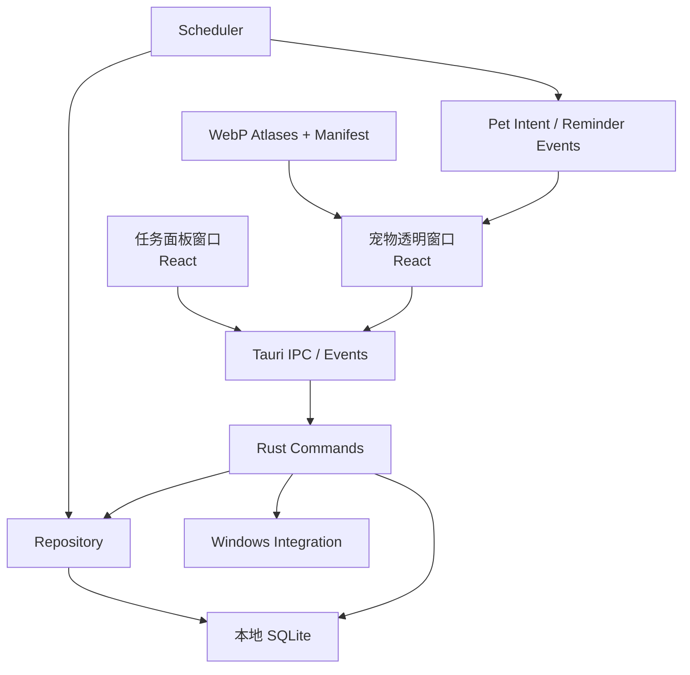
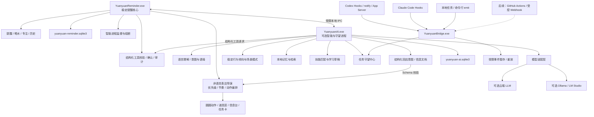
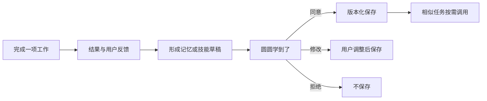
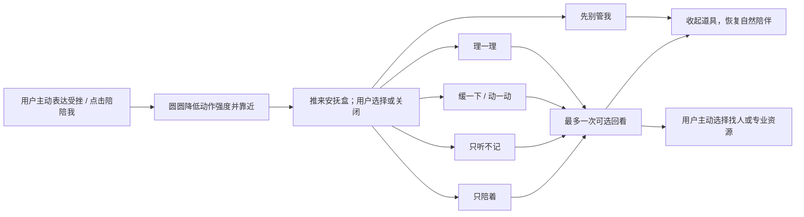

# 圆圆智能陪伴与任务守望能力升级最终设计方案

文档版本：1.5（第二轮专家评审定稿）<br>
编制日期：2026-08-03<br>
当前产品基线：圆圆提醒 v1.4.0 构建候选版<br>
拟议目标版本：圆圆智能伴侣 v2.0 系列<br>
评审状态：第二轮有条件通过；批准进入 P0，冻结条件见第23、26节

---

## 1. 执行摘要

圆圆提醒目前是一款可独立运行的 Windows 桌面宠物与提醒工具。它通过拟真小猫动画承载喝水、待办、专注、休息、久坐活动、历史和娱乐互动等功能，所有核心数据保存在本机 SQLite 中，安装后的日常运行不依赖 Codex、Node.js、Rust、Python、账号或云服务。

本次拟议升级并非把圆圆改造成通用办公 Agent，而是围绕以下产品定位建设可选的智能增强层：

> 圆圆首先为用户提供情绪价值；工具能力用于减轻用户的注意力负担，并通过圆圆的陪伴、守望和反馈自然呈现。

圆圆是一只小猫，而不是以小猫形象出现的人类助理。它可以理解用户输入，但不会说人话、朗读答案或用第一人称聊天气泡回应；简单回应通过目光、耳朵、尾巴、姿态、距离和动作完成，复杂信息由圆圆拨动、叼来或守在一个明确的信息工具旁展示。

当用户在工作中受挫、疲惫、烦躁或被冲突消耗时，圆圆不急着给答案，也不把安抚包装成“尽快恢复生产力”。它先以低刺激动作共同在场，再由用户主动选择陪伴、一次性倾诉、短暂缓和、活动、整理问题或暂时不被打扰；涉及事实、选项和安全信息时由固定道具或正式系统界面承载，而不是让小猫突然开口劝慰。

方案计划吸收三类理念：

- 保留圆圆现有的拟真动画、提醒闭环和本地离线能力，作为稳定产品底座；
- 借鉴 OpenClaw 的工具边界、权限策略、审批与可插拔模型理念，形成受控执行框架；
- 借鉴 Hermes Agent 的人格分层、精选记忆、程序性技能和经用户审核的学习闭环，使圆圆能够逐渐理解用户习惯；
- 增加“任务守望”能力，通过 Hooks、通知、App Server、API 或标准任务桥接入 Codex、Claude Code、GitHub Actions 及其他任务工具，在需要用户、完成、失败或疑似卡住时，由圆圆以情绪化方式提醒。

本方案的核心建议是：

1. 不直接捆绑 OpenClaw 或 Hermes Agent 的完整运行时；
2. 在现有 Rust/Tauri 架构中原生实现轻量智能核心；
3. AI、记忆、技能和外部连接器均为可关闭、可替换、可审计的增强能力；
4. 无模型、无网络、无 Codex/Claude 时，v1.4.0 的全部核心功能仍应正常运行；
5. 首期 Agent 不拥有通用 Shell、任意文件系统写入或自动批准外部工具权限的能力；
6. 模型、记忆检索与连接器运行在可独立停止和重启的故障域中，不与提醒调度共享进程级命运；
7. 任务守望连接器必须“只观察、不干预”，自身超时、退出或损坏不得阻塞 Codex、Claude Code 或其他源任务；
8. 语言交互记录、记忆和全文索引使用独立 AI 数据库，避免其迁移、锁竞争、体积增长和恢复操作影响提醒核心；
9. 模型只能生成结构化“回应意图”和工具内容，不能直接让圆圆输出自由文本、合成人声或任意驱动动画；
10. 工作受挫安抚坚持用户主动触发、本地优先、“只听不记”零持久化和危机安全降级，不建设被动情绪监控，也不以安抚完成率或恢复工作速度评价产品。

## 2. 两轮专家评审目标与结论

两轮评审不是代码级验收，主要围绕下列产品、架构与安全决策形成可执行结论：

1. “情绪陪伴优先、工具能力隐藏于后台”的产品边界是否清晰；
2. 在现有 Tauri/Rust/SQLite 基础上原生建设智能层是否合理；
3. 语言理解、非语言回应、记忆、技能和任务守望的优先级是否恰当；
4. “事实记忆”和“工作技能”分离的数据设计是否足以降低长期漂移；
5. 外部工具采用事件推送优先、API 轮询补充、拒绝屏幕识别的接入策略是否合理；
6. 写操作必须确认、技能变更必须审核、圆圆不得自动批准 Codex/Claude 权限的安全边界是否充分；
7. 首期 MVP 的范围、里程碑、质量门和风险控制是否可落地；
8. 是否存在需要在研发开始前解决的许可证、隐私、合规或 Windows 平台问题；
9. 智能进程、任务桥和提醒核心的故障域是否真正隔离；
10. 连接器的 fail-open 契约、事件证据等级和乱序重放规则是否充分；
11. 本地 IPC 对同用户恶意进程、伪造事件和重放攻击的防护是否可接受；
12. AI 数据发送、备份、删除、恢复和云端保留之间的生命周期是否完整；
13. “听得懂但不会说话”的身份边界、道具介导信息层和无障碍替代表达是否足以让用户持续把圆圆感知为真实小猫，而不是猫皮聊天助手；
14. 工作受挫安抚是否既能让用户感到被看见和保有选择，又不会越界诊断、监控情绪、掩盖结构性工作问题或以温柔方式催促用户继续工作。

第二轮结论为“有条件通过，批准进入 P0”，没有新增研发阻塞项。方向性决策已在第23节冻结，P0—P2 仍需以原型、契约测试、专业复核和安全验证关闭执行条件；任何变更必须进入第24节的复核记录，不能在实现中静默扩大能力或降低边界。

## 3. 当前项目简介

### 3.1 产品定位

圆圆提醒是一款面向 Windows 10/11 x64 的桌面宠物与个人节奏提醒工具。用户可以把圆圆放在桌面上，由圆圆陪伴喝水、安排任务、进入专注、定时休息、离屏活动，并通过真实连续的小猫动作完成提醒和反馈。

当前产品的差异点并非提醒功能本身，而是把功能事件转换为具备情绪的宠物行为：

- 提醒到达时，圆圆用醒目气泡和前爪拍“屏幕玻璃”；
- 专注时，圆圆安静坐着或趴着，不用随机动作打扰用户；
- 完成事项或活动后，圆圆通过跳跃、挥爪等方式积极反馈；
- 平时会舔毛、伸懒腰、打哈欠、喵叫、翻肚皮、入睡和呼吸；
- 用户可以喂食、喂水、喂猫条、使用逗猫棒、摸摸圆圆和玩扔球游戏。


### 3.2 目标用户和核心场景

目标用户主要包括：

- 长时间在 Windows 电脑前工作的个人用户；
- 容易忘记喝水、活动、休息或遗漏待办的用户；
- 希望桌面工具更柔和、更有陪伴感的用户；
- 在高压工作、任务失败、沟通冲突或过载时，希望获得安静陪伴和短暂恢复空间的用户；
- 同时使用 Codex、Claude Code、CI、渲染或其他长时任务工具，需要有人“代为盯住”的用户。

核心场景为：

1. 日常陪伴：圆圆自然活动、入睡、回应鼠标与娱乐互动；
2. 节奏提醒：喝水、工作事项、专注、活动和离屏休息；
3. 任务管理：创建、完成、稍后、跳过、编辑、停用、删除和历史查询；
4. 智能陪伴（拟议）：理解用户语言、用动作/道具回应、记住用户同意保留的习惯；
5. 任务守望（拟议）：在用户离开 Codex、Claude Code 等工具后，圆圆继续观察其状态并在必要时叫回用户。
6. 工作受挫安抚（拟议）：用户不顺心时可主动让圆圆陪着、倾诉、缓和、活动、整理问题或保持距离，结束后不被追问和催促。

### 3.3 用户分层与首发叙事

本次升级涉及两类需求不同但可相互转化的用户，不能用同一套首屏说明和默认设置覆盖：

| 用户层 | 主要诉求 | 默认体验 | 首要验证问题 |
| --- | --- | --- | --- |
| 日常陪伴与节奏用户 | 喝水、休息、待办、专注和柔和陪伴 | 保持 v1.4.0 离线能力，不要求理解 Agent、Hook 或模型 | 智能入口是否降低亲和力、增加学习成本或打扰 |
| 高压工作中的陪伴用户 | 任务失败、冲突、过载或疲惫时希望先获得空间与支持 | 安抚入口由用户主动开启；除复杂问题整理外均可完全本地运行 | 是否感到被看见但没有被分析、说教或催促 |
| 任务守望用户 | 离开 Codex、Claude Code 或本地长任务后仍能及时获知状态 | 无需 LLM 即可连接受支持工具并看到可信任务状态 | 是否真正减少反复切窗和等待焦虑，且不干预源任务 |
| 重叠用户 | 希望圆圆既陪伴生活节奏，也理解工作上下文 | 先启用守望，再按需启用本地或云端语言理解与记忆 | 两类能力能否自然衔接，而不是变成复杂的开发工具面板 |

v2.0A 的首发叙事应明确为“会替你安静看着长任务的桌面小猫”，面向任务守望用户验证价值，但不得把产品整体改写为开发者专用工具。普通用户第一次启动时继续看到陪伴、喝水、休息和待办；只有检测到受支持工具或用户主动进入“任务守望”时，才展示连接器说明。v2.0B 再以“听得懂你、不会说人话，工作不顺时也愿意安静陪着你”承接更广泛的智能陪伴和安抚价值。

P0 通过小规模访谈和可用性测试分别验证两类用户的理解、启用意愿与打扰感，避免用开发团队自身偏好代替用户分层证据。

### 3.4 不变的产品原则

- 情绪价值高于工具数量；
- 圆圆不能变成“长着猫脸的命令行界面”；
- 圆圆不会说人话：不使用第一人称聊天气泡、合成人声、口型同步或连续文字冒充猫的语言；
- 用户可以和圆圆说话，圆圆通过真实猫咪行为和它操作的工具回应；工具显示的信息必须与圆圆的肢体表达区分清楚；
- 圆圆可以安抚日常工作受挫，但不诊断心理状态、不冒充心理咨询师，也不把结构性工作问题归咎为用户不会调节情绪；
- 安抚以用户主动表达或主动开启为主，不通过摄像头、常开麦克风、键盘节奏、工作文档情感分析或隐蔽行为评分推断情绪；
- 核心提醒能力离线可用，AI 故障不得破坏提醒；
- 用户数据默认本地保存，不做遥测；
- 圆圆只报告有证据的外部任务状态，不伪造进度和成功；
- 对外部系统的写操作和权限批准由用户最终决定；
- 功能状态必须通过圆圆动画与用户操作形成完整闭环；
- 圆圆的毛色、脸型、眼睛、花纹和体态在新增动作中保持一致。

## 4. 当前已开发完成的项目情况

### 4.1 当前版本状态说明

截至 2026-08-03：

- 源码版本号和构建配置已更新为 v1.4.0；
- v1.4.0 Windows NSIS 安装包已成功生成；
- v1.4.0 功能和测试改动仍处于本地工作区，尚未形成正式提交；
- 当前 Git 最近一次正式提交为 v1.3.2；
- 因此本评审稿将 v1.4.0 定义为“已实现、已构建、待完成发布级验证的候选基线”，不把它描述为已经正式对外发布。

### 4.2 已完成能力清单

| 模块 | 已完成能力 | 当前状态 |
| --- | --- | --- |
| 应用外壳 | 单实例、宠物窗口、任务面板、托盘、开机启动、置顶、穿透、窗口位置与尺寸管理 | 已实现 |
| 提醒调度 | 一次性、间隔、每日、每周和自选星期提醒；间隔生效时段；本地时间调度 | 已实现 |
| 提醒处理 | 完成、跳过、5/10/30/60 分钟稍后；逾期和错过提醒策略 | 已实现 |
| 提醒管理 | 查看、编辑、启用、停用、软删除；系统喝水/活动提醒保护 | v1.4.0 已实现 |
| 喝水 | 喝水计划、每日目标、记录一杯、按本地自然日更新、重复提醒去重 | 已实现 |
| 久坐活动 | 连续活跃时间累计、短暂离开暂停、真实休息后重置、与喝水提醒排队 | 已实现 |
| 专注与休息 | 专注/休息计时、状态持久化、结束提醒、专注期间安静动画 | 已实现 |
| 离屏休息 | 定时休息并锁定 Windows；结束后唤醒显示器但不绕过系统认证 | 已实现 |
| 历史记录 | 查询完成、跳过、错过归档的事项及喝水、活动记录 | 已实现 |
| 数据保护 | 每日自动备份、手动备份、14份保留、安全恢复、恢复前快照 | v1.4.0 已实现 |
| 故障隔离 | 今日、设置、专注、互动模块独立加载和局部重试 | v1.4.0 已实现 |
| 宠物动画 | 标准、睡眠、生活/互动三套图集；待机、行走、睡觉、提醒、娱乐等35个动画定义 | 已实现 |
| 娱乐互动 | 喂猫粮、喂水、猫条跟随、逗猫棒、摸摸、扔球取回 | 已实现 |
| 提醒表现 | 大气泡、前爪拍屏幕、直接完成/稍后/跳过，处理后立即恢复正常 | 已实现 |
| 打包 | Windows x64 current-user NSIS 安装包，内置 WebView2 Bootstrapper | 已实现 |

### 4.3 动画资源现状

运行时宠物包包括：

- 标准图集：8列×11行，单元尺寸192×208；
- 睡眠图集：入睡、呼吸循环、醒来3行；
- 生活/互动图集：21行；
- 当前清单定义35个可播放动画；
- 资源均为透明背景 WebP，并有确定性校验脚本。

现有动画已覆盖后续智能功能可复用的若干表达：

- `waiting`：等待、守望；
- `review`：查看、思考；
- `focus-calm`：安静陪伴；
- `jumping` / `activity-jumping`：成功与开心；
- `failed`：失败或担心；
- `alert-glass-paws`：需要用户立即注意；
- `sleeping`：长任务期间安静等待。

智能伴侣版本仍需新增或重制：聆听与耳朵朝向、靠近/陪坐、慢眨眼、回忆、轻度思考、任务守望、拨动信息牌、按铃、叼取纸条和学习成功等动作。无需制作自然说话或口型同步动作；复杂回应由道具承载，不能用摇晃或缩放静态图片伪装动画。

### 4.4 当前验证证据

2026-08-03 在当前工作区重新执行验证：

| 验证项 | 结果 |
| --- | --- |
| TypeScript 编译 | 通过 |
| 前端单元/交互/E2E | 9个测试文件、45项测试全部通过 |
| Rust 后端测试 | 39项测试全部通过 |
| 宠物资源校验 | 35个动画、3套 WebP 图集通过 |
| Windows NSIS 构建 | v1.4.0 安装包已生成，约11.54 MiB |

### 4.5 当前仍待发布级验证的项目

下列内容不应在评审中被误认为已经完成：

- 无开发环境的干净 Windows 机器安装与完整回归；
- 8小时以上常驻稳定性测试；
- 双屏、多显示器拔插及多档 DPI 缩放验证；
- v1.3.2 到 v1.4.0 升级安装及数据保留验证；
- 卸载和用户数据保留选项验证；
- 休眠恢复、跨时区和系统时间跳变的完整实机测试；
- v1.4.0 正式提交、发布包整理、哈希及 Release 发布。

这些项目应在智能版本研发前先形成可靠基线，避免将既有发布风险带入新架构。

## 5. 当前技术架构

### 5.1 技术栈

| 层级 | 当前技术 |
| --- | --- |
| 桌面框架 | Tauri 2 |
| 前端 | React 19、TypeScript、Vite |
| 后端 | Rust、Tokio |
| 数据 | SQLite、rusqlite（bundled） |
| Windows 集成 | windows-sys、通知、自启动、托盘、锁屏与唤醒显示器 |
| 测试 | Vitest、Rust cargo test、宠物包校验脚本 |
| 打包 | Tauri NSIS、current-user 安装、WebView2 Bootstrapper |

### 5.2 当前组件关系



### 5.3 主要模块

- `src/pet/`：宠物状态机、精灵动画、鼠标方向、提醒舞台和交互；
- `src/panel/`：今日、专注、互动、历史、新建、管理和设置；
- `src/lib/backend.ts`：前端与 Tauri 后端的边界；
- `src-tauri/src/commands.rs`：前端可调用的业务命令；
- `src-tauri/src/repository.rs`：数据库、调度计算和业务一致性；
- `src-tauri/src/scheduler.rs`：提醒、专注、喝水和活动调度；
- `src-tauri/src/backups.rs`：备份、校验和安全恢复；
- `src-tauri/src/windows.rs`：锁屏、显示器唤醒、窗口边界和 Windows 行为；
- `public/assets/pet/`：圆圆运行时宠物资源。

### 5.4 当前数据和运行边界

- 前端不直接访问 SQLite；
- 所有业务写入通过 Rust 命令和 Repository 完成；
- 调度状态、提醒、历史、喝水、专注、互动和设置保存在应用本地目录；
- 宠物窗口和任务面板通过 Tauri 事件同步；
- 当前没有 AI 服务、网络账号、遥测或远程连接器；
- 当前 CSP 只允许自身资源和 Tauri IPC。

该边界适合作为智能版本的安全底座：LLM 不应获得直接数据库权限，而只能通过同样受约束的 Rust 工具接口工作。

## 6. 升级机会与问题定义

现有版本能够提醒和记录，但仍存在四个产品机会：

1. 圆圆不理解用户自然语言，用户仍需进入面板逐项配置；
2. 圆圆没有跨会话的精选记忆，不能逐渐理解用户的沟通和工作习惯；
3. 当用户把工作交给 Codex、Claude Code、CI 或其他长时工具后，仍需反复切回检查状态，注意力负担没有被真正解除；
4. 当工作失败、沟通不顺、任务过载或疲惫积累时，现有提醒只能处理事务，不能让用户感到有一只小猫理解了自己的状态并愿意以合适距离陪伴。

拟议升级希望解决的不是“让圆圆能做所有事情”，而是：

- 用户可以自然地和圆圆说话或输入文字，圆圆能理解，但始终以小猫的方式回应；
- 圆圆能够在用户同意后记住重要偏好；
- 圆圆可以把用户纠正过的做法沉淀为受控技能；
- 圆圆能安静地替用户守望外部任务，在真正需要用户时再靠近提醒；
- 工具异常时圆圆提供陪伴和可靠摘要，而不是制造压力或伪造结论；
- 用户工作不顺时可以主动开启安抚流程，获得共同在场、一次性倾诉、短暂缓和、活动或问题整理，同时保留继续、休息、找人和暂不处理的选择。

## 7. 目标产品定位与体验原则

### 7.1 一句话定位

> 圆圆是一只听得懂你、不会说人话，会用动作和身边小工具回应，能替你安静守望任务，也会在工作不顺时陪你缓一缓的 Windows 桌面小猫。

### 7.2 能力优先级

1. 情绪陪伴和日常生命感，包括工作受挫时不说教、不催促的安静支持；
2. 提醒、喝水、活动和专注等可靠核心；
3. 任务守望，减少反复查看工具的注意力成本；
4. 语言理解、非语言回应和记忆；
5. 用户确认后的简单工作处理；
6. 更复杂的外部连接器。

不以工具数量、自动执行步数或“完全自主”为主要卖点。

### 7.3 非语言身份宪章

圆圆的真实感来自一致的物种边界，而不是更像人的语言能力：

- **能理解，不开口解释**：用户可以打字，后续也可选择语音输入；圆圆不输出人声或第一人称对白。
- **先行为，后信息**：能用动作表达的内容不显示文字；只有动作无法准确承载事实、选项或长内容时才调用工具。
- **文字属于工具**：任务牌、提词器、小终端和正式确认卡可以显示文字，但采用“任务来源 + 状态 + 操作”的中性系统文案，不写成“圆圆说：我帮你……”；
- **猫的身体不是加载动画**：聆听、等待、犹豫、靠近和离开都有连续动作与节奏，不通过抖动、缩放或嘴部循环假装交流；
- **可靠功能与猫咪自主性分层**：提醒、任务状态和权限确认必须确定可靠；非关键陪伴行为允许圆圆休息、观察、换个姿势或暂时不玩，使其像有自己节奏的生命，而不是随叫随到的按钮；
- **沉默本身有价值**：圆圆不为了证明“聪明”持续制造回复，理解之后安静陪在旁边也可以是完整回应。

### 7.4 前台表达与后台能力

- 前台：圆圆的目光、耳朵、尾巴、姿态、移动、距离、叫声以及与道具的连续互动；
- 信息层：圆圆拨动或守在任务牌、提词器、小终端、沙漏和收件篮旁，工具显示必要信息；
- 二级界面：用户点击工具后展开任务台、理解记录、信息正文和详细来源；
- 后台：LLM、记忆检索、技能匹配、任务连接器和权限策略；
- 技术日志、工具调用细节和错误堆栈不进入圆圆的身体表达，也不伪装成圆圆说的话。

### 7.5 可信表达

- 有完成事件时，工具才能显示“完成”；
- 没有进度数据时，工具只显示“运行中”；
- 超过一段时间没有事件时，工具只显示“可能停住”；
- 失败原因不明确时不进行臆测；
- 圆圆可以用靠近、陪坐等动作安慰用户，但不能用可爱表演弱化或掩盖工具中的事实。

### 7.6 产品成功指标

项目默认不做遥测，因此成功指标首先以本机可见统计、主动参与的脱敏研究和发布前可用性测试采集；任何外发分析数据都必须单独征得同意。P0 冻结口径、样本和目标值，至少覆盖：

- 任务守望启用率、首次连接完成率和连接器恢复成功率；
- 用户因任务提醒点击“去看看”的比例及从事件到用户返回原工具的时间；
- 相比无守望基线，用户主动切回检查长任务的次数是否下降；
- 虚假完成提示为零，重复提醒率、错误归组率和状态未知率处于冻结阈值内；
- 提醒被忽略、立即静音或主动关闭的比例，用于衡量噪音与打扰；
- v2.0B 再增加自然语言输入周使用率、记忆采纳/删除率、非语言回应辨识率和主动关闭云模型后的留存，不用文字长度或交互时长代替真实陪伴价值。

这些指标是继续投资的决策门，不以“功能已实现”或“模型能回答”作为产品成功证明。

### 7.7 情绪价值地图

圆圆的情绪价值不等于说更多安慰话。优先验证以下九种体验假设：

| 情绪价值 | 圆圆如何提供 | 必须避免 |
| --- | --- | --- |
| 共同在场 | 呼吸、睡眠、舔毛、换姿势；用户工作时安静陪坐 | 高频随机动作、为了刷存在感弹提示 |
| 被理解但不被说教 | 听到用户后转耳、注视、靠近；按语境选择陪坐、玩耍或调出工具 | 长篇建议、未经请求分析情绪、诊断用户 |
| 托付后的安心 | 守在小电脑或任务篮旁，在真正需要用户时才按铃 | 伪造进度、频繁报告“还在运行” |
| 努力被见证 | 完成重要事项时跑来、竖尾、轻跳；重要程度决定庆祝强度 | 每个小操作都庆祝、连续签到压力、夸张吹捧 |
| 失败时不孤单 | 不强行开心，安静靠近或趴在失败工具旁，等用户决定下一步 | 责备、失望表演、空洞鼓励、把失败萌化掉 |
| 节奏被温柔调节 | 用伸懒腰、喝水、趴下和沙漏带动休息/专注转换 | 命令口吻、健康恐吓、打断深度工作 |
| 关系的连续性 | 形成回家、开工、收工、完成长期项目等小仪式；在用户同意后保留少量共同记忆物 | 监控感、未经同意记忆私密细节、用连续天数绑架用户 |
| 照顾与被需要的温和互惠 | 喂食、摸摸、玩耍会得到真实动作反馈；圆圆偶尔叼来玩具邀请互动 | 饥饿惩罚、离线受伤、用内疚迫使用户回来 |
| 轻微惊喜和生命感 | 低频、与场景相符的独立小动作和玩具互动 | 随机弹窗、抽奖式奖励、无法关闭的彩蛋 |

最核心的五项是“共同在场、被理解、托付安心、努力被见证、失败时不孤单”。其余能力只有在不增加操控、监控和打扰的前提下再加入。圆圆不能声称治疗孤独、焦虑或其他心理问题；这些是需要通过用户研究验证的陪伴体验假设，不是医疗功效。

### 7.8 工作受挫安抚的研究依据与产品边界

圆圆只提供日常压力下的陪伴、自助工具和重新获得选择感，不宣称治疗焦虑、抑郁、创伤或职业倦怠。研究与开源产品只用于确定交互方向，不能直接转化为医疗功效承诺：

| 证据或项目 | 可借鉴结论 | 对圆圆的具体影响 |
| --- | --- | --- |
| [WHO《Doing What Matters in Times of Stress》](https://tdr.who.int/home/our-work/global-engagement/9789240003927) | 落地感、注意并命名、与苛刻想法脱钩、接纳和善待自己等技能可以被拆成短小练习 | 安抚工具必须短、可选、可停止，不让模型自由发挥心理建议 |
| [工作微休息系统综述与荟萃分析](https://journals.plos.org/plosone/article?id=10.1371%2Fjournal.pone.0272460) | 微休息对精力和疲劳有小幅积极作用，但没有普遍提升总体绩效 | 不宣传“休息一分钟效率更高”；允许用户真正离开工作，而不是快速充电后继续硬撑 |
| [情绪命名实验研究](https://pmc.ncbi.nlm.nih.gov/articles/PMC3444304/) | 把感受写成词语可能参与情绪调节，但效果与主观体验存在差异 | 情绪命名只作为可跳过的自选步骤，圆圆不自动给用户贴标签 |
| [工作场景自我关怀系统综述](https://pmc.ncbi.nlm.nih.gov/articles/PMC8102699/) | 结果有希望，但研究数量少且总体方法质量中等 | 使用非评判、不过度积极的表达，同时把效果视为待验证假设 |
| [NIOSH 工作压力资料](https://www.cdc.gov/niosh/docs/99-101/default.html) | 工作条件、负荷、控制感和支持环境是重要压力来源 | 问题整理必须区分个人可做的小步骤与需要暂停、沟通、调整负荷或寻求组织支持的问题 |
| [呼吸练习系统综述](https://pmc.ncbi.nlm.nih.gov/articles/PMC10741869/) | 自愿调节呼吸可能有帮助，较慢节奏通常优于快速呼吸，但研究方案差异较大 | 只提供温和、无屏息、随时停止的视觉引导，并列提供不依赖呼吸的替代方式 |

开源经验只借鉴交互和隐私理念：[Breathly](https://github.com/mmazzarolo/breathly-app) 的单一低干扰视觉节奏、[Mindfulness at the Computer](https://gitlab.com/mindfulness-at-the-computer/mindfulness-at-the-computer) 的桌面场景入口，以及 [ActivityWatch](https://docs.activitywatch.net/en/latest/faq.html) 的本地优先、可导出和可删除思路。圆圆不照搬未经临床验证的练习参数，不复用可能受 GPLv3 约束的代码，也不引入窗口、网站、输入节奏或工作内容追踪。

安抚的目标按顺序是：让用户感到被看见而没有被评判；从持续刺激中获得一点空间；重新获得继续、休息、倾诉、整理问题或找人协助的选择；在愿意时形成一个现实的小步骤；最后自然结束且不被追问。它不诊断、不治疗、不强迫积极思考、不把所有工作问题个人化，也不以安抚完成率、连续使用天数或恢复工作速度作为增长指标。

## 8. 拟议总体设计

目标版本在现有稳定核心之上增加六个可选模块：

1. 语言理解与稳定行为倾向；
2. 非语言表达导演与道具层；
3. 本地记忆中心；
4. 经审核的技能与学习闭环；
5. 受控工具网关；
6. 外部任务守望与连接器。

### 8.1 目标架构



### 8.2 架构选择

| 选项 | 优点 | 主要问题 | 建议 |
| --- | --- | --- | --- |
| 原生轻量智能核心 | 与现有 Rust/Tauri 边界一致、体积可控、可离线降级 | 需要自行建设记忆、工具与审批 | 推荐 |
| 可选连接已安装 OpenClaw/Hermes | 高级用户可复用现有能力 | 外部版本和配置复杂 | 后期可选 |
| 完整捆绑 OpenClaw/Hermes | 能力齐全、开发初期看似更快 | 运行时、安装体积、安全面、重复功能和升级负担大 | 不建议 |

### 8.3 进程与数据故障域

“可选增强层”必须落实为操作系统级隔离，而不是只拆成 Rust 异步任务：

- `YuanyuanReminder.exe` 只承载现有可靠核心、宠物 UI、非语言表达导演、结构化工具校验和最终用户确认；
- `YuanyuanAI.exe` 承载模型请求、语言理解、信息文档生成、记忆检索、技能匹配和任务守望，可独立停止、升级和重启；
- `YuanyuanBridge.exe` 只负责快速接收、验证和转发事件，不加载模型、不读取提醒数据库；
- AI 进程无权直接打开 `yuanyuan-reminder.sqlite3`，对现有业务的读写只能通过受限 IPC 工具调用；
- 语言交互、记忆、技能、Agent 运行和任务事件进入独立的 `yuanyuan-ai.sqlite3`；
- 主程序使用心跳、超时、熔断和崩溃循环抑制管理 AI 进程，不进行无限自动重启；
- AI 进程被关闭、崩溃、OOM 或数据库损坏时，提醒调度、喝水、专注、动画和本地备份继续正常运行。

是否采用单独进程和单独数据库属于 P0 阻塞决策；若技术验证否决该方案，必须提供能够覆盖进程崩溃、锁竞争、数据库膨胀和迁移失败的等价隔离证据。

### 8.4 信任边界

系统明确区分四类信任级别：

1. 稳定核心：提醒业务规则、权限策略和最终写入校验，视为可信计算基；
2. 智能进程：可被模型输出影响，但只能提出结构化请求，不能自行扩权；
3. 外部事件：Hook、日志、Webhook、任务摘要和深链均为不可信输入；
4. 外部 Provider：按第三方数据处理方管理，不能获得本机凭据或与当前请求无关的上下文。

任何从低信任区域流向高信任区域的数据都必须经过 Schema、大小、来源、时效、权限和业务状态校验。

## 9. 语言理解、非语言回应与 LLM 设计

### 9.1 模型接入

模型层采用 Provider Adapter，首期建议支持：

- 一个明确选定并完成契约测试的云端 Provider；
- 本地 Ollama 或 LM Studio 接口，默认只允许回环地址；
- 流式信息文档、取消、超时、最大步骤和单次成本上限；
- 模型不可用时明确降级，不影响提醒和宠物功能。

不在首期安装包中捆绑大型本地模型。用户未配置模型时，圆圆仍是完整的 v1.4.0 桌面宠物提醒工具。

“OpenAI-compatible”只能作为传输族名称，不能视为完整兼容承诺。不同服务对 Responses/Chat Completions、流式事件、工具调用、严格 JSON Schema、取消、Token 用量和错误码的支持可能不同，适配器必须通过能力探测和版本化契约测试后再开放对应功能。

模型不得直接输出给宠物窗口。智能进程只产生两类经过 Schema 校验的结果：

1. `response_intent`：表达“听见、靠近、陪坐、庆祝、提醒注意、调出信息”等语义，不包含动画文件名和任意台词；协议携带 `schema_version`，只接受当前兼容表中注册的意图，未知版本或未知意图统一降级为 N0“安静在场”，不得猜测最接近动作；
2. `display_document`：确需文字时使用的状态、列表、说明、选项、警告或确认文档，记录 `schema_version`、来源、置信度、敏感级别和声明式操作。

`display_document` 不接收或直接渲染原始 Markdown/HTML。正文只允许 Schema 定义的安全内容块，例如段落、标题、列表、表格和代码片段；文本不自动链接化，不加载网络图片、字体、脚本、iframe 或其他远程资源。引用与操作分别进入 `references` 和 `actions` 字段：引用默认显示来源名称和地址文本，打开外部地址必须经过协议/目标校验与明确用户操作；操作只能来自产品注册表中的声明式动作，由 Rust 业务层再次校验，不能从正文、代码块或模型生成的按钮标签中解析执行。高风险确认继续使用独立系统确认卡，不属于信息文档自由布局范围。

稳定核心的非语言表达导演结合当前提醒、专注、陪伴强度、用户是否主动发起交互和打扰预算，从审核过的动作编排与道具中选择最终表现。LLM 不能指定任意动画、持续时间、音效或窗口位置，也不能把自由文本伪装成圆圆的语言。

### 9.2 人格分层

人格和任务数据不得混为一体：

1. 安全规则：不可被模型、记忆或技能修改；
2. 圆圆基础人格：温柔、真实、适度活泼、不制造焦虑；
3. 用户偏好：输入方式、信息牌内容密度、陪伴强度；
4. 场景模式：日常、安静陪伴、专注、任务守望、睡前；
5. 当前语言交互；
6. 与当前问题相关的记忆和技能。

该设计借鉴 Hermes 的稳定人格与上下文分层思路，但圆圆人格由产品定义和用户可见设置共同维护，不能由模型静默改写。

### 9.3 输入与回应界面

- 用户通过键盘打开“倾听台”输入自然语言；可选语音输入在后续版本单独评估录音权限、本地转写和隐私，不把麦克风常开作为默认能力；
- 圆圆接收输入时先用转耳、转头、靠近或注视表示听见；输入失败时由倾听台显示原因，不让圆圆表演“没听懂台词”；
- 能靠动作完成的回应不创建文字：问候、感谢、安慰、庆祝、陪伴、想玩或想安静均优先使用身体与距离；
- 复杂信息由圆圆拨动提词器、踩亮小终端、叼来纸条或守在任务牌旁；工具使用中性标题和来源标签，不出现从圆圆嘴边指向文字的气泡尾；
- 长内容进入独立信息台，显示模型来源、使用了哪些记忆、事实依据以及是否准备调用工具；圆圆可以在旁等待，但内容不以猫的第一人称书写；
- 写操作和高风险行为使用明确的系统确认卡。为了安全与无障碍，确认卡不需要伪装成玩具或猫咪对白；
- 生成信息时可以随时停止，执行任务时可以取消；停止后圆圆回到自然状态，不用失败表演责怪用户；
- v1.4.0 现有强提醒文字在迁移期仍可作为系统告示牌保留，但应去除聊天气泡语义和第一人称陪伴文案，逐步改为由圆圆拍、推或守在提醒牌旁。

### 9.4 Provider 能力、网络与成本控制

每个 Provider 配置记录并向用户展示：

- 服务名称、基础地址、模型标识和数据发送目的地；
- 是否支持流式、工具调用、严格结构化输出、取消、用量统计和上下文上限；
- 数据保留说明链接、是否请求服务端存储以及本次将发送的数据类别；
- 单次、每日和每月 Token/费用上限；费用不可可靠计算时显示用量而不伪造金额；
- 超时、重试、退避、幂等和熔断策略；
- 本地 Provider 是否仍位于回环地址，非回环或明文远程地址必须单独警告并再次确认。

自定义基础地址必须防止 SSRF：默认拒绝系统元数据地址、非预期本地网段、文件协议和重定向到不同安全域；若高级用户确需连接远程自托管模型，应显式加入允许列表并配置传输安全和凭据。

### 9.5 智能能力启用路径

设置页将智能能力拆成三个逐级可选入口，避免把模型配置变成使用圆圆的门槛：

1. **零配置任务守望**：检测到受支持的 Codex、Claude Code 或本地任务工具后，先说明会修改什么配置、采集哪些事件，再由用户确认连接；不要求账号、API Key 或 LLM。
2. **本地模型**：只在回环地址探测 Ollama/LM Studio 的可用性，显示硬件与模型兼容提示；检测结果不能自动启用连接或发送内容。
3. **云端模型**：按 Provider 分步说明申请凭据、数据去向、服务端保留、费用上限和撤销方式，验证成功后才允许开启语言理解与复杂信息工具。

用户可长期停留在任意一层，关闭上一层不应破坏 v1.4.0 功能；连接器、模型与记忆分别启停，不使用一个笼统的“开启 AI”开关掩盖不同数据边界。

## 10. 记忆系统设计

### 10.1 记忆分类

| 类型 | 内容 | 示例 | 默认策略 |
| --- | --- | --- | --- |
| 用户偏好 | 稳定沟通和生活偏好 | 喜欢简洁信息牌、下午不喝咖啡 | 长期、可编辑 |
| 习惯规则 | 重复行为和节奏 | 每工作一小时活动 | 长期、可暂停 |
| 事件记忆 | 有时间性的经历 | 上周完成了某方案 | 有效期和降权 |
| 工作上下文 | 当前项目和待办背景 | 当前正在开发圆圆 v2 | 项目级、可归档 |
| 技能 | 如何完成某类任务 | 如何生成周报 | 版本化、按需加载 |

### 10.2 记忆层级

- 短期记忆：当前会话，自动过期；
- 工作记忆：近期任务、计划和未完成事项；
- 长期记忆：用户明确同意保存的偏好、习惯和重要事实；
- 历史记录：完整语言交互和事件记录，不自动全部进入模型上下文。

### 10.3 记忆写入原则

- 提供“记住这件事”“不要记住”“忘掉这件事”；
- 模型可以提出记忆草稿，但默认不能静默写入长期记忆；
- 记忆记录来源、时间、置信度、敏感级别、有效期和是否允许发送给云模型；
- 重复记忆合并，冲突记忆提示用户选择；
- 云端模型只接收本次任务所需且被允许的最小上下文；
- “仅本机”记忆不得发送给云端模型；
- 用户可以从记忆中心查看、修改、导出、删除和恢复。

### 10.4 检索策略

第一阶段使用 SQLite FTS5 完成语言交互、历史和记忆全文检索；只有在准确率评测证明有必要后，再增加可选向量检索。这样可降低依赖、安装体积和隐私复杂度。

由于主要用户内容为中文，不能直接假设 FTS5 默认分词满足检索质量。P0/P2 必须比较 `unicode61`、`trigram` 或受控自定义分词方案，并使用中文金标准数据集评估 Top-K 召回、误召回、短词查询、同义表达和混合中英文场景。检索方案只有在达到冻结阈值后才能进入长期记忆。

构建时继续使用当前 `rusqlite` 的 `bundled` SQLite；P0/P2 在启动诊断和 CI 中实际创建 FTS5 虚表并执行查询，验证最终安装包中的扩展可用性。这里以运行时自检和中文检索结果为准，不依赖并不存在的 `rusqlite` `fts5` Cargo feature 名称。

### 10.5 记忆生命周期与抗污染

- 长期记忆区分 `user_asserted`、`user_confirmed`、`system_observed` 和 `model_inferred` 来源；只有前两类可默认参与高置信信息生成；
- 模型推断出的健康、财务、宗教、政治、身份和亲密关系等敏感信息不得自动形成长期记忆；
- 外部日志、网页、Hook 文本和任务输出不能直接写入长期记忆，只能形成待审核草稿；
- 由外部事件摘要生成的草稿必须保留 `untrusted_external` 边界、原始来源引用和生成链路；即使用户采纳，也不能作为工具参数或写操作的唯一依据，执行前仍需从可信业务状态重新取值并验证；
- 记忆修改保留替代关系和来源，但“彻底删除”必须清理正文、派生摘要、FTS/向量索引和待重放队列；
- 备份中的已删除记忆遵循独立保留期，恢复旧备份时不得静默复活，需通过删除墓碑或恢复确认处理；
- 记忆检索记录本次使用了哪些条目，用户可以查看“圆圆为什么想起这件事”；
- 建立记忆污染、冲突、过期、误召回和删除传播的自动化测试集；
- 单独构造 `model_inferred` 和 `system_observed` 记忆样例，证明它们未经用户确认时不能进入信息文档的高置信事实断言、写操作参数或“圆圆记得你……”类关系表达；若确需展示，只能明确标注为待确认推断。

## 11. 技能与受控学习闭环

### 11.1 事实记忆与程序性技能分离

- 记忆决定“信息工具可以为圆圆取回什么”；
- 技能决定“圆圆可以调用工具怎样做”。

技能包含：适用场景、输入要求、步骤、允许工具、确认点、输出格式、版本、使用次数、成功/失败记录和回退点。

### 11.2 圆圆学习卡



触发学习建议的条件包括：

- 用户明确说“以后都这样”；
- 用户多次纠正同一做法；
- 一个复杂任务成功完成且形成稳定步骤；
- 任务经历失败后找到可靠替代方案。

学习建议仍受打扰预算控制，默认采用以下可调初值，并在 P0/P3 用户测试后冻结：

- 同一技能类型或同一规范化建议在 7 天内只出现一次；
- 每个自然周最多主动展示 3 张学习卡，用户明确要求“记住/以后这样做”不计入主动额度；
- 同类建议连续被拒绝 2 次后进入低优先级，除非用户再次明确触发，否则不再主动展示；
- 专注、安静时段或已有高优先级提醒时只保存草稿，不弹出学习卡。

### 11.3 技能安全边界

- 技能使用结构化 Schema 保存，至少包含 `skill_id`、版本、触发条件、类型化输入、步骤、允许工具、参数映射、确认点、输出约束和失败策略；自然语言只能作为说明，不能直接成为可执行步骤；
- 新技能必须审核；
- 已生效技能的修改显示差异并可回退；
- 内置技能不可被模型删除；
- 技能只能组织已有工具，不能增加权限；
- 首期技能不能携带或生成可执行脚本；
- 连续失败的技能自动暂停并提示用户，不自行无限重写；
- 第三方技能市场不进入 MVP。

## 12. 受控工具网关

### 12.1 分版本工具范围

v2.0A 任务守望 MVP 不向模型开放任何工具，也不要求配置模型。

v2.0B 只开放圆圆现有领域内的结构化只读工具：

- 查询今日事项；
- 查询历史；
- 查询任务守望状态；
- 查询当前专注和喝水进度。

v2.1 经确认后再开放结构化写工具：

- 创建、修改、启停提醒；
- 完成、稍后或跳过提醒；
- 开始/取消专注；
- 记录喝水；
- 保存/删除一条记忆草稿；
- 提议一个技能草稿。

v2.0 系列明确不开放：通用 Shell、任意 SQL、整个硬盘读写、自动发送邮件、付款、发布内容和自动批准外部 Agent 权限。

### 12.2 风险等级

| 等级 | 行为 | 处理 |
| --- | --- | --- |
| L0 | 语言理解、本地只读查询 | 可直接执行并记录 |
| L1 | 可撤销的低风险本地操作 | 可配置是否确认 |
| L2 | 新建/修改/删除提醒、写入记忆或技能 | 显示预览并确认 |
| L3 | 文件修改、外部消息、远程服务写操作 | 每次明确确认，后期开放 |
| 禁止 | 通用命令、凭据读取、绕过系统认证、自动批准 Agent | 不提供工具 |

### 12.3 执行保障

- 每个工具使用固定 JSON Schema；
- Rust 后端再次验证参数和业务条件；
- 单次 Agent 运行限制步骤、时间、Token 和重试次数；
- 对工具名和规范化参数计算调用指纹；同一运行中连续 3 次出现相同工具、相同参数且外部状态没有变化时立即停止，并把原因显示为“可能陷入重复操作”；
- 失败重试必须由新的状态证据、不同的修正参数或明确的退避策略驱动，不能仅让模型原样重复请求；
- 所有写操作记录 `agent_run`、`tool_call`、确认人和结果；
- 可撤销操作应提供撤销入口；
- LLM 输出不能直接变成 SQL、Shell 或文件路径。

## 13. 任务守望设计

### 13.1 产品目标

任务守望不是让圆圆替用户控制其他 Agent，而是：

- 用户可以离开 Codex、Claude Code 或构建窗口；
- 圆圆继续观察任务是否运行、需要用户、完成或失败；
- 只有需要用户注意时才明显提醒；
- 用户点击“去看看”返回原工具；
- 圆圆不自动批准危险操作。

### 13.2 统一任务事件模型

```text
protocol_version    任务事件协议版本
event_id            全局去重标识
connector_id        连接器实例标识
source_instance     来源工具实例或安装实例标识
task_id            圆圆内部任务标识
run_id             一次执行标识；重试时生成新 run_id
parent_task_id      可选；父子任务关系
source             命名空间化来源标识，例如 openai.codex、anthropic.claude-code
external_id        外部任务/会话标识
title              用户可见任务名称
workspace          工作目录或项目别名
state              queued | running | waiting_user | succeeded |
                   failed | cancelled | stalled | unknown
progress           可选；只有外部工具提供可靠进度时使用
summary            最小必要摘要
attention_reason   等待用户的原因
evidence_type      hook | api | exit_code | process | user | inferred
evidence_level     authoritative | partial | presence_only | unknown
sequence           来源内单调序号
occurred_at        来源声明的发生时间
received_at        圆圆接收时间
started_at         开始时间
updated_at         最后事件时间
completed_at       完成时间
finality           provisional | terminal | corrected
return_action      连接器注册表中的返回动作标识，不接受任意命令或 URI
return_target      由对应连接器解释的最小目标标识，不直接交给系统 Shell
payload_digest     规范化载荷摘要，用于审计和去重
raw_payload_ref    可选的本地原始事件引用，不直接进入模型
```

`source` 不使用封闭枚举，也不在 MVP 引入第三方连接器市场。内置来源由随版本发布的注册表声明来源名、连接器实现、支持版本和证据能力；未知来源只有在用户安装受信任连接器并完成注册后才能进入任务状态机，否则只作为未验证诊断事件隔离保存。

状态机必须定义合法转换及冲突处理：

- 依据 `source`、`connector_id`、`source_instance`、`workspace`、`external_id`、`run_id`、`event_id` 和 `sequence` 形成归组/去重键并处理乱序，避免同一工具多窗口、多工作区或多安装实例串线；
- `succeeded`、`failed`、`cancelled` 为终态，后续矛盾事件只能以 `corrected` 明确修正；
- 取消后迟到的成功、重试产生的新运行、子任务完成但父任务仍运行等情况不得合并成错误结论；
- 来源只提供进程存在时，最多标记 `running/unknown`，不能据此证明任务成功；
- 所有“完成”“失败”和“等待用户”提示都记录证据来源；无权威证据时使用不确定措辞；
- 事件队列设置容量、保留期和背压，超过限制时保留终态与等待用户事件，丢弃可重建的高频进度事件并记录诊断。

“去看看”不执行事件载荷提供的任意深链。每个随版本发布的连接器必须在注册表中声明允许的 `return_action`、目标格式和处理器；Rust 层在渲染前和点击后各校验一次。默认拒绝 `file://`、`shell:`、`cmd:`、PowerShell、脚本解释器、任意可执行协议以及未经注册的自定义协议。确需使用 `vscode://` 等受支持协议时，只允许连接器声明的固定动作和经过规范化的目标，禁止载荷拼接命令行参数、凭据或任意本地路径；不能安全返回时降级为打开圆圆任务台并显示来源信息。

### 13.3 YuanyuanBridge.exe

安装包增加一个小型 Rust 辅助程序：

- 接收命令行 JSON 参数；
- 接收标准输入 JSON；
- v2.0A 不启动 HTTP/Webhook 监听器，只接受命令行参数、标准输入和受限命名管道；
- 通过 Windows 命名管道向圆圆主程序发送事件；
- 主程序未运行时，将有限事件安全落盘，启动后重放；
- 不需要 Node.js 或 Python；
- 不读取外部工具私有数据库；
- 不默认保存完整提示词、源代码或终端输出。

任务桥必须在极短时间内完成“校验后入队”并返回，不在 Hook 调用路径中等待主程序、数据库整理或模型。落盘记录包含 spool schema 版本、长度和 CRC32C（完整性校验，不代替 HMAC 身份认证）；落盘队列使用当前用户 ACL、原子写入、大小上限和损坏隔离。无法解析、校验失败或版本不支持的记录移入有容量上限的隔离区，不参与自动重放；事件重放仍执行身份认证、去重、过期和协议版本校验。

### 13.4 Codex 接入

按能力由浅到深分三层：

1. `notify` 兼容层：接收 `agent-turn-complete`，适合“完成后叫我”；
2. Codex Hooks：监听开始、工具调用、权限请求、子任务和停止事件；
3. Codex App Server：仅用于由圆圆启动或管理的 Codex 任务，接收线程状态、计划更新、工具事件、完成和审批请求。

v2.0A 以 Hooks 为主、`notify` 为兼容方案；App Server 放入后续深度模式。圆圆不得直接读取 Codex 内部状态文件，也不得替用户自动批准命令或文件修改。

Codex 项目 Hook 可能受项目信任、Hook 哈希审核、管理员策略和功能开关影响。连接器安装不能声称“写入配置即已连接”，必须检测实际加载与信任状态。监控 Hook 显式设置短超时、使用空决策输出并始终快速放行；`PermissionRequest` 只用于提示用户，不返回 `allow` 或 `deny`。

App Server 深度模式优先采用稳定的 `stdio` 传输，按本机已安装 Codex 版本生成并固定 Schema，启动时执行能力协商。实验字段或传输只能在用户显式开启的实验模式中使用；圆圆默认不实现审批响应，只提供“去 Codex 处理”的深链。

### 13.5 Claude Code 接入

使用 Claude Code Hooks 接收：

- `Notification`；
- `TaskCreated` / `TaskCompleted`；
- `SubagentStart` / `SubagentStop`；
- `Stop` / `StopFailure`；
- `PostToolUse` / `PostToolUseFailure`。

首期明确支持 Claude Code；Claude Desktop 和 Claude Web 若没有等价的本地事件能力，不承诺完整监控。

Claude Code 的部分 Hook 具备阻止任务完成、停止或权限请求的能力。圆圆连接器必须使用非干预输出契约：正常与异常路径都不返回阻塞决定，不使用退出码 2，不向模型注入反馈；Bridge 不可用时源任务继续执行。对 `TaskCompleted` 等全局事件还需按会话和任务标识过滤，避免把其他项目任务错误归入当前守望卡。

### 13.6 其他任务工具

- 本地构建、测试、渲染：使用圆圆任务桥包装命令并读取退出码；
- v2.0A 只提供命令行 `emit` 协议，不提供通用 Webhook；
- 没有 API 或 Hook 的桌面软件只允许检测进程是否存在，不通过屏幕截图或 OCR 猜测结果。

GitHub Actions 放到 v2.0A 之后，默认关闭。后续优先评估只读、低频、带退避和休眠暂停的 REST 拉取；只有在明确端口暴露、身份认证、重放防护和部署模型后才评估 Webhook。个人访问令牌不进入 v2.0A，不能为了远程 CI 扩大首版凭据与网络攻击面。

### 13.7 连接器配置策略

- 设置页提供“已连接工具”；
- 一键接入前展示将修改的配置；
- 修改 Codex/Claude 配置前自动备份；
- 合并而不是覆盖用户已有 Hooks；
- 配置变化后需要重新确认；
- 一键断开并恢复圆圆添加的部分；
- 连接器使用的密钥保存在 Windows Credential Manager；
- 连接器只拥有完成监控所需的最小权限。

备份恢复、用户配置目录迁移或换机后，Credential Manager 引用可能不存在或不再属于当前凭据上下文。恢复流程不得反复静默重试或把失败误判为连接器故障，而应把对应连接标记为“需要重新授权”，清除失效引用并引导用户重新连接。

每个 `connector_id + source_instance` 使用独立高熵事件认证密钥和 `key_id`，密钥正文只存 Windows Credential Manager。首次连接生成密钥；连接器重新配置、重装、来源实例变化或用户主动轮换时执行两阶段换钥，旧密钥只接受切换前已经生成且仍在重放时间窗内的事件，最长宽限5分钟；用户点击“重置连接器信任”或系统判定凭据可能泄露时立即吊销全部旧密钥，不保留宽限。认证连续失败时暂停该连接器的状态更新并提示重新连接，但仍遵守 fail-open，不影响源任务。审计只记录 `key_id`、轮换原因和时间，不记录密钥正文。

### 13.8 连接器能力矩阵与版本策略

每个连接器在发布前维护可执行的能力矩阵：

| 能力 | 需要说明的内容 |
| --- | --- |
| 支持版本 | 已验证的最低、最高版本和未知版本降级行为 |
| 可观测状态 | 能否权威证明 running、waiting_user、succeeded、failed、cancelled |
| 事件语义 | Hook/API 触发时机、是否可能重复、乱序或缺失 |
| 安装与信任 | 修改哪些配置、是否需要用户审核、管理员策略是否可能禁用 |
| 非干预保证 | 超时、崩溃和异常退出是否会阻塞源工具 |
| 深链能力 | 能否准确回到对应任务；不能时如何降级 |
| 敏感字段 | 原始载荷包含什么、默认丢弃什么、保留多久 |

连接器使用契约测试夹具模拟已知版本，并对未知字段前向兼容、缺失字段保守降级。版本不在验证范围时显示“有限兼容”，不得静默声称完整守望。

### 13.9 连接器非干预契约

所有任务守望连接器统一遵守：

1. 只观察，不改变源工具的批准、工具输入、上下文、停止或任务完成决定；
2. Hook 处理目标在 1 秒内完成，硬超时不超过 3 秒；
3. 正常、Bridge 未运行、队列已满和载荷无效时均采用 fail-open；
4. 不在 Hook 中访问网络、调用 LLM、执行数据库迁移或等待 UI；
5. 安装、升级和卸载均显示差异、创建备份并只撤销圆圆拥有的配置片段；
6. 通过自动化测试证明连接器故障不会改变 Codex、Claude Code 和本地命令的退出结果。

## 14. 情绪化交互与动画方案

### 14.1 非语言回应层级

| 层级 | 适用内容 | 圆圆的表达 | 文字规则 |
| --- | --- | --- | --- |
| N0 共同在场 | 空闲、陪伴、专注、等待 | 呼吸、睡眠、舔毛、换姿势、趴在附近 | 不显示文字 |
| N1 简单回应 | 听见、喜欢、感谢、安慰、邀请玩耍 | 转耳、注视、慢眨眼、蹭近、竖尾、叼玩具 | 不显示文字；必要时只提供可访问名称 |
| N2 明确状态 | 计时、任务运行、完成、失败、需要注意 | 守在沙漏/小电脑旁、按铃、拍玻璃、推任务牌 | 工具可显示图标、来源和一个短状态，不写猫咪台词 |
| N3 复杂信息 | 多步说明、摘要、列表、事实回答、多个选项 | 圆圆拨动提词器、踩亮小终端或叼来纸条后在旁等待 | 信息台显示结构化内容、来源和操作；不使用第一人称猫语 |
| N4 正式决策 | 权限、写操作、隐私、付费、高风险提示 | 圆圆退到一旁或守在入口处 | 使用清晰的系统确认卡，不为沉浸感牺牲安全与无障碍 |

表达导演必须选择能够准确传达含义的最低层级。N0/N1 已足够时调用 LLM 生成长文属于体验缺陷；N4 被装扮成可爱玩具导致用户忽视风险同样属于体验缺陷。

非语言表达必须有“标签模式”后备，但不能退回猫咪聊天气泡：

- **纯动作模式**：动作和道具为主，道具仅保留必要来源与图标；适合已熟悉词汇的用户；
- **辅助标签模式**：任务牌、小电脑和任务篮始终显示“运行中 / 需要你 / 已完成 / 失败 / 状态未知”等中性小字，标签属于道具门牌，不写成圆圆台词；
- **自适应模式**：首次使用、未知状态、连续误解或用户停留查看时临时显示标签，熟悉后保持安静；
- 用户可以永久开启辅助标签模式；屏幕阅读器、认知差异或 P0 辨识测试未达冻结阈值时，不得强迫纯动作表达。若“动作 + 道具”辨识率未达到 v2.0A 质量门，发布默认切换为自适应或辅助标签模式，纯动作模式保留为可选项，而不是恢复文字气泡或取消整个非语言方向。

### 14.2 道具介导的信息语言

首期只建设少量职责固定的道具，避免桌面变成杂乱场景：

| 道具 | 作用 | 典型动作 |
| --- | --- | --- |
| 小电脑/沙漏 | 表示任务仍在运行、专注或等待 | 圆圆坐守、趴睡、偶尔抬头查看 |
| 小铃铛/玻璃 | 表示确实需要用户注意 | 圆圆按铃或拍玻璃；只用于高优先级事件 |
| 任务牌 | 显示来源、短状态和“去看看”入口 | 圆圆推入、翻面、用爪点一下 |
| 任务篮 | 聚合多个等待处理或已完成任务 | 圆圆叼入纸条，用户点击展开任务台 |
| 小提词器/信息台 | 承载复杂回答、摘要、步骤和来源 | 圆圆拨动开关或滚轮，内容在工具上流式出现 |
| 记忆盒 | 表示准备记住、取回或删除一条经用户确认的记忆 | 圆圆叼来记忆卡；正式保存/删除仍由系统卡确认 |

v2.0A 只需前四种；小提词器和记忆盒分别随 v2.0B 的语言理解、记忆能力加入。道具是稳定的交互词汇，每种含义长期一致，不能为了新鲜感随机更换。

### 14.3 任务守望表达

| 任务状态 | 圆圆表现 | 工具与用户操作 |
| --- | --- | --- |
| running | 坐在小电脑旁，偶尔抬头或耳朵转动 | 小电脑显示来源和“运行中”；点击查看 |
| long-running | 趴在小电脑旁休息或睡觉，屏幕仍保持运行标记 | 不主动弹出文字；用户查看时显示持续时间 |
| waiting_user | 走近按铃或拍玻璃，再把任务牌推到前面 | 任务牌显示“Codex · 需要确认”等中性事实；去看看、稍后 |
| succeeded | 叼来带完成记号的纸条，竖尾或轻跳 | 纸条进入任务篮；查看结果、收起 |
| failed | 安静靠近，耳朵略低，趴在失败任务牌旁 | 任务牌显示来源和“失败”；去看看、稍后处理 |
| stalled | 歪头查看小电脑，用爪轻碰但不做成功/失败动作 | 工具显示“可能停住”；打开任务、继续等待 |
| cancelled | 把任务牌翻面或推回篮中，坐回原位 | 工具显示“已取消”；收起 |

### 14.4 理解与回应动作

- 聆听：耳朵先朝向输入来源，再转头或靠近；不使用连续嘴部动作；
- 听见/同意：短暂停顿后慢眨眼、轻蹭或尾尖摆动，根据关系强度选择；
- 思考：安静坐着观察小提词器，偶尔眨眼或尾巴轻摆；加载进度属于工具，不让猫循环抖动；
- 情绪陪伴：用户表达疲惫、难过或受挫时，默认靠近、陪坐或趴下；除非用户主动要建议，否则不自动打开长篇信息；
- 回忆：走到记忆盒旁叼出一张卡，再由信息台显示可追溯内容；
- 复杂回应：拨动小提词器或踩亮信息台，内容显示时圆圆保持自然注视、趴卧或离开，不做口型同步；
- 请求确认：把爪放到确认入口旁，正式选项由系统卡显示；不能通过可爱动作诱导用户选择“同意”；
- 学会：叼来一张待审核记忆/技能卡；用户接受后可竖尾或轻跳，拒绝后自然收走，不表现失望；
- 无法完成：信息工具明确显示不可用、缺少证据或需要用户处理，圆圆保持安静，不表演夸张委屈；
- `meowing` 只代表真实猫叫，可用于引起注意或回应互动，不能拼接音节、配合字幕或合成成人类语言。

### 14.5 陪伴强度

建议提供三档：

- 安静：只有事务型提醒和 `waiting_user` 会主动使用任务牌/铃铛；其余以自然在场为主；
- 日常：增加少量靠近、完成反馈、玩具邀请和共同开工/收工仪式；
- 亲近：允许更多主动陪坐、叼玩具和低频场景仪式，但仍不主动输出聊天文字。

任何档位都不应频繁打断专注。档位改变的是圆圆靠近和发起互动的频率，不改变其物种边界、事实标准或用户权限。

### 14.6 状态优先级

从高到低：

1. 喝水等强提醒；
2. 到期工作事项；
3. 外部任务等待用户确认；
4. 久坐活动提醒；
5. 外部任务完成或失败；
6. 用户主动输入和娱乐互动；
7. 后台任务守望；
8. 睡眠和日常随机动作。

继续保持“喝水与活动重叠时先喝水再活动”的既有规则。高优先级事件结束后，状态机必须恢复先前的专注、守望或睡眠状态，道具也必须被圆圆收起或回到稳定位置，避免屏幕残留失去生命感。

### 14.7 多任务聚合规则

- 桌面同时只主动推出一个任务牌；任务台最多展开 3 张高优先级卡，其余进入任务篮并显示“还有 N 项”，不能让多 Agent 状态覆盖宠物和提醒操作；
- 任务按 `workspace + source + source_instance` 分组，同一父任务的子任务默认叠成一组纸条，用户可展开查看证据时间线；
- 30 秒内到达的非紧急成功、失败和取消事件合并放入任务篮；`waiting_user` 不与普通完成混为一类，并始终排在同组最前；
- 多个 `waiting_user` 同时到达时只推出一块任务牌，按既有提醒优先级、发生时间和用户最近使用的工作区排队；处理后再展示下一项；
- 专注期间保留状态更新但不轮播任务牌，结束专注后由圆圆叼来一张聚合纸条；用户主动打开任务台时不受展示数量限制。

### 14.8 情绪安全与打扰预算

- 圆圆不得使用内疚、冷落、惩罚、失望或依赖暗示迫使用户回应；
- 不把模型拟人化为真实意识，不暗示圆圆在用户不使用时挨饿、受伤、孤独或受到惩罚；
- 用户自行设置的到期提醒和必须处理的 `waiting_user` 属于事务型通知，不计入主动陪伴额度，但仍必须服从优先级、聚合和一键安静规则；
- 主动靠近、玩具邀请、学习卡和非必要仪式的默认额度为：安静档 0 次/日；日常档最多 3 次/日且不超过 1 次/小时；亲近档最多 6 次/日且不超过 2 次/小时；
- 非紧急任务终态在 30 秒窗口内进入任务篮，默认最多每 10 分钟主动推出 1 次任务摘要，其余等待用户打开任务台；
- 专注期间除用户自行设置的强提醒和 `waiting_user` 外不主动推出道具，专注结束后最多补发一张聚合纸条；
- 所有默认数值均可降低或关闭，P0/P1 通过用户测试校准后冻结，不以更高互动频率作为活跃度优化手段；
- 用户连续忽略同类邀请后自动降频，不通过更急促的叫声、动作或悲伤姿态升级压力；
- 健康、心理、法律和财务问题使用清晰能力边界，不以可爱动作掩盖不确定性或专业风险；
- 亲近档只提高陪伴频率，不降低隐私、权限和事实表达标准。

### 14.9 无障碍与替代表达

- 所有关键状态同时提供文字、图形和动画以外的可访问名称，不能只依赖颜色、猫咪姿态或道具动作；
- 倾听台、信息台、任务卡和确认卡支持完整键盘操作、焦点顺序和屏幕阅读器；
- “减少动态效果”模式用短姿态切换或静态状态图替换快速跳跃、往返叼取和高频闪动，但保留状态含义；
- 标签模式支持关闭、自适应和始终显示三档，并与屏幕阅读器、减少动态效果分别配置；标签始终附着于道具或系统界面，不从圆圆嘴边伸出气泡尾；
- 道具文字、Windows 文本缩放、高对比度和多档 DPI 纳入视觉回归；
- 音效、猫叫或系统通知始终可关闭、可调节，并有不依赖声音的替代方案；
- 屏幕阅读器文本、系统通知和高风险确认可以直接使用清晰系统语言，不必维持“猫不会说话”的视觉隐喻；无障碍准确性优先于沉浸感。

### 14.10 典型交互片段

| 用户输入或事件 | 圆圆先做什么 | 何时使用工具 |
| --- | --- | --- |
| “圆圆，我好累” | 转耳、靠近，在桌边趴下或慢眨眼 | 默认不显示文字；用户主动继续时推来安抚盒，不直接弹出建议 |
| “这个任务怎么样了？” | 走到小电脑旁查看，再把对应任务牌推过来 | 任务牌只显示来源、运行状态、更新时间和“去看看” |
| “帮我安排今天下午” | 走到小提词器旁踩亮开关并等待 | 信息台展示日程草案；真正创建提醒前使用正式确认卡 |
| “这次做砸了” | 停止庆祝类动作，安静靠近或趴在失败任务牌旁 | 不主动说教；用户回应后可推来安抚盒，请求复盘时再展示来源明确的步骤或失败证据 |
| “刚才被批评得很难受” | 保持低刺激距离，等用户主动靠近或继续输入 | 可选择只听不记、只陪着或理一理；不判断谁对谁错，不揣测对方动机 |
| “你还记得我下午不喝咖啡吗？” | 走到记忆盒旁叼出对应记忆卡 | 卡片显示记忆原文、来源和保存时间，允许修改或忘记 |
| “你喜欢我吗？” | 慢眨眼、竖尾、轻蹭或趴近，根据当前关系强度选择 | 不需要文字、爱心台词或模型生成答案，身体回应就是完整回应 |
| 用户长时间专注后结束 | 先伸懒腰，再视陪伴档位靠近 | 只有确有待处理任务时叼来聚合纸条；否则保持安静，不用“辛苦啦”气泡 |

这些片段用于验证交互语法，不是固定剧情。相同语义可在审核过的动作集合内轻微变化，但工具含义、事实文案、权限步骤和情绪安全规则必须稳定。

### 14.11 工作受挫安抚的触发与基本流程

安抚只通过用户主动入口或明确表达启动：

- 用户点击圆圆或托盘中的“陪陪我”；
- 用户在倾听台明确表达“烦”“累”“不想干了”“这次很不顺”等日常工作受挫；
- 任务失败时，圆圆可以自动切换为低刺激陪坐动作，但不声称用户正在难过；只有用户主动回应后才推来安抚盒；
- 用户可以设置一个本地快捷键直接进入“只陪着”，无需模型。

首版不使用摄像头、面部或声调识别、常开麦克风、键盘速度、鼠标力度、窗口标题、聊天记录或工作文档情感分析。多次任务失败、长时间工作等行为信号只能用于降低打扰，不能生成“用户焦虑”“用户易怒”等情绪标签。需要云模型理解原文时，必须先遵循 Provider 数据预览和用户授权；“只听不记”路径永不调用模型。

基本流程遵循“先安顿、再选择、必要时才整理问题”：圆圆降低动作强度并靠近或在用户选定距离趴下；用户没有继续时，陪坐本身就是完整回应；用户继续时，圆圆才用爪推来安抚盒。任何步骤都可退出，退出后圆圆收起道具并恢复自然陪伴，不庆祝“情绪已完成”，也不提醒用户赶快回去工作。

### 14.12 安抚盒：六条用户可选路径

安抚盒属于固定职责的信息工具，只显示六个简短选择：

| 选择 | 圆圆与道具表现 | 数据与边界 |
| --- | --- | --- |
| 只陪我一会 | 圆圆靠近趴下、慢眨眼或安静呼吸；可选2/5/10分钟 | 不调用 LLM，不生成文字，不记录原因 |
| 听我说，不保存 | 圆圆面向倾听台，用户输入时保持聆听动作，结束后把一次性纸条推入废纸篮 | 原文只存在进程内存，关闭即清除，不进日志、数据库、备份、FTS、崩溃报告或模型 |
| 带我缓一下 | 圆圆走到呼吸灯或沙漏旁，用户选择温和呼吸、观察/触碰周围事物或安静计时 | 60—180秒、默认无屏息、可随时停；呼吸不适时立即换用其他方式，不宣称治疗效果 |
| 陪我动一动 | 圆圆先伸懒腰，再邀请用户离屏、伸展、喝水或走动1/3/5/10分钟 | 复用现有活动与喝水能力；完成与否不计分、不连续签到 |
| 帮我理一理 | 圆圆拨动整理板，入口始终显示“本机整理”或“将发送给已配置模型”的数据去向图标，再依次呈现“发生了什么—哪里最难受—现在能控制什么—最小下一步/是否暂停或找人” | 感受字段可跳过；选择瞬间即可查看将发送的字段并取消；模型只能整理用户提供的内容，不能诊断人格、同事动机或心理状态 |
| 先别管我 | 圆圆后退、转身趴到较远位置并收起盒子 | 在用户选择的时段内不追问、不再次主动安抚，仅保留用户已设置的事务型强提醒 |

其中除“帮我理一理”可能按需使用模型外，其余五条路径在 AI 关闭、离线或智能进程故障时仍可独立运行。“只听不记”是核心信任承诺：用户可以把不悦说出来，而不必担心脆弱时刻变成长久画像。若用户随后要求总结，系统必须重新说明将处理哪些文字、使用本地还是云端模型，以及结果是否保存，不能沿用先前的零留存入口暗中改变边界。

动画优先复用 `focus-calm`、`stretching`、`pet-nuzzle`、`failed` 和睡眠呼吸循环。新增动作集中在缓慢靠近、选定距离后趴下、慢眨眼、推来/收回安抚盒、面向倾听台、把一次性纸条推入废纸篮和尊重拒绝后退开。呼吸节奏由独立呼吸灯或沙漏表达；圆圆的腹部呼吸可提供陪伴感，但不能暗示用户必须与猫完全同步。

### 14.13 安抚状态机与结束规则



一次安抚最多出现一次低负担回看，只提供“舒服一点 / 差不多 / 更难受 / 不想回答”。“差不多”或“更难受”不会触发更可怜、更急迫的小猫动作，也不会自动延长练习；系统只提供停止、换一种方式或联系可信任的人等选择。用户关闭后不再追问，安抚状态不得升级圆圆的亲密等级或后续主动互动频率。

### 14.14 典型受挫场景编排

| 工作场景 | 第一反应 | 可选后续 | 禁止反应 |
| --- | --- | --- | --- |
| 构建、提交或 Agent 任务失败 | 停止庆祝动作，趴在失败任务牌旁或靠近用户 | 只陪着；查看证据；理清最小下一步 | 立刻催促重跑、卖萌淡化损失、空洞保证一定能解决 |
| 被批评、沟通冲突 | 保持低刺激距离，等用户主动靠近 | 只听不记；区分事实、感受、可控制事项和是否需要找人沟通 | 判断谁对谁错、揣测对方动机、替用户发送消息 |
| 任务过载、不知道先做什么 | 把多任务纸条收进篮中，只留下一个入口 | 先缓一下；整理必须做/可延后/需协助；经确认后更新提醒 | 用更多红点制造紧迫感、把所有任务标成高优先级 |
| 愤怒、想立即做高风险操作 | 圆圆不卖萌也不阻挡系统，安静守在正式确认入口旁 | 可选短暂离开；确认卡继续显示事实、影响和可撤销性 | 根据情绪替用户拒绝或批准、隐藏操作、道德说教 |
| 疲惫、明显不想继续 | 趴下或伸懒腰，降低动作强度 | 真正离屏1/3/5/10分钟；保存工作后结束今天；找人接手 | 把休息包装成提高产出的手段、连续提醒用户回来 |

### 14.15 安抚数据边界与安全分级

- 原始倾诉、自选情绪词、冲突对象、工作评价和危机相关输入统一视为最高敏感级别；
- 默认不建立情绪时间线、心情分数、压力曲线、脆弱时段画像或“最常让你生气的人”；
- 只允许保存用户明确确认的支持偏好，例如“工作失败时先安静陪着”“不要呼吸练习”“被打断后不要追问”；偏好可限定本次、当前项目或长期，并能随时查看、修改和删除；
- 项目级支持偏好不得泄漏到其他工作区；情绪支持内容不得用于训练、遥测、营销、亲密度升级或主动触达；
- 结构性工作问题不能被缩减成个人情绪问题；整理板必须允许选择暂停、调整负荷、留下事实记录、与可信任的人沟通或寻求组织支持。

| 等级 | 范围 | 系统行为 |
| --- | --- | --- |
| S0 日常受挫 | 烦躁、疲惫、失败、沟通不顺、任务过载 | 使用安抚盒和非语言陪伴；用户随时退出 |
| S1 持续或明显影响工作生活 | 用户主动表示长期无法恢复、持续失眠或需要更多帮助 | 不诊断；信息台中性地建议联系可信任的人、单位支持渠道或合格专业人员，并允许用户关闭 |
| S2 自伤、伤人或紧急医疗风险 | 明确出现紧迫安全风险表达 | 立即停止可爱化流程，显示正式安全面板；提供经地区审核的紧急服务、危机热线和可信任联系人入口，鼓励尽快寻求人类帮助 |

S2 不由通用 LLM 自由生成电话号码、机构名称或处置步骤；安全资源使用按地区版本化、定期复核的静态资源包。圆圆不能承诺保密救援、声称已经联系他人、自行报警或发送消息，除非未来另行设计并获得逐次明确授权。正式安全面板的清晰度高于小猫沉浸感，相关原文仍遵循最小留存和脱敏诊断原则。

地区资源包缺失、过期或校验失败时不得猜测热线号码，也不得回退到模型生成。正式安全面板改为通用降级内容：明确说明当前没有经过核验的本地号码，建议用户立即联系所在地紧急服务、前往最近的急诊/医疗机构或联系可信任的人，并允许用户查看自己预先配置的紧急联系人；面板同时提供手动选择地区和查看资源包最后复核日期。关键联系方式超过冻结复核周期时自动隐藏号码并使用同一降级流程，直到更新并复核。

## 15. 拟议数据模型

智能数据使用独立的 `yuanyuan-ai.sqlite3`，不在现有提醒数据库中增加 AI 表。这样可以独立迁移、重建索引、限制体积、选择性备份和彻底关闭智能模块，同时避免长语言交互和 FTS 写入与提醒调度争用同一数据库锁。

当前 v1.4.0 的 `PetIntent` 同时携带 `animation`、`title` 和 `message`，适合现有提醒，却不应继续扩展为 AI 回应协议。v2 将表达拆成三个对象：

- `response_intent`：版本化的听见、靠近、陪坐、庆祝、注意、调出信息等语义及优先级，不包含自由文本和动画资源名；未知意图由稳定核心降级为安静在场；
- `prop_presentation`：由稳定核心选定道具、进入/退出编排、持续时间和无障碍名称；
- `display_document`：确需文字时保存版本化安全内容块、引用、可信度、声明式操作与敏感级别，生命周期独立于猫咪动作；正文不保存原始 Markdown/HTML，也不能隐含生成操作。

这样可以保证模型无法把任意台词塞进现有 `.pet-intent-bubble`，也能让相同事实在正常动画、减少动态效果和屏幕阅读器模式下使用不同表达而不改变含义。

| 表 | 主要用途 |
| --- | --- |
| `ai_schema_meta` | AI 数据库版本、迁移和兼容状态 |
| `interaction_sessions` | 语言交互会话、模型、模式和时间 |
| `interaction_turns` | 用户输入、理解结果、工具结果和敏感级别 |
| `display_documents` | 信息台文档、来源、操作、保留期和可信度 |
| `expression_events` | 最终采用的回应意图、动作/道具、优先级和降级原因 |
| `support_preferences` | 用户主动确认的安抚方式偏好、禁用方式和有效范围；不保存原始倾诉内容 |
| `memories` | 偏好、习惯、事件和工作上下文 |
| `memory_links` | 记忆来源、冲突和替代关系 |
| `skills` | 技能元数据、状态和当前版本 |
| `skill_versions` | 技能内容、差异、审核和回退 |
| `agent_runs` | 每次智能运行的状态、时间和限额 |
| `tool_calls` | 工具调用、确认、结果和错误摘要 |
| `provider_profiles` | Provider 非敏感配置、能力和数据政策快照 |
| `connectors` | 连接器类型、状态和非敏感配置 |
| `watched_tasks` | 统一外部任务状态 |
| `task_events` | 外部任务事件时间线和去重键 |
| `deletion_tombstones` | 防止恢复旧备份后静默复活已删除敏感数据 |

敏感凭据只保存 Windows Credential Manager 引用，不进入 SQLite、日志和备份。

数据库记录的凭据引用不是可恢复的凭据本身。迁移、换机或从备份恢复后若引用失效，相关 Provider/连接器必须进入“需要重新授权”状态，不得用空值、旧缓存或循环重试代替用户重新认证。

数据库迁移要求：

- v1.4.0 数据原样保留；
- AI 数据库初始化或迁移失败不得阻断提醒核心；
- 可单独重建 AI 索引而不删除提醒和历史；
- 恢复旧备份时允许智能模块降级并重新迁移；
- 用户关闭 AI 时可以选择保留或彻底删除语言交互、信息文档、记忆和技能数据。

### 15.1 AI 数据备份与恢复

- 现有提醒自动备份继续只覆盖 `yuanyuan-reminder.sqlite3`，不因智能功能改变既有恢复可靠性；
- AI 数据备份默认关闭；开启前说明其中可能包含用户输入、信息文档、记忆、任务摘要和项目名称；
- AI 备份启用后使用用户级加密并设置独立保留期，凭据仍不进入备份；自动本机备份使用随机数据加密密钥，密钥由 Windows DPAPI CurrentUser 保护，只承诺在同一 Windows 用户凭据上下文中恢复，不把它宣传为可换机备份；
- 跨设备迁移只能由用户主动生成“便携加密导出”：使用用户设置的独立口令和版本化强 KDF 派生密钥，导出前明确提示口令无法由圆圆找回；导出不含 Provider/连接器凭据，导入新设备后必须逐项重新授权。具体加密算法、KDF 参数、文件头版本和兼容迁移在 P2 实现前经安全评审冻结，不允许使用设备标识、登录密码或硬编码密钥代替；
- “只听不记”的临时内容永远不属于备份或导出范围；`support_preferences` 只有在用户选择备份智能偏好时才进入加密备份；
- 恢复 AI 备份前进行完整性、版本、大小和恶意内容校验，并先创建当前 AI 数据安全快照；
- 恢复时先应用 `deletion_tombstones`，已彻底删除的记忆和会话不得静默复活；
- 用户可以只导出提醒数据、只导出 AI 数据或生成经过脱敏的诊断包。

## 16. 隐私与安全设计

### 16.1 数据最小化

- 默认不上传任务、提醒、文件和完整外部工具日志；
- 原始倾诉、情绪词、冲突对象和工作评价默认不持久化、不上传，也不进入诊断包；
- 云模型只接收完成当前理解或信息生成所需的最小上下文；
- 外部任务默认只保存名称、状态、时间和简短摘要；
- 项目绝对路径可在 UI 中显示别名；
- 日志不写模型密钥、提示词、源代码和原始 Hook 载荷。
- 首次启用每个云 Provider 时展示数据流预览：发送目的地、数据类别、服务端存储选项、保留说明和删除入口；
- 支持 Provider 时显式关闭非必要服务端存储，不能仅以“API 调用”推断服务端不会保留数据；
- 每次请求记录发送的数据类别和政策版本，但不复制保存完整敏感正文；
- 关闭云模型后，网络层对该 Provider 进入硬禁用状态，而不是只隐藏 UI。

### 16.2 提示注入与不可信输入

- 外部任务日志、网页、文件和 Hook 文本均视为不可信数据；
- 不可信内容只能用于展示和摘要，不能自动转化为工具指令；
- 摘要、记忆草稿和学习卡不得洗掉不可信来源标签；从外部内容派生出的文本不能成为工具选择、参数值或权限确认的唯一证据；
- 工具权限由宿主策略决定，不由提示词决定；
- 技能不能授予自身新权限；
- 模型输出必须通过结构验证和业务验证。

### 16.3 本地通信

- 命名管道显式设置安全描述符，只允许当前登录会话 SID，拒绝依赖系统默认 DACL；
- 禁止远程管道客户端，并校验协议版本、客户端会话和可用时的客户端进程信息；
- 连接器事件使用按来源实例隔离、可轮换和可吊销的高熵 HMAC 密钥、`key_id`、nonce、时间窗口和去重标识，降低同用户进程伪造与重放风险；
- v2.0A 不启动本地 HTTP；后续若经威胁评审批准引入，只能绑定 `127.0.0.1`，并使用可轮换、可吊销和有作用域的随机令牌；
- 拒绝不支持的 Content-Type、超大负载、过深 JSON、异常频率和跨安全域重定向；
- 事件暂存目录和文件使用当前用户 ACL、原子写入、容量上限和损坏隔离；
- 连接器配置、身份验证失败、事件丢弃和重放具备脱敏审计记录。

### 16.4 外部 Agent 权限

- 圆圆可以提醒“Codex 正在等待你确认”；
- 圆圆可以打开对应任务；
- 圆圆默认不能代用户点击批准；
- 即使后续开放远程批准，也必须区分只读、文件写入、命令执行和网络访问，并逐次确认；
- 不支持绕过 Windows 密码、PIN 或 Windows Hello。

### 16.5 威胁模型与滥用场景

P0 形成可维护的威胁模型，至少覆盖：

- 恶意或被污染的 Hook 载荷伪造任务成功、等待用户或深链；
- 同一 Windows 用户下的其他进程向命名管道或本地 HTTP 注入事件；
- 外部日志、网页和文件通过提示注入诱导模型调用工具；
- 自定义 Provider 地址造成 SSRF、明文泄露或凭据发送到错误服务；
- 恶意深链、项目路径和备份文件触发目录穿越或打开非预期目标；
- 超大事件、重放风暴、子任务爆炸和模型流式输出造成内存、磁盘或 UI 拒绝服务；
- 连接器更新、安装包替换或配置合并引入供应链风险；
- 恢复旧备份导致已删除敏感记忆复活。

每项威胁记录资产、攻击者能力、入口、现有缓解、剩余风险、测试方法和接受责任人。高风险项没有自动化或可重复验证证据时不得进入发布候选。

### 16.6 本地审计与诊断导出

- 审计记录使用关联 ID 串联 Agent 运行、工具请求、确认、结果和任务事件，但不记录密钥与完整敏感载荷；
- 用户可查看最近的连接器错误、被丢弃事件、Provider 调用和工具写操作；
- 诊断包默认脱敏项目绝对路径、用户名、提示词、代码和模型密钥；
- 导出前展示文件清单和敏感项扫描结果，由用户主动保存或发送；
- 本项目继续默认无遥测，诊断包不会自动上传。

### 16.7 发布与供应链

- `YuanyuanReminder.exe`、`YuanyuanAI.exe`、`YuanyuanBridge.exe` 和安装包使用同一发布身份进行 Authenticode 签名；
- 签名使用 SHA-256 并附加 RFC 3161 可信时间戳，保持稳定发布身份；证书类型与签名服务在 P0 根据预算、密钥保护和发布渠道决策；
- 不把 EV 证书写成 SmartScreen 的即时通行证。OV、EV 或其他受信任签名都需要持续建立文件/发布者信誉，评估时同时比较 Microsoft Artifact Signing、传统证书和 Microsoft Store 渠道；
- Release 提供 SHA-256、SBOM、第三方许可证清单和三项协议版本；
- 主程序、智能进程和任务桥使用统一兼容清单，升级顺序不兼容时先停止智能模块，不能冒险影响提醒核心；
- 安装器只写入当前版本拥有的文件和连接器配置片段，卸载时不删除用户原有 Hook；
- 更新失败保留上一个可启动版本和配置备份，协议不兼容时降级为“连接器需更新”；
- OpenClaw、Hermes 或其他项目只作为架构参考；复制代码、协议实现或素材前必须核对具体文件许可证、NOTICE、商标和依赖传递义务，无法确认来源时重新实现而不是直接借用；
- 在干净 Windows、启用 Defender/SmartScreen 和无开发工具环境中验证辅助进程不会因行为模式被误报或隔离，并形成误报复现、提交、跟踪和发布阻断流程。

### 16.8 WebView CSP 与网络出口

- React/WebView 不直接请求云端或本地模型，Provider 网络访问集中在 `YuanyuanAI.exe`，这样 Tauri CSP 的 `connect-src` 可以继续只允许受限本地 IPC；
- 前端禁止通配域名、任意 `http:`/`https:` 和由用户输入动态扩张 CSP；自定义 Provider 地址由 Rust 网络层校验，不进入 WebView 允许列表；
- 若未来出现必须由 WebView 直连的功能，只能使用编译期固定的最小域名清单，逐项说明用途，并通过 CSP 回归、重定向和数据外发测试后开放；
- 智能进程维护独立的目标允许列表、DNS/重定向复核和出站审计；关闭某 Provider 后从网络层撤销该目标，而不只是隐藏界面。

### 16.9 企业环境策略预留

企业集中管理不进入 v2.0 系列 MVP，但数据结构和策略层应避免阻断后续扩展。进入受管环境版本前再评估只读管理策略，至少可覆盖 Provider/连接器允许列表、云能力硬禁用、数据保留期、诊断导出和自动更新渠道。管理策略必须独立于模型和技能、明确显示“由组织管理”，且不能被普通 UI 设置静默覆盖。

## 17. 性能、可靠性与降级

### 17.1 运行原则

- 任务守望采用事件驱动，不高频扫描窗口；
- API 轮询使用退避和抖动；
- 长任务只保留有限事件摘要；
- 语言理解、信息文档生成和记忆整理在独立智能进程中运行；
- AI 模块崩溃后，提醒调度和宠物日常继续工作；
- 系统进入睡眠后暂停不必要网络请求，恢复时补查任务状态。

### 17.2 降级路径

| 故障 | 降级行为 |
| --- | --- |
| 未配置 LLM | 保留全部 v1.4.0 功能；已启用安抚盒时，除“理一理”外五条本地路径仍可使用 |
| 云模型不可用 | 可切换本地模型或暂时只使用任务守望 |
| AI 进程崩溃或连续重启 | 熔断并关闭智能入口，提醒核心继续运行，用户可查看诊断后手动重试 |
| 记忆索引损坏 | 使用结构化记忆和全文重建，不影响提醒数据库 |
| 连接器断开 | 标记状态未知，不把任务误判为失败 |
| 圆圆主程序重启 | 重放本地未处理任务事件 |
| Hook 配置失效 | 设置页显示诊断和重新连接，不自动覆盖用户配置 |
| 外部任务长期无事件 | 标记“可能卡住”，交给用户决定 |
| 事件签名无效或协议不兼容 | 丢弃事件、记录脱敏诊断，不更新任务状态 |
| 事件队列达到上限 | 保留终态和等待用户事件，合并进度事件并明确提示监控降级 |
| Provider 地址变为非回环或重定向 | 停止请求并要求重新确认连接目标 |
| “只听不记”过程中进程崩溃 | 直接丢弃临时内容，不尝试恢复；重启后只说明本次内容未保存 |

### 17.3 初始性能与可靠性预算

下列阈值作为 P0/P1 初始质量门，P0 实测后可以经评审调整，但不能在没有数据的情况下取消：

- AI 未启用时：不存在 AI 外发网络请求，v1.4.0 的提醒延迟、空闲 CPU 和内存基线无显著回退；
- 仅任务守望时：新增进程空闲 CPU 一分钟平均值不高于 1%，新增工作集目标不高于 50 MiB；
- 本地 Hook 事件从接收到安全落盘 P95 不高于 1 秒，从接收到 UI 状态更新 P95 不高于 3 秒；
- 重复输入事件不得产生重复用户提醒；主程序重启后，未处理终态在 30 秒内完成重放；
- 事件暂存默认上限为 10,000 条或 50 MiB，以先到者为准，并具备可验证的降级策略；
- 单次模型运行、每日和每月用量均有硬上限，达到上限后停止新请求而不影响任务守望；
- P1 至少完成 24 小时守望常驻，发布候选至少完成 72 小时组合常驻，并验证无持续内存增长、事件堆积和提醒风暴。

## 18. MVP 范围与非目标

### 18.1 v2.0A：任务守望 MVP

首个可发布 MVP 只解决“用户不必反复切回查看长任务”这一问题，不要求配置 LLM：

1. `YuanyuanAI.exe`、`YuanyuanBridge.exe` 与受限本地 IPC；
2. 版本化统一任务事件、状态机、证据等级、去重、落盘和重放；
3. Codex `notify`/Hooks 连接器及信任、诊断、断开流程；
4. Claude Code Hooks 连接器及 fail-open 验证；
5. running、waiting_user、succeeded、failed 四类核心状态和 unknown/cancelled 降级表达；
6. 小电脑/沙漏、任务牌、任务篮和铃铛/拍玻璃四类道具，以及去看看、稍后、收起操作；
7. 守望、需要用户、成功、失败四类连续动画，并复用现有 `waiting`、`failed`、`focus-calm`、`alert-glass-paws` 等动作作为缺失资源降级；
8. 多任务合并提醒、打扰预算和专注状态优先级；
9. 连接器能力矩阵、契约模拟器、24小时常驻和非干预测试；
10. 无模型、无账号、无网络时完整可用。

v2.0A 不包含语言理解、长期记忆、模型工具调用或技能学习。这样可以先验证“猫咪动作 + 道具守望”是否真正降低注意力负担，并在不引入 LLM 风险的情况下稳定事件和非语言表达基础设施。

v2.0A 同时不包含通用 Webhook、GitHub Actions 远程连接和个人访问令牌；首版外部输入面仅保留已验证的 Codex/Claude Code Hook 与本地命令行 `emit`。

### 18.2 v2.0B：非语言智能陪伴 Beta（核心与安抚模块可拆分发布）

在 v2.0A 达到稳定质量门后增加：

1. 独立智能进程与独立 AI 数据库；
2. 倾听台、`response_intent`、小提词器/信息台、流式信息文档、取消和超时；
3. 一个完成契约验证的云端 Provider 和一个回环本地 Provider；
4. 稳定非语言身份、安静/日常/亲近三档陪伴强度，以及任务守望与安抚状态编排；
5. 本地语言交互历史、用户主动确认的记住/忘记和记忆中心基础版；
6. 中文 FTS5 检索评测与可解释的记忆引用；
7. 今日事项、专注状态、喝水和历史等只读工具；
8. Provider 数据流预览、用量上限和关闭云模型后的网络硬禁用；
9. 不提供猫咪人声、第一人称聊天气泡或口型同步，复杂内容只通过有来源的信息工具显示；
10. 工作受挫安抚盒六条路径，其中除“理一理”可能按需调用模型外，其余五条无需 LLM；所有路径均按敏感数据边界运行。

v2.0B 在产品上仍是一条“理解用户并以小猫方式陪伴”的统一主线，但工程和发布上拆成两个独立功能门：

- **v2.0B Core**：语言理解、结构化信息台、非语言回应、精选记忆和只读工具；满足自身质量门后，不因安抚顾问复核或地区资源包延期而被阻塞；
- **Support Box**：完整六路径安抚、数据去向提示、支持偏好和 S0—S2 安全流程；必须通过职业健康/心理健康复核、本地化资源和隐私清除测试后才能启用。

若完整安抚模块未通过复核，只能以“基础陪伴选择”提供“只陪我一会、陪我动一动、先别管我”三条纯本地路径，不提供呼吸练习、倾诉收集、问题整理或安抚效果表述，也不称为完整安抚盒。语言入口遇到明确安全风险表达时仍必须退出小猫沉浸层并使用14.15的正式通用降级面板。此裁剪是发布解耦，不代表把情绪安抚降为无关附属产品；后续是否开启完整模块仍由专业复核和用户验证决定。

### 18.3 v2.1：受控工具与学习

在语言理解、非语言回应、记忆和权限交互经过真实使用验证后增加：

- 创建或修改提醒、开始专注、记录喝水等结构化写工具；
- 写操作预览、确认、撤销和审计；
- 圆圆学习卡、技能版本、差异审核和回退；
- 少量内置技能草稿，不支持可执行脚本；
- 连续失败停用、权限不扩张和记忆污染防护。

### 18.4 v2.0 系列非目标

- 通用电脑控制；
- 自动批准 Codex/Claude 权限；
- 任意文件系统读写；
- 邮件、聊天、付款和公开发布自动化；
- 多 Agent 并行编排；
- 第三方技能市场；
- 默认捆绑大型本地模型；
- Claude Desktop/Web 的无接口屏幕监控；
- 基于截图/OCR 的任务结果判断；
- 圆圆合成人声、第一人称聊天气泡、口型同步和拟人化长对话；
- 默认常开麦克风或未经用户明确操作的环境语音监听；
- 企业级集中策略与受管部署；仅保留后续兼容性设计，不进入 v2.0 系列交付范围。

## 19. 分阶段开发计划

### P0：专家评审、交互原型与技术验证（3—4周）

- 冻结产品边界、数据分类和安全策略；
- 冻结日常陪伴、任务守望和重叠用户的分层、v2.0A 首发叙事、成功指标口径及可用性研究样本；
- 冻结“听得懂但不会说话”的身份宪章、N0—N4 回应层级、道具语义和禁用表达清单；
- 冻结日常工作受挫安抚与医疗/危机支持的边界，邀请心理健康或职业健康专业人士复核流程、文案和本地化安全资源；同时冻结地区资源缺失/过期降级、完整安抚模块裁剪条件和三路径基础陪伴集边界；
- 校准安静/日常/亲近档的打扰预算和多任务聚合原型；
- 冻结稳定核心、智能进程、任务桥和两份数据库的故障域；
- 完成本地 IPC、同用户进程、事件伪造、Provider 和备份恢复威胁模型；
- 验证一个云模型和一个本地模型输出严格 `response_intent` 与流式 `display_document`，自由文本无法直达宠物窗口；
- 验证 Codex Hook、Claude Code Hook 到 Rust 任务桥；
- 验证 Hook 的短超时、空决策和 fail-open，不改变源任务结果；
- 验证带显式 DACL 的 Windows 命名管道、事件签名、落盘与重放；
- 形成连接器能力矩阵、事件协议 v1 和状态转换表；
- 定义真实 Codex/Claude 事件的脱敏录制规范，建立带来源版本标签的第一批金标准夹具；
- 使用中文样本比较 FTS5 分词方案，并在最终 Rust 构建中执行 FTS5 创建/查询自检；
- 启动代码签名身份、时间戳、预算与密钥保护方案选型，不以 EV 证书替代 SmartScreen 信誉建设；
- 在未签名和候选签名构建上提前进行 Defender/SmartScreen 及目标市场至少两款主流第三方安全软件的误报预演，建立厂商提交和跟踪流程；
- 明确 Windows/Rust、前端与产品/LLM、连接器与 QA 的负责人及可用工时；视觉制作作为独立并行工作线从 P0 启动；建立架构决策记录、模块负责人和至少一名可接手者，避免主开发者成为不可替代单点；
- 原型化小电脑/沙漏、任务牌、任务篮、铃铛和小提词器，比较现有气泡、纯动作、辅助标签和自适应标签在状态理解、真实感、打扰感和可访问性上的差异；除辨识率外，单独访谈任务守望用户是否愿意承担道具学习成本；
- 冻结任务守望效果的双轨测量口径：10—30分钟受控实验用于可比性，数小时真实试点使用本机统计主动检查次数、误提醒和静音行为；两类数据分别报告，不用短任务结果直接外推全部长任务；
- 原型化“安抚盒”的只陪着、只听不记、缓一下、动一动、理一理和先别管我六条路径，验证用户是否感到被理解、保有选择且没有被催促继续工作；
- 形成新增动画视觉说明、猫咪行为参考、角色一致性规范、道具尺寸/透视规范和任务状态原型。

质量门：不存在必须捆绑 Python/Node 或破坏离线核心的技术阻塞；智能进程崩溃不影响提醒测试通过；Codex/Claude 连接器异常不会阻塞源任务；命名管道默认权限和事件重放攻击测试通过；签名采购与误报处理路径在预算和时间上可执行；角色、工时、交接责任和动画产能假设已由负责人确认；目标用户能从动作/道具识别核心状态，且不会把复杂信息工具误认为圆圆正在说人话；未达纯动作辨识阈值时已冻结辅助/自适应标签的默认降级；职业健康或心理健康顾问确认完整安抚盒不存在阻塞性问题，或项目已明确裁剪为三路径基础陪伴集；地区资源缺失和过期时的正式降级内容已经复核。

### P1：v2.0A 任务守望 MVP（4—6周）

- 统一任务事件、状态机和持久化；
- `source_instance`、工作区归组和命名空间化来源注册表；
- 按连接器实例隔离的事件密钥、两阶段轮换、立即吊销和“重置连接器信任”入口；
- 注册式 `return_action`、目标格式校验和恶意深链拒绝策略；
- 独立智能/守望进程及监督、熔断和诊断；
- 稳定核心内的非语言表达导演、动作恢复和道具进入/退出状态机；
- YuanyuanBridge.exe；
- Codex Hooks/notify、Claude Code Hooks；
- 守望、等待用户、成功、失败动画，以及小电脑、任务牌、任务篮和铃铛道具；
- 连接器接入、备份、断开和诊断；
- 零配置守望启用引导、多任务合并提醒和超时状态；
- 带 schema 版本、CRC32C、容量限制和隔离区的事件暂存与恢复；
- 使用脱敏真实事件夹具的连接器契约模拟器、能力检测、乱序/重复/重放和非干预测试；
- 连接器事件契约、表达导演状态机和故障恢复说明形成可由第二名开发者执行的交接文档；
- 24小时常驻、资源预算和干净机安装验证。

质量门：本地任务终态不丢失、不重复，不出现虚假成功；连接器崩溃或队列满不改变源任务结果；断开连接器不影响提醒；密钥轮换/吊销后旧事件按时间窗处理且重置信任立即生效；未经注册的返回动作、`file://` 和可执行协议无法打开；无需配置 LLM 即可完整使用任务守望；状态文字只出现在任务工具或标签上，圆圆不出现第一人称台词或聊天气泡。

### P2：v2.0B 语言理解、非语言回应、安抚与精选记忆（5—7周）

- Provider Adapter 和模型设置；
- 版本化 `response_intent`、未知意图安静降级、安全内容块 `display_document`、取消和超时；
- 稳定非语言身份与行为倾向分层；
- 倾听台、小提词器/信息台和记忆盒；
- 通过独立功能门交付安抚盒、一次性倾诉纸、呼吸灯/沙漏和问题整理板；“理一理”入口显示本机/云端数据去向；
- 独立 AI 数据库、本地语言交互历史和经过中文评测的 FTS5；
- 主动记住/忘记和记忆中心；
- 与现有提醒、专注等只读工具结合。
- Provider 数据流预览、服务端存储选项、SSRF 防护和费用上限；
- 本地模型检测、云 Provider 分步引导和 Credential Manager 失效后的重新授权流程；
- 不可信外部摘要的来源标签、记忆边界和间接提示注入回归；
- WebView IPC-only CSP 与智能进程网络目标允许列表；
- AI 数据选择性加密备份、DPAPI 本机密钥、口令型便携导出、删除传播和旧备份恢复防复活；
- `model_inferred`/`system_observed` 记忆不得进入高置信事实断言的回归测试。

Core 质量门：模型不可用或 AI 进程崩溃时完整降级；未知意图只进入安静在场；模型自由文本和动画名无法直达宠物 UI；信息台不解析原始 Markdown/HTML、不自动链接或加载远程资源，所有动作均来自注册 Schema；简单情绪回应不产生信息文档；未经允许的记忆不发送给云模型；`model_inferred`/`system_observed` 不形成高置信事实断言；删除可传播到派生索引和备份策略；中文记忆检索达到 P0 冻结阈值。

Support Box 质量门：职业健康/心理健康复核、本地化资源和地区缺失降级均通过；“只听不记”内容不进入数据库、日志、备份、FTS、模型或崩溃报告；“理一理”选择前能够识别数据去向；完整模块未过门时构建只暴露三路径基础陪伴集，且语言入口仍能进入正式安全降级面板。Support Box 未过门不阻塞已通过质量门的 v2.0B Core 发布。

### P3：v2.1 受控工具与学习闭环（4—6周）

- 写操作确认和审计；
- 技能模型、版本和回退；
- 使用结构化 Schema 的技能与参数映射；
- 受 7 天去重、每周额度和拒绝降权控制的圆圆学习卡；
- 用户纠正后的记忆/技能建议；
- 技能按需加载；
- 连续失败停用、同工具同参数循环检测和诊断。

质量门：技能不能扩权，所有长期学习可见、可撤销；写操作全部经过 Rust 业务校验；外部不可信内容不能绕过确认触发工具。

### P4：稳定性与发布（2—3周）

- 数据迁移、备份恢复和异常降级；
- 干净机、升级、卸载、多DPI、睡眠恢复；
- 24小时与72小时常驻；
- 模型断网、Hook 损坏、重复事件和异常负载测试；
- 安抚模式静默退出、只听不记崩溃清除、备份排除、云端硬禁用、本地化安全资源、屏幕阅读器和减少动态效果验证；
- 隐私检查、依赖和许可证审查、SBOM、可执行文件签名和杀毒软件误报验证；
- 发布说明和用户引导。

在范围不继续扩张的前提下，v2.0A 可在 P1 完成并经过针对性 P4 后先行发布；v2.0B 在其稳定基础上继续开发。加入非语言交互、安抚安全边界与道具原型验证后，全序列顺序开发初估调整为18—26周，假设一名有 Windows/Rust 与 React 经验的主开发者，并有兼职产品/视觉、职业健康/心理健康顾问与发布测试支持；若同一人还需从零完成全部新增动画，当前估算不包含这部分新增产能风险。并行14—20周的估算至少要求三条可并行工作线：Windows/Rust 与进程边界、前端/产品与 LLM、连接器/QA，另有视觉制作与安抚体验审查从 P0 同步推进。两种估算都必须在 P0 根据实际人员投入、交互/安抚原型结果、连接器兼容、签名采购、进程隔离、动画产能和中文检索结果重新校准。

## 20. 验收标准和质量指标

### 20.1 产品与体验

- 用户不配置 AI 时，现有功能和数据行为与 v1.4.0 一致；
- 专注期间任务守望动作保持安静；
- 圆圆不显示第一人称聊天气泡、不朗读人话、不做口型同步；
- 简单问候、安慰、感谢、庆祝和陪伴仅使用动作、距离、猫叫或非文字道具，不生成不必要的文本；
- 复杂信息只显示在圆圆操作的小提词器、信息台、任务牌或正式系统卡中，且有明确来源；
- 用户能从动作和固定道具词汇分辨“运行中”“等待我”“成功”“失败”“状态未知”；
- 用户可以永久开启辅助标签模式；纯动作辨识未达阈值时，自适应/辅助标签可作为发布默认值，且不被误认为圆圆在说话；
- 圆圆、道具和信息内容不会互相遮挡眼睛、脸或关键操作；
- 关闭主动陪伴后，圆圆不会频繁打扰；
- 任务失败时表达柔和但不弱化事实；
- 用户能够一键安静到指定时间，忽略同类主动提示后系统自动降频；
- 安静/日常/亲近档及专注模式符合14.8的默认预算，多任务同时到达时只主动推出一个任务牌并可在任务台追溯全部事件；
- 圆圆不使用内疚、冷落、惩罚或依赖暗示推动用户操作；
- 用户表达工作受挫后可以选择只陪着、只听不记、缓一下、动一动、理一理或先别管我，并能在任何一步立即退出；
- 安抚结束后不庆祝“情绪已完成”、不催促恢复工作，也不在用户拒绝后追问；
- 键盘、屏幕阅读器、减少动态效果、高对比度和文本缩放场景可完成核心操作。

### 20.2 功能

- Codex/Claude Code 完成和等待用户事件可稳定传入；
- 同一事件重复投递不会产生重复提醒；
- 乱序、迟到、重试、取消后成功和子任务事件按冻结状态机处理；
- 每个成功、失败和等待用户状态可追溯到证据类型和来源能力；
- 任务状态重启后可恢复；
- 无可靠进度时不显示伪造百分比；
- 写工具执行前展示明确预览；
- 记忆和技能可查看、修改、删除和回退；
- 多任务同时运行时能够分别查看并合并非紧急提醒；
- 同一来源的多个安装实例、窗口和工作区按 `source_instance` 与 `workspace` 正确归组，不发生跨项目串线；
- `response_intent` 不含自由文本和动画资源名，`display_document` 不会被渲染为圆圆的聊天气泡；
- `response_intent` 和 `display_document` 均执行协议版本协商，未知意图稳定降级为安静在场而不是猜测动作；
- 表达导演在高优先级事件结束、生成取消或模型故障后能恢复先前动作并正确收起道具。

### 20.3 安全与隐私

- 密钥不进入 SQLite、日志、备份和错误报告；
- 关闭云模型后不存在 AI 模块外发流量；
- “仅本机”记忆不会进入云模型请求；
- 外部日志不能通过提示注入触发工具；
- 圆圆不能自动批准外部 Agent 权限；
- 连接器安装、升级和卸载不覆盖用户原始配置；
- 所有工具写操作均有审计记录。
- 命名管道 DACL、远程客户端拒绝、事件身份验证和重放防护通过安全测试；
- 连接器超时、崩溃、队列满和无效载荷均不会阻塞或改变源工具结果；
- 连接器事件密钥按来源实例隔离，轮换、吊销、重置信任和连续认证失败流程均通过测试，密钥正文不进入审计；
- 返回原工具只能调用连接器注册的 `return_action`；`file://`、命令 Shell、脚本解释器、任意可执行协议和未经注册目标均被拒绝；
- 云 Provider 启用前展示数据流与保留说明，关闭后无该 Provider 外发流量；
- 彻底删除覆盖正文、派生摘要、检索索引和备份恢复防复活逻辑；
- 自定义 Provider 地址通过 SSRF、重定向和明文传输测试。
- WebView 保持 IPC-only 网络边界；关闭 Provider 后，智能进程网络层不能再连接对应目标；
- 外部事件经摘要、记忆草稿或学习卡转述后仍保留不可信来源标签，不能单独决定工具参数；
- “只听不记”原文不进入数据库、日志、备份、FTS、崩溃报告或遥测，进程结束后不可恢复；
- 未经单独同意，安抚模式不向云 Provider 发送原始倾诉、情绪词、冲突对象或工作评价；
- 不存在摄像头、常开麦克风、键盘节奏、工作文档或窗口标题驱动的被动情绪识别；
- S2 安全资源来自版本化地区资源包，不由模型自由生成，正式安全面板不被猫咪道具或动画遮挡；
- 地区资源缺失、过期或校验失败时不显示猜测号码，使用经复核的通用安全降级内容；
- 信息台只渲染安全结构化内容块，不解析原始 Markdown/HTML、不自动链接化、不加载远程资源，正文不能生成可执行操作；

### 20.4 工程质量门

- 前端、Rust、数据库迁移和宠物资源测试全部通过；
- 增加任务事件去重、崩溃重放、连接器兼容和权限测试；
- 事件暂存的 schema 版本、长度、CRC32C、损坏隔离、容量上限和隔离区清理均有自动化测试；
- 脱敏真实事件夹具标注来源工具版本，并在连接器升级时进入回归矩阵；
- 动作、道具、可访问文本和减少动态效果四条表达路径对同一语义保持一致，并具有状态恢复、优先级抢占和取消测试；
- 干净 Windows 独立运行；
- v2.0A 完成24小时、发布候选完成72小时常驻，无持续内存增长、事件堆积或提醒重复；
- Hook 入队、UI 更新、进程资源和队列容量达到17.3冻结预算；
- v1.4.0 数据升级和回退备份验证通过；
- AI 数据库损坏、迁移失败或智能进程崩溃时，提醒核心回归测试仍全部通过；
- 自动本机 AI 备份只能在 DPAPI 对应用户上下文恢复；便携导出必须使用独立口令、版本化 KDF 和经过认证的加密格式，且不包含凭据；
- 生成 SBOM，完成依赖、许可证、安装包签名和辅助进程杀毒软件误报检查；
- 正式构建使用一致发布身份、SHA-256 与 RFC 3161 时间戳；签名采购或 SmartScreen/安全软件误报处理未闭环时不得发布；
- 无 P0/P1 缺陷才进入发布候选。

### 20.5 AI、表达与检索评测

- 建立固定中文语言输入、非语言回应、信息文档、记忆检索、冲突记忆、过期记忆和敏感记忆测试集；
- 对非语言身份稳定、事实忠实、回应层级选择、工具参数正确、应确认未确认和不应调用工具等场景进行可重复评测；
- 评测“能用 N0/N1 表达却生成文字”“把信息文档写成猫咪第一人称”“失败后错误庆祝”“未经请求分析用户情绪”等身份与共情失配；
- 评测未知 `response_intent`、恶意信息文档内容块、伪造操作、钓鱼式正文和 `model_inferred` 记忆进入事实断言等协议与认知欺骗场景；
- 覆盖用户拒绝安抚、呼吸不适、只想倾诉、不想命名情绪、结构性工作问题、持续不悦和危机安全降级；
- 覆盖间接提示注入、同工具同参数循环、无状态变化重试和学习卡降频；命中循环保护时不得继续消耗工具调用额度；
- 模型或提示词升级必须与冻结基线对比，不得只凭主观体验替换；
- 评测数据不包含真实用户私密语言交互，真实问题只以经授权、脱敏的回归样例进入测试；
- 各 Provider 分别验证流式、取消、超时、结构化输出和用量统计，不能用一个 Provider 的结果推断其他服务兼容。

### 20.6 v2.0 系列产品验证门

P0 可根据样本修订 v2.0A 目标，但必须在开始 P1 前冻结；安抚与语言理解指标必须在开始 P2 前冻结，不能在结果不佳后临时更换口径。建议的首轮目标为：

- 至少 80% 的目标用户能在不阅读技术文档的情况下连接一种受支持工具，并能说明圆圆会读取什么、不会替自己批准什么；
- 经过一次不超过 60 秒的道具介绍后，至少 80% 的目标用户能正确分辨运行、需要自己、完成、失败和不确定五个核心状态；
- 在“现有气泡”与“动作 + 固定道具”对照原型中，后者的状态理解不能显著下降，且用户对“小猫真实感”和“不像聊天助手”的评价达到 P0 冻结阈值；
- 单独询问任务守望用户是否愿意学习固定道具词汇、愿意付出的学习时间及是否长期选择标签模式；不能只根据辨识正确率推断接受度；
- 在一组可重复的 10—30 分钟受控任务中，相比无守望基线，用户主动切回检查的中位次数降低至少 30%；同时在数小时真实试点中以用户自愿开启的本机统计记录主动检查、误提醒、静音和连接器关闭，两类结果分别报告；
- 脱敏金标准夹具、自动化测试和试点样本中，虚假成功与跨工作区错误归组均为 0；
- 连接器升级或损坏后，至少 90% 的测试参与者能通过设置页完成诊断、重新连接或安全断开；
- 试点结束时分别测量共同在场、被理解、托付安心、努力被见证和失败时不孤单五项核心情绪价值，不用使用时长替代主观体验；
- 安抚试点额外测量“被看见但没有被分析”“仍有选择权”“没有被催促继续工作”“退出是否轻松”，不以恢复工作速度作为效果指标；
- 同时记录保留启用意愿、立即静音/关闭比例和非紧急提示忽略率；若打扰指标超过 P0 冻结阈值，先降低频率和改进聚合，不以扩大功能掩盖体验问题。

## 21. 主要风险与缓解措施

| 风险 | 影响 | 缓解措施 |
| --- | --- | --- |
| 工具能力稀释宠物感 | 产品变成披着猫皮的聊天助手 | “不会说人话”身份宪章、N0—N4 表达层级、动作优先和道具介导信息 |
| 模型自由文本直达宠物 | 圆圆突然开始像人一样说话，长期身份崩塌 | `response_intent` 与 `display_document` 分离、稳定核心表达导演、禁止自由文本进入宠物窗口 |
| 道具过多、含义变化或用户不愿学习 | 桌面杂乱、状态读不懂，守望价值无法成立 | MVP 固定四种道具、职责单一、辨识与接受度分开测试、纯动作失败时启用自适应/辅助标签 |
| 情绪回应与场景失配 | 失败时庆祝、疲惫时说教，反而造成疏离 | 审核过的行为编排、失败/疲惫安全回应、默认先陪伴且不主动给建议 |
| 不说话导致复杂任务难用 | 用户找不到答案或误以为系统无响应 | 小提词器/信息台、安全结构化文档、辅助标签和无障碍系统文本 |
| 信息文档诱导或伪造系统操作 | 恶意 Provider/注入内容用钓鱼链接或假按钮欺骗用户 | 安全内容块、不解析 Markdown/HTML、不自动链接/加载远程资源、引用与动作分离、Rust 注册表复核 |
| 自动推断用户情绪 | 形成监控感、误判和敏感画像 | 用户主动入口、禁止摄像头/常开麦克风/键盘与文档情感分析、推断结果不入记忆 |
| 把结构性工作压力个人化 | 用户被要求自我调节后继续承受不合理负荷 | 整理板区分可控小步骤、暂停、沟通、调整负荷和寻求人类支持 |
| 倾诉内容被持久化或发往云端 | 最脆弱时刻形成长期隐私风险 | 进程内临时缓冲、关闭即清除、云端默认禁用、单独重新授权 |
| 呼吸练习不适或不适用 | 安抚反而增加不适 | 自愿进入、温和无屏息默认、随时停止、并列提供落地感/伸展/安静陪伴 |
| 危机表达被可爱化或处理错误 | 延误人类帮助或提供错误资源 | 停止沉浸式流程、正式安全面板、地区静态资源包、专业复核和定期更新 |
| 模型幻觉或错误工具参数 | 错误提醒或数据变更 | 结构化工具、Rust 二次校验、确认和审计 |
| 记忆错误长期累积 | 圆圆越来越不懂用户 | 精选记忆、来源与置信度、冲突确认、可删除 |
| 技能自我修改失控 | 行为漂移或扩权 | 所有变更审核、版本化、技能不能增加权限 |
| 外部日志提示注入 | 非预期工具调用 | 不可信数据隔离、工具策略独立于提示词 |
| 外部摘要进入记忆后洗掉来源 | 间接提示注入长期影响工具参数 | 派生链路保留标签、待审核草稿、执行前从可信状态重新取值 |
| Agent 重复同一工具调用 | 浪费资源、重复写入或陷入循环 | 规范化调用指纹、状态变化条件、连续三次熔断 |
| Hook/API 版本变化 | 连接器失效 | 适配器隔离、能力检测、兼容测试和诊断 |
| 修改用户配置冲突 | 破坏 Codex/Claude 使用 | 备份、合并、差异预览和一键恢复 |
| 误判任务完成 | 破坏信任 | 只认正式事件；未知与卡住使用不确定措辞 |
| 云模型隐私泄露 | 用户数据风险 | 最小上下文、敏感分级、本机记忆、透明提示 |
| 本地模型性能不足 | 卡顿和工具调用不稳定 | Provider 可切换、硬件检测、限制工具和上下文 |
| AI 模块拖垮提醒 | 核心可靠性下降 | 独立进程、独立数据库、监督熔断和资源预算 |
| 监控 Hook 阻塞源任务 | Codex/Claude 工作被圆圆干扰 | 短超时、空决策、退出码0、fail-open 和非干预测试 |
| 本地事件被伪造或重放 | 虚假成功、失败或权限提示 | 显式 DACL、事件身份验证、nonce、序号、证据等级和去重 |
| 事件密钥泄露或连接器信任无法撤销 | 攻击者持续伪造已信任来源 | 按来源实例隔离密钥、Credential Manager、轮换/吊销、重置信任和认证失败停用 |
| 恶意返回入口打开本地资源或命令 | 点击“去看看”触发非预期协议、文件或执行程序 | 注册式 `return_action`、目标 Schema、双重校验、拒绝 `file://`/Shell/可执行协议并安全降级 |
| 多来源实例或工作区串线 | 把其他任务结果提示给当前项目 | 命名空间来源、`source_instance`、工作区归组和金标准夹具 |
| 自定义 Provider 造成 SSRF | 内网探测或数据发往错误目标 | 回环默认、地址允许列表、重定向检查和传输安全确认 |
| AI 备份复活已删除记忆 | 隐私删除承诺失效 | 独立加密备份、删除墓碑、保留期和恢复确认 |
| 主开发者成为关键人单点 | 生病、离职或长期过载导致关键路径中断和知识丢失 | P0 架构决策记录与模块责任图，P1 连接器/表达导演契约文档、模拟器和第二名可接手者演练 |
| 陪伴表达形成内疚或依赖 | 情绪价值转化为用户压力 | 禁止饥饿/受伤/孤独暗示、照顾行为无惩罚、打扰预算、忽略后降频和一键安静 |
| 多辅助进程触发安全软件 | 安装失败或用户不信任 | P0 启动签名采购、稳定发布身份、时间戳、SBOM、最小行为和提前误报验证/提交 |
| 新动画身份漂移 | 圆圆不再像同一只猫 | 锁定视觉规范、完整动作行、连续播放 QA |

## 22. P0 专项复核问题

### 22.1 产品与用户体验专家

- 情绪价值优先是否在功能顺序、交互层级和文案中得到体现？
- “听得懂但不会说话”是否形成稳定、可信的物种边界，而不是降低可用性的噱头？
- N0—N4 回应层级是否能让简单情绪只靠动作、复杂信息可靠落到工具？
- 纯动作、辅助标签和自适应标签是否兼顾小猫真实感、辨识率与不同用户的学习意愿？
- 任务失败和等待用户的表达是否会制造新的焦虑？
- 倾听台、信息台、任务牌、系统确认卡和宠物动作的归属是否清楚？
- 共同在场、被理解、托付安心、努力被见证和失败时不孤单五项价值能否被独立验证？
- 安抚盒是否给予用户真实选择，而不是以温柔外观把用户推回生产状态？
- “只听不记”、禁止被动情绪监控和结构性压力不个人化的边界是否足够清晰？
- 三档陪伴强度是否足以控制打扰？
- 禁止内疚与依赖暗示、打扰预算和忽略后降频是否足够？
- 键盘、屏幕阅读器、减少动态效果和高对比度是否覆盖核心流程？

### 22.2 架构专家

- 稳定核心、独立智能进程和任务桥的故障域是否真正隔离？
- 事件桥、任务状态机和 Provider Adapter 的边界是否合理？
- 独立 AI 数据库是否足以隔离迁移、锁竞争、膨胀和恢复风险？
- 事件密钥轮换/吊销、注册式返回动作和 DPAPI/便携导出两种备份恢复模型是否可实施？
- App Server 等深度接入应放在何时引入？
- 主程序监督、熔断和崩溃循环抑制是否可验证？
- `response_intent`、`display_document`、表达导演与工具网关的边界是否阻止模型直接驱动宠物 UI？

### 22.3 AI 与记忆专家

- 结构化记忆、FTS5 和可选向量检索的顺序是否恰当？
- 中文 FTS5 分词和检索金标准是否能够支持产品主要语言？
- 记忆写入审核是否过重或仍不充分？
- 事实记忆和程序性技能的区分是否清晰？
- 学习卡触发条件是否会产生过多建议？
- 敏感推断、记忆污染和删除后从备份复活是否被充分控制？
- 信息文档安全内容块、未知意图降级和低信任记忆不得形成事实断言的规则是否完整？

### 22.4 安全与隐私专家

- 本地 Hook、命名管道、Webhook 和凭据存储是否存在攻击面遗漏？
- 同用户恶意进程、事件伪造、重放和恶意深链的剩余风险是否可接受？
- 信息文档钓鱼、自动链接、远程资源和正文伪造操作是否已被结构性阻断？
- 工具风险分级和确认策略是否足以防止越权？
- 云模型上下文、外部日志和记忆的边界是否清楚？
- 自定义 Provider 的 SSRF、重定向和数据保留策略是否充分？
- 是否需要为企业环境增加策略文件、连接器白名单和数据保留策略？

### 22.5 Windows 与发布专家

- 辅助进程、自动启动、命名管道和 current-user 安装是否有兼容问题？
- WebView2、DPI、多屏、睡眠恢复和杀毒软件误报风险是否可接受？
- 配置备份恢复和升级路径是否满足长期维护要求？
- Authenticode、SBOM、三个可执行文件的升级顺序和协议回退是否足够？

### 22.6 QA 专家

- 如何构建 Codex/Claude Hook 的稳定模拟器和契约测试？
- 如何验证不存在虚假成功、重复事件以及对源任务的干预？
- 情绪体验是否需要可重复的场景录屏和主观量表？
- 如何验证动作/道具辨识率、猫咪真实感、情绪场景匹配和减少动态效果下的语义等价？
- 受控短任务与真实数小时试点的双轨统计是否可复现，关键模块是否已完成第二人接手演练？
- 24/72小时常驻、性能预算和14—20周并行估算是否充分且可执行？

### 22.7 职业健康与心理健康顾问

- 安抚盒是否严格停留在日常工作受挫、自助支持和恢复选择感的范围，没有构成诊断或治疗暗示？
- “先安顿—再选择—必要时整理问题”的流程是否会淡化不合理负荷、欺凌、冲突或其他结构性工作问题？
- 呼吸、落地感、情绪命名、自我友善和微休息的说明、时长、退出方式与禁忌提示是否恰当？
- S0—S2 分级是否容易被普通用户理解，危机场景能否可靠退出小猫沉浸界面并转入正式安全面板？
- 本地化安全资源的来源、复核周期、过期处理和地区缺失时的降级方式是否可执行？
- 方案是否避免依赖塑造、内疚暗示、脆弱内容画像和把“恢复工作速度”误当安抚效果？

## 23. 第二轮评审后的冻结结论

第二轮评审没有新增研发阻塞项，方案获“有条件通过”并批准进入 P0。以下方向性决策已冻结，后续只能用验证证据调整实现参数，不能在开发中静默改变产品边界：

- [x] 以 v1.4.0 作为稳定离线核心，智能能力采用可选增强层；
- [x] 原生轻量实现，不捆绑完整 OpenClaw/Hermes；稳定核心、智能进程和任务桥采用独立故障域；
- [x] AI 数据使用独立数据库，默认不进入提醒自动备份；本机备份与便携导出使用不同密钥恢复模型；
- [x] v2.0A 先发布无 LLM 的任务守望 MVP，任务守望优先于复杂自主工作；
- [x] 圆圆坚持“听得懂但不会说人话”，简单回应以猫咪行为完成，复杂信息由固定道具承载；纯动作辨识失败时使用道具标签，而不是猫咪台词；
- [x] 模型只输出版本化结构化意图和安全信息文档，不能直接生成猫咪台词、驱动动画或从正文创建操作；
- [x] v2.0B Core 再加入语言理解、非语言回应、精选记忆和只读工具；完整 Support Box 使用独立发布门，不阻塞 Core；
- [x] 工作受挫安抚由用户主动触发，不做摄像头、常开麦克风、键盘或工作内容的被动情绪监控；
- [x] “只听不记”原文零持久化且不进入模型，支持偏好只有在用户确认后保存；“理一理”在选择时显示数据去向；
- [x] 危机表达退出猫咪沉浸层，使用经地区审核的正式安全资源；地区资源缺失时不猜测号码、不由 LLM 自由生成处置内容；
- [x] Codex Hooks/notify 和 Claude Code Hooks 遵守短超时、空决策和 fail-open；App Server 深度控制后置；
- [x] 连接器事件密钥可轮换、可吊销，返回原工具只允许注册动作和受控目标；
- [x] 长期记忆和技能写入默认需要用户审核，低信任记忆不能形成高置信事实断言；
- [x] 首期不开放通用 Shell、任意文件写入，不自动批准外部 Agent 权限；
- [x] FTS5 优先、向量检索后置；中文检索通过冻结金标准后才能进入长期记忆；
- [x] 顺序18—26周、明确负责人后并行14—20周作为 P0 后重新校准的初步范围；安抚延期不得拖累已过门的 v2.0B Core；
- [x] P0 必须冻结标签降级、安抚裁剪、地区资源缺失处理、双轨效果测量和关键人交接；P1/P2 分别关闭连接器信任与信息渲染/备份加密条件。

## 24. P0 复核与设计变更反馈格式

| 字段 | 填写说明 |
| --- | --- |
| 结论 | 通过 / 有条件通过 / 需重新设计 |
| 专业领域 | 产品 / UX / 架构 / AI / 安全 / Windows / QA / 职业健康 / 心理健康 |
| 问题等级 | 阻塞 / 高 / 中 / 低 / 建议 |
| 对应章节 | 本文节号 |
| 问题描述 | 可验证、可定位的问题 |
| 建议方案 | 推荐修改或备选方案 |
| 进入阶段 | P0 / P1 / P2 / P3 / P4 / 后续版本 |
| 是否需复审 | 是 / 否 |

## 25. 参考资料

### 当前项目资料

- `AGENTS.md`：产品和宠物不变原则；
- `README.md`：当前功能和使用说明；
- `CHANGELOG.md`：版本演进；
- `docs/V1.4.0_STABILITY_MANAGEMENT_PLAN.md`：v1.4.0 稳定与管理方案；
- `docs/YUANYUAN_AI_COMPANION_DEVELOPMENT_PLAN.md`：基于本方案的工作流、Epic、依赖、排期与质量门分解；
- `docs/PET_PACK_SPEC.md`：宠物资源规范；
- `public/assets/pet/pet-manifest.json`：当前35个动画定义；
- `src-tauri/migrations/`：当前数据库迁移；
- `src-tauri/src/`：调度、数据、备份和 Windows 集成。

### 外部参考资料

- [OpenClaw 官方仓库](https://github.com/openclaw/openclaw)
- [OpenClaw Memory](https://github.com/openclaw/openclaw/blob/main/docs/concepts/memory.md)
- [OpenClaw Tools](https://docs.openclaw.ai/tools)
- [OpenClaw Exec Approvals](https://docs.openclaw.ai/tools/exec-approvals)
- [Hermes Agent 官方仓库](https://github.com/NousResearch/hermes-agent)
- [Hermes Persistent Memory](https://hermes-agent.nousresearch.com/docs/user-guide/features/memory/)
- [Hermes Skills System](https://hermes-agent.nousresearch.com/docs/user-guide/features/skills)
- [Hermes Security](https://hermes-agent.nousresearch.com/docs/user-guide/security/)
- [Codex Hooks](https://learn.chatgpt.com/docs/hooks)
- [Codex App Server](https://learn.chatgpt.com/docs/app-server)
- [Codex Advanced Configuration](https://developers.openai.com/codex/config-advanced)
- [Claude Code Hooks](https://code.claude.com/docs/en/hooks)
- [GitHub Actions Workflow Runs API](https://docs.github.com/en/rest/actions/workflow-runs)
- [Windows Named Pipe Security and Access Rights](https://learn.microsoft.com/en-us/windows/win32/ipc/named-pipe-security-and-access-rights)
- [Tauri Content Security Policy](https://v2.tauri.app/security/csp/)
- [Microsoft Defender SmartScreen reputation](https://learn.microsoft.com/en-us/windows/apps/package-and-deploy/smartscreen-reputation)
- [Microsoft Authenticode](https://learn.microsoft.com/en-us/windows-hardware/drivers/install/authenticode)
- [Time Stamping Authenticode Signatures](https://learn.microsoft.com/en-us/windows/win32/seccrypto/time-stamping-authenticode-signatures)
- [SQLite FTS5 Extension](https://www.sqlite.org/fts5.html)
- [OpenAI API Data Controls](https://platform.openai.com/docs/models/default-usage-policies-by-endpoint)
- [Ollama API Authentication](https://docs.ollama.com/api/authentication)
- [WHO：Doing What Matters in Times of Stress](https://tdr.who.int/home/our-work/global-engagement/9789240003927)
- [PLOS ONE：工作微休息系统综述与荟萃分析](https://journals.plos.org/plosone/article?id=10.1371/journal.pone.0272460)
- [Subjective Responses to Emotional Stimuli During Labeling, Reappraisal, and Distraction](https://pmc.ncbi.nlm.nih.gov/articles/PMC3444304/)
- [Effects of Self-Compassion Training on Work-Related Well-Being](https://pmc.ncbi.nlm.nih.gov/articles/PMC8102699/)
- [NIOSH：Stress at Work](https://www.cdc.gov/niosh/docs/99-101/default.html)
- [Breathing Practices for Stress and Anxiety Reduction](https://pmc.ncbi.nlm.nih.gov/articles/PMC10741869/)
- [Breathly 开源呼吸应用](https://github.com/mmazzarolo/breathly-app)
- [Mindfulness at the Computer](https://gitlab.com/mindfulness-at-the-computer/mindfulness-at-the-computer)
- [ActivityWatch 隐私与本地数据说明](https://docs.activitywatch.net/en/latest/faq.html)

---

## 26. 最终设计结论与进入 P0 条件

第二轮专家评审结论为“有条件通过”，没有新增研发阻塞项，批准方案进入 P0。从当前产品基础、技术栈和拟议边界判断，本次升级具备可行性。圆圆已经拥有稳定的桌面外壳、本地数据、提醒调度、动画状态机和 Windows 集成，适合在其上增加可选智能层，而不需要推翻重做。

进入 P0 后必须验证和冻结以下条件；未达到对应阶段质量门的模块不得进入发布候选：

1. v1.4.0 先完成正式发布级回归并冻结为稳定底座；
2. 稳定核心、智能进程和任务桥采用独立故障域，AI 数据不与提醒数据库混用；
3. v2.0A 先交付无 LLM 的任务守望，验证价值与可靠性后再进入语言理解和记忆；
4. 圆圆坚持“听得懂但不会说人话”，简单回应通过猫咪行为完成，复杂信息通过固定道具和信息工具显示；
5. 模型只输出结构化回应意图与信息文档，由稳定核心决定动作和道具，不允许自由文本直达宠物窗口；
6. 任务守望采用版本化正式事件接口，不做屏幕识别，并为每个结论保留证据等级；
7. Codex、Claude Code 等监控 Hook 采用短超时、空决策和 fail-open，任何故障都不得改变源任务行为；
8. 本地 IPC 使用显式访问控制、事件身份验证、重放防护和容量限制；
9. 长期记忆和技能变化对用户可见、可审核、可撤销，彻底删除覆盖派生索引和备份恢复；
10. 云 Provider 启用前展示数据流、服务端保留和费用上限，自定义地址经过 SSRF 防护；
11. 首期只提供结构化业务工具，不提供通用系统控制；
12. v2.0A 不开放通用 Webhook、GitHub Actions 远程连接或个人访问令牌；
13. P0 完成签名路径、时间戳、SmartScreen/安全软件误报预演和处理闭环；
14. 共同在场、被理解、托付安心、努力被见证和失败时不孤单优先于对话长度、互动次数和自动化深度；
15. 工作受挫安抚以用户主动触发、本地优先和“只听不记”零持久化为边界；涉及危机风险时退出拟真陪伴界面，使用经地区审核或正式降级的安全资源；
16. 纯动作表达辨识不足时使用附着于道具的辅助/自适应标签，不恢复猫咪对白，也不因一种表达失败否定整个非语言方向；
17. `response_intent` 与 `display_document` 使用版本化协议；信息台只渲染安全结构化内容块，引用和操作与正文分离，未知意图降级为安静在场；
18. 连接器事件密钥按来源实例隔离并支持轮换、吊销和重置信任；返回原工具只使用注册动作，拒绝任意 URI、文件和可执行协议；
19. 自动本机 AI 备份使用 DPAPI 保护的随机密钥，便携导出使用独立口令与版本化加密格式，所有 Provider/连接器在换机后重新授权；
20. v2.0B Core 与完整 Support Box 分设质量门；安抚专业复核或地区资源延期不阻塞已过门的语言理解、记忆和信息工具；
21. P0 建立架构决策记录、模块责任图和第二名可接手者，受控实验与真实长任务试点采用双轨指标，避免关键人和单一实验范式误导项目决策。

在这些条件下，“不会说人话的拟真小猫 + 动作与道具介导的信息表达 + 不监控、不催促的工作受挫安抚 + 可证明不干预的任务守望 + OpenClaw式安全工具边界 + Hermes式受控学习闭环”能够形成更明确且难以被普通聊天助手替代的产品方向。P0 若发现纯动作辨识不足，按标签模式降级；完整安抚模块未过专业门，按三路径基础陪伴集裁剪；进程隔离、连接器非干预、事件真实性或稳定核心不受 AI 故障影响任一硬条件无法验证，则对应 v2.0A/P1 不得启动。不同模块的失败按故障域和发布门独立处理，不再用“一项延期拖住全部能力”，也不允许以裁剪名义绕过安全条件。

## 27. 两轮专家意见处理记录

### 27.1 直接采纳

- 将非语言小猫身份、九类情绪价值和工作受挫安抚从后置补充决策整合进执行摘要、产品定位、正式交互、数据边界、阶段计划和验收门；
- 增加用户分层、v2.0A 首发叙事、三级启用路径和产品成功指标；
- 量化打扰预算，补充多任务聚合与注意力队列规则；
- 为学习卡增加 7 天同类去重、每周额度、连续拒绝降权和专注期静默；
- 增加间接提示注入边界、工具循环检测和结构化技能 Schema；
- 增加 `source_instance`、工作区归组、脱敏真实事件金标准夹具；
- 为落盘队列增加 schema 版本、长度、CRC32C、损坏隔离和隔离区；
- 补充 WebView CSP、智能进程网络出口、凭据恢复后重新授权和代码借用许可证审查；
- 把代码签名采购、误报预演、人员假设和动画并行产能前移到 P0。

### 27.2 已由原方案覆盖，保留并强化

- 评审提出的进程隔离与数据库锁竞争风险，原方案已通过 `YuanyuanReminder.exe`、`YuanyuanAI.exe`、`YuanyuanBridge.exe` 和独立 `yuanyuan-ai.sqlite3` 处理；本轮保留命名，不改成容易与稳定主核心混淆的 `yuanyuan-core.exe`；
- 事件身份认证、DACL、HMAC/nonce/重放防护、协议版本协商、中文 FTS5 评测和组件兼容清单原方案已有，本轮补足验收细节而不重复另建机制。

### 27.3 收窄后采纳

- `source` 从封闭枚举改为命名空间化注册字符串，但只开放随版本发布且经过契约测试的连接器；MVP 不因此引入第三方连接器或技能市场；
- v2.0A 移除通用 Webhook，GitHub Actions 延后且默认关闭；不是永久否定远程连接，而是等威胁模型、身份认证和部署方式明确后再评估；
- 代码签名在 P0 同时评估 Microsoft Artifact Signing、传统 OV/EV 证书和 Store 渠道，以稳定身份和持续信誉为目标，不以证书类别承诺立即消除警告；
- CSP 不采用运行时任意扩张的域名白名单，而是让 WebView 保持 IPC-only、由独立智能进程统一控制 Provider 网络；未来确有前端直连需求时再增加编译期最小清单。

### 27.4 不采纳

- 不采纳“EV 代码签名可以立即获得 SmartScreen 信誉”的表述；微软当前说明明确指出 EV 不再绕过信誉检查；
- 不采纳“为 `rusqlite` 显式开启 `fts5` Cargo feature”的具体做法；当前项目所用 `rusqlite 0.37` 没有该 feature，`bundled` 构建已在其 SQLite 编译流程中启用 FTS5。方案改用最终安装构建的运行时自检与中文检索回归作为可靠证据；
- 不在 MVP 建设通用来源插件市场、第三方技能市场或任意 Webhook 接入层，它们会显著扩大供应链、权限和兼容面，且不是验证首版任务守望价值的必要条件。

### 27.5 第二轮直接采纳

- 增加道具标签降级、任务守望用户对学习成本的接受度访谈，以及受控实验和真实长任务试点双轨测量；
- 为 `response_intent` 增加协议版本、兼容表和未知意图安静降级；
- 禁止信息台直接解析 Markdown/HTML、自动链接和远程资源，正文、引用、声明式动作三者分离；
- 增加低信任记忆不能进入高置信事实断言的自动化验证；
- 增加按连接器实例隔离的 HMAC 密钥、轮换、吊销、重置信任和认证失败停用；
- 将任意 `deep_link` 改为连接器注册的 `return_action + return_target`，拒绝文件、Shell、脚本解释器和可执行协议；
- 冻结 DPAPI 本机备份与口令型便携导出两种不同恢复模型；
- 在“理一理”入口直接显示本机/云端数据去向，并冻结地区资源缺失或过期时不猜测号码的正式降级；
- 增加关键人风险、架构决策记录、契约文档、模拟器和第二名可接手者要求。

### 27.6 第二轮收窄后采纳

- 不把状态标签默认永久覆盖所有用户；提供纯动作、辅助标签和自适应三档，用户可永久开启，辨识未达标时发布默认降级为辅助或自适应标签；
- 不把信息台限制成无法表达列表、表格或代码的一整段纯文本；采用 Schema 定义的安全内容块，但不支持原始 Markdown/HTML、内联可执行操作或自动网络资源；
- 不把工作受挫安抚定义为与圆圆无关的“第二个产品”，但在工程和发布上将完整 Support Box 设为独立功能门；未过专业复核时只暴露三路径基础陪伴集，不能以完整安抚盒名义发布。

### 27.7 第二轮已有覆盖，无需重复建设

- 表达导演位于稳定核心的选择正确；20.4 已要求动作、道具、可访问文本和减少动态效果语义一致并覆盖恢复、抢占和取消，P1 只补充独立回归套件与交接文档，不另建第二套状态机；
- 进程隔离、双数据库、连接器非干预、代码签名与误报、`source_instance`、学习卡节流、CSP 和间接提示注入已经通过上一轮修订闭环，本轮保留并把新增条件接入同一质量门。

第二轮评审没有需要完全否定的新建议；上述三项不按原表述直接实施，是为了同时保留小猫真实感、信息可用性和统一产品定位。第一轮27.4中的三项不采纳结论继续有效。
