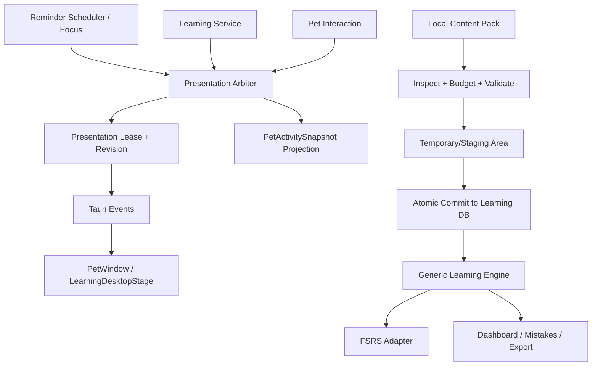

# 圆圆碎片学习模块：阶段 0 / 阶段 1 开发实施方案

> 文档状态：可执行开发方案<br>
> 对应产品评审：`YUANYUAN_FRAGMENT_LEARNING_MODULE_EXPERT_REVIEW.md`<br>
> 评审结论：Conditional Go，仅批准阶段 0 / 阶段 1<br>
> 计划基线：`personal/kajweb-kaoyan-local` / `ef210e7`<br>
> 编制日期：2026-08-14<br>
> 约束：不公开发布、不建设远程内容源、不上传个人 `kajweb/dict` 词库

## 0. 开发结论

开发分两条主线推进：

1. **阶段 0：可靠性前置**——在不改写稳定提醒调度的前提下，建立呈现权协调器、宠物统一快照、可恢复的学习会话状态机和性能基线。
2. **阶段 1：通用本地学习包**——冻结通用 schema 和安全预算，把现有英语词汇迁移为兼容适配器，交付内容库、包启停、指定包学习和安全的 CSV/JSON 本地导入。

阶段 1 完成并不意味着可以公开发布。第二学科、极简编辑器、远程更新和公共内容包分别属于阶段 2、阶段 4或独立的内容权利工作，必须再次评审。

## 1. 开发目标与不变量

### 1.1 阶段 0 目标

- 任意时刻只有一个圆圆前台学习/提醒表面持有有效呈现租约；
- 强提醒可在 1 秒内使学习小黑板进入暂停并获得呈现权；
- 菜单、动画、小黑板和后端状态读取同一 `PetActivitySnapshot`；
- 正常暂停、抢占、应用崩溃或重启后均可恢复到原题；
- 已提交答案永不重复计分，未提交选择永不写入；
- 学习开启不破坏 v1.4.0 的提醒领取、呈现和离线边界。

### 1.2 阶段 1 目标

- 通用引擎不依赖音标、词性、中文释义或词族；
- 内容包只能声明数据，不能执行脚本、命令、任意 HTML 或网络请求；
- 使用稳定 `(packId, cardId)` 身份更新内容，不静默破坏进度；
- 现有 4,533 张个人英语卡及其调度、错题、作答日志可从 v5 迁移到 v6；
- 用户可启用/停用内容包，可混合学习或指定包学习；
- 导入满足“先预览、再确认、取消零可见写入、失败无半安装”；
- 稳定版关闭学习时仍不注册学习命令、不包含页面和个人词包。

### 1.3 全程不变量

- 正式运行不依赖 Codex、Node.js、Rust、Python、账号、云服务或 AI；
- 学习数据库继续与提醒数据库物理隔离；
- 个人词库资源和许可不清的来源不得进入公共分支或发行物；
- 自动邀请保持默认关闭，阶段 0/1 只允许“专注结束”触发；
- 不采集默认遥测；试验数据默认本机计算；
- 任何迁移失败都必须保持旧数据库可恢复；
- 高优先级提醒不得等待学习一轮完成。

## 2. 源码与分支隔离方案

当前个人分支同时包含通用学习代码和不可公开分发的个人词包。开发前先建立两条隔离通道：

### 2.1 通用开发通道

建议分支：`feat/fragment-learning-stage-0-1`

该分支必须从经过审计、从未包含个人词库资源的 Learning Preview 基线创建；若没有现成干净基线，则从稳定集成基线逐个挑选通用学习提交重建。不能从个人分支直接新建后再删除 CSV，因为受限内容仍会留在 Git 历史中。

允许包含：

- `src/learning/` 通用 UI；
- `src-tauri/src/learning/` 通用引擎；
- learning feature、Learning Preview 配置、通用夹具和文档；
- 不含受限词库的合成测试包。

禁止包含：

- `src-tauri/resources/personal-learning/**`；
- `work/personal-sources/**`；
- 用户 `%LOCALAPPDATA%` 数据、安装目录或绝对路径；
- `personal-kajweb` 的资源内容和生成产物。

### 2.2 个人验证通道

保留：`personal/kajweb-kaoyan-local`

用途仅为：

- 合并或挑选通用开发提交；
- 对 4,533 张词库执行迁移、性能和真实安装 E2E；
- 构建个人安装包。

不得从个人验证通道向公共仓库直接推送。任何准备进入通用通道的提交都必须运行个人资源泄漏扫描。

### 2.3 SCM-001 基线清理任务

开发开始前生成一份文件级审计：

```text
通用代码提交列表
个人内容/构建提交列表
可挑选提交及冲突说明
个人资源路径 denylist
稳定版学习关闭边界结果
```

验收：通用通道在没有个人资源目录时仍能完成 `learning:verify`；`rg`、构建产物清单和 Git 历史候选中均不存在个人 CSV、上游压缩包或用户数据。

## 3. 目标技术结构



### 3.1 呈现权协调器

新增后端模块建议：`src-tauri/src/presentation_arbiter.rs`。它是应用进程内协调器，不另建跨进程服务。

建议领域类型：

```rust
enum PresentationOwner {
    StrongReminder,
    WaterReminder,
    MovementReminder,
    NormalReminder,
    Focus,
    LearningSession,
    LearningInvitation,
    TaskWatch,
    AmbientPet,
}

struct PresentationLease {
    lease_id: Uuid,
    owner: PresentationOwner,
    priority: u8,
    preemptible: bool,
    revision: u64,
    acquired_at_unix_ms: i64,
    expires_at_unix_ms: Option<i64>,
}

enum AcquireResult {
    Granted(PresentationLease),
    Denied { reason: String, retry_after_ms: Option<u32> },
    Preempted { granted: PresentationLease, displaced_lease_id: Uuid },
}
```

实现原则：

- 现有 reminder `claim_due`、proactive attention budget 和 learning invitation claim 继续负责“持久业务资格”；
- Arbiter 只负责“此刻谁能占用前台呈现表面”，租约可在进程内保存；
- 应用重启时不恢复旧租约，而是根据持久 reminder/session 状态重建；
- 释放必须同时携带 `leaseId + revision`，过期窗口不能释放新租约；
- 强提醒为不可抢占，学习会话为可抢占，自动邀请优先级低于主动学习；
- UI 不自行推断优先级，也不能自行创建高优先级租约；
- 所有状态变更发出包含 revision 的快照，前端丢弃旧 revision。

暂定优先级只用于实现和测试，最终值由 REL-001 冻结：

| 呈现方 | 暂定优先级 | 抢占规则 |
| --- | ---: | --- |
| Windows 锁定休息/认证表面 | 120 | 不可绕过 |
| 强提醒 | 100 | 可抢占其他表面 |
| 专注状态 | 90 | 强提醒可临时抢占，结束后恢复 |
| 喝水提醒 | 80 | 高于活动提醒 |
| 活动/普通提醒 | 70 | 可抢占学习 |
| 用户主动学习 | 60 | 可抢占任务守望/邀请/闲置动画 |
| 任务守望 | 50 | 不覆盖提醒或主动学习 |
| 自动学习邀请 | 30 | 可忽略、可过期 |
| 宠物闲置动画 | 10 | 永远可让位 |

优先级数字不得由内容包、前端或用户导入数据覆盖。

建议后端事件：

```text
presentation-lease-changed
pet-activity-snapshot-updated
learning-session-paused
learning-session-resumable
```

### 3.2 PetActivitySnapshot

```ts
interface PetActivitySnapshot {
  revision: number;
  activity:
    | "idle"
    | "sleeping"
    | "reminding"
    | "focusing"
    | "learning"
    | "interrupted";
  source: "manual" | "schedule" | "reminder" | "focus" | "learning";
  leaseId: string | null;
  resumableLearningSessionId: string | null;
  restoreTarget: "idle" | "sleeping" | "focusing" | "learning" | null;
}
```

菜单、“立即睡觉/叫醒圆圆”、宠物动画和学习小黑板只消费该快照。前端可以显示乐观交互反馈，但后端拒绝后必须回滚到最新快照。

### 3.3 学习会话状态机

稳定状态：

```text
created → active ↔ paused → completed
                   ↘ abandoned
                   ↘ expired
```

`interrupted` 作为追加事件和暂停原因，不作为长期稳定状态。合法转换：

| 当前 | 事件 | 目标 | 关键动作 |
| --- | --- | --- | --- |
| created | board_presented | active | 记录呈现租约和当前卡 |
| active | user_pause | paused | 释放租约，保留当前卡 |
| active | high_priority_preempt | paused | 写 interrupted 事件，释放租约 |
| active | answer_committed | active/completed | 幂等写答案；最后一题后完成 |
| paused | user_resume | active | 重新申请租约，恢复原题 |
| created/active/paused | user_abandon | abandoned | 已答保留，未答回到未来选卡池 |
| created/active/paused | ttl_elapsed | expired | 已答保留，未答回池，不计错误 |

建议 TTL：以最后活动时间为基准 24 小时。该值在 GEN-000 冻结前可调整；不能用日期零点直接过期，避免跨午夜误伤夜间学习。

启动恢复：

1. 扫描 `active` 且没有当前进程租约的孤儿会话；
2. 原子转为 `paused(reason=crash_recovery)`；
3. 首页展示“继续上一轮”；
4. 不自动弹出小黑板；
5. 超过 TTL 后转 `expired`，未答卡片保持原调度状态。

建议命令：

```text
pause_learning_session(sessionId, expectedRevision, reason)
resume_learning_session(sessionId, expectedRevision)
abandon_learning_session(sessionId, expectedRevision)
get_resumable_learning_session()
```

现有 `finish_learning_session(..., user_exit)` 在兼容期映射为 `abandon`，前端继续显示“结束本轮”。

## 4. 学习数据库 v6 方案

### 4.1 迁移策略

不在原英语表上继续堆哨兵值。v6 将英语专用 `learning_cards` 迁移为通用学习项，同时保留内部 64 位十六进制 ID，使现有 schedule、session target、attempt 和 review log 可对账迁移。

建议核心表：

```text
content_packs
learning_items
learning_item_extensions
card_schedule
learning_sessions
learning_session_events
learning_session_targets
learning_question_attempts
review_logs
learning_remediation_queue
```

### 4.2 通用学习项

```text
learning_items
  item_id                  TEXT PK，内部 SHA-256
  pack_id                  TEXT FK
  external_card_id         TEXT，内容包内稳定 cardId
  exercise_kind            choice | recall
  prompt_text              TEXT
  answer_text              TEXT
  choices_json             JSON array nullable
  explanation_text         TEXT nullable
  tags_json                JSON array
  prompt_sha256            TEXT
  answer_sha256            TEXT
  schedule_epoch           INTEGER >= 1
  content_sha256            TEXT
  created_at_unix_ms        INTEGER
  updated_at_unix_ms        INTEGER
  UNIQUE(pack_id, external_card_id)
```

内部 ID 计算：

```text
item_id = SHA-256("yuanyuan-item-v1\0" + packId + "\0" + externalCardId)
```

包内 `cardId` 不要求是哈希，但只允许 `[A-Za-z0-9._:-]`，长度 1—128。规范化后重复必须拒绝，不能自动加后缀。

`choice` 有两种受控来源：内容包显式提供 1 个正确答案和 1—3 个干扰项；或领域适配器声明经过测试的 `peer_answers` 策略，从同包其他卡片生成候选。英语兼容适配器可继续使用现有安全干扰项规则；没有足够且无歧义的候选时必须降级为 `recall`。通用引擎不使用 AI 临时编造选项。

### 4.3 领域扩展

```text
learning_item_extensions
  item_id             TEXT FK
  namespace           TEXT
  extension_version   INTEGER
  payload_json        TEXT
  payload_sha256      TEXT
  PRIMARY KEY(item_id, namespace)
```

英语迁移为 `namespace=englishVocabulary`，payload 包含：

```json
{
  "headword": "stone",
  "phonetic": "stəʊn",
  "partOfSpeech": ["n."],
  "meaningsZh": ["石头；石料"],
  "wordFamily": []
}
```

通用出题和调度测试必须证明：删除或替换扩展 payload 后，通用 `prompt/answer` 仍可学习；扩展不能覆盖答案判定、调度评分或提醒优先级。

### 4.4 会话与事件

`learning_sessions` 增加：

```text
state_revision
current_item_id
paused_at_unix_ms
pause_reason
last_activity_at_unix_ms
expires_at_unix_ms
```

新增 append-only `learning_session_events`：

```text
event_id, session_id, event_kind, from_state, to_state,
item_id, reason, occurred_at_unix_ms, state_revision
```

迁移映射：

| v5 status | v6 state | 说明 |
| --- | --- | --- |
| active | paused | `pause_reason=migration_recovery`，避免升级后自动弹窗 |
| interrupted | paused | 保留原 `exit_reason` |
| completed | completed | 原样保留 |
| exited | abandoned | 已答记录保留 |

### 4.5 调度可重放

`card_schedule` 增加 `fsrs_params_version`。`review_logs` 继续 append-only，并补足重放所需的评分、调度器输入版本和时间。禁止更新历史评分；用户清除进度时通过显式删除操作和审计摘要完成，不伪造历史事件。

v6 迁移对账至少输出：

```text
pack/card/item count before/after
schedule stage/reps/lapses/due hash before/after
session/attempt/review/mistake count before/after
orphan FK count
4,533 personal card identity mapping
database integrity_check / foreign_key_check
failed migration backup restore result
```

## 5. 内容包 v1 开发合同

### 5.1 首版输入

- `.yuanyuan-learning.json`；
- CSV 字段映射导入；
- 不支持压缩包、图片、音频、Markdown 富文本或远程 URL；
- `.yylearn` 压缩包留到本地 JSON 稳定后的后续工作，不与 PACK-001 同批交付。

### 5.2 暂定安全预算

以下数值由 SEC-001 压测后在 GEN-000 冻结：

| 项目 | 暂定上限 |
| --- | --- |
| JSON/CSV 文件 | 25 MiB |
| 单包卡片数 | 20,000 |
| `prompt` | 2,000 Unicode 字符 |
| `answer` | 4,000 Unicode 字符 |
| `explanation` | 8,000 Unicode 字符 |
| 完整选项 | 含正确答案共 2—4 个，每项 1,000 字符；也可不提供并降级 recall |
| 标签 | 最多 32 个，每个 64 字符 |
| 单卡全部 extensions | 16 KiB UTF-8 |
| 解析 | 可取消；持续报告进度；总耗时超预算则失败而非卡住 UI |

解析在 Rust 后台执行，前端只接收有限错误摘要和进度。不得把整个 25 MiB 文件通过频繁 Tauri 事件反复复制到 WebView。

### 5.3 校验顺序

```text
文件身份/大小
→ UTF-8、NUL、双向控制字符
→ JSON/CSV 结构
→ schemaVersion 与已知字段
→ packId/cardId/重复身份
→ 字段长度、选项和题型
→ extension namespace/version/payload budget
→ 哈希与 manifest 摘要
→ 抽样预览
→ 用户确认 token
→ 隔离 staging 全量写入
→ foreign_key_check/integrity check
→ 单事务发布 ready
```

preview token 必须绑定文件 SHA-256、解析器版本、schema 版本和过期时间，并保持单次使用。确认时重新核对原文件身份；文件被替换则要求重新预览。

### 5.4 更新合同

- 机器计算 `promptHash`、`answerHash`，发布者维护 `scheduleEpoch`；
- 任何答案哈希变化或 epoch 增长均要求用户选择进度处置；
- 题干变化至少进入差异预览，不因 epoch 未增长而静默略过；
- 删除项先归档，学习日志不级联删除；
- 新版本安装完成前旧版本保持 `ready`；
- PACK-001/002 只保存更新所需字段，完整差异 UI 和回滚属于 PACK-005，不提前开发远程更新。

## 6. 阶段 0 / 1 工作分解

### 6.1 依赖波次

```text
Wave A: SCM-001
Wave B: REL-001  || PERF-001 || SEC-001 || UX-RESEARCH-001
Wave C: REL-002  || GEN-000(持续起草)
Wave D: GEN-000 冻结
Wave E: PACK-001
Wave F: PACK-002
Wave G: PACK-003 || PACK-004 || DATA-001
Wave H: 阶段 1 集成、QA-001、专家出口评审

Hold: GEN-001 / PACK-005 / REMOTE-001 不在本次批准开发范围
```

### 6.2 任务卡

#### SCM-001：通用与个人内容通道隔离

目标：形成不含个人词库的通用开发基线。

主要范围：Git 文件审计、构建配置、个人资源 denylist、边界验证脚本。

验收：Learning Preview 可构建；个人版仍能在个人通道验证；稳定构建和通用 Git 状态均无个人内容。

停止条件：无法在不删除用户个人验证能力的情况下分离受限资源；发现个人内容已进入公共历史时先执行泄漏响应，不继续功能开发。

#### REL-001：呈现权协调器与宠物快照

目标：在现有资格 claim 上增加单一前台呈现租约。

主要范围：`scheduler.rs`、新 Arbiter 模块、`AppState`、Tauri 事件、`PetWindow` 快照消费；不改提醒领取语义。

验收：并发申请只有一个租约；强提醒抢占学习；陈旧 lease/revision 释放失败；睡觉、专注、提醒、学习菜单和动画一致；learning-off 行为不变。

停止条件：实现要求修改稳定版 occurrence 状态含义、绕过 Windows 锁定休息认证或降低提醒优先级。

#### PERF-001：性能基线

目标：冻结学习开启/关闭的成本。

测量：冷/温启动、学习页打开、小黑板打开、4,533/20,000 卡导入、搜索分页、内存 2 小时、DB 增长、提醒领取/呈现 P50/P95。

验收：报告绑定二进制、数据库夹具、脚本哈希和设备信息；不能用浏览器 demo 替代 Tauri 桌面数据。

停止条件：学习开启导致强提醒呈现超出现有冻结门，先修复再进入 PACK 开发。

#### SEC-001：本地内容包 STRIDE 与安全夹具

目标：在写校验器前冻结输入、命令和数据库信任边界。

至少覆盖：伪造/篡改/抵赖/信息泄露/拒绝服务/提权；超长输入、畸形 JSON/CSV、Unicode、公式注入、preview token 重放、路径、解析预算、Tauri allowlist、半安装。

验收：每个威胁映射到预防控制、测试夹具、剩余风险和责任人。

停止条件：需要执行内容包代码或放开任意路径权限才能实现需求。

#### UX-RESEARCH-001：私有学习包制作访谈

目标：验证普通用户从零做卡的真实流程。

执行：5—8 人，以零散工作笔记制作 10—20 张卡；记录准备时间、字段理解、错误、放弃点和希望的最小编辑能力。

验收：形成匿名汇总，不收集原始敏感工作内容；结果进入 GEN-000 和阶段 2 编辑器范围。

停止条件：参与者只能通过上传机密材料完成任务；改用合成笔记重新设计研究。

#### REL-002：会话状态机与崩溃恢复

目标：交付暂停、抢占、恢复、放弃和过期。

主要范围：学习 schema、repository、commands、LearningView、LearningDesktopStage；所有写操作携带 expected revision 或幂等 ID。

验收：每个合法/非法转换测试；杀进程后重启显示“继续上一轮”；恢复原题；已答不重算；强提醒让位；Esc 提供“暂停/结束本轮”清晰选择。

停止条件：恢复依赖前端内存、重复答案无法幂等，或抢占会丢失已提交记录。

#### GEN-000：冻结 RFC

目标：冻结 v6 schema、内容包 v1、迁移、状态机和文案合同。

输入：REL-001/002 结果、SEC-001、访谈、性能数据。

验收：产品、架构、安全、学习/内容、Windows QA 对未决项逐项签字；未知字段策略、预算、TTL、哈希和扩展规则无“以后再说”的歧义。

停止条件：5→6 迁移无法证明可恢复，或通用引擎仍需要英语字段。

#### PACK-001：schema、检查器与原子安装

目标：实现本地 JSON/CSV 的安全解析和通用包入库。

主要范围：Rust parser/validator、preview token、staging/临时区、错误 DTO、合成夹具；不做完整更新 UI。

验收：合法包可重复确定性导入；所有恶意夹具失败；取消零可见写入；注入失败后旧包/进度不变；错误包含文件、行/字段和可行动建议。

停止条件：为支持坏数据而放宽 schema，或错误只能以原始 Rust/SQLite 英文暴露给用户。

#### PACK-002：英语兼容适配与 v5→v6

目标：在不丢个人进度的前提下移除引擎英语依赖。

主要范围：v6 migration、English adapter、DTO 映射、旧 JSON 导入兼容、个人库迁移 QA。

验收：4,533 卡身份映射；schedule/session/attempt/review/mistake 对账；个人英语 UI 功能不退化；故意失败触发备份恢复；稳定 learning-off 不含迁移。

停止条件：任何孤儿 FK、卡片身份漂移、调度到期漂移或受限内容进入通用提交。

#### PACK-003：内容库与包选择

目标：用户能看见并控制装了什么。

功能：包列表、启停、版本、来源/许可、卡片数、到期/错题数；混合学习、指定包、仅错题；删除影响预览。

验收：多包不串包；禁用不删除进度；删除一个包不影响其他包；自动邀请只从用户允许参与的包选卡。

停止条件：内容包可以改变全局提醒频率或自动邀请安全设置。

#### PACK-004：CSV 映射与原生 JSON UI

目标：非技术用户可完成字段映射、抽样预览和导入。

验收：键盘可操作；大文件有进度/取消；浏览器预览预先标注桌面限制；同一文件变化导致 token 失效；不出现“点击后卡死”。

停止条件：解析在 WebView 主线程执行，或取消后仍留下 ready/preview 包。

#### DATA-001：学习库备份恢复

目标：将数月学习投入纳入本地备份保护。

方案：学习库独立备份目录和 manifest；支持仅提醒、仅学习、两者恢复；恢复前各自创建安全快照；不把两个 DB 合并。

验收：每日一次、手动备份、14 份保留策略经产品确认；损坏拒绝；恢复中断可回到恢复前；非 ASCII 路径、磁盘空间不足和锁占用测试通过。

停止条件：恢复一个数据库会静默覆盖另一个数据库，或备份包含个人词库而 UI 未说明。

#### QA-001：贯穿式质量门

目标：每个波次维护测试矩阵和未验证事实，不在末尾补测试。

输出：自动化结果、真实桌面录屏/截图、性能报告、迁移对账、无障碍清单、内容权利清单、Go/No-Go。

## 7. 前端交互补充

### 7.1 小黑板退出

答题中触发 Esc 或关闭：

```text
继续学习
暂停，稍后继续
结束本轮
```

被强提醒抢占时不询问，自动暂停；提醒完成后只展示“上一轮可以继续”的轻提示，不自动重新弹出小黑板。

### 7.2 答对节奏

设置新增：

```text
答对后：自动下一题 / 手动继续
有解释时：驻留 3 秒 / 手动继续
学习声音：关闭（默认）/ 开启
```

减少动画开启时，按钮与气泡仍提供文本状态，动作缩短但不移除对错信息。

### 7.3 看板诚实性

- 比率显示 `正确数/样本数`；
- 样本 `n < 30` 显示“数据不足”；
- 使用“稳定复习状态”，不写“已经掌握”；
- 北极星只在本地计算主动完成轮数与主动留存；
- 自动邀请接受率放在防打扰诊断，不做激励目标。

## 8. 验证矩阵与命令

基线观察（2026-08-14）：`npm.cmd run verify` 与稳定版 `npm.cmd run tauri build` 通过；第一次默认并行 `cargo test` 在主程序测试进程末尾出现一次 Windows `STATUS_ACCESS_VIOLATION`，随后主程序串行测试 201 通过/1 项权限忽略，整个 workspace 串行复验全部通过。该现象不归因于本轮文档变更，但应由 PERF-001/QA-001 做连续复现和进程级定位；不能只把串行参数固化后删除异常记录。

### 8.1 每个任务的最小门

1. 精确目标测试；
2. `npm.cmd run check`；
3. 对应 Rust feature 定向测试；
4. `git diff --check`；
5. 任务卡声明尚未验证的真实 Windows 项。

### 8.2 阶段 0 集成门

```powershell
npm.cmd run verify
npm.cmd run learning:verify
npm.cmd run pet:validate
cd src-tauri
cargo test -p yuanyuan-reminder --lib
cargo test -p yuanyuan-reminder --lib --features learning
cd ..
npm.cmd run tauri build
npm.cmd run learning:desktop:build
```

人工：强提醒抢占、睡觉/叫醒、专注结束邀请、暂停恢复、杀进程恢复、360×560/390×620/520×420、100/125/150/200% DPI、键盘与减少动画。

### 8.3 阶段 1 集成门

在阶段 0 基础上增加：

```powershell
npm.cmd run learning:personal:verify
npm.cmd run learning:personal:desktop:build
```

以及：

- v5→v6 空库、合成库、4,533 个人库迁移；
- 故意失败与备份恢复；
- 2 个以上合成内容包的启停/指定/混合/删除；
- 25 MiB/20,000 卡上限附近导入、取消和超限；
- 高对比度、夜间模式、RDP、更新重启、非 ASCII 路径；
- 学习库备份恢复；
- learning-off 源和二进制边界；
- 最终安装包内容审计，证明个人资源不在 Learning Preview/稳定版。

## 9. 智能体开发规则

每个 Vibecoding 智能体一次只领取一个任务卡。涉及同一迁移、`models.rs`、`repository.rs` 或共享前端类型的任务不得并行写同一文件。

任务提示必须包含：

```text
任务 ID：
目标与用户可见结果：
基线提交/构建形态：
必须阅读：AGENTS.md、主评审稿、本开发方案、相关 migration/源码
允许修改：
禁止修改：
数据与状态机合同：
隐私/权利边界：
精确测试：
完整集成门：
人工验收：
必须生成的证据：
停止条件：
提交规则：不混入格式化、个人资源或无关修复
```

智能体不得自行：

- 更改优先级表或自动邀请默认值；
- 放宽安全预算以让夹具通过；
- 生成或下载公开词库放入通用分支；
- 新增远程请求、AI Provider、遥测或账号；
- 宣称测试通过等于内容、法律、无障碍或发布批准；
- 在迁移失败或对账不一致时继续下一任务。

## 10. 阶段出口与下一次评审

### 10.1 阶段 0 出口

- REL-001/002、PERF-001、SEC-001 完成；
- 呈现租约和会话状态机报告通过；
- 崩溃恢复与强提醒 1 秒让位真实桌面验证；
- 无稳定提醒回归；
- 用户访谈已完成或有具名延期处置；
- GEN-000 可以冻结。

### 10.2 阶段 1 出口

- PACK-001/002/003/004、DATA-001 完成；
- 4,533 卡迁移与失败恢复对账通过；
- 通用包安全夹具通过；
- 内容库和指定包学习 E2E 通过；
- 学习库备份恢复通过；
- 通用开发通道无个人词库；
- 产品、架构、安全、内容/学习、Windows QA、无障碍具名复核。

### 10.3 继续保持 No-Go

即使阶段 1 全部通过，以下事项仍不得自动开始：

- 公开发布学习功能；
- 公开分发 `kajweb/dict` 内容；
- 远程内容源、签名或市场；
- 第二学科正式发布；
- AI 制卡或 AI 老师；
- 对学习效果、提分或掌握做宣传。

下一次专家评审以证据齐备为事件门，不承诺固定“两周完成”。4 周主动留存必须等待真实试验周期，不能由工程测试替代。
