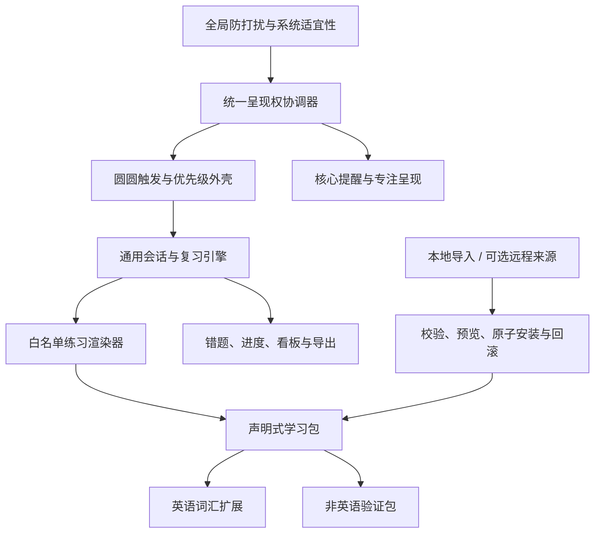

# 圆圆碎片学习模块：产品、技术与阶段建设完整评审方案

> 文档状态：专家评审稿，不代表发布批准<br>
> 评审基线：`personal/kajweb-kaoyan-local` / `ef210e7`<br>
> 评审日期：2026-08-14<br>
> 当前产品版本：v1.4.0<br>
> 建议评审角色：产品、学习科学、内容与版权、安全与隐私、Windows 客户端、交互与无障碍

配套实施文件：[`YUANYUAN_FRAGMENT_LEARNING_DEVELOPMENT_PLAN.md`](./YUANYUAN_FRAGMENT_LEARNING_DEVELOPMENT_PLAN.md)，用于阶段 0/1 的分支隔离、技术合同、任务拆分和验收执行。

## 0. 评审摘要

本方案建议把现有“考研英语”能力升级为圆圆的通用“碎片学习模块”：英语词汇是第一个内容适配器和真实验证场景，不再是系统唯一能够理解的学习对象。用户后续可在本地导入或显式拉取经过校验的学习包，用同一套触发、学习、复习、错题、看板和防打扰机制学习专业术语、资格考试、产品知识、规章制度、快捷键、面试题等内容。

核心判断如下：

1. 当前个人考研英语版已经完成从内容导入、出题、答题、反馈、FSRS 调度、错题订正、看板、单词本、导出删除到桌面宠物小黑板的最小闭环，适合个人自用和继续内测。
2. 稳定版 v1.4.0 的提醒、喝水、活动、专注和宠物能力仍是产品主线；学习功能通过构建特性和独立应用标识隔离，默认稳定版不携带学习命令、页面或词包。
3. 当前实现的领域模型、字段命名、题目生成和 UI 仍明显绑定英语词汇，尚不能仅靠换一个配置包就安全支持其他学科。
4. `kajweb/dict` 考研词库只可用于当前个人本地版本。上游未发现清晰的可再分发许可，因此不得上传 GitHub、不得进入公开安装包，也不能作为通用学习模块的默认内容。
5. 推荐先完成可靠性前置项和“声明式、无代码”的学习包 v1，再用一个非英语、用户自有或合成内容包证明通用性；远程内容源、AI 生成内容和内容市场均后置。

建议评审结论：

- 对个人自用/封闭内测：**Go**。
- 对“通用碎片学习模块”的方案和本地学习包原型：建议**有条件 Go**。
- 对把当前考研词库随公开版本分发：**No-Go**。
- 对把当前学习实现直接并入 v1.4.0 稳定版：**No-Go**；继续保持功能门和版本隔离。

## 1. 本次评审需要形成的决定

本次不要求专家评审每个视觉细节，也不把自动化测试通过等同于教学有效或可公开发布。希望评审明确以下决策：

1. 是否认可“圆圆学习 = 通用碎片学习引擎，英语 = 首个适配器”的产品方向；
2. 是否认可首版学习包只允许声明式数据，不允许脚本、任意 HTML、命令或动态插件代码；
3. 是否认可通用 MVP 只支持选择题和回忆卡两类练习；
4. 是否认可先完成本地导入和内容库，再研究远程订阅；
5. 是否认可稳定版、Learning Preview、个人词库版继续使用独立构建和应用标识；
6. 是否认可内容与进度分离、以 `(packId, cardId)` 保存学习身份的更新策略；
7. 是否将宠物状态统一、会话暂停恢复和性能基线列为通用化前置条件；
8. 公开发布前还需要哪些内容权利、学习效果、安全、无障碍和 Windows 人工验收门。

## 2. 项目定位与既有产品原则

圆圆是一个本地优先、低打扰的 Windows 桌面伙伴。它不是聊天机器人，也不应成为连续占据注意力的课程平台。学习模块应继续遵守既有原则：

- **陪伴而非授课者**：圆圆通过拉出小黑板、动作、表情和按钮反馈陪用户完成一小轮，不用长对话替代内容本身。
- **碎片而非强占用**：一轮默认 3/5/10 张，用户可主动连续学习，但自动邀请必须少、短、可忽略。
- **重要事务优先**：强提醒、健康提醒、专注状态和用户正在进行的任务高于学习邀请。
- **本地优先**：卡片、进度、错题、复习日志和设置默认只存本机；核心学习不依赖登录、云端或 AI。
- **默认克制**：自动邀请默认关闭；用户主动学习不设每日硬上限，每日目标仅是可选软目标。
- **透明可退出**：用户知道为什么出现、可以结束、暂停当天邀请、导出或删除自己的数据。
- **能力隔离**：实验功能不反向扩大 v1.4.0 稳定版范围，不让个人内容进入公共发行物。

## 3. 当前项目已建设情况

### 3.1 版本与技术栈

| 项目 | 当前路径 | 状态 |
| --- | --- | --- |
| 桌面框架 | Tauri 2，Windows 为当前主要运行平台 | 已建设 |
| 前端 | React 19 + TypeScript + Vite | 已建设 |
| 本地后端 | Rust 命令层、领域服务与 SQLite | 已建设 |
| 核心提醒库 | 提醒、喝水、活动、专注、历史、任务守望等 | 稳定主线 |
| 学习库 | 独立 SQLite 数据库，当前迁移到 schema v5 | Learning Preview/个人版已建设 |
| 复习调度 | Rust `fsrs` 6.6.1，经隔离适配器调用 | 已建设 |
| 宠物表现 | 透明 WebP 图集、清单驱动动画、桌面小黑板 | 已建设 |
| 网络/AI | 核心离线可用；AI 默认关闭且不参与学习必需链路 | 边界已建设 |

稳定主线当前已经覆盖：

| 稳定能力 | 当前完成情况 |
| --- | --- |
| 提醒 | 一次性、间隔、每日、每周提醒；创建、编辑、启停、软删除、稍后提醒、错过策略和历史保留 |
| 健康 | 喝水、活动、休息记录和目标反馈 |
| 专注 | 专注计时、启停、结束反馈，并可作为学习邀请的唯一首批自动触发源 |
| 宠物 | 非语言状态反馈、道具、减少动态、用户主动互动、睡觉/叫醒和任务守望表现 |
| 数据 | 每日/手动备份、完整性校验、安全恢复、自动备份保留和分范围删除 |
| 运行边界 | 正式离线运行不依赖开发工具、账号、云服务或 AI Provider |
| 发行工程 | Windows x64 NSIS、源范围/二进制边界、SBOM、第三方许可和多类发布证据脚本 |

需要特别说明：v1.4.0 源码可验证、可构建，不等于正式发布已批准。代码签名与时间戳、SmartScreen/第三方安全产品、真实升级回滚、24 小时运行、完整 DPI/Narrator 矩阵和具名责任人仍是稳定版独立的发布门；学习方案不能绕过这些门。

### 3.2 当前三个构建形态

| 形态 | 应用标识与内容 | 当前用途 | 发布判断 |
| --- | --- | --- | --- |
| v1.4.0 稳定版 | 默认不启用 Rust `learning` feature；前端不打入学习页面和词包 | 正式提醒主线 | 可继续稳定版验证 |
| Learning Preview | `com.yuanyuan.reminder.learning-preview`，启用学习命令但不依赖个人词包 | 内部产品与技术验证 | 仅预览/内测 |
| 个人考研词库版 | `com.yuanyuan.reminder.learning-personal`，启用 `personal-kajweb` 并使用独立数据目录 | 当前用户个人使用 | 不上传、不公开分发 |

构建隔离不是 UI 隐藏，而是同时使用：

- Rust Cargo feature：`learning`、`personal-kajweb`；
- 前端构建模式：learning preview/personal；
- 独立 Tauri 配置、产品名和应用 identifier；
- 禁用学习时的源码、产物和命令边界检查；
- 个人词包准备、校验和个人构建专用脚本。

### 3.3 已完成的学习闭环

| 能力 | 当前实现 | 完成度 |
| --- | --- | --- |
| 内容进入 | JSON/CSV 预览后确认导入，事务化写入；个人版可准备内置词包 | 已完成，仍是英语模型 |
| 内容选择 | 所有 `ready` 内容包合并参与；可查看来源 | 基础完成，尚无按包勾选学习 |
| 手动触发 | 学习页、宠物快捷入口、桌面小黑板 | 已完成 |
| 自动触发 | 用户明确开启后，只接入“专注结束”；具备冷却、每日邀请次数、TTL 和暂停当天 | 已完成第一种安全触发 |
| 一轮学习 | 每轮 3/5/10 张，到期复习优先，再用新内容补齐 | 已完成 |
| 连续学习 | 完成后可“再学一轮”；主动学习不受每日新词硬上限 | 已完成 |
| 出题 | 四选一优先；无合格干扰项时退化为回忆卡 | 已完成，英语专用规则较多 |
| 答题反馈 | 正确自动约 1.2 秒切题；错误显示正确答案，用户确认理解后继续 | 已完成 |
| 宠物反馈 | 乖坐/眼镜、等待后歪头眨眼；正确伸右爪拍绿色勾，错误伸左爪拍红色叉，并显示短气泡 | 已完成 |
| 复习调度 | FSRS 驱动新内容、学习中、稳定等状态和下次到期时间 | 已完成 |
| 错题机制 | 待订正、已订正待复查、已巩固；支持只练错题 | 已完成 |
| 本轮总结 | 首答正确、错题数、用时、再学一轮/订正错题 | 已完成 |
| 学习看板 | 近 7 天活动、首答正确率、各阶段数量、错题入口 | 已完成基础版 |
| 内容浏览 | 单词本搜索与新词/学习中/稳定/错题筛选 | 已完成英语版 |
| 数据控制 | 完整 JSON、卡片 CSV、复习日志 CSV 导出；清进度或完整删除均有确认 | 已完成 |
| 退出语义 | “结束本轮”有确认，已答记录保留，剩余题目放弃 | 已修正歧义；真正暂停恢复未完成 |

### 3.4 当前学习数据与算法路径

当前学习数据库与提醒数据库分离，主要实体包括：

- 内容来源、内容包、卡片；
- 每张卡的 FSRS 调度状态；
- 学习设置；
- 学习会话与会话卡片；
- 首次作答、订正作答与耗时日志；
- 自动邀请事件及抑制原因；
- 导入/导出所需元数据。

算法边界如下：

1. 调度器只负责根据原始答题结果更新学习状态和到期时间；
2. 同一道题的即时订正不重复推进调度，避免一次错误产生多次学习权重；
3. 错题订正成功先进入“待复查”，需要未来到期复查正确后才能视为巩固；
4. 主动学习按“本轮数量”工作，不按天封顶；历史 `dailyNewLimit` 字段仅为旧数据和导出兼容，后续通用 schema 应正式弃用；
5. 学习看板中的“首答正确率”只统计第一次回答，不用订正结果粉饰准确率。

### 3.5 当前个人考研词库事实

个人版使用 `kajweb/dict` 的 `KaoYan_2` 数据，锁定的来源提交为 `3992bcb94c800a2fd38a9fd6ff95b2353e755363`。最近一次个人包准备结果为：

- 导入 4,533 张，跳过 0 张；
- 缺失音标 0；
- 带词族信息 3,748 张；
- 释义长度已有约束和清洗，仍需持续做语言质量抽检；
- 上游没有可供本项目确认的清晰再分发许可；
- 个人包清单明确标记 `redistributionApproved=false`、`uploadAllowed=false`。

因此该词库可证明“真实规模本地内容包能否运行”，不能证明公开内容供应链已经解决。

### 3.6 已有验证证据与尚缺证据

已验证：

- 前端类型检查、静态检查和自动化回归；
- 学习关闭边界、AI 关闭边界和稳定版主能力回归；
- Rust/SQLite 学习仓储、迁移、FSRS、导入导出、错题和会话测试；
- 学习预览/个人前端构建、个人桌面安装包构建；
- 宠物 39 个动画和 4 张 WebP 图集的结构校验；
- 真实安装版的学习主链路、宠物小黑板、自动切题、错题、看板、单词本、睡觉/叫醒菜单状态；
- 最近完整个人特性测试为 255 项通过、1 项因 Windows 符号链接权限忽略；最近稳定验证前端为 198 项通过。

仍不能由自动化替代的门：

- 内容再分发权利与公告文本签字；
- 学习内容的语言/学科质量抽检和错误率口径；
- 多 DPI、多屏、缩放、睡眠唤醒、锁屏解锁的完整 Windows 人工矩阵；
- Narrator、键盘顺序、对比度、减少动画等无障碍具名验收；
- 学习开启/关闭相对提醒延迟、长期内存、数据库增长和大包导入性能；
- 真实用户对自动邀请的接受度和延迟记忆效果。

### 3.7 当前总体成熟度判断

| 范围 | 产品闭环 | 工程实现 | 发布/权利 | 当前结论 |
| --- | --- | --- | --- | --- |
| v1.4.0 离线提醒主线 | 完整 | 已建设并有发行工程 | 仍有独立人工发布门 | 继续发布候选验证，不因学习而扩范围 |
| Learning Preview 英语学习 | 完整基础闭环 | 已实现并受 feature 隔离 | 仅内部预览 | 可继续内测 |
| 个人考研词库版 | 完整且已真实安装验证 | 4,533 卡可运行 | 上游许可不清 | 仅个人本地使用 |
| 通用碎片学习模块 | 本文已完成产品与架构方案 | 尚未通用化；现有模型仍绑定英语 | 尚无公共内容供应链 | 等待本次评审后启动阶段 0/1 |
| 远程内容源/市场 | 只有边界设计 | 未实现 | 信任、隐私、撤回均未评审 | 明确后置 |
| AI 学习助手 | 非 MVP | 未接入必需链路 | 需单独隐私与质量评审 | 默认关闭、暂不建设 |

## 4. 当前版本的关键问题与通用化阻力

### 4.1 领域模型仍以英语词汇为中心

现有 `LearningCardDto`、释义、音标、词性、词族、干扰项与“单词本”等概念被写进前后端合同。直接导入法律条文、快捷键或面试题会导致字段滥用和界面文案错位。因此不能只把 CSV 列名开放给用户就宣称“支持任意学习内容”。

### 4.2 内容包目前更像导入批次，不是完整产品对象

当前能够记录来源、版本、许可字段和就绪状态，但还缺：

- 用户启用/停用或指定某个包学习；
- 内容包详情、版本差异、更新提示、回滚；
- 卡片身份不变时保留进度的正式更新合同；
- 同一包本地修改与上游更新冲突处理；
- 面向用户的字段映射向导和错误定位。

### 4.3 会话“结束”清晰了，但真正暂停恢复仍未完成

当前结束本轮会保存已答记录并丢弃未答题，语义已不再伪装成“收起”。但碎片学习天然可能被提醒、会议或用户操作中断，通用模块应支持：

- 暂停并隐藏小黑板；
- 被更高优先级提醒中断后自动保留；
- 恢复到原题且不重复记分；
- 明确过期会话的清理与重排规则。

### 4.4 宠物状态仍有分散风险

最近“立即睡觉无动画”“睡着后菜单仍显示立即睡觉”的问题已经修复，但暴露出手动睡眠、自动睡眠、表情、前端引用和菜单文案可能各自判断状态。建议在继续增加动作前建立唯一的宠物活动快照和状态导演。

### 4.5 内容质量、学习有效性和公开分发不是同一件事

系统正确调度不代表题目优质；4,533 个词能导入不代表义项适合考研；用户做对一题也不代表长期掌握。产品只能如实展示“首答正确、到期、稳定状态、复查”等可观察事实，不能在没有实验的情况下宣传提分或掌握效果。

## 5. 目标产品：通用碎片学习模块

### 5.1 产品定义

圆圆碎片学习模块是一个**由桌面伙伴递送、由本地学习引擎调度、由声明式学习包供给内容**的小轮学习系统。它负责“何时适合出现、拿哪几张、怎么记录和何时再复习”，不试图替代教材、课程、教师或专业内容编辑。

它不参与 Anki、墨墨或刷题应用的题库规模和课程深度竞争。圆圆的差异化只来自三点：**低打扰地把握碎片时机、以宠物陪伴形成轻量学习仪式、坚持本地优先的隐私边界**。任何功能一旦削弱这三点，例如为了参与率放宽打扰、建设排行榜或把 AI 老师变成主入口，即使短期数据更好也不进入产品主线。

用户心智应是：

> 我给圆圆装上想学的内容；工作空隙里，我可以主动叫它拉出小黑板，也可以允许它在合适时机轻轻邀请；每次只学一小轮，进度留在本机。

### 5.2 适合与不适合的内容

首版适合：

- 一问一答、概念—定义、术语—解释；
- 有有限选项的知识辨认；
- 可独立复习、单张 10—60 秒完成的内容；
- 用户自有的工作知识、考试要点或个人笔记。

首版不适合：

- 依赖长上下文的系统课程；
- 复杂数学推导、编程环境、作文批改；
- 必须联网查询才能判断答案的题目；
- 需要高风险专业判断的即时医疗、法律或财务建议；
- 通过脚本任意控制桌面、文件或网络的“学习插件”。

## 6. 推荐目标架构



### 6.1 五层职责

1. **统一呈现权协调器与圆圆触发外壳**：在现有提醒 claim、注意力预算和学习邀请 claim 之上形成单一呈现租约；主动入口、宠物邀请、冷却、暂停当天、全屏/锁屏/专注/提醒抑制都通过它执行。`PetActivitySnapshot` 只是协调器状态的投影，不是第二套判断源。阶段 0 先覆盖宠物、学习和高优先级提醒的抢占，不要求一次性重写全部稳定提醒调度。
2. **通用学习引擎**：会话、卡片选择、FSRS、错题生命周期、暂停恢复、统计和数据删除。
3. **白名单练习渲染器**：只渲染产品实现并审计过的题型，不执行内容包代码。
4. **声明式内容包**：题干、答案、选项、解释、标签、来源、许可、版本和可选领域扩展。
5. **领域适配器**：英语音标/词性/词族等只存在于 `extensions`，通用引擎不依赖它们。

### 6.2 通用内容包 v1 建议合同

```json
{
  "schemaVersion": 1,
  "packId": "user.example.security-basics",
  "version": "1.0.0",
  "title": "信息安全基础",
  "subject": "work-knowledge",
  "language": "zh-CN",
  "publisher": { "name": "用户本人" },
  "license": {
    "status": "private-use",
    "spdxExpression": null,
    "notice": "仅限个人使用"
  },
  "defaults": {
    "roundSize": 5,
    "estimatedSecondsPerCard": 20
  },
  "supportedExercises": ["choice", "recall"],
  "cards": []
}
```

通用卡片：

```json
{
  "cardId": "phishing-definition",
  "prompt": "什么是网络钓鱼？",
  "answer": "伪装可信来源以诱导用户泄露信息或执行危险操作",
  "choices": ["……", "……", "……"],
  "explanation": "可选的简短解释",
  "tags": ["安全", "基础"],
  "extensions": {}
}
```

英语词汇只扩展为：

```json
{
  "extensions": {
    "englishVocabulary": {
      "headword": "stone",
      "phonetic": "stəʊn",
      "partOfSpeech": ["n."],
      "wordFamily": []
    }
  }
}
```

首版只实现两类渲染器：

- `choice`：2—4 个选项，记录首答正确/错误；
- `recall`：用户先回想，再揭示答案并选择“记错了/想起来了”。

判断、排序、填空、图片和本地音频可在后续按独立安全与交互评审加入。任意 JavaScript、任意 HTML、命令执行、文件路径访问、内容包主动联网不进入 v1。

### 6.3 内容身份与更新规则

进度必须与内容文件分离：

- 学习身份为 `(packId, cardId)`；
- 同一身份的小幅文字修正保留进度；
- 新 `cardId` 视为新卡；
- 上游删除的卡先归档，不立即删除用户记录；
- 系统对规范化后的题干、答案分别计算 `promptHash`、`answerHash`；内容发布者另外维护单调递增的 `scheduleEpoch`，用于声明语义级变更；
- `answerHash` 变化或 `scheduleEpoch` 递增时必须展示差异，并让用户选择保留或重置进度；仅 `promptHash` 变化也必须进入差异预览，系统不得把发布者漏增 epoch 当作“无变化”；
- 有本地编辑时不得被远程更新静默覆盖；
- 安装失败必须保持旧版本和原有进度可用。

这里不直接采用仅靠 `contentHash + answerEpoch` 自动区分“文字修正/实质变化”的建议：epoch 最终仍依赖发布者判断，且题干变化也可能改变答案语义。推荐合同同时保留机器计算的题干/答案哈希和发布者显式 epoch，以保守规则触发预览，避免静默误判。

### 6.4 数据合同演进规则

- `schemaVersion` 决定解析合同；客户端不支持更高主版本时拒绝安装并给出升级提示；
- 已知对象中的未知字段默认拒绝，避免拼写错误或安全字段被静默忽略；只有命名空间化的 `extensions` 可被不认识的客户端原样保留但不参与出题；
- 每个扩展具有独立的 `extensionVersion`，通用引擎不得依赖扩展字段；
- 字段废弃采用 deprecated → 兼容读/必要时双写 → 后续主版本移除；
- 数据库迁移必须在事务内执行，迁移前生成可验证备份，失败自动回滚并提供恢复证明；不强求每个 SQLite 迁移都实现高风险的“逆向 SQL”，以备份恢复作为最终兜底。

## 7. 内容获取与内容库方案

### 7.1 分阶段入口

**阶段一：本地文件优先**

1. CSV 字段映射向导：用户指定题干、答案、选项、解释、标签；
2. 原生 `.yuanyuan-learning.json`；
3. 内容导入前显示来源、许可、卡片数、警告和抽样预览；
4. 校验通过后原子安装，可单独启用、停用和删除内容包。

导入采用两阶段发布：先在隔离临时区或 staging 结构完成解析、预算检查和全量校验，再在单一事务中切换为 `ready`。产品合同要求“取消零可见写入、失败不产生半安装”；具体实现可以选择临时数据库、staging 表或等价机制，不在方案阶段强行固定为某一种表结构。

**阶段二：本地包格式**

可引入 `.yylearn` 压缩包，承载 manifest、数据和受限媒体。必须校验哈希、条目数、单文件和总大小、压缩比、路径穿越、重复 ID、非法字符和媒体类型。

解析器同时设置单字段、单文件、总展开大小和总耗时预算；富文本若后续开放，只允许经过独立清洗器处理的受限 Markdown，并持续覆盖 Markdown/HTML 注入、ReDoS 和异常编码夹具。Tauri 学习命令使用显式 allowlist，校验失败不得调用任何提交命令。

**阶段三：可选远程来源**

仅在前两阶段稳定后研究。远程来源应满足：

- 用户明确添加 HTTPS 地址，不内置来源市场；
- 拉取的是带版本、发布者、许可、摘要和 SHA-256 的 manifest；
- 自动更新默认关闭，更新前展示变更；
- 下载到隔离缓存，校验后再原子切换；
- 保留上一版本以供回滚；
- 远程包不能改变提醒优先级、触发频率、网络权限或 UI 代码。

`TOFU + Ed25519 + 密钥轮换 + 本地撤销列表` 可作为阶段 4 威胁建模时的候选，不在当前阶段冻结。TOFU 不能证明首次连接的发布者身份，离线撤销也存在传播延迟；届时需与签名元数据、根密钥恢复、用户显式换钥确认和类似 TUF 的版本/回滚防护一起比较后再决定。

### 7.2 内容库信息架构

学习页建议收敛为五个二级区域：

1. **开始学习**：选择“混合学习/指定内容包/仅错题”，选择本轮 3/5/10 张；
2. **学习看板**：今日/近 7 天/近 30 天、首答正确率、到期、错题、稳定状态、按内容包分布；
3. **卡片与错题**：通用文案，英语适配器可显示“单词本”；
4. **内容库**：已安装包、启停、版本、来源、许可、卡片数、更新和删除；
5. **设置**：软目标、自动邀请、冷却、动画与声音、导出删除。

## 8. 碎片时间触发与全局优先级

### 8.1 允许学习的时机

- 用户主动点击圆圆或学习页；
- 用户主动完成一轮后选择继续；
- 用户明确开启自动邀请，并刚完成一次专注；
- 后续经数据验证后，才研究用户配置的学习时段或工作间隙。

### 8.2 绝不能主动打扰的时机

- 屏幕锁定、演示/全屏、系统勿扰或用户暂停邀请；
- 正在专注计时，或刚出现更高优先级提醒；
- 强提醒、喝水、活动、普通提醒、任务守望已占用呈现权；
- 已有学习小黑板、设置/导入确认或其他模态交互；
- 没有到期内容，或邀请达到每日次数/冷却限制；
- 系统状态无法可靠判断时。

屏幕共享、会议、游戏模式和远程桌面原则上也应抑制自动邀请，但只使用 Windows 能稳定、低权限且不读取内容的系统信号。当前阶段不以轮询摄像头/麦克风活跃状态作为 P0 条件，避免新增隐私感知、误判和兼容性风险；无法可靠检测时默认保留现有全屏/演示/锁屏抑制，并在真实场景 QA 中记录缺口。

### 8.3 推荐优先级

从高到低：

1. 用户安全和系统锁定/演示状态；
2. 用户明确开始或停止的专注；
3. 强提醒与到时任务；
4. 喝水、活动和普通提醒；
5. 任务守望状态反馈；
6. 用户主动学习；
7. 自动学习邀请；
8. 普通宠物闲置动画。

用户主动学习可以打开，但一旦高优先级提醒到来，应暂停会话并让位，而不是吞掉提醒或直接结束本轮。内容包只能建议“每张预计秒数/默认轮次”，无权提高自身优先级。

## 9. 圆圆在学习中的角色与交互原则

圆圆的价值不是说更多话，而是让微学习产生可识别的仪式：拉小黑板、等待、按对错按钮、收回道具。推荐保留以下原则：

- 正常答题：戴眼镜乖坐，画面稳定；
- 等待约 15 秒：只做一次轻微歪头/眨眼，不催促、不弹文案；
- 正确：使用对应爪拍绿色勾，短气泡“真棒”；默认约 1.2 秒后自动下一题，但当卡片存在解释时延长驻留，并提供“自动下一题/手动继续”的可访问性设置；
- 错误：拍红色叉，短气泡“可惜了”，展示答案后由用户确认继续；
- 减少动画：保留清晰状态变化，缩短或跳过大幅动作；
- 声音默认关闭或低刺激，必须有总开关，不能将声音作为唯一反馈；
- 自动邀请只邀请“要不要学一轮”，不直接把题目或答案浮在工作内容上。

为避免状态再次分裂，建议建立 `PetActivitySnapshot` 作为唯一权威状态，至少包含：

```text
activity: idle | sleeping | reminding | focusing | learning | interrupted
source: manual | schedule | reminder | focus | learning
revision: 单调递增版本
restoreTarget: 中断后应恢复的状态/会话
```

所有窗口、菜单和动画都订阅该快照，不再分别猜测“圆圆是否睡着”。

## 10. 本地优先、隐私、记忆与可选 AI 边界

### 10.1 本地默认

- 内容包、学习进度、答题、耗时、错题和邀请日志存本地；
- 不要求账号，不默认上传，不把工作知识用于训练；
- 用户可导出完整备份，可只清学习进度，也可连内容一起删除；
- 学习数据库继续与核心提醒数据库隔离，删除范围必须可验证；
- 学习库必须纳入独立的每日备份、手动备份和恢复演练；不得为了复用现有提醒备份而把两个数据库重新合并，恢复界面需让用户明确选择提醒数据、学习数据或两者。

### 10.2 远程内容不是云同步

以后即使允许拉取内容包，也只表示客户端获取用户选择的公开/私有静态内容，不代表上传用户学习记录。下载和遥测权限要分别授权。

### 10.3 AI 仅可作为可选工具

第一版不需要 AI。未来 AI 可协助用户在本地预览后生成干扰项、解释或卡片草稿，但必须满足：

- 默认关闭，明确标注生成内容；
- 不自动发送本地工作资料；
- 用户确认后才进入学习包；
- 不能替代来源许可和学科质量复核；
- AI 不直接决定 FSRS 评分、掌握状态或自动打扰时机；
- AI 不可成为离线学习闭环的单点依赖。

## 11. 分阶段落地顺序

### 阶段 0：可靠性前置（建议先做）

- 在现有提醒 claim/注意力预算之上建立统一呈现权协调器，再由它生成宠物活动快照，统一菜单和动画状态；
- 把会话显式建模为 `created → active ↔ paused → completed/abandoned/expired`，高优先级抢占先转为 `interrupted` 事件再落到 `paused`；
- 实现正常暂停、提醒让位、崩溃重启扫描孤儿会话、恢复原题、不重复计分和过期卡片重排；
- 建立页面打开、大包导入、SQLite 增长、提醒延迟和长期内存基线；
- 保持现有测试发现边界，继续排除 `src-tauri/target/**` 历史构建副本；
- 保持现有个人英语版功能不回退。

退出条件：睡眠、提醒、专注、学习相互切换无状态分裂；暂停恢复不重复计分；学习开启对核心提醒延迟的增量达标。

### 阶段 1：通用模型与本地包 v1

- 冻结 RFC、JSON Schema、题型和安全上限；
- 将通用卡片与 `englishVocabulary` 扩展拆开；
- 为每张卡的调度状态记录 `fsrsParamsVersion`；到期时间继续以 UTC Unix 时间存储，并冻结跨时区、夏令时和系统时钟回拨测试；
- 将首次作答、订正和评分日志冻结为 append-only 事实源，使调度状态可由日志重放验证；
- 为现有英语数据建立兼容适配和迁移，不丢进度；
- 建设内容库、包启停和指定包学习；
- 建设 CSV 字段映射向导和原生 JSON 导入。

退出条件：现有 4,533 张个人词库升级后卡片身份、调度和错题记录不丢失；恶意或错误包被拒绝且不会半安装。

### 阶段 2：第二学科证明

- 选择与英语词汇结构差异明显的内容，例如快捷键动作或规章制度长题干，由 5—8 名真实目标用户中的代表从零制作并记录耗时、卡点和放弃原因；合成包只能作为自动化夹具，不能代替可用性验证；
- 提供逐张新增/编辑题干与答案的极简卡片编辑器，并提供“这题有问题”本地标记；阶段 1 先冻结其数据合同，阶段 2 再交付 UI，避免扩张 PACK-001 的首批范围；
- 汇总形成 100—300 张非英语验证包；
- 验证选择题、回忆卡、看板、卡片列表、错题和导出均无需英语字段；
- 完成通用文案和领域名称覆盖机制。

退出条件：移除该验证包后不影响英语；不修改通用引擎即可安装另一包；不存在隐藏英语必填字段。

### 阶段 3：版本更新、差异与回滚

- 同一 `packId` 的版本检测；
- 新增/修改/删除卡片差异预览；
- 实质答案变化的进度处置；
- 本地修改冲突和一键回滚。

退出条件：更新失败不破坏旧包；卡片 ID 稳定时进度可预测保留；所有迁移具备回滚测试。

### 阶段 4：可选远程来源

- 来源信任模型、签名/哈希、下载预算、缓存和撤销；
- 用户显式添加、默认不自动更新；
- 审核网络权限、隐私声明和供应链响应流程。

在本地包安全、内容权利责任和更新合同未稳定前，不进入此阶段。

### 阶段 5：有限自动化扩展

只有专注结束邀请积累足够数据后，才逐项评估配置时段或工作间隙。每增加一个触发源都要单独做防打扰实验，不因“参与率低”自动放宽全屏、锁屏或强提醒抑制。

## 12. 可交给 Vibecoding 智能体的开发工作包

每个工作包必须携带基线提交、允许/禁止修改范围、数据迁移合同、自动验收命令、人工验收和停止条件。不得把“测试绿”写成“专家已批准”。

| ID | 目标 | 依赖 | 关键验收 |
| --- | --- | --- | --- |
| REL-001 | 在既有 claim/注意力预算上建立呈现权协调器，并由其投影 `PetActivitySnapshot` | 无 | 睡眠/叫醒/提醒/专注/学习状态一致；高优先级可撤销学习呈现租约；旧回归全过 |
| REL-002 | 显式会话状态机、暂停、抢占、崩溃恢复和过期 | REL-001 | 重启恢复原题、不重复计分；高优先级提醒 1 秒内获得呈现权；非法转换被拒绝 |
| PERF-001 | 建立学习性能与提醒隔离基线 | 无 | UI 反馈、页面打开、导入、内存、DB 增长、提醒 P95 均有可复现证据 |
| GEN-000 | 冻结通用学习 RFC、状态机、schema 演进和词汇迁移映射 | REL-002 | 产品/学习/安全共同签字；无模糊字段；5—8 人内容制作访谈已完成或有明确处置 |
| SEC-001 | 对本地学习包和命令面完成 STRIDE 威胁模型与安全预算 | 与 GEN-000 并行 | 威胁、边界、夹具和剩余风险可追踪；不等待远程来源阶段 |
| PACK-001 | 实现学习包 v1 schema、校验器、两阶段发布和错误报告 | GEN-000/SEC-001 | 合法夹具通过；未知字段、越界、重复 ID、恶意路径、预算和半安装不变量通过 |
| PACK-002 | 建立英语兼容适配器与 schema v6 迁移 | PACK-001 | 个人库 4,533 卡、进度、错题和日志前后数量及身份一致；失败备份恢复通过 |
| PACK-003 | 内容库、启停、指定包与混合学习 | PACK-002 | 多包选择不串包；删除包不误删其他包或核心数据 |
| PACK-004 | CSV 字段映射和本地原生包导入 | PACK-001 | 预览—确认—原子安装；可定位到行/字段；取消零写入 |
| DATA-001 | 学习库独立每日/手动备份与选择性恢复 | PACK-002 | 损坏拒绝、恢复中断和提醒/学习分范围恢复 E2E 通过 |
| GEN-001 | 真实用户制作的差异学科验证包、极简编辑器和通用 UI | PACK-002/003 | 无英语字段也能完成全闭环；制作耗时/卡点有证据；问题标记只存本地 |
| PACK-005 | 包更新、哈希/epoch 差异、进度保留和回滚 | GEN-001 | 新增/修改/删除/冲突/漏增 epoch/失败矩阵全过 |
| REMOTE-001 | 远程来源技术与信任刺探，不直接上线 | PACK-005 | 威胁模型、隐私、下载预算、撤销和回滚报告经评审 |
| QA-001 | 跨版本、Windows、无障碍和内容质量总门 | 全程 | 具名人工证据和 Go/No-Go 表，不接受只有截图或自动化数字 |

任务卡统一模板：

```text
任务 ID / 一句话目标
基线提交与构建形态
必须阅读的范围和架构文档
允许修改 / 禁止修改
输入输出 schema 与失败合同
迁移、回滚和兼容要求
隐私和内容权利边界
目标测试 / 完整验证 / 构建命令
人工验收场景
必须生成的证据
停止条件与需要人工决定的问题
```

## 13. 测试与评测方案

### 13.1 自动化质量门

至少覆盖：

- schema v5→v6 迁移、重复运行、失败回滚、旧版本打开策略；
- 多内容包启停、指定包、混合学习和删除隔离；
- 卡片身份稳定、版本更新、实质答案变化和本地冲突；
- FSRS 冻结向量、时钟边界、错题订正不重复调度；
- 暂停恢复、提醒抢占、崩溃恢复和会话过期；
- 会话状态机每个合法/非法转换、启动时孤儿 `active` 扫描和原题恢复不重复计分；
- CSV/JSON 的未知字段、超长文本、公式注入、NUL、双向控制字符和编码；
- 受限 Markdown/HTML 注入、ReDoS、单字段/文件/总耗时预算；
- `.yylearn` 的路径穿越、压缩炸弹、哈希不符、非法媒体和半安装回滚；
- `fsrsParamsVersion`、UTC、跨时区、夏令时、系统时钟回拨和日志重放对账；
- 学习关闭构建不注册命令、不含页面/词包；
- 个人内容不进入稳定产物、SBOM、许可清单或 Git 状态；
- 真实浏览器预览不伪装桌面能力，桌面专属按钮应预先禁用并说明。

依赖审计纳入持续集成和发行复核，但不简单把在线 `npm audit`/`cargo audit` 的任何告警都设为不可解释的“一票否决”。应锁定 advisory 数据来源、按实际可达性和发行物比对处置，并把例外、到期日和责任人写入证据；SBOM 必须与最终二进制/安装包自动比对。

### 13.2 Windows 人工 E2E 矩阵

必须在真实桌面版执行：

- 360×560、390×620、520×420，小/中/大 DPI，多屏与任务栏位置；
- 键盘全流程、Esc/结束/暂停/恢复、重复快速点击；
- 屏幕锁定、全屏演示、睡眠唤醒、专注开始/结束、强提醒抢占；
- 圆圆睡觉/叫醒、正在学习时被提醒打断、恢复后的动作和菜单；
- 大包导入、取消、错误、升级、回滚、导出、清进度和完整删除；
- 学习库每日/手动备份、仅恢复学习库、提醒与学习同时恢复、损坏备份拒绝和恢复中断；
- Narrator 名称/状态、焦点顺序、颜色对比、200% 缩放、减少动画；
- 无声场景中仍能理解对错，关闭动画后仍能完成学习。

扩展矩阵分层执行：阶段 1 出口必须覆盖高对比度、夜间模式、远程桌面、Windows 更新重启恢复、非 ASCII 安装/数据路径和通知区域溢出；HDR、UAC、杀软/EDR 共存按可获得设备与环境记录证据，不把无法获得的商业 EDR 环境伪装为已经验证。

### 13.3 内容质量评测

每个对外内容包都要冻结：

- 来源、字段级溯源、许可表达式和 notice；
- 目标人群和内容范围；
- schema/重复/空值/长度/字符自动质量门；
- 学科专家抽样方案、实质错误定义和可接受阈值；
- 干扰项歧义、多个正确答案、题干泄露、过长解释和不适龄内容检查；
- 发现严重错误后的撤回、修正和用户进度处置。

用户私有包可以不由产品承诺内容正确性，但仍必须通过结构和安全校验。

内容责任分三级：私有包由用户负责正确性，产品负责结构安全和清晰免责；社区包还需许可审查、分层抽检、问题报告与撤回机制；官方随包内容必须全文审校、具名签字并承诺错误响应时限。官方包“分层抽检不少于 2% 且至少 50 张、发现任一高危错误即撤回、实质错误率超过 0.5% 停发”可作为评审起点，但该数字尚无本项目统计依据，必须由内容/评测专家结合包规模和置信口径确认后才能成为正式发布门。

### 13.4 小规模用户验证

建议先做 12—18 人、至少 2 周的内部试验，分开观察主动学习与自动邀请：

- 能否理解“一轮”和软目标，不再误解为每日硬上限；
- 一轮完成率、连续开轮比例、结束/暂停原因；
- 首答正确率、即时订正完成率、到期复查正确率；
- 自动邀请出现后 5 秒/20 秒内拒绝率；
- 是否打断会议、演示、专注和重要提醒；
- 7 天后是否仍主动使用，而不是只被动画吸引一次。

这些数据用于改产品，不用于未经对照实验的“提高成绩”宣传。

## 14. 指标与建议阈值

北极星指标定义为：**每周由用户主动发起并完成的学习轮数，以及连续 4 周仍主动完成学习的留存**。个人版默认只在本机计算；内测试验若要跨用户汇总，必须另行取得明确同意。自动邀请漏斗只是诊断和防打扰护栏，不作为增长目标，不能因参与率低而放宽抑制条件。20 秒内拒绝率超过 60% 可触发本地降频建议或产品复盘，但不在后台静默改写用户设置。

### 14.1 学习指标

- 一轮开始率、完成率、中断率和中位耗时；
- 首答正确率，而非订正后的表面正确率；
- 错题订正率、到期复查率和延迟正确率；
- 新内容/到期复习/错题的占比；
- 内容包维度的题目回退率、无合格干扰项率和报告错误率。

所有比率同时显示分子/分母或样本量，例如“首答正确率 72%（62/86）”；样本少于 30 时显示“数据不足”，避免用小样本比率暗示稳定趋势。看板优先使用“稳定复习状态”等可观察措辞，不把调度状态直接命名为“已经掌握”。

### 14.2 防打扰指标

- `candidate → eligible → claimed → presented → engaged` 漏斗；
- 每个抑制原因的数量；
- 自动邀请 5 秒和 20 秒内关闭率；
- 提醒与学习同时出现的冲突数，目标为 0；
- 用户关闭自动邀请、暂停当天或降低频次的比例。

### 14.3 性能与可靠性建议门

- 可点击控件反馈小于 100 ms；
- 学习页温启动主要内容小于 500 ms；
- 文件解析、导出和数据库维护不阻塞主线程造成“卡死”；
- 高优先级提醒到达后学习 UI 在 1 秒内让位；
- 学习开启相对关闭的提醒领取/呈现 P95 增量不超过评审冻结阈值；
- 暂停恢复成功率 100%，不得重复计分；
- 安装/升级失败后旧内容包和数据库完整性检查通过。

具体性能数字需在目标设备上冻结，本文只给出建议起点。

## 15. 主要风险与缓解

| 风险 | 影响 | 当前判断 | 缓解与评审门 |
| --- | --- | --- | --- |
| 宠物状态分裂 | 菜单、动画与真实状态不一致 | 已出现过 | REL-001 先行；单一快照、revision 和状态转换测试 |
| 会话被误结束 | 碎片学习无法稍后继续 | 部分缓解 | 保留“结束本轮”，新增真正暂停/恢复和提醒抢占 |
| 内容权利不清 | 无法公开分发，产生法律风险 | 个人词库阻断 | 内容级许可清单和具名签字；个人包永不进入公共产物 |
| 恶意内容包 | 路径、内存、磁盘或 UI 攻击 | 尚未建设包格式 | 无代码 schema、大小预算、原子安装、哈希和安全夹具 |
| 过度通用化 | schema 臃肿、无法交付 | 中风险 | v1 只支持 choice/recall；用第二学科验证后再扩题型 |
| 进度在更新中丢失 | 用户信任受损 | 尚无正式合同 | `(packId, cardId)`、差异预览、迁移对账、回滚 |
| 干扰项质量差 | 错误教学、选择题有歧义 | 英语已有防护 | 无安全干扰项时降级 recall；包级质量报告和人工抽检 |
| 自动邀请打扰 | 破坏核心提醒与工作 | 默认关闭、单触发源 | 全局仲裁、冷却/次数/TTL、漏斗和拒绝率复盘 |
| 内容库 UI 复杂 | 小窗口难用 | 尚未设计 | 五区信息架构、渐进披露、小窗口/DPI/键盘评测 |
| 大包性能退化 | 页面卡顿、误判程序卡死 | 需基线 | 后台解析、分页/虚拟化、进度和取消、性能门 |
| 构建形态泄漏 | 个人词包进入 GitHub/稳定包 | 已有隔离 | feature、identifier、边界脚本和发行物内容审计 |

## 16. 第一版通用 MVP 的包含与排除

### 必须包含

- 本地声明式学习包 v1；
- 选择题、回忆卡；
- 混合/指定内容包、仅错题、本轮 3/5/10 张；
- 主动连续学习、可选软目标、专注结束自动邀请；
- FSRS、错题生命周期、暂停恢复、基础看板；
- 内容库、启停、来源/许可、导入预览、导出删除；
- 英语兼容适配和一个非英语验证包；
- 构建隔离、迁移回滚、安全和 Windows 验证。

### 明确排除

- 任意插件代码、脚本、HTML、命令和内容包主动联网；
- 默认远程市场、默认自动更新和云同步；
- AI 聊天老师、自动上传资料、AI 自动发布题目；
- 听力、口语评分、作文批改、编程执行环境；
- 排行榜、强制连续打卡、失败羞辱或高频催促；
- 把个人 `kajweb/dict` 词库打入公开版本；
- 在没有对照研究时宣传提分、掌握或效率提升。

## 17. 建议的 Go/No-Go 门

### 本地通用学习包原型 Go

同时满足：

- 通用 schema、安全预算和英语迁移合同经评审；
- 第二个非英语包无需修改引擎即可运行；
- 暂停恢复、提醒抢占和状态导演通过；
- 旧个人英语数据完整迁移；
- 所有内容只在本地，未扩大公开分发范围。

### Learning Preview 内测 Go

在以上基础上还需：

- Windows E2E、无障碍和性能具名验收；
- 自动邀请仍默认关闭，只开放专注结束；
- 导入错误、内容来源和删除后果对普通用户可理解；
- 试验数据采集仅本地或另行明确同意。

### 公开稳定版 Go

在以上基础上还需：

- 所有随包内容具备可再分发权利和内容专家签字；
- 供应链、安全、撤回和升级回滚流程可运行；
- 安装、升级、卸载、备份恢复和核心提醒无回归；
- 产品版本范围重新批准，不再借用 v1.4.0 预览身份。

任何一项权利不清、迁移不可回滚、提醒被延迟/覆盖、内容包可执行代码或个人词包进入公共产物，均为 No-Go。

## 18. 请专家重点回答的问题

请对每项给出“通过 / 有条件通过 / 驳回”，并写明阻断条件：

1. 通用学习引擎与领域适配器的边界是否合理？
2. `choice + recall` 是否足以证明第一版价值，是否应删减而非扩展？
3. 通用卡片和 `extensions` 的数据合同是否可演进？
4. `(packId, cardId)` 身份、实质答案变化和归档规则是否足以保护进度？
5. 本地声明式、无可执行代码的安全边界是否充分？
6. 是否同意远程来源至少后置到阶段 4？需要哪种签名、撤销和信任模型？
7. 自动邀请只从专注结束起步是否合适？还应永久排除哪些系统状态？
8. 宠物状态导演和会话暂停恢复是否必须作为前置项？
9. 当前看板指标是否会误导为“掌握”；应如何调整术语和证据？
10. 用户私有包、社区包和官方随包内容分别应承担什么质量与版权责任？
11. 公开内容包的抽检规模、实质错误定义和停止阈值如何冻结？
12. Windows 性能、无障碍和防打扰还缺哪些验收场景？
13. 哪些工作包可以并行，哪些必须串行以避免迁移或状态冲突？
14. 本方案是否足以进入原型开发，还是应先补充用户研究或威胁模型？

## 19. 期望的评审输出

评审会后应形成一页可执行结论：

- 总体结论：Go / Conditional Go / No-Go；
- 对第 18 节每个决策的明确意见；
- 必须改动的范围和明确不做的范围；
- P0/P1 阻断问题及责任角色；
- 产品、学习科学、内容权利、安全隐私、Windows QA、无障碍的具名签字；
- 是否允许启动阶段 0、阶段 1；
- 下一次评审所需证据、样本、测试和日期。

## 20. 当前建议结论

当前项目已经证明了三个关键事实：圆圆的非语言陪伴可以承载一轮学习仪式；本地 SQLite + FSRS 可以完成可恢复、可导出的学习记录；学习能力可以与稳定提醒主线进行构建隔离。下一步最大的价值不在继续堆更多英语动画或题型，而在把已经跑通的英语闭环拆成安全、可迁移的通用模块。

推荐批准阶段 0 和阶段 1 的设计与原型工作，但附带四个硬条件：

1. 不改变 v1.4.0 稳定版范围；
2. 不公开分发当前个人考研词库；
3. 不以远程代码或 AI 绕过声明式内容安全边界；
4. 不在完成宠物状态统一、会话暂停恢复和迁移对账前开始远程内容源建设。

在这些条件下，英语不再是一次性的功能分叉，而会成为圆圆通用碎片学习能力的第一个兼容适配器和质量基准。

## 21. 2026-08-14 专家评审意见处置记录

外部评审给出 `Conditional Go`，同意阶段 0/1，拒绝公开发布和远程来源建设。项目接受该总裁决。以下记录用于区分“原样采纳、调整后采纳、暂不采纳”，后续开发以本文已回写的合同为准，不以评审原文中的建议性数字或实现方式自动替代项目决定。

### 21.1 原样采纳

| 评审意见 | 处置 | 已回写位置 |
| --- | --- | --- |
| 明确圆圆不与题库规模竞争，差异化是低打扰、宠物仪式、本地隐私 | 采纳，作为功能取舍仲裁原则 | 5.1 |
| 自动邀请漏斗不是北极星 | 采纳；北极星改为主动完成轮数与 4 周主动留存 | 14 |
| 答对自动跳题需兼顾解释阅读和无障碍 | 采纳 | 9 |
| 阶段 2 选与英语结构差异大的内容 | 采纳 | 阶段 2 |
| 比率显示样本量，样本过小时提示数据不足 | 采纳 | 14.1 |
| FSRS 参数版本、UTC/时钟回拨、append-only 日志和可重放验证 | 采纳；当前已有 Unix 时间和追加作答日志，但尚未冻结参数版本与完整重放不变量 | 阶段 1、13.1 |
| 暂停恢复必须是显式状态机并覆盖崩溃重启 | 采纳 | 阶段 0、REL-002 |
| 扩展命名空间化并独立版本 | 采纳 | 6.4 |
| 注入、解析预算、命令 allowlist、半安装不变量 | 采纳 | 7、13.1、SEC-001 |
| 学习库纳入备份和恢复演练 | 采纳，保持与提醒库物理隔离 | 10.1、DATA-001、13.2 |
| 私有/社区/官方内容承担不同责任 | 采纳 | 13.3 |
| 阶段 0/1 可启动，远程市场、云同步、AI 老师等继续排除 | 采纳 | 0、16、17 |

### 21.2 调整后采纳

| 评审意见 | 调整后的项目决定 | 原因 |
| --- | --- | --- |
| 建立全系统单一 Arbiter | 在现有提醒 claim、注意力预算和学习 invitation claim 之上增加“呈现权协调器”，先统一宠物、学习和高优先级提醒；不在阶段 0 一次性重写稳定提醒调度 | 现有系统已有原子 claim 与预算能力，整体替换会给 v1.4 稳定主线引入不必要风险 |
| `contentHash + answerEpoch` 判断实质变化 | 采用机器计算的 `promptHash + answerHash`，再加发布者维护的 `scheduleEpoch`；答案哈希变化、epoch 增长或题干变化均进入保守差异预览 | 单靠 epoch 仍是人肉判断，发布者忘记递增时会静默保留错误进度 |
| 未知字段一律忽略 | 只允许未知的命名空间扩展被保留但不执行；已知对象中的未知字段拒绝，通过 `schemaVersion` 做前向演进 | 静默忽略会掩盖拼写错误、缺失安全意图和错误内容合同 |
| 每个迁移都提供逆向迁移 | 要求事务、迁移前备份、失败回滚和恢复证明；不强求每个 SQLite 变更都有逆向 SQL | 复杂 schema 的逆向 SQL 本身可能比恢复已验证备份更危险 |
| 内置极简编辑器进入阶段 1/2 | 阶段 1 冻结编辑合同，阶段 2 随真实用户制作验证交付 UI，并增加本地“这题有问题”标记 | 避免 PACK-001 同时承担 schema、安全、迁移和完整编辑体验而失控 |
| 5—8 人访谈是启动阶段 1 的前置 | 与阶段 0/1 技术工作并行，但必须在 GEN-000 最终冻结、GEN-001 开始前关闭 | 不让低成本技术前置空等，同时避免未经用户验证就冻结创作流程 |
| 20 秒拒绝率 >60% 自动降频 | 作为暂定护栏触发本地建议或人工复盘，不静默改写设置 | 尊重用户明确配置；阈值需用真实数据校准 |
| 会议/摄像头/麦克风/游戏/RDP 永久排除 | 原则上抑制会议、屏幕共享、游戏和 RDP 自动邀请，但只使用可靠、低权限、非内容读取的系统信号；不以摄像头/麦克风轮询作为 P0 | 避免以防打扰之名增加新的隐私与兼容性风险 |
| 导入必须使用 staging 表 | 接受“两阶段校验后原子发布”的不变量，允许 staging 表、临时数据库或等价实现 | 架构应冻结结果合同，不应过早冻结唯一存储实现 |
| `npm audit + cargo audit` 作为 CI 硬门 | 纳入 CI/发行审计，但锁定 advisory 来源，按可达性处置并记录有期限的例外；与最终 SBOM 对账 | 在线审计存在波动和误报，不能把未分析告警等同于可利用漏洞 |
| Windows 新场景全部作为同级阻断 | 高对比度、RDP、更新重启、非 ASCII 路径等进入阶段 1 必测；HDR、UAC、商业 EDR 按设备和发行阶段分层 | 保持真实证据，不承诺当前无法获得的环境 |
| 官方包抽检 2%/至少 50、错误率 0.5% | 仅作为内容专家冻结阈值的起点，不直接成为正式门 | 尚缺包规模、分层方法和统计置信依据 |

### 21.3 暂不采纳或明确后置

| 评审意见 | 决定 | 说明 |
| --- | --- | --- |
| 现在冻结 `TOFU + Ed25519 + 本地撤销列表` | 不冻结，只记录为阶段 4 候选 | TOFU 不能验证首次身份，离线撤销有传播延迟，需要与 TUF 类元数据、根恢复和回滚防护一起做威胁模型 |
| 阶段 0 完成后固定 2 周内复审 | 不采纳固定日历承诺 | 以阶段 0 证据齐备或阶段 1 出口为事件门；4 周留存本身也不能在 2 周内得出结论 |
| 为提高邀请接受率自动弱化安全条件 | 明确不采纳 | 与产品定位和防打扰原则冲突 |
| 在当前阶段启动远程内容源、公有市场或公开个人词库 | 明确不采纳 | 权利、信任、撤回和供应链条件均未满足 |

### 21.4 修订后的依赖与下次评审证据

依赖关系冻结为：

```text
REL-001(呈现权协调器) → REL-002(会话状态机)       串行
PERF-001、SEC-001、用户访谈                         可与 REL-001 并行
GEN-000                                             可并行起草，REL-002/访谈后冻结
PACK-001 → PACK-002                                 串行
PACK-003、PACK-004                                  依赖 PACK-001，可并行
DATA-001                                            依赖 PACK-002，可与 PACK-003/004 并行
GEN-001                                             依赖 PACK-002 + PACK-003
PACK-005 → REMOTE-001                               串行，REMOTE 仍只做刺探
QA-001                                              全程贯穿
```

下次评审至少携带：呈现权与状态机转换/抢占证据；4,533 卡 v5→v6 迁移和故障回滚对账；真实用户制作非英语包的耗时与卡点；恶意包安全夹具；学习库恢复演练；提醒 P95、大包导入和内存基线。4 周留存作为后续用户试验报告，不伪装成阶段 0 的两周工程证据。
