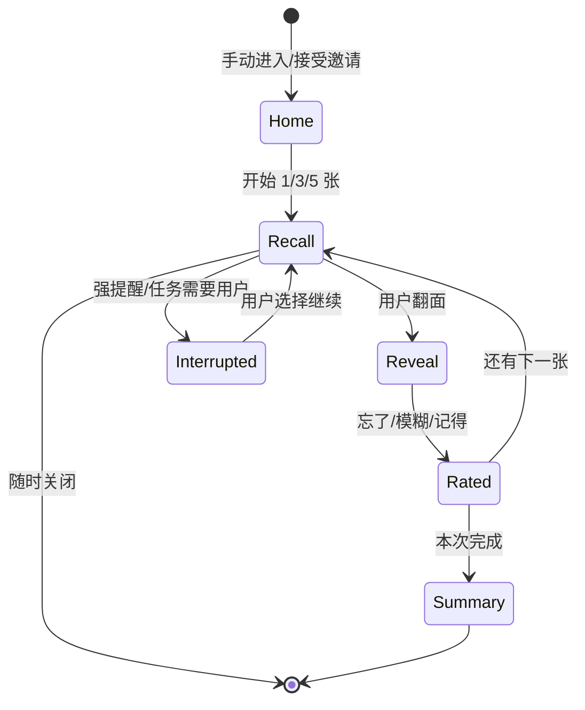
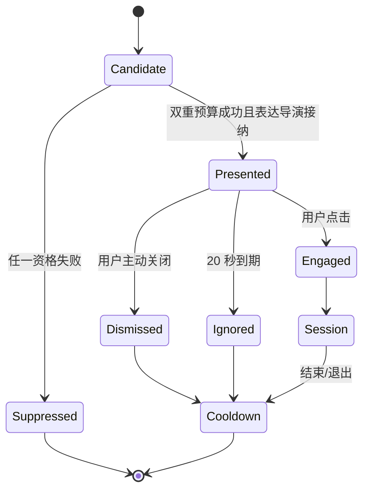

# 圆圆考研英语碎片学习：最终产品方案、专家评审稿与 Vibecoding 开发合同

状态：一轮专家评审后修订，已形成可运行开发预览，待二轮确认，不构成发布承诺<br>
版本：Review Draft 1.2（开发实现回填版）<br>
日期：2026-08-10<br>
评审基线：圆圆提醒 v1.4.0，提交 `12f3a58e65ffb857a98f3ccbdff2c0c5406e7bde`<br>
目标候选：v1.4.0 之后的独立学习实验分支，内部代号 `Learning Preview`；通过用户试验和发布门后再决定公开版本号<br>

> 本文把“英语学习”定义为离线学习模块，不是现有路线图中“圆圆学习用户技能”的 AI 学习卡。本文不修改 `V1.4.0_SCOPE_FREEZE_2026-08-10.md`，不把学习能力追认为 v1.4.0 已交付功能。

## 0. 专家需要给出的结论

请评审专家分别给出 `通过 / 有条件通过 / 退回`，并明确条件：

1. 是否同意把考研英语学习作为 v1.4.0 之后的独立离线产品模块，而不等待通用 AI、Bridge 或 Provider；
2. 是否同意“手动入口默认开启、自动邀请默认关闭且需用户明确选择”的触发原则；
3. 是否同意圆圆只叼来和守着学习卡，所有文字属于卡片工具，圆圆继续不说人话；
4. 是否同意 MVP 只做英文识义、三档自评和间隔复习，不做例句、听说、拼写、聊天和长课程；
5. 是否同意使用独立 `yuanyuan-learning.sqlite3`，学习故障不得阻断提醒核心；
6. 是否同意自动邀请共用现有主动注意力预算，并服从喝水、事项、活动、任务守望和专注优先级；
7. 是否同意在取得明确词表权利之前，不把社区词表标为“官方考研词表”，必要时先采用用户导入包；
8. 是否认可本文的内容来源、隐私、无障碍、学习效果和防打扰质量门。

任何一项涉及内容再分发权、Windows 自动触发误判或提醒核心回归的结论为“不通过”，均应阻止学习模块进入正式安装包，但不影响 v1.4.0 的既有维护。

### 0.1 一轮专家意见裁决

本版已经完成逐条裁决，不把专家建议自动等同于产品决定：

| 评审意见 | 决定 | 落地方式 |
| --- | --- | --- |
| 当前新词节奏不足以覆盖完整备考词表 | 采纳 | 明确定位为“碎片复习辅助”，不替代主学习渠道；默认仍为 5 个新词，但增加 20/30 的主动可选档 |
| 优先导入用户已有词表/进度 | 调整后采纳 | 阶段 1A 先做通用 CSV/JSON 导入，不承诺直接兼容某个商业应用的私有格式；授权内容包并行推进 |
| 500 词不能按通用高频前 500 选择 | 采纳 | 仅从有权使用的考研真题/等价考试语料中频段产生候选，并增加义项依据字段；没有合法语料时不得声称完成考研选词 |
| 背面增加词族/派生词 | 采纳 | 仅显示经来源与词形校验的最多 3 项，放在翻面后，不增加评分维度 |
| 增加非 streak 正反馈 | 采纳 | 只在学习首页被动展示本周完成量与当前相对稳定量，不推送、不比较、不惩罚中断 |
| 英语一/二共用公共核心 | 采纳 | 内容范围固定标为“公共核心（英一/英二通用）” |
| 小样本研究以组内差值为主要口径 | 采纳 | 写入研究统计合同，禁止用小样本宣传提分 |
| 资格终审、额度消费与展示记录原子化 | 调整后采纳 | 两个独立 SQLite 库不强行做跨库事务；采用单一协调临界区、主库 `BEGIN IMMEDIATE` 原子占额、展示前二次系统状态复核和安全失败 |
| 使用 `SHQueryUserNotificationState` | 采纳 | 作为 Windows 系统通知适宜性主信号，矩形检测作为补充；任何未知或 API 失败均抑制 |
| 自动邀请通过率低于 1% 就放宽条件 | 部分采纳 | 增加候选机会转化与抑制原因度量；低于 1% 阻止进入用户试验并触发人工复盘，但不得自动放宽安静、锁屏、提醒等安全条件 |
| v12 先确认是否需要重建表 | 已核实并采纳 | 当前表确有 `CHECK (kind IN ('focus_finished', 'reunion'))`；v12 必须按现有 v9→v10 模式重建表并恢复索引 |
| 学习库启用 WAL、`busy_timeout` | 采纳 | 写入数据库合同与故障测试，实际超时时长由刺探冻结 |
| `card_id` 使用稳定哈希 | 调整后采纳 | 复用内容管线已有 SHA-256，不新增 BLAKE3 依赖；输入为稳定 pack namespace 与规范化 headword，不含 pack 版本 |
| 优先 `fsrs-rs` | 不按原排序采纳 | 两个候选都属于 Open Spaced Repetition；其官方说明反而建议纯调度使用 `rs-fsrs`。继续以向量一致性、运行依赖、体积和维护证据决策 |
| JSON + CSV 双格式导出 | 采纳 | JSON 保留完整结构，CSV 提供用户可直接打开的表格视图 |
| `review_logs` 永久保留 | 采纳 | 在用户主动清空/删除前保留；邀请原始事件仍最多保留 30 天 |
| 首轮自动邀请只开专注结束 | 采纳 | 阶段 2A 仅 `focus_finished`；定时时段延后到阶段 2B，避免试验归因混杂 |
| 3 秒关闭率阈值放宽为 35% | 采纳为暂定值 | 它只作为打扰诊断指标，不解释为学习价值或接受度 |
| 完全取消人工内容复核 | 不采纳 | 自动化负责选择、富化和 100% 规则校验；正式内置教学包仍需具名权利确认与语言质量门 |

### 0.2 当前开发实现与评审边界

截至 2026-08-10，方案已在独立实验分支形成可运行的 Learning Preview。实现仍受 Cargo `learning` feature 和前端 `VITE_FEATURE_LEARNING=1` 双重构建门保护，默认 v1.4.0 构建不注册学习命令、不创建学习库、不包含学习页面或学习内容。

| 工作包 | 当前状态 | 已实现结果或剩余条件 |
| --- | --- | --- |
| LRN-000 | 已实现 | 默认关闭边界、运行能力快照、前后端构建门、开启/关闭 bundle 验证 |
| LRN-003 | 代码完成，发布门未关 | `fsrs` 6.6.1、FSRS-6 默认参数、0.9 保持率、三档映射与冻结向量已接入生产评分；仍需外部第二来源、NOTICE/SBOM、体积和冷启动证据 |
| LRN-010 | 核心完成 | 独立学习库 schema v2、外键、WAL、2 秒 busy timeout、迁移/回滚/并发读写/checkpoint/损坏隔离测试；真实只读目录、磁盘满和异常断电仍属 Windows QA |
| LRN-004 / 011 | 已实现 | 通用 CSV、圆圆原生版本化 JSON、preview/confirm、受限解析、单次 token、类型化 IPC、伪造/过期/重放关闭失败 |
| LRN-020 / 021 / 022 | 已实现，人工无障碍门未关 | 手动 1/3/5 卡、主动回忆、词族、三档自评、即时保存、Esc 退出、非语言递卡/收卡、提醒与任务事件抢占 |
| LRN-030 / 031 / 032 / 033 / 034 | 阶段 2A 已实现 | 主库 v12 无内容注意力 claim/补偿；仅专注结束；系统通知适宜性与全屏补充探测；邀请打开/忽略/今日暂停；定时时段保持不可用 |
| LRN-040 / 041 | 已实现 | 来源/许可展示、原生 JSON/CSV 导出、CSV 公式转义、清空/彻底删除、浏览器内存演示与前端回归 |
| LRN-001 / 002 | 未启动发布内容 | 没有取得权利和语言确认，因此仓库不内置或宣称任何考研词包；第一版只接受用户合法导入 |
| LRN-042 | 部分完成 | 自动测试和 360×560、480×760 浏览器视觉/键盘验收完成；真实 Windows DPI、Narrator、强制颜色、锁屏/演示/全屏、提醒延迟与耐久测试待人工执行 |
| LRN-043 / 044 | 未放行 | 正式安装包、SBOM、权利签署、专家验收与用户研究未完成，不得进入稳定版 |

当前实现证据、命令与剩余人工门分别见 `docs/learning/IMPLEMENTATION_STATUS.md`、`docs/learning/QA_MATRIX.md` 和 `docs/learning/CONTENT_SOURCE_REVIEW.md`。本表是开发快照，不替代后续具名专家签署。

## 1. 执行摘要

圆圆考研英语学习的核心不是“桌面背单词弹窗”，而是：

> 用户在工作碎片时间里主动开始，或明确开启低频自动邀请后，由圆圆叼来一张合上的复习卡；用户点击后完成 1—5 张、每次 30—90 秒的主动回忆。圆圆负责陪伴、递卡和收卡，卡片工具负责文字、复习调度和掌握状态。

产品默认完全手动。可选自动模式只展示一张合上的邀请卡，不显示单词、不发系统通知、不抢焦点、不播放声音；忽略后自动收走，不追问、不升级动作。

第一版面向有一定英语基础、在 Windows 上工作的中文知识工作者，内容聚焦考研英语公共核心词汇。一次学习的最小闭环是：

产品定位是**主学习渠道之外的碎片复习辅助**：圆圆负责把用户已有学习材料或经授权内容中的到期词轻量递过来，不承诺仅靠每日少量碎片完成约 5,500 词的首次学习。用户需要完整覆盖考研词汇时，应继续使用课程、纸书或主背词工具；圆圆优先承接复习、保持和低负担补充。

```text
手动进入或接受邀请
  → 到期复习优先
  → 看英文并主动回忆核心中文义
  → 翻面查看答案
  → 选择“忘了 / 模糊 / 记得”
  → 本地计算下次复习
  → 每张卡即时保存，随时退出
```

第一版不依赖网络、账号、AI Provider、Codex、Claude Code、Node.js、Rust 或 Python 运行环境。构建期可以使用现有 Node/Rust 工具链生成内容包，安装后的产品不得依赖它们。

## 2. 当前项目已经建设的情况

### 2.1 当前产品与技术底座

当前仓库是一款 Windows 10/11 x64 桌面宠物与提醒应用：

- 前端：React 19、TypeScript、Vite；
- 桌面容器：Tauri 2；
- 后端：Rust；
- 数据：`rusqlite` + bundled SQLite；
- 窗口：透明置顶宠物窗 `220×240`，可缩放面板窗默认 `390×620`；
- 运行边界：完全离线、无账号、无遥测、无云依赖；
- 数据目录：`%LOCALAPPDATA%\com.yuanyuan.reminder\`；
- 稳定版主数据库：`yuanyuan-reminder.sqlite3`，schema v11；Learning Preview 分支通过事务 migration v12 增加无内容学习邀请注意力 kind；
- 代码许可证：MIT；圆圆素材使用独立素材许可。

当前前端已经形成三层结构：

```text
src/pet/                 宠物状态、动画、交互与道具表达
src/panel/               今日、任务守望、专注、照料、历史、管理、设置
src/lib/backend.ts       Tauri IPC 与浏览器演示降级
```

当前后端已经形成：

```text
src-tauri/src/scheduler.rs             15 秒调度循环、提醒领取、专注结束、活动与睡眠
src-tauri/src/repository.rs            主库、迁移、提醒/历史/设置/注意力预算
src-tauri/src/companion_core.rs        确定性表达导演与固定优先级
src-tauri/src/companion_runtime.rs     表达信号、主动仪式、抢占与恢复
src-tauri/src/windows.rs               Windows 窗口、锁屏等本机能力
src-tauri/src/commands.rs              Tauri 命令边界
```

### 2.2 v1.4.0 已交付候选能力

| 已建设能力 | 当前状态 | 对学习模块的可复用价值 |
| --- | --- | --- |
| 一次性、间隔、每日、自选星期提醒 | 已实现 | 复用调度思想，不复用提醒弹窗形态 |
| 喝水、工作、活动确定性优先级 | 已实现 | 学习必须作为更低优先级信号接入 |
| 5/10/30/60 分钟稍后、完成、跳过、历史 | 已实现 | 可复用事务、事件与测试方法 |
| 专注和离屏休息 | 已实现 | 可作为学习邀请触发源与屏蔽条件 |
| Windows 最后输入时间 | 已在活动/睡眠调度使用 | 可用于实验性“工作空隙”检测，不读取输入内容 |
| 安静时段、一键暂停、自动睡眠 | 已实现 | 自动学习邀请必须服从这些状态 |
| 本地 SQLite、迁移、备份、恢复 | 已实现 | 可复用迁移和故障注入方法；学习数据建议独立存储 |
| 非语言宠物、道具标签、减少动态 | 已实现 | 可新增“学习卡”道具，不新增猫咪对白 |
| 表达导演、状态抢占与恢复 | 已实现 | 可添加学习邀请/学习中信号，避免另建状态机 |
| 主动注意力预算 | 已实现 | 日常档 3 次/日且 1 次/小时，亲近档 6 次/日且 2 次/小时，学习邀请必须共用 |
| 用户主动基础陪伴 | 已实现 | 学习开始时需要正确收尾其他互动 |
| 浏览器演示降级和 Vitest | 已实现 | 可在不写真实数据时验证学习 UI |
| Windows NSIS、SBOM、第三方许可归档 | 已实现 | 新算法和内容包必须进入同一发布许可门 |

当前道具层已经支持小电脑、铃铛、任务牌、任务篮、提词器和系统卡，且可以把道具变成可键盘点击的入口。学习卡应扩展这一稳定词汇，而不是创建聊天气泡。

### 2.3 当前质量与发布状态

冻结证据记录：

- `npm.cmd run verify` 已通过；
- `cargo test --workspace` 已通过；534 项已登记测试中 3 项因权限或真实交互式 Windows 条件按设计忽略；
- `npm.cmd run tauri build` 已通过；
- 35 个宠物动画、3 个 WebP 图集通过校验；
- 当前发布预检为 13 项通过、14 项待完成、0 项失败；
- `readyForRelease=false`，正式发布仍为 NO-GO；
- 当前候选尚缺发布主体/渠道、签名、RFC 3161、SmartScreen/安全软件、完整无障碍人工矩阵、真实旧库/中断/重启等外部门。

因此：当前项目是“源码可验证、可构建的 v1.4.0 离线稳定候选”，不是“已经获得正式发布批准的产品”。学习方案必须建立自己的范围决定与质量门，不能借用 v1.4.0 的自动证据宣称学习功能已通过。

### 2.4 已存在但不属于 v1.4.0 承诺的源码

仓库中已经存在 Bridge、AI 隔离进程、连接器、任务守望、记忆/支持实验、诊断和协议源码，但 v1.4.0 安装边界明确排除：

- `YuanyuanBridge.exe`、`YuanyuanAI.exe` 和 QA 夹具；
- 真实 Codex/Claude Code Hook；
- 真实 Provider、模型对话、自动工具执行；
- 正式记忆中心与 Support Box；
- 返回任务工具的正式动作。

考研英语 MVP 不应依赖这些原型。即使 AI/Bridge 永久关闭，学习与提醒核心也必须完整可用。

## 3. 用户、场景与产品边界

### 3.1 目标用户

- 中文母语；
- 使用 Windows 进行知识工作或学习；
- 已有基础英语能力；
- 准备考研英语一或英语二；
- 不希望打开完整学习应用，但愿意在 30—90 秒空隙复习；
- 重视离线、隐私、低打扰和可随时退出。

第一版词汇层先采用英语一/英语二公共核心，不在没有证据时声称两套词表具有精确差异。题型差异化属于后续阅读、完形、翻译和写作模块，不进入本 MVP。

### 3.2 适合的碎片时间

- 用户主动点击圆圆、托盘或面板里的“英语学习”；
- 一次专注自然结束，且没有更高优先级事项；
- 用户设置的学习时段内，系统检测到短暂、非离开的操作空隙；
- 后台任务仍在运行，但没有 `waiting_user`、完成、失败或状态异常；
- 用户明确接受圆圆叼来的合上卡片。

### 3.3 绝不能自动打扰

- 专注或离屏休息仍在进行；
- 强饮水、工作事项、活动提醒待处理；
- 外部任务等待用户、完成、失败、停住或状态未知等待呈现；
- 一键暂停、安静时段、自动睡眠、锁屏或系统状态无法确认；
- 全屏应用；
- 用户刚忽略、关闭或选择“今天不再邀请”；
- 主动注意力额度或学习专属额度已耗尽；
- 没有到期复习，仅为了提高活跃度；
- 内容包、学习数据库或资格判断出现错误。

失败时必须安静降级。无法确认“现在适合”就等同于“不适合”。

### 3.4 明确非目标

- 不做普通背单词通知弹窗；
- 不做圆圆聊天或语言教师；
- 不做完整考研课程平台；
- 不做连续打卡、排行榜、惩罚、内疚或“圆圆会失望”；
- 不读取文档、剪贴板、键盘内容、浏览记录、窗口标题和会议内容；
- 不自动生成并发布未经验证的教学内容；
- 不在第一版使用麦克风、摄像头、云同步或账号；
- 不把自评结果包装成考试分数或真实掌握证明。

## 4. 最终产品形态

### 4.1 推荐形态：圆圆叼来的微复习卡

圆圆承担三种角色：

1. **递卡者**：把合上的卡片带到桌面；
2. **陪伴者**：用户回忆时安静守在卡边；
3. **节奏守门者**：高优先级提醒到来时收起卡片，事后允许用户继续。

圆圆不承担：讲课、对话、评判、打分、催促和监督。

文本规则：

- 单词、音标、释义、按钮、来源和许可信息属于学习卡工具；
- 圆圆没有第一人称台词；
- 自适应/始终标签可以显示中性短标签“复习”，但不显示“我来考考你”；
- 屏幕阅读器名称可以说明“圆圆叼来一张可选复习卡”，不把宠物拟人化为教师。

### 4.2 两个界面层

**宠物窗邀请层**：只显示合上的卡片道具，点击后打开面板学习页；无单词正文、无声音、无系统通知、无抢焦点。

**面板学习层**：承载学习正文、翻面、自评、设置、来源说明和本地统计。复用现有面板，不创建新的常驻窗口。

### 4.3 最小学习闭环



每张卡完成即提交事务。被打断时：

- 已评分卡保持完成；
- 尚未评分卡不产生复习记录，仍保持到期；
- 不保存用户脑中答案，也不要求输入自由文本；
- 恢复时回到当前未评分卡或重新取队列。

### 4.4 MVP 卡片内容

正面：

- 英文 headword；
- 可选音标；
- “翻面”按钮和键盘快捷键。

背面：

- 词性；
- 1—2 个面向考研阅读的核心中文义；
- 可选词族/派生词提示，最多 3 项，仅使用经来源与词形校验的数据；
- `忘了 / 模糊 / 记得` 三档自评。

词族只在翻面后出现，例如 `decide → decision, decisive, indecisive`；它不提供额外评分按钮，不自动扩展为独立待复习卡。无法确认词形关系或来源权利时整行省略。

第一版不显示例句、音频、词根故事、联想图、AI 解释和复杂同义辨析。原因是它们会显著扩大内容权利、正确性、体积和人工复核范围。

### 4.5 内容选择顺序

1. 到期复习；
2. 逾期时间更长、预测保持率更低的卡；
3. 当日仍允许的新词；
4. 同分时按稳定 `card_id` 排序，保证确定性测试。

自动邀请只在存在到期复习时出现，默认不为新词发起邀请。手动学习可以在复习完成后加入新词。

### 4.6 掌握度语义

用户可见状态只使用：

- `初见`；
- `巩固中`；
- `相对稳定`。

内部可以保存 FSRS 的稳定度、难度、到期时间和复习记录，但第一版不把算法小数展示为“掌握 87%”。自评是调度输入，不是客观测验。任何“学习有效”主张必须来自独立延迟测验，而不是自评点击率。

### 4.7 退出与情绪安全

- 每张卡都可以关闭；
- 不显示连续天数损失、逾期红色债务或“还有很多没学”；
- 忘了只影响复习间隔，圆圆不失望；
- 记得后圆圆可以轻微竖尾或收卡，减少动态模式保持静态；
- 自动邀请被忽略后不重复、不叫得更响；
- 用户可以“一直手动”“今天不再邀请”或彻底关闭学习模块。

### 4.8 非连续打卡式能力反馈

学习首页可以被动展示两个本地事实：`本周完成 X 张复习`、`当前 Y 个词处于相对稳定`。不得改写为“连续学习 X 天”“超过其他用户”或“还有 X 个逾期债务”，不得据此触发通知。为避免虚假因果，不使用“圆圆让你掌握了 Y 个词”一类表述。

## 5. 手动与自动触发最终合同

### 5.1 用户设置模型

顶层模式只有两种：

- `manual_only`：默认值；
- `automatic_opt_in`：用户明确开启后才允许任何自动邀请。

自动模式下提供来源开关：

- `focus_finished`：默认开启；
- `scheduled_windows`：阶段 2B 才开放，用户配置 0—3 个时间窗口；
- `work_gap_experimental`：默认关闭，仅实验版本可见。

默认参数：

| 参数 | 默认值 | 可调范围 |
| --- | --- | --- |
| 每次卡数 | 3 | 1 / 3 / 5 |
| 每日新词上限 | 5 | 0 / 5 / 10 / 20 / 30 |
| 每日自动邀请上限 | 2 | 1 / 2 / 3 |
| 自动邀请最短间隔 | 120 分钟 | 60 / 120 / 240 分钟 |
| 邀请可见时间 | 20 秒 | 第一版固定 |
| 定时窗口宽度 | 30 分钟 | 第一版固定 |
| 自动邀请内容 | 仅到期复习 | 第一版固定 |

20/30 档只影响用户主动开始的会话，不让自动邀请塞入新词。用户首次选择高于 10 时只显示一次中性说明“较多新词会增加后续到期复习量”，不使用警告色、倒计时或劝退文案。任何固定“每天会产生 60—100 张复习”的说法都必须先由冻结参数下的模拟证据支持。

全局陪伴强度仍具有更高约束：`quiet` 档不出现学习自动邀请；`everyday/close` 仍受现有 3/6 次每日预算和 1/2 次每小时预算限制。学习专属上限和全局上限取更小值。

### 5.2 触发源

#### A. 专注结束

- 复用现有专注完成事件；
- 学习邀请与专注结束仪式合并为一次主动表达，不连续播放两个仪式；
- 若有任务摘要、提醒或活动待呈现，学习放弃本次机会；
- 不做“结束后补发”，避免延迟打扰。

#### B. 用户设定时间窗口

- 不进入阶段 2A；只有专注结束邀请的防打扰与归因数据通过后，才在阶段 2B 开放；
- 调度循环只在窗口内检查；
- 要求最后输入空闲时间在 45—300 秒之间，避免连续输入和长时间离开；
- 同一窗口每天最多成功展示一次；
- 被高优先级状态抑制时，可在窗口内重新评估，但只有实际展示才消耗额度；
- 窗口结束后不追补。

#### C. 工作空隙实验

不进入首个正式 MVP，只在开发/用户研究功能门下验证：

- 本机连续活跃至少 25 分钟；
- 出现 45—180 秒短空隙；
- 只读取 `GetLastInputInfo` 得到的秒数；
- 不读取按键、鼠标位置、进程名、窗口标题或工作内容；
- 误触率未达到评测阈值前不得默认开放。

### 5.3 自动资格判断

建议实现为单一纯函数 `evaluate_learning_invitation(context) -> Decision`，返回 `eligible` 或一个固定抑制原因。所有触发源必须共用，不允许各自复制条件。

资格条件：

```text
learning_available
AND learning_mode == automatic_opt_in
AND due_review_count > 0
AND source_enabled
AND source_specific_timing_is_valid
AND !focus_or_break_active
AND !quiet_time
AND !one_click_pause
AND !basic_support_active
AND !sleeping_or_session_unknown
AND !fullscreen_or_fullscreen_unknown
AND no_pending_local_reminder
AND no_external_task_attention_state
AND global_attention_budget_available
AND learning_daily_budget_available
AND learning_cooldown_elapsed
AND !ignored_for_today
AND content_and_database_healthy
```

固定抑制原因用于本地统计和测试，例如：`focus_active`、`quiet_time`、`reminder_pending`、`task_attention_pending`、`fullscreen`、`fullscreen_unknown`、`no_due_reviews`、`cooldown`、`daily_budget`、`today_paused`、`learning_unavailable`。不得记录窗口标题、任务正文或用户内容。

### 5.4 全屏和锁屏边界

当前项目已有最后输入时间，但没有生产级全屏/锁屏资格探测。实现自动模式前必须补齐：

- Windows 主信号使用 `SHQueryUserNotificationState`；只有 `QUNS_ACCEPTS_NOTIFICATIONS` 才能继续资格判断，`QUNS_NOT_PRESENT`、`QUNS_BUSY`、`QUNS_RUNNING_D3D_FULL_SCREEN`、`QUNS_PRESENTATION_MODE`、`QUNS_QUIET_TIME`、其他值和 HRESULT 失败全部抑制；
- 前台窗口矩形与所在显示器区域比较只作为补充信号，用于覆盖系统 API 未报告的无边框全屏；不读取或保存进程名、窗口标题；
- 任一探测失败返回 `unknown`，自动邀请关闭失败；
- 长时间空闲、自动睡眠或会话不可交互时不展示；
- 不声称识别具体会议软件；系统通知状态、安静时段、暂停和全屏信号共同构成会议/演示防打扰边界；
- 不为了“智能触发”申请辅助功能、键盘记录、屏幕捕获或管理员权限。

### 5.5 邀请状态机



`Presented` 之前不得暴露具体单词。只有 `Presented` 成功才应计入主动预算；数据库失败、导演拒绝或资格漂移不得产生半展示。

### 5.6 原子终审与 TOCTOU 合同

纯函数负责可解释的预判，但不能直接授权 UI。所有触发源最终都必须调用唯一协调器 `try_present_learning_invitation`：

1. 事务外构造候选快照并运行纯函数，用于早期退出和固定抑制原因；
2. 进入单一运行时临界区，重新读取学习开关、今日暂停、高优先级队列和导演可接纳状态；
3. 再次调用 `SHQueryUserNotificationState` 与矩形补充探测；
4. 主库以 `BEGIN IMMEDIATE` 重新计算全局额度，并插入 `learning_invitation` 占额记录，返回唯一 claim ID；
5. 学习库写入不含单词的 invitation 记录后，立即发出合卡展示事件；
6. 任一步失败都不展示；若主库已经占额但展示尚未发生，按 claim ID 做幂等补偿释放。进程在补偿前崩溃时允许保守损失一次额度，但绝不允许无额度展示；
7. 展示后的接受、忽略和撤回进入学习库独立事务，不反向阻断提醒主库。

不采用跨 `yuanyuan-reminder.sqlite3` 与 `yuanyuan-learning.sqlite3` 的 `ATTACH` 事务：跨库写会扩大锁与损坏传播面，违背学习故障不得阻断提醒核心的边界。资格测试必须包含“预判后强提醒到达、设置变化、系统转入演示、导演拒绝、学习库写失败、展示事件失败、进程中断”等状态漂移夹具。

## 6. 与现有优先级共存

### 6.1 建议表达优先级

在现有导演中增加两个信号：

- `LearningSession`：用户已经主动学习，属于用户交互，建议 rank 330；
- `LearningInvitation`：自动邀请，建议 rank 230。

保持从高到低：

1. 强饮水；
2. 到期工作事项；
3. 外部任务等待用户；
4. 基础陪伴/久坐活动（遵守现有实现与后续统一）；
5. 外部任务失败、完成、取消摘要；
6. 用户主动输入与正在进行的学习；
7. 专注结束、重逢等既有低频仪式；
8. 自动学习邀请；
9. 后台任务守望；
10. 睡眠与随机动作。

专家评审需特别检查当前文档优先级与代码中 `BasicSupport` rank 的差异；学习功能不得顺手改变既有优先级，若要统一应另建范围任务。

### 6.2 学习中的抢占

| 事件 | 行为 |
| --- | --- |
| 强饮水、工作事项、`waiting_user` | 立即收起学习道具，保存已评分卡，展示高优先级事件 |
| 活动提醒、普通任务终态 | 当前卡最多完成到评分；最迟 90 秒后切换 |
| 后台任务守望 | 不打断 |
| 用户主动关闭 | 立即退出并收卡 |
| 提醒结束 | 只显示“继续复习”入口，不自动展开答案 |

所有抢占测试必须验证：先前专注/睡眠/任务守望状态能恢复，学习卡、猫条、逗猫棒、抚摸区和球不会残留或叠加。

## 7. 本地数据、算法和隐私

### 7.1 独立数据库

建议新增：

```text
%LOCALAPPDATA%\com.yuanyuan.reminder\learning-data\yuanyuan-learning.sqlite3
```

理由：

- 不把词库和高频复习日志写入提醒主库；
- 学习库初始化、迁移或损坏不得阻断提醒、喝水和专注；
- 可独立删除、导出、重建内容索引；
- 未来内容包更新不会扩大 v1.4 主库备份；
- 与 `yuanyuan-ai.sqlite3` 分离，避免把离线学习误认为 AI 数据。

学习库打开失败时：隐藏学习入口、取消自动资格、记录无正文错误日志，继续启动提醒核心。禁止在主库中写“学习失败哨兵”造成耦合。

学习库连接初始化必须显式启用 `foreign_keys=ON`，优先采用 WAL，并设置非零 `busy_timeout`；具体同步级别和超时时长由 LRN-010 在真实调度并发夹具中冻结。WAL、SHM、checkpoint、只读目录、磁盘满、异常退出和损坏文件都必须进入故障测试，不能把 WAL 当作无需验证的性能开关。

### 7.2 建议 schema v1

| 表 | 最小字段与用途 |
| --- | --- |
| `learning_schema_meta` | schema 版本、创建/迁移时间 |
| `learning_settings` | 模式、触发源、卡数、新词上限、窗口、今日暂停 |
| `content_sources` | 来源 ID、版本/commit、URL、许可证、NOTICE、内容哈希 |
| `content_packs` | 稳定 namespace、pack ID、版本、标题、考试范围声明、状态、哈希；首包范围固定为“公共核心（英一/英二通用）” |
| `learning_cards` | 稳定 card ID、pack、headword、phonetic、POS、核心中文义、词族、考研频率带、核心义选择依据、来源引用、内容哈希 |
| `card_schedule` | card ID、状态、due、stability、difficulty、reps、lapses、last_review |
| `review_logs` | review ID、card ID、rating、reviewed_at、elapsed/scheduled days、session ID |
| `learning_sessions` | 入口来源、计划/完成数、开始/结束、退出/抢占原因 |
| `learning_invitation_events` | 触发源、展示/接受/忽略/关闭/抑制、固定原因、时间；不含单词和窗口内容 |

外键、CHECK、唯一约束和索引必须写入迁移；迁移使用 `BEGIN IMMEDIATE`，失败完整回滚。`card_id` 在内容包版本之间保持稳定，禁止按数组下标生成。

`card_id` 正向规则冻结为完整小写 SHA-256 十六进制：

```text
sha256(stable_pack_namespace + "\0" + normalize_headword(headword))
```

`stable_pack_namespace` 不含内容包版本；英文 headword 先做 Unicode NFKC、首尾空白清理、ASCII 小写和连字符/撇号规范化。管线必须发布规范化测试向量；同一 namespace 内规范化后冲突直接阻断构建。选择 SHA-256 是为了复用 manifest 已需要的哈希能力，不为 ID 再增加 BLAKE3 供应链依赖。

### 7.3 间隔复习算法

并列评估 [rs-fsrs](https://github.com/open-spaced-repetition/rs-fsrs) 的 Rust scheduler-only 实现（MIT）和 [fsrs-rs](https://github.com/open-spaced-repetition/fsrs-rs)（BSD-3-Clause）。两者均来自 Open Spaced Repetition 组织；其 `fsrs-rs` 项目说明建议“只做调度”时使用 `rs-fsrs`，需要本地参数优化时再考虑 `fsrs-rs`。第一版明确不训练个性化参数，因此不能仅以仓库规模决定选型。

正式加入依赖前必须完成独立技术刺探：

- 许可证和 NOTICE 进入现有第三方归档；
- 固定版本和 Cargo.lock；
- 二进制体积与冷启动增量；
- `忘了/模糊/记得` 到算法 rating 的冻结映射；
- 新卡、跨日、时钟回拨、夏令时和长期离线测试；
- 已知向量和升级兼容；
- 最近发布、维护响应、未解决缺陷以及与冻结的 Anki/FSRS 参考调度向量一致性；
- 第一版不训练个性化参数，不引入张量或优化器依赖。

建议映射：`忘了 = Again`、`模糊 = Hard`、`记得 = Good`。第一版不暴露 `Easy`，减少选择负担。

### 7.4 数据生命周期

- 所有学习数据只在本机；
- 默认无遥测、无上传；
- 用户可导出 pack 信息、学习设置、卡片状态和复习日志；完整结构使用 JSON，面向表格查看的卡片状态与复习日志同时提供 CSV；
- 用户可只清空学习进度，或彻底删除学习库；
- 原始邀请事件保留最多 30 天，之后只保留本地聚合计数；
- `review_logs` 在用户主动清空进度或彻底删除学习数据前保留，不应用邀请事件的 30 天期限；
- 清空/删除不影响提醒主库；
- 学习备份不自动混入 v1.4 提醒备份。第一版先提供显式导出；设置页可在用户完成过至少一次导出后被动显示“距上次导出 N 天”，不得主动通知；自动学习备份需单独评审。

## 8. 词库、开源项目与内容治理

### 8.1 可学习的开源项目

| 项目/数据 | 可借鉴内容 | 许可与决定 |
| --- | --- | --- |
| [Qwerty Learner](https://github.com/RealKai42/qwerty-learner) | 键盘工作者、考研词库、默写和速度反馈 | GPL-3.0；词库来自社区/爬取来源。只做产品参考，不复制代码或直接打包词库 |
| [Anki](https://github.com/ankitects/anki) | 卡片状态、复习日志、导入导出、撤销 | 主体 AGPL-3.0。只学习模式，不复制实现 |
| [rs-fsrs](https://github.com/open-spaced-repetition/rs-fsrs) | Rust 间隔调度 | MIT；候选依赖，需完成体积和向量刺探 |
| [ECDICT](https://github.com/skywind3000/ECDICT) | 中英文释义、音标、词形、词频、考试标签 | 仓库标示 MIT，但历史来源混合；可作候选富化源，必须做来源/法律复核和抽样质检 |
| [Open English WordNet](https://github.com/globalwordnet/english-wordnet) | 英文词义、词性、同义关系校验 | CC BY 4.0；适合作自动校验，不解决中文义和考研范围 |
| [Tatoeba](https://en.wiki.tatoeba.org/articles/show/using-the-tatoeba-corpus) | 中英例句候选 | 文本通常 CC BY 2.0 FR，需署名；官方也建议自动处理加人工复核，故 MVP 排除例句 |
| [KyleBing/english-vocabulary](https://github.com/KyleBing/english-vocabulary) | 有 9,602 考研词条，可用于发现候选 | 仓库未展示明确 LICENSE，不得进入安装包 |

### 8.2 当前未解决的内容事实

本轮没有发现一个同时满足以下四项的现成数据包：

1. 当前考研范围；
2. 机器可读；
3. 来源权威；
4. 明确允许重新分发。

教育考试院公开考试大纲是范围权威，但公开可访问不等于允许把附录词表重新打包。社区仓库可作为线索，不等于开放数据许可。

### 8.3 推荐内容路线

路线 B（阶段 1A 首选）：第一版先提供学习引擎和 CSV/JSON 导入，用户导入自己合法取得的词表或从主学习渠道导出的清单；产品不内置、不上传，也不把用户内容改标为“官方考研词包”。通用 CSV 可接受 `headword`、用户自有释义和可选 `progress_hint`，但只把提示确定性映射为初始队列，不伪装成对商业应用算法进度的精确迁移；圆圆原生版本化 JSON 才允许完整恢复调度状态。

路线 A（并行长期路线）：取得当前考研种子词表及用于选词/义项分析的语料权利，再用开放词典富化，形成可再分发的公共核心包。取得授权后仍须通过考试语言质量门。

路线 C（拒绝）：直接复制 Qwerty、KyleBing、商业词典或来历不明的 GitHub 数据并随 MIT 安装包发布。

第一版不实现针对 Anki、百词斩、墨墨、不背单词等具体产品的私有格式连接器；只有对方提供稳定导出格式和兼容许可后，才能另立任务。导入文件必须有大小、行数、字段长度、编码、重复和公式注入检查，CSV 导出中以 `= + - @` 开头的用户字段必须转义。

### 8.4 自动内容生产管线

目标是让机器完成候选选择、富化和规则校验，把人工从“手工造词表”缩减为权利签字、语义确认和异常处理；正式内置教学包不接受零人工责任：

```text
有权使用的考研种子词表
  → 规范化 headword / lemma / 大小写 / 连字符
  → 与有权使用的考研真题或等价考试语料对齐
  → 从约第 1,500—4,000 位中频带分层产生试验候选，避免高频天花板效应
  → 去重并按 stable namespace + normalized headword 生成 SHA-256 card_id
  → ECDICT 候选音标、词性、中文义、词形、词频
  → Open English WordNet 交叉验证词形和词性
  → 按考试语料中的义项分布自动提出 1—2 个核心义与最多 3 个词族
  → 写入 sense_basis：语料/编辑来源、结构化频次或人工决定；不携带无权再分发的真题原句
  → 100% schema、空值、长度、字符、重复、来源和许可证检查
  → 具名语言专家确认试验包全部 headword、核心义和 sense_basis；辅字段采用全异常 + 词性/频率带分层抽检
  → 生成不可变内容包、manifest、NOTICE、SHA-256
```

建议只把最终 500/5,500 词子集打包，不随安装包携带 ECDICT 全库。

约第 1,500—4,000 位只是待验证的候选带，不是脱离语料即可执行的魔法数字。LRN-001 必须冻结语料统计单位、lemma 归并、年份范围、英语一/二覆盖、熟词僻义处理和目标用户难度筛查方法。没有合法考试语料时，构建管线只能处理用户导入或标为通用英语试验数据，不能把 ECDICT 默认义项顺序当作考研核心义。

建议自动质量门：

- card ID 重复：0；
- headword 空值：0；
- 核心中文义空值：0；
- 来源/许可证/内容哈希覆盖：100%；
- 未通过词形或词性校验的条目：全部进入异常队列，不自动发布；
- HTML、控制字符、超长字段和非预期脚本字符：0；
- 试验包语言门目标为实质错误率低于 1%，抽样必须覆盖全部词性与频率分层；统计口径、样本量和置信界限由语言/评测专家在 LRN-001 冻结，不能用十几个样本证明达标；
- 面向用户内置的首个 500 词包，其 headword、核心义与 sense_basis 必须 100% 具名确认。自动化负责提出选择并减少劳动，不代替教学内容责任。

完全零人工复核不适合作为正式教学内容的质量承诺。若业务坚持零复核，只能采用“用户自行导入、不由产品分发内容”的边界。

## 9. 技术架构与接口合同

### 9.1 模块边界

建议新增：

```text
src/learning/
  LearningView.tsx
  LearningCard.tsx
  learningPresentation.ts
  *.test.tsx

src-tauri/src/learning/
  mod.rs
  models.rs
  repository.rs
  scheduler_adapter.rs
  invitation.rs
  content_pack.rs
  migrations/001_initial.sql
```

共享文件只做薄接线：

- `src/types.ts`：新增版本化 DTO；
- `src/lib/backend.ts`：新增 IPC 和浏览器演示实现；
- `src/panel/TaskPanel.tsx`：新增 `learning` route；后续应考虑把超大单文件拆分，学习任务本身不顺手重构全部面板；
- `src/pet/CompanionPropStage.tsx`：新增 `learning_card`；
- `src-tauri/src/commands.rs`、`lib.rs`、`state.rs`：命令和状态薄接线；
- `src-tauri/src/companion_core.rs`、`companion_runtime.rs`：新增两个学习信号；
- `src-tauri/src/scheduler.rs`：只调用统一邀请资格引擎。

### 9.2 功能门

学习代码开发期必须受编译/能力门保护：

- Rust `learning` feature 未启用时，不注册学习命令、不打开学习库；
- 前端使用构建期 `VITE_FEATURE_LEARNING=0/1` 隔离学习 route 和资源，关闭时不得把学习页面或词包打入 `dist`；
- 前端从后端能力快照判断 `learning.available`，不能仅靠可伪造的查询参数；
- v1.4.0 发布边界脚本继续证明安装包无学习内容包和学习命令；
- 专家批准新的版本范围后，才能为新版本开启正式门；
- 学习门关闭或学习库失败时，提醒/喝水/专注测试结果必须与当前基线一致。

### 9.3 建议 DTO

```ts
type LearningMode = "manual_only" | "automatic_opt_in";
type LearningRating = "again" | "hard" | "good";
type LearningEntrySource =
  | "manual"
  | "focus_finished"
  | "scheduled_window"
  | "work_gap_experimental";

interface LearningCapabilities {
  available: boolean;
  contentPackReady: boolean;
  autoInvitationAvailable: boolean;
  failureReason: "disabled" | "database" | "content" | null;
}

interface LearningHomeSnapshot {
  schemaVersion: 1;
  capabilities: LearningCapabilities;
  dueCount: number;
  newAvailableCount: number;
  stableCount: number;
  settings: LearningSettings;
  activeSession: LearningSessionSnapshot | null;
}

interface LearningCardDto {
  cardId: string;
  headword: string;
  phonetic: string | null;
  partOfSpeech: string[];
  meaningsZh: string[];
  wordFamily: string[];
  stage: "new" | "learning" | "stable";
  sourceIds: string[];
}
```

DTO 必须有 `schemaVersion`；未知枚举关闭失败或降级为不可用，不能猜测。

### 9.4 建议命令

| 命令 | 说明 |
| --- | --- |
| `get_learning_home` | 能力、设置、到期数、本地统计、活动会话 |
| `start_manual_learning_session` | 只接受 1/3/5，后端创建会话和确定性队列 |
| `accept_learning_invitation` | 只接受未过期 invitation ID，不由前端自称触发来源 |
| `get_current_learning_card` | 返回当前卡；没有活动会话则失败 |
| `rate_learning_card` | 事务写入复习记录和下一次调度，并推进队列 |
| `finish_learning_session` | 固定退出原因；幂等 |
| `update_learning_settings` | 类型化 patch 和范围校验 |
| `pause_learning_invites_today` | 只暂停学习邀请，不暂停事务提醒 |
| `preview_learning_import` | 只解析受限 CSV/原生 JSON，返回数量、错误与确定性映射预览，不落库 |
| `confirm_learning_import` | 只接受未过期 preview token；事务导入，不直接信任客户端汇总 |
| `export_learning_data` | 类型化选择 JSON/CSV；用户选择路径、原子写入、不覆盖、无自动上传 |
| `delete_learning_progress` | 二次确认，只删除学习库或进度，不碰提醒主库 |

不得提供“运行 SQL”“导入任意数据库”“执行脚本”或自由文本命令。

### 9.5 建议事件

- `learning-invitation-presented`：只含 ID、来源、到期时间、到期卡数量；不含单词；
- `learning-invitation-withdrawn`：超时、抢占、用户关闭；
- `learning-session-updated`：会话数量与当前阶段；
- `learning-data-cleared`：前端刷新；
- 高优先级提醒继续使用现有事件，学习 UI 监听后进入可恢复中断态。

### 9.6 主库 schema v12 最小变化

为了让学习自动邀请真正与专注结束、重逢共用全局预算，建议只在主库增加一个最小迁移：允许 `companion_proactive_attention.kind` 新值 `learning_invitation`。

该迁移：

- 不增加单词、学习进度或内容字段；
- 只记录事件种类、时间和本地日期；
- 已核实现有建表语句包含 `CHECK (kind IN ('focus_finished', 'reunion'))`，不能用 SQLite `ALTER COLUMN` 放宽；
- 必须使用表重建式迁移：重命名旧表、移除旧索引、按含 `learning_invitation` 的 CHECK 创建新表、逐列拷贝并保留 ID、删除旧表、重建两个现有索引、设置 `user_version=12`，全程 `BEGIN IMMEDIATE`；
- 必须完成真实 v11 数据、空表、大量历史行、AUTOINCREMENT、索引 SQL、未知 kind 注入失败、每一步故障回滚、备份恢复和迁移后预算消费测试；
- 只进入 v1.4.0 之后的新版本，不修改 v1.4.0 冻结候选。

LRN-030 同时把预算 API 从布尔值升级为可追踪的 claim ID，并提供只对“尚未展示的同一 claim”生效的幂等补偿接口。它不在主库保存 invitation 文本、card ID、pack ID 或抑制原因。

如果专家拒绝主库变化，则自动学习不能与全局预算形成单一事实源，应退回“仅手动”或先重构通用注意力服务，不能用两套独立计数勉强上线。

## 10. MVP 范围

### 10.1 必须包含

- 学习能力门和故障隔离；
- 独立学习库及 schema v1；
- 用户 CSV/原生 JSON 导入、预览和安全校验；经授权 500 词试验包作为并行可选输入，不是启动手动引擎的前提；
- 手动入口；
- 1/3/5 张英文识义卡；
- 翻面后的可选词族行和非 streak 本地周回顾；
- `忘了/模糊/记得`；
- 到期优先和本地间隔复习；
- 每张卡即时保存、可恢复中断；
- 可选自动邀请阶段 2A：仅专注结束；用户时间窗口延后到阶段 2B；
- 全局和学习双重预算；
- 合上卡片、20 秒超时、忽略不追问；
- 安静/专注/提醒/任务/全屏/睡眠抑制；
- 键盘、屏幕阅读器、减少动态和强制颜色；
- 来源、许可证、导出和删除入口；
- 浏览器演示、Rust 单元、迁移、集成和 Windows 运行验收。

### 10.2 明确排除

- 自动工作空隙默认开放；
- 首个自动试验同时开放专注结束与定时时段；
- 针对具体商业背词应用的私有格式连接器；
- 例句、音频、发音评分、听力、口语；
- 中文提示拼写英文、默写和输入速度；
- 阅读理解、完形、翻译、作文批改；
- AI 解释、AI 造句、聊天和个性化课程；
- 云同步、账号、跨设备；
- 连续打卡、积分、排行榜、宠物饥饿惩罚；
- 读取工作内容生成学习卡；
- 没有明确许可的“完整考研词包”；
- 学习数据自动进入提醒备份或 AI 记忆。

## 11. Vibecoding 智能体开发合同

### 11.1 总体规则

每个 Vibecoding 智能体开始前必须完整阅读：

- `AGENTS.md`；
- `docs/V1.4.0_SCOPE_FREEZE_2026-08-10.md`；
- 本文；
- 任务涉及的现有源码和测试。

共同约束：

- 不在 v1.4.0 稳定分支直接开发；新建 `feat/learning-*` 分支；
- 一个任务包一个分支/PR，提交只包含允许文件；
- 不删除或弱化现有测试和发布阻断；
- 不把网络、AI、账号、遥测引入 MVP；
- 不复制 GPL/AGPL 或无许可证内容；
- 不用自由文本替代类型化协议；
- 不让前端成为复习调度或自动资格的权威；
- 不顺手重构无关模块；
- 共享文件必须按下述依赖顺序串行合入，避免多智能体互相覆盖；
- 任何内容权利、提醒回归、迁移回滚或全屏误判失败都应停止并报告，不得自行降低门槛。

### 11.2 推荐工作流

```text
合同与内容许可
  → 算法/数据库刺探
  → 后端领域与 DTO
  → 手动学习闭环
  → 宠物道具与抢占
  → 自动资格与调度
  → 数据/许可证/无障碍
  → Windows 运行门与用户研究
  → 新版本范围决定
```

### 11.3 任务包

建议依赖和可并行关系：

| 任务 | 前置 | 可并行任务 | 主要文件所有权 |
| --- | --- | --- | --- |
| LRN-000 | 无 | LRN-001、LRN-003 | 构建门、能力边界、范围文档 |
| LRN-001 | 无 | LRN-000、LRN-003 | 内容许可材料，不改产品源码 |
| LRN-002 | LRN-001 | LRN-010 | 内容构建脚本和 manifest |
| LRN-003 | 无 | LRN-000、LRN-001 | 隔离算法适配器/报告 |
| LRN-010 | LRN-000、LRN-003 | LRN-002 | `src-tauri/src/learning/` |
| LRN-004 | LRN-001、LRN-010 | LRN-002 | 版本化导入合同、受限解析器和安全测试 |
| LRN-011 | LRN-004、LRN-010 | 无，涉及共享合同应串行 | Rust/TS DTO、IPC 薄接线 |
| LRN-020 | LRN-011 | LRN-021 | `src/learning/`，TaskPanel 只做接线 |
| LRN-021 | LRN-011 | LRN-020 | 宠物道具与表达文件 |
| LRN-022 | LRN-020、LRN-021 | 无 | 会话、事件、抢占集成 |
| LRN-030 | LRN-000 | LRN-020、LRN-021 | 主库 migration v12、预算 repository |
| LRN-031 | LRN-010、LRN-030 | LRN-033 | 自动资格纯函数 |
| LRN-032 | LRN-031 | LRN-034 | scheduler/专注结束接线 |
| LRN-033 | LRN-031 可先定义接口 | LRN-032 | Windows 无内容探测 |
| LRN-034 | LRN-020、LRN-021、LRN-031 | LRN-032 | 邀请 UI 与 TTL |
| LRN-040 | LRN-004、LRN-010、LRN-020 | LRN-041 | 导入/导出、清空、许可 UI |
| LRN-041 | LRN-020、LRN-034 | LRN-040 | 浏览器演示与前端回归 |
| LRN-042 | LRN-022、LRN-032、LRN-033、LRN-034 | LRN-043 | Windows QA 夹具与验证器 |
| LRN-043 | LRN-001、LRN-002、LRN-003、LRN-040 | LRN-042 | 发布/SBOM/安装边界 |
| LRN-044 | LRN-042、LRN-043 | 无 | 评测证据，不改产品判定代码 |

`src/types.ts`、`src/lib/backend.ts`、`src/panel/TaskPanel.tsx`、`src-tauri/src/commands.rs`、`src-tauri/src/lib.rs`、`src-tauri/src/state.rs` 属于共享接线文件。多个智能体不得同时修改；接口智能体先合入稳定合同，前端和后端实现再基于同一提交继续。

#### LRN-000：范围、功能门与基线

- 目标：建立未编号的 `Learning Preview` 实验范围文件和默认关闭的能力门；
- 允许：新文档、构建 feature、能力快照薄接线、边界测试；
- 禁止：注册正式学习命令、加入内容包；
- 验收：v1.4 默认构建哈希边界不因学习资源变化；`learning.available=false`；提醒核心全测通过；不得在版本号、README 或安装包中宣称 v1.5。

#### LRN-001：内容来源与许可清单

- 目标：冻结种子词表、考试语料、释义、音标、词族的来源权、版本、地区、NOTICE 和允许字段；
- 产物：`learning-content-source-review.md/json`、中频候选带统计口径、lemma/英一英二/熟词僻义规则、`sense_basis` 合同和具名人工/法律决定；
- 禁止：AI 或自动化代替权利签字；
- 验收：每个字段可追溯；无许可来源不能进入构建输入；没有合法考试语料时不能生成标为考研的自动选词/义项；语言错误率目标、分层样本与置信口径已冻结。

#### LRN-002：确定性内容包管线

- 目标：从有权输入生成 500 词试验包、manifest、NOTICE 和 SHA-256；
- 建议目录：`scripts/learning/`、`learning-content/manifest/`；
- 验收：相同输入字节产生相同输出；稳定 SHA-256 card ID 测试向量通过；按考试中频段分层且无高频天花板样本；每卡包含结构化 `sense_basis`；全部自动质量门通过；异常项单独输出；具名语言确认已闭环；安装包只含最终子集。

#### LRN-003：FSRS 技术刺探

- 目标：并列比较 `rs-fsrs`/`fsrs-rs`，冻结 scheduler-only 适配器和 rating 映射；
- 允许：隔离 crate/测试与报告；
- 禁止：直接接入生产命令；
- 验收：冻结的 Anki/FSRS 一致性向量、时钟、最近发布、维护响应、未解决缺陷、二进制体积、许可证、Cargo.lock 和无网络依赖报告；不得因“官方”标签跳过 scheduler-only 适配性比较；专家批准后才选库。

#### LRN-010：学习数据库与领域模型

- 目标：建立独立 repository、schema v1、事务和故障注入；
- 文件：优先限制在 `src-tauri/src/learning/`；
- 验收：`foreign_keys=ON`、WAL、`busy_timeout` 参数有实测依据；新建、迁移、回滚、并发读写、checkpoint、异常退出、残留 WAL/SHM、损坏、只读、磁盘写失败；`review_logs` 保留到主动清空；学习库失败时提醒 repository 仍可用。

#### LRN-004：用户导入合同与受限解析器

- 目标：实现通用 CSV 内容/进度提示导入与圆圆原生版本化 JSON 完整恢复的 preview/confirm 两阶段合同；
- 禁止：猜测商业应用私有格式、导入任意 SQLite、执行公式/宏/脚本、预览时落库；
- 验收：大小/行数/编码/字段/长度/重复/规范化冲突/压缩炸弹/路径/CSV 公式注入测试；`progress_hint` 映射确定且不冒充算法精确迁移；preview token 过期/重放拒绝；事务失败零半导入。

#### LRN-011：版本化 DTO 与命令合同

- 目标：增加 Rust/TypeScript 对称 DTO、IPC 命令和浏览器降级；
- 共享文件：`models/commands/lib/types/backend`，必须在 LRN-010 后串行；
- 验收：未知枚举、越界卡数、伪造 invitation、过期会话、重复评分和重放全部拒绝。

#### LRN-020：手动学习页

- 目标：新增学习 route、首页、正反面卡、翻面后词族、自评、退出和非 streak 本地周回顾；
- 验收：360×560 到 480×760；100/125/150/200% DPI；Tab/Shift+Tab/Enter/Space/Escape；无鼠标可完成完整会话。

#### LRN-021：学习卡道具与非语言表达

- 目标：增加 `learning_card` prop、学习邀请和学习中表达；
- 禁止：猫咪对白、系统通知、声音、静态图抖动伪动画；
- 验收：纯动作/自适应/始终标签、减少动态、强制颜色、Narrator 名称；拒绝或忽略时无失望动作。

#### LRN-022：学习会话抢占与恢复

- 目标：连接提醒、活动、任务守望、专注和玩具状态；
- 验收：每种高优先级事件的前中后状态；已评分不丢、未评分不计；道具和交互零残留。

#### LRN-030：主库 v12 全局注意力预算

- 目标：以表重建迁移增加 `learning_invitation` kind，并提供可追踪 claim/幂等补偿，不保存学习内容；
- 验收：真实 v11 CHECK schema 逐列保 ID 迁移；索引 SQL、AUTOINCREMENT 与约束完全恢复；每一步失败回滚、备份恢复、并发 claim/补偿、小时/日限额；未知 kind 拒绝；v1.4 分支不合入。

#### LRN-031：统一自动资格引擎

- 目标：实现纯函数资格判断、固定抑制原因，以及唯一 `try_present_learning_invitation` 协调器；
- 验收：预判后在单一临界区终审，主库 `BEGIN IMMEDIATE` 原子 claim，展示前二次系统探测，学习库/导演/事件失败安全抑制和幂等补偿；条件矩阵、边界时间、时钟回拨、跨日、数据库失败、强提醒竞态、设置变化和进程中断；每个触发源不得复制资格逻辑。

#### LRN-032：专注结束与定时窗口接线

- 目标：阶段 2A 只把专注结束接入现有 scheduler；阶段 2B 另开门接入定时窗口；
- 验收：专注仪式与学习邀请只消费一次；2A 构建中定时窗口不可用；2B 才验证窗口内可重评、窗口后不追补；无到期卡不展示。

#### LRN-033：无内容系统通知适宜性与全屏探测

- 目标：以 `SHQueryUserNotificationState` 为主信号，以前台矩形和显示器区域比较为补充；
- 禁止：保存窗口标题、进程名、截图；
- 验收：所有 `QUERY_USER_NOTIFICATION_STATE` 枚举映射、HRESULT 失败、Presentation Settings、锁屏、单屏/多屏/任务栏/无边框全屏/DPI；只有明确接受通知且补充信号通过才 eligible；手动学习不受影响。

#### LRN-034：邀请点击、忽略与暂停

- 目标：20 秒 TTL、点击、关闭、今天暂停、冷却；
- 验收：不抢焦点、不出现单词、不重复、不重放；高优先级事件到达时撤回邀请且不留下卡片。

#### LRN-040：导入导出、清空与许可展示

- 目标：导入预览/确认、JSON 完整导出、CSV 表格导出、进度清空、彻底删除、来源/许可页面；
- 验收：导入错误可定位且不泄露内容到日志；导出原子写、不覆盖、取消零文件、CSV 公式转义、无绝对路径回传；设置页只被动显示上次导出时间；学习删除不碰提醒库。

#### LRN-041：前端和浏览器演示回归

- 目标：不启动 Tauri 也能演示完整学习会话；
- 验收：演示数据只在内存；刷新重置；生产构建不包含测试夹具；现有面板模块故障隔离不退化。

#### LRN-042：Windows 运行质量门

- 目标：扩展隔离 QA，验证提醒延迟、抢占、系统通知状态、全屏、DPI、锁屏/解锁、睡眠/唤醒和自动机会转化；
- 验收：学习开启相对关闭的提醒领取/呈现 P95 增量不超过冻结阈值；强提醒能在 1 秒内令学习 UI 进入中断态；正式数据目录零误写；统计 `candidate_opportunity → eligible → claimed → presented → engaged` 漏斗和抑制原因，候选定义不含关闭模式/无到期卡的普通 tick；内部 7 天候选到 eligible 低于 1% 时暂停用户试验并人工复盘，不自动弱化安全条件。

#### LRN-043：发布、SBOM 与内容包边界

- 目标：算法依赖、数据许可证、内容哈希、安装/卸载和升级全部进入现有发布预检；
- 验收：安装包含规定资源且卸载正确；v1.4 包不包含学习资源；新版本缺任何人工权利结论时 `readyForRelease=false`。

#### LRN-044：专家与用户评测

- 目标：执行第 12 节矩阵，形成具名结论；
- 禁止：AI 代替法律、语言、无障碍或发布人工验收；
- 验收：首轮自动研究只包含 `focus_finished`；延迟识义以预注册组内差值为主要口径；小样本不宣传提分；所有阻断项关闭后才提交新版本范围决策。

### 11.4 智能体任务提示词模板

每个任务使用以下模板，不向单个智能体一次性下发“实现完整学习功能”：

```text
任务 ID：LRN-xxx
目标：一句话、可验证的结果
基线提交：<hash>
必须阅读：AGENTS.md、范围冻结、本方案、相关源码
允许修改：精确目录/文件
禁止修改：稳定版范围、无关模块、现有质量门
接口合同：输入、输出、枚举、失败模式、schemaVersion
隐私合同：允许采集什么、禁止采集什么、保留多久
验收命令：单元/集成/构建/边界命令
人工验收：DPI、Narrator、语言、许可等
停止条件：许可不清、迁移不回滚、提醒回归、无法关闭失败
交付：代码、测试、变更说明、风险、未完成项；不得自行提交发布结论
```

### 11.5 验证层级与 Definition of Done

每个任务先运行精确目标测试，集成里程碑再运行完整门。现有最低命令：

```powershell
npm.cmd run check
cd src-tauri
cargo test
cd ..
npm.cmd run verify
npm.cmd run tauri build
```

应新增聚合命令 `npm.cmd run learning:verify`，至少覆盖内容包、学习库、算法适配器、IPC、前端、表达导演、自动资格和 `learning off` 回归；它必须被完整 `verify` 调用。Vibecoding 智能体不得通过跳过测试、降低断言、改动 fixture 期望或把失败标成 ignored 来完成任务。

单任务完成定义：

- 合同、实现、成功/失败/边界测试同时提交；
- 新代码无未声明网络、权限、数据和许可证变化；
- 浏览器降级与 Tauri 路径语义一致；
- 用户数据迁移可回滚，故障关闭失败；
- 现有提醒、喝水、活动、专注、备份和宠物回归无退化；
- 变更说明列出已验证事实、尚未验证事实和需要的人工门；
- 不把“测试通过”写成“专家/法律/发布批准”。

## 12. 专家评测方案

### 12.1 专家组成

至少覆盖：

- 产品/工作流专家；
- 考研英语或二语习得专家；
- Windows/Tauri/Rust 工程专家；
- 隐私与安全专家；
- 开源许可/内容权利专家；
- 无障碍专家；
- 发布质量负责人。

内容权利、考试正确性、Narrator 实听、SmartScreen/安全软件和最终发布签字不得由 AI 代理完成。

### 12.2 文档评审矩阵

| 领域 | 核心问题 | 阻断条件 |
| --- | --- | --- |
| 产品 | 是否仍像圆圆而不是背词弹窗 | 自动直接弹词、聊天化、内疚机制 |
| 学习 | 英文识义是否匹配考研阅读首期目标 | 声称客观掌握却只有自评 |
| 定位 | 是否明确为主学习渠道之外的碎片复习辅助 | 暗示每日少量新词能独立覆盖完整考研词表 |
| 触发 | 是否能证明“不适合就不出现” | 专注/提醒/全屏/锁屏误触发 |
| 架构 | 学习故障是否与提醒隔离 | 学习库失败导致主程序启动或提醒失败 |
| 数据 | 是否本地、可删、可导出 | 上传、隐蔽采集、读取工作内容 |
| 内容 | 是否有明确种子词表权和字段来源 | 无许可或把社区数据标为官方 |
| 许可 | 依赖和数据是否进入 NOTICE/SBOM | GPL/AGPL/无许可内容并入 MIT 安装包 |
| 无障碍 | 键盘、标签、Narrator、减少动态是否完整 | 只能靠动作理解、焦点或读屏失败 |
| 发布 | 新范围是否有独立发布门 | 借 v1.4 证据宣称学习已发布 |

### 12.3 自动测试质量门

必须新增并通过：

- 内容包确定性和 schema 测试；
- 导入解析、preview token、公式注入、半导入回滚和原生 JSON 恢复测试；
- FSRS 适配器向量与时钟测试；
- 学习库 WAL/checkpoint、`busy_timeout`、迁移、失败回滚、损坏和并发事务测试；
- 主库 v11→v12 表重建、索引/约束/AUTOINCREMENT 恢复、claim/补偿与失败回滚；
- 自动资格全组合/性质测试；
- 终审竞态、系统状态二次复核和跨库失败安全测试；
- 邀请额度、冷却、跨日和忽略测试；
- 表达导演固定优先级、抢占、恢复和减少动态；
- IPC 越权、重放、过期会话、重复评分；
- 浏览器演示不写真实数据；
- AI/Bridge 关闭时学习与提醒可用；
- 学习关闭时当前提醒核心行为不变；
- 发布边界、SBOM、许可证和安装资源测试。

### 12.4 Windows 人工/运行矩阵

- 100/125/150/200% DPI；
- 100/150/200% 文本缩放；
- 深色/浅色高对比度与强制颜色；
- 减少动态；
- 全键盘完成手动学习、接受/忽略邀请、暂停和删除；
- Narrator 实际听读邀请、正面、背面、自评、来源和错误；
- `SHQueryUserNotificationState` 全枚举、Presentation Settings、单屏、多屏、无边框全屏；
- 专注、离屏休息、一键暂停、安静时段；
- 睡眠/唤醒、锁屏/解锁；
- 喝水/工作/活动/任务等待用户对学习的抢占；
- 学习库损坏、只读、无空间和内容包缺失；
- 安装、升级、默认保留和明确删除学习数据。

### 12.5 暂定工程阈值

以下为评审初值，需在原型前冻结：

- 未经用户操作自动展开单词卡：0 次；
- 学习导致强提醒漏发：0 次；
- 自动邀请突破每日/小时/冷却额度：0 次；
- 专注、安静、全屏、睡眠、锁屏矩阵中的误展示：0 次；
- 学习开启相对关闭的提醒呈现 P95 增量：建议不超过 250 ms；
- 强提醒事件到学习 UI 进入中断态：P95 不超过 1 秒；
- 关闭学习门后正式数据库新增学习写入：0；
- 学习库失败导致主程序/提醒不可用：0；
- 安装后网络请求：0；
- 内容包无来源/无许可证字段：0；
- 内容包重复 card ID、空 headword、空核心义、空 sense_basis：0；
- `candidate_opportunity → eligible → claimed → presented → engaged` 各阶段守恒，任何 presented 无 claim：0；
- 内部 7 天候选到 eligible 低于 1%：阻止进入用户试验并人工复盘，不自动调整安全条件。候选分母固定为“已开启相应触发源、时机成立且存在到期卡”的真实机会，不把普通 scheduler tick 计入。

### 12.6 目标用户试验

建议 12—18 名目标用户，先做 7—14 天可逆试验：

- 第 1 阶段：完全手动；
- 第 2 阶段：用户自愿开启仅由 `focus_finished` 触发的轻自动；定时时段不混入首轮对照；
- 采用交叉顺序减少新鲜感偏差；
- 每人使用同一经授权、来自考试中频候选带并经过目标用户预筛的 40—60 词研究子集，避免已知率过高的天花板效应；
- 学习内容和使用指标默认本地，参与者主动导出脱敏研究报告；
- 不采集任务、窗口、项目和输入内容。

体验指标：

- 手动会话完成率；
- 单次时长中位数；
- 自动邀请接受、忽略、3 秒内关闭、今天暂停和彻底关闭比例；
- 触发时机主观合适度；
- “像宠物陪伴 / 像弹窗 / 像聊天机器人”辨识；
- 是否感到催促、内疚、被监视；
- 7 天后仍愿意保留模块和自动模式的比例。

学习效果不能只用自评。建议另设不影响正式调度的延迟识义测验：每位用户学习词与匹配未学词各 20 个，7 天后进行随机化识义测试。**预先冻结的主要口径是每位参与者“学习词减匹配未学词”的组内差值**，汇总时报告个体分布与不确定性；12—18 人样本只能证明可行性，不能做组间显著性包装或宣传考试提分。

暂定体验阈值，仅用于 P0 讨论：

- 80% 会话在 120 秒内结束；
- 自动邀请后 3 秒内关闭率低于 35%；该指标只诊断时机打扰，不单独解释为内容无价值；
- 7 天内因打扰关闭自动模式的比例低于 20%；
- 80% 用户能准确解释“圆圆没有说话，内容来自学习卡”；
- 任何用户报告会议/演示/专注中误弹都按严重缺陷处理。

### 12.7 Go / No-Go

正式进入新版本安装包必须同时满足：

- 新版本范围文件批准；
- 内容权和许可证具名结论；
- 所有自动与 Windows 质量门通过；
- 若安装包内置 500 词包：语言专家认可全量核心义/sense_basis 确认与分层质量报告；若为纯导入版：导入权利文案、解析安全和“不标官方”边界通过；
- 无障碍人工矩阵通过；
- 防打扰用户试验达到冻结阈值；
- `learning off` 和学习库故障的提醒核心回归通过；
- 新候选完成自身签名、SmartScreen、安全软件、升级回退和发布门。

任一未完成项必须保持 `readyForRelease=false`。可以继续内部实验，但不能对外宣称“圆圆已支持考研英语学习”。

## 13. 分阶段落地顺序

### 阶段 0：评审与权利确认

完成本文评审、版本范围决定、词表授权路线和 FSRS 刺探。不写稳定版功能。

### 阶段 1A：导入优先的手动 MVP

独立学习库、通用 CSV/原生 JSON 导入、手动入口、三张卡、词族、自评、调度、双格式导出删除、非语言学习道具。先证明用户会主动使用，并验证“主渠道之外的复习递卡员”定位；不等待完整考研词包授权。

### 阶段 1B：经授权的 500 词研究包

在种子词表、考试语料和字段权利明确后，按中频带生成 500 词试验包，完成全量核心义/sense_basis 具名确认和分层质量门。没有权利结论时跳过本阶段，不把通用词表冒充考研内容。

### 阶段 2A：专注结束低频自动邀请

主库 v12 全局预算、原子终审、`SHQueryUserNotificationState`、专注结束、邀请 TTL、忽略和冷却。默认关闭，只验证一个触发源。

### 阶段 2B：用户定时时段

阶段 2A 的防打扰、机会转化和用户研究通过后，才增加定时时段、短空闲窗口和不追补规则。阶段 2B 必须单独报告增量打扰，不与 2A 混合归因。

### 阶段 3：完整词包与内容增强

在权利和抽检通过后扩展到完整考研公共核心。之后再单独评审例句、词组、拼写和音频。

### 阶段 4：工作空隙实验与可选 AI

只有自动触发误判率达标后才研究工作空隙。AI 只可在用户主动授权下生成私人解释或候选例句，不自动写公共词库、不读取工作内容、不改变掌握度。

## 14. 二轮评审需要确认的事项

一轮评审已经关闭“版本先编号、英一/二拆包、首轮同时开两个触发源、quiet 可被分项突破、第一版自动备份、MVP 加例句”等产品选择。二轮只评以下仍依赖外部证据的事项：

1. 是否认可第 0.1 节的采纳、调整采纳和不采纳理由，尤其是独立双库不做跨库事务；
2. 谁负责考研种子词表与考试语料的具名权利结论，以及纯导入实验版是否可以在该结论前进入受控用户试验；
3. 语言/评测专家冻结 500 词包低于 1% 实质错误目标的抽样、置信口径和熟词僻义判定表；
4. LRN-003 用冻结向量和运行成本决定 `rs-fsrs`/`fsrs-rs`，而不是在文档阶段预选；
5. LRN-010 实测后冻结 WAL checkpoint 策略、`busy_timeout` 和同步级别；
6. 阶段 2A 内部数据是否达到进入 12—18 人用户试验的机会转化门，任何条件调整都需重新做防打扰评审；
7. 完成阶段 1/2 证据后，再决定公开 SemVer；在此之前只使用实验分支和内部代号。

## 15. 参考资料

- `AGENTS.md`
- `README.md`
- `docs/V1.4.0_SCOPE_FREEZE_2026-08-10.md`
- `docs/P0_RELEASE_CANDIDATE_REFRESH_2026-08-10.md`
- `docs/YUANYUAN_AI_COMPANION_EXPERT_REVIEW.md`
- `docs/YUANYUAN_AI_COMPANION_DEVELOPMENT_PLAN.md`
- `docs/nonverbal/COMPANION_EXPRESSION_DIRECTOR_V1.md`
- `docs/P0_REMINDER_LATENCY_QA_2026-08-06.md`
- `docs/P0_RELEASE_ACCESSIBILITY_ACCEPTANCE_QA_2026-08-10.md`
- [Microsoft Learn：SHQueryUserNotificationState](https://learn.microsoft.com/en-us/windows/win32/api/shellapi/nf-shellapi-shqueryusernotificationstate)
- [Microsoft Learn：QUERY_USER_NOTIFICATION_STATE](https://learn.microsoft.com/en-us/windows/win32/api/shellapi/ne-shellapi-query_user_notification_state)

---

本文是评审和开发合同，不是实现完成声明。当前未修改稳定版代码、数据库、安装包或发布状态。
